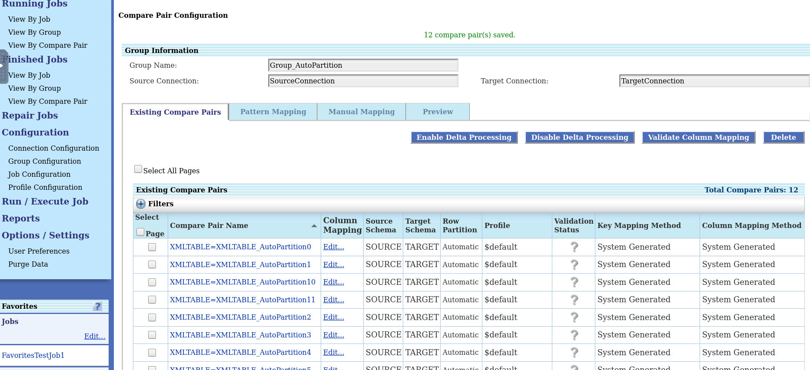

# Configure Auto Partitions

## Introduction
This lab describes how to split the large table comparison into multiple partitions and then you  use Automatic Row Partitioning option. The partitioning is possible only when both the source database and target database are Oracle.

The automatic row partition creates configurable partitions and generates compare pairs for each generated partition.

*Estimated Lab Time*: 15 minutes

### Objectives
In this lab, you will:
* Create Automatic Row Partitioning

### Prerequisites
This lab assumes you have:

* A Free Tier, Paid or LiveLabs Oracle Cloud account
* SSH Private Key to access the host via SSH
* You have completed:
    * Lab: Generate SSH Keys (Free-tier and Paid Tenants only)
    * Lab: Prepare Setup (Free-tier and Paid Tenants only)
    * Lab: Environment Setup
    * Lab: Initialize Environment
* From the [Get Started with Oracle GoldenGate Veridata Workshop](https://apexapps.oracle.com/pls/apex/dbpm/r/livelabs/workshop-attendee-2?p210_workshop_id=833&p210_type=1&session=13638147975386), the following are required to complete this lab:
    * Source and Target connections are created as described in [Lab: Create Datasource Connections](https://apexapps.oracle.com/pls/apex/dbpm/r/livelabs/workshop-attendee-2?p210_workshop_id=833&p210_type=1&session=13638147975386).
    * Follow the steps to [Create a Group](https://apexapps.oracle.com/pls/apex/dbpm/r/livelabs/workshop-attendee-2?p210_workshop_id=833&p210_type=1&session=13638147975386). Let the Group Name be **Group_AutoPartition**.
    * Follow the steps 1 to 2 in [Create Compare Pairs (on Manual Mapping Tab)](https://apexapps.oracle.com/pls/apex/dbpm/r/livelabs/workshop-attendee-2?p210_workshop_id=833&p210_type=1&session=1455719632468).

## **Task 1:** Configure Automatic Row Partitioning
To configure Automatic Row Partitioning:
1. In the Compare Pair Configuration page, click **Manual Mapping**.
2. Select a Source **Schema** and a Target **Schema** under **Datasource Information**, and then select the tables from **Source Tables** and **Target Tables** for Manual Compare Pair Mapping. Enter:
    * Source schema: **SOURCE**
    * Target schema: **TARGET**
    * Source Table: **XMLTABLE**
    * Target Table: **XMLTABLE**
    
3. Select the **Automatic Row Partitions** check box.

4. Enter a numeric value between 2 to 100 in the text field.

      Enter:

      * **Automatic Row Partitions**: **12**

      

5. Click **Generate Mappings**. The control moves to the **Preview** tab.

    

6. Click **Save** to save the generated compare pair. The control moves to the **Existing Compare Pairs** tab.

    
You may now proceed to the lab on [Creating and Executing Jobs](https://apexapps.oracle.com/pls/apex/dbpm/r/livelabs/workshop-attendee-2?p210_workshop_id=833&p210_type=1&session=1455719632468) to create a new job. Add the **Group_AutoPartition** Group to this job.

Watch our short video that explains the partitioning feature in Oracle GoldenGate Veridata:

## Want to Learn More?

* [Oracle GoldenGate Veridata Documentation](https://docs.oracle.com/en/middleware/goldengate/veridata/12.2.1.4/index.html)
* [Configuring Partitions in Oracle GoldenGate Veridata ](https://docs.oracle.com/en/middleware/goldengate/veridata/12.2.1.4/gvdug/configure-workflow-objects.html#GUID-03B3876F-7A79-43BA-9E14-8B216BD8F3BB)

## Acknowledgements
* **Author** - Anuradha Chepuri, Principal UA Developer, Oracle GoldenGate User Assistance
* **Contributors** -  Nisharahmed Soneji, Senior Principal Product Manager and Sukin Varghese, Senior Member of Technical staff
* **Last Updated By/Date** - Anuradha Chepuri, September 2021
