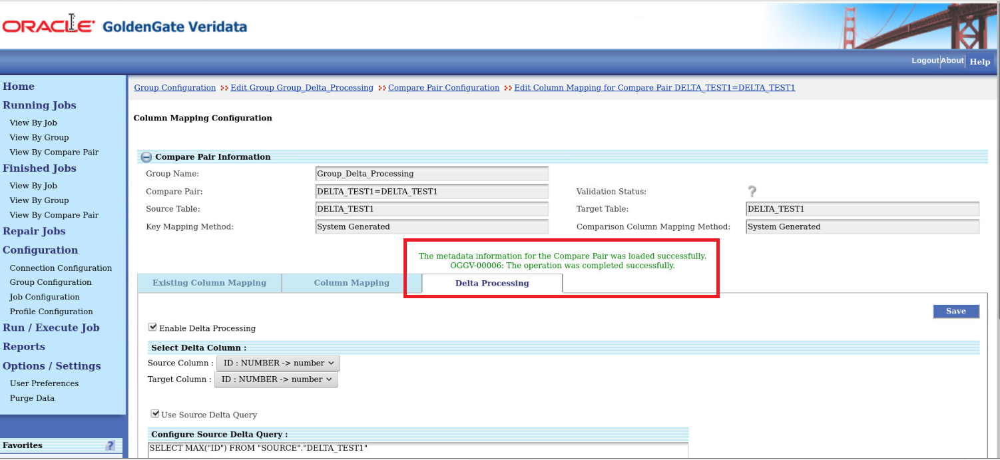
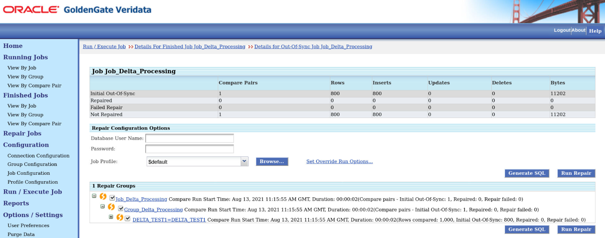
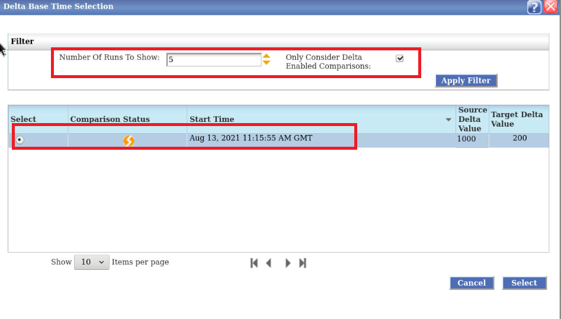
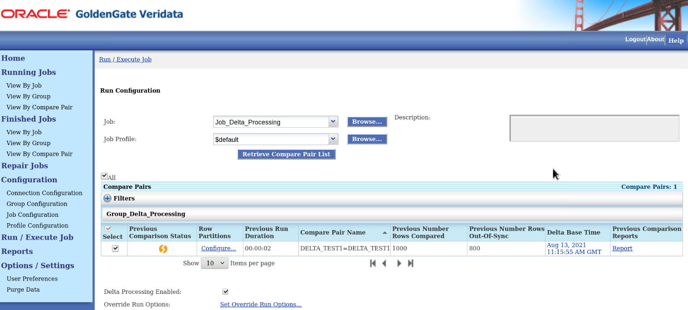

# Configure Delta Comparison in Oracle GoldenGate Veridata

## Introduction
This lab shows you how to enable delta comparison for database compare pairs in Oracle GoldenGate Veridata.

Oracle GoldenGate Veridata compares a source database table to the target database table. The source and target tables are configured using compare pairs, which are grouped and added to a job to run the comparison (see lab). When all the rows in the table are compared, it is a Full Comparison Job.

During the subsequent runs of a comparison job, the comparison of the tables can be performed based on what has changed in the tables from previous job run; these jobs are Delta Processing Jobs. Delta processing is usually performed on tables that contain a large number of rows so it is probable that in these tables there will be columns eligible for delta processing.

### What Do You Need?

+ **An existing Oracle GoldenGate Veridata install that is functional, version 12.2.1.2 and higher**

## Task 1: Enable Delta Comparison
1. In the Compare Pair Configuration page, click **Manual Mapping**.
2. Select a Source **Schema** and a Target **Schema** under **Datasource Information**, and then select the tables from **Source Tables** and **Target Tables** for Manual Compare Pair Mapping.
Enter:
    * Source schema: **SOURCE**
    * Target schema: **TARGET**
    * Source Table: **DELTA_TEST1**
    * Target Table: **DELTA_TEST1**
    
3. Click **Generate Compare Pair**.
    
4. Click **Save** to save the generated compare pairs on the **Preview** tab.
5. Click the **Existing Compare Pairs** tab, select the Compare Pair **DELTA_TEST1=DELTA_TEST1**, and click **Enable Delta Processing**.
    

6. Select the **Enable Delta Processing** check box and click **Save**.

    

    The metadata information gets saved:

    

    Delta Processing is enabled. Notice the changed status of the compare pairs on the **Enable Delta Processing** tab:
    

7.   Create a job and name it **Job_Delta_Processing** and run this job.

     

8.   Run the terminal.
9.   Run the following command:

    ```
    <copy>
    cd /home/opc/stage/scripts
     source env_setup.sh
     sqlplus   <\copy>
     
    ```  
10.  Enter the following credentials:
      * **User Name**: source
      * **Password**: source
11. Enter the following INSERT query:

      ```
      <copy>
      insert into delta_test1 values ('2000',2000);
      insert into delta_test1 values ('2001',2001);
      insert into delta_test1 values ('2002',2002);
      insert into delta_test1 values ('2003',2003);
      insert into delta_test1 values ('2004',2004);
      commit;<\copy>
     ```
8.   In the **Run/Execute Job** page, select **Job_Delta_Processing** from the **Job** drop-down list and click **Retrieve Compare Pair List**.

9. Click **Select...** under **Delta Base Value** to select the delta-base value from the list to perform delta processing.

      

10. In the **Delta Base Time Selection** page, enter a number, for example 5 in **Number of Runs to Show**, select the **Only Consider Delta Enabled Comparisons** check box, click **Apply Filter**. Select the record and click **Select** to display the **Run Configuration** page.

      

11. Select the record and click the **out-of-sync** icon to display the **Run Configuration** page.

      

      


## Task 2: Configure Delta Comparison


## Want to Learn More?


## Acknowledgements
* **Author** - Anuradha Chepuri, Principal UA Developer, Oracle GoldenGate User Assistance
* **Contributors** -  Nisharahmed Soneji, Senior Principal Product Manager and Sukin Varghese, Senior Member of Technical staff
* **Last Updated By/Date** - Anuradha Chepuri, September 2021
