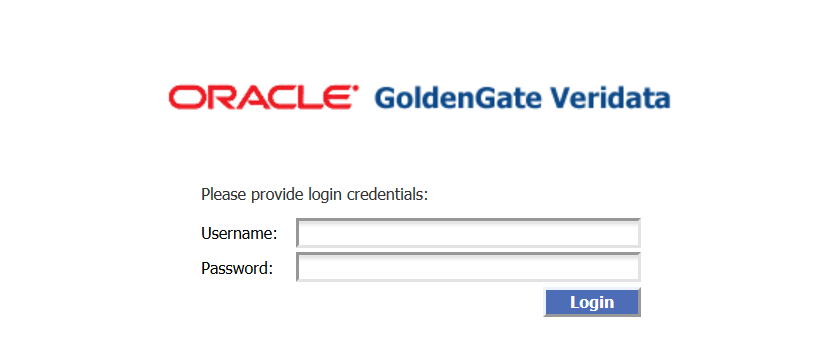
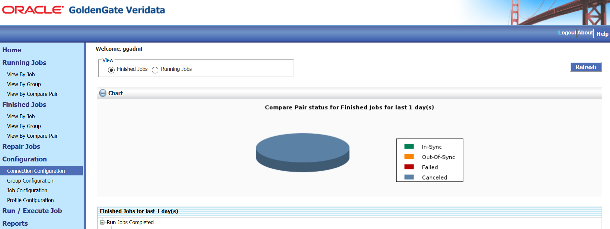

# Create Datasource Connections

## Introduction
This lab describes how to configure datasource connections. The Oracle GoldenGate Veridata  Server must be able to connect to an Oracle GoldenGate Veridata Agent for each database that contains source and target data that you want to compare. A connection is defined by a host, the port number of an Oracle GoldenGate Veridata Agent (or Manager, if a C-agent), and the datasource that is accessed by the agent. You need to create connections before you create any of the GoldenGate Veridata objects, such as groups, compare pairs, profiles, or jobs.

### What Do You Need?

+ **Oracle GoldenGate Veridata installed**
+ **Oracle Database 19c (19.3.0.0) (for the repository)**

## **STEP 1:** Login to Oracle GoldenGate Veridata
  To login to GoldenGate Veridata:
  1. In a browser, enter the URL, for example: http://hostName.us.oracle.com:22738/veridata/login.jsf.
  2. Enter your login credentials and click **Login**:
      

## **STEP 2:** Create a Connection
To get started with Oracle GoldenGate Veridata, you must define a connection to the source and target databases that contain the data that you want to compare. Oracle GoldenGate Veridata Server uses the connection information to communicate with Oracle GoldenGate Veridata Agent.
**Note**: Ensure that you have the Administrator or the Power User roles to create and configure connections.

To create connections:
1. From the left navigation pane, click **Configuration** and then click **Connection Configuration** to display the **Connection configuration** page.
    
2. Click **New** to display the **New Connection Assistant** page to create one connection for the source database.
3. Enter the **Connection Name**, for example, **Source** and click **Next**.
4. Enter the following details:
    * **Host Name or IP Address**: Name of the host where Oracle GoldenGate Veridata Agent is running.
    * **Port**: The port number for Oracle GoldenGate Veridata Agent on that host.
    * **Datasource Type**: The datasource that is associated with this agent.
      
5. Click **Next** to enter the Datasource Connection credentials:
    
6. Similarly, create another connection (for example, target) for the target  database.

## Want to Learn More?

* [Oracle GoldenGate Veridata Documentation](https://docs.oracle.com/en/middleware/goldengate/veridata/12.2.1.4/index.html)
* [Configuring Connections](https://docs.oracle.com/en/middleware/goldengate/veridata/12.2.1.4/gvdug/configure-workflow-objects.html#GUID-75005B4D-5C24-4467-A68B-1FE66A168905)

## Acknowledgements

* **Author:**
    + Anuradha Chepuri, Principal UA Developer, Oracle GoldenGate User Assistance
* **Reviewed by:**
    + Avinash Yadagere, Principal Member Technical Staff, Oracle GoldenGate Development
    + Sukin Varghese, Senior Member of Technical staff, Database Test Dev/Tools/Platform Testing

* **Last Updated By/Date:** Anuradha Chepuri, December 2020

## Need Help?
Please submit feedback or ask for help using our [LiveLabs Support Forum](https://community.oracle.com/tech/developers/categories/livelabsdiscussions). Please click the **Log In** button and login using your Oracle Account. Click the **Ask A Question** button to the left to start a *New Discussion* or *Ask a Question*. Please include your workshop name and lab name.  You can also include screenshots and attach files. Engage directly with the author of the workshop.

If you do not have an Oracle Account, click [here](https://profile.oracle.com/myprofile/account/create-account.jspx) to create one.
