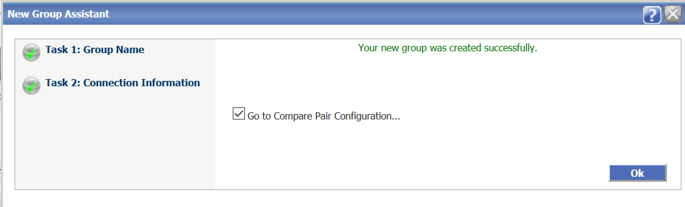
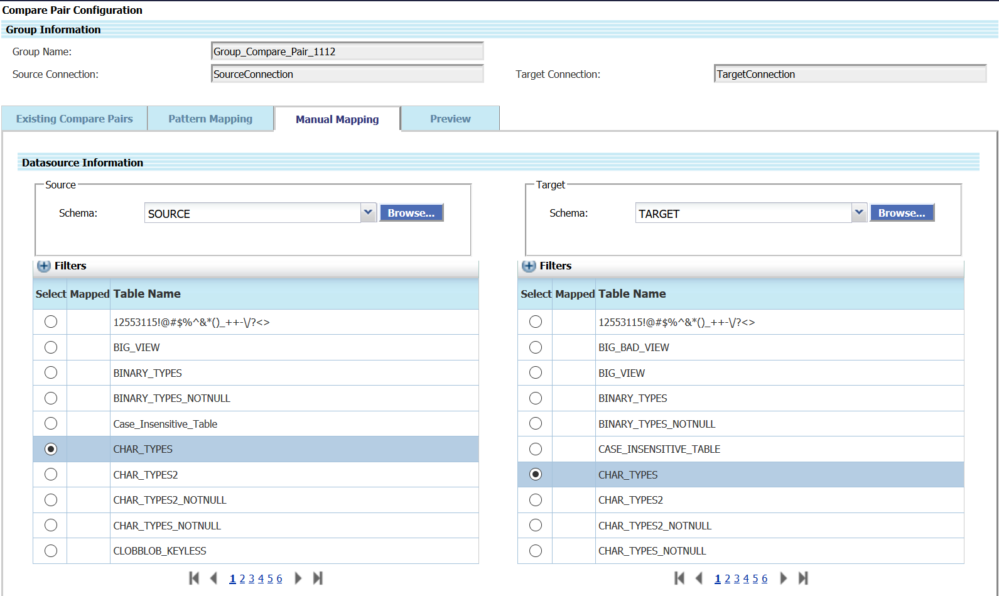
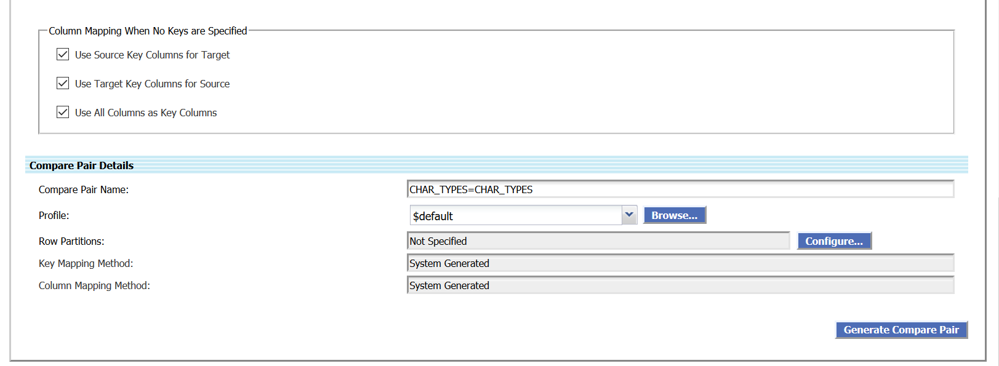
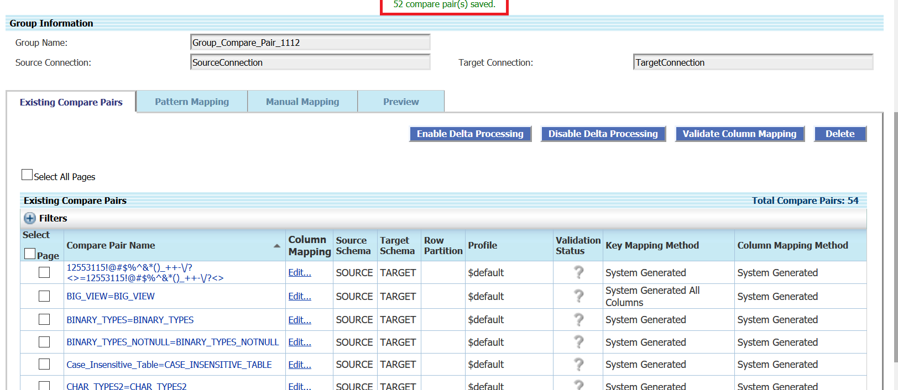
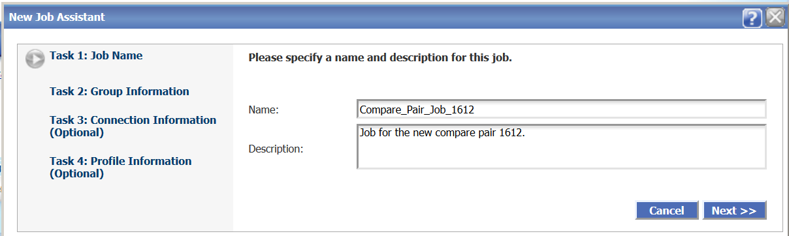
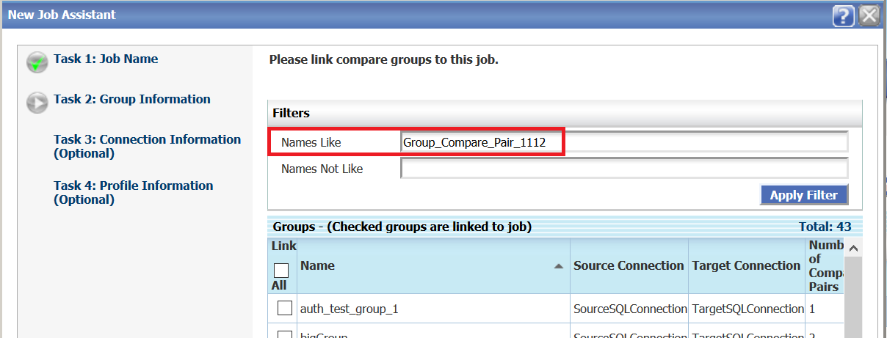

# Create Groups, Compare Pairs, Jobs, and Run Jobs

## Introduction
This lab describes how to groups and compare pairs. Groups are logical containers for one or more compare pairs. They help you to organize and partition large or diverse sets of data into more manageable units. Groups are linked to jobs when jobs are created. Any group can be linked to one or more jobs, allowing you complete control over how and when data is compared.

A group is associated with a set of connections to the source and target data.

A compare pair is the logical relationship between a source table or file and a target table or file for the purpose of comparing their data. Compare pairs are linked to groups. Because of this, all of the source and target objects that you configure into compare pairs for any given group must be accessible from the datasource connections that are associated with that group.

You must create and execute the job to run the comparisons. The job configuration determines which compare pair groups are processed.

*Estimated Lab Time*: 15 minutes

### Objectives
In this lab, you will:
* Create a Group.
* Create Compare Pairs (on Manual Mapping and Pattern Mapping tabs).
* Create a job for the Compare Pair Groups.
* Run the job.

### Prerequisites
This lab assumes you have:

* A Free Tier, Paid or LiveLabs Oracle Cloud account
* SSH Private Key to access the host via SSH
* You have completed:
    * Lab: Generate SSH Keys (Free-tier and Paid Tenants only)
    * Lab: Prepare Setup (Free-tier and Paid Tenants only)
    * Lab: Environment Setup
    * Lab: Initialize Environment
* The following are required to complete this lab:
    * Oracle GoldenGate Veridata installed
    * Source and Target connections as described in Lab 2

## **STEP 1:** Create a Group

  To create a group:
1. From the left navigation pane, click **Configuration** and then click **Group Configuration** to display the **Group configuration** page.
    
2. Click **New** to display the **New Group Assistant** page to create a group.
3. Enter the **Name** and **Description** for the Group and click **Next**.
  
4. Click **Next** to enter the connection information.
5. Browse to select the **Source Connection** and **Target Connection** (that you have created in Lab 2).
  
6. Click **Finish**.
Your new Group has been created.

## **STEP 2:** Create Compare Pairs (on Manual Mapping Tab)
Use the **Manual Mapping** tab to map source objects to target objects one at a time. This method is useful when source and target names differ vastly and cannot be mapped by using wildcards.
To create compare pairs on the **Manual Mapping** tab:
1. After you have created the Group, click **Go to Compare Pair Configuration...** check box in the **New Group Assistant** page to display the **Compare Pair Configuration** page.
    
2. Click **Manual Mapping**.
3. Select a Source **Schema** and a Target **Schema** under **Datasource Information**, and then select the tables from **Source Tables** and **Target Tables** for Manual Compare Pair Mapping.
    
4. Click **Generate Compare Pair** to add the compare pair to the preview list.
    
5. Go the **Preview** tab and click **Save** to save the generated compare pair.
    
    The control moves to the **Existing Compare Pairs** tab.
    
Similarly, you can create any number of compare pairs for other tables.

## **STEP 3:** Create Compare Pairs (on Pattern Mapping Tab)
Use the **Pattern Mapping** tab to map numerous source and target objects at once by using:

* An exact name match (for example TAB1=TAB1).
* A SQL percent (%) wildcard (for example, %_Table)
* An asterisk (GoldenGate *) wildcard to map differently named source and targets whose naming conventions support wildcarding.

To create compare pairs on the **Pattern Mapping** tab:
1. In the **Compare Pair Configuration** page, click **Pattern Mapping**.
    
2. Select a Source **Schema** and a Target **Schema** under **Datasource Information**.
3. Under **Pattern Compare Pair Mapping**, select a **Table Mapping Method**. You can select any of the following:
    * **Map Source and Target Tables Using Exact Names**: Let's select this option here:
        
	  * **Map Source and Target Tables Using SQL % Wildcard Pattern. (Use only one % on each side.)**
        
    * **Map Source and Target Tables Using GoldenGate * Wildcard Pattern. (Use only one * on each side.)**
        

4. Click **Generate Mappings**. The control moves to the **Preview** tab.
5. Click **Save** save the generated compare pair. The control moves to the **Existing Compare Pairs** tab.
    

## **STEP 4**: Create a Job for the Compare Pair Group
  To create a job:
1. From the left navigation pane, click **Configuration** and **Job configuration** to display the **Job Configuration** page.
    
2. Click **New** to display the **New Job Assistant** page.
3. Enter a **Name** and **Description** for the new job, click **Next**.
    
4. Enter the **Group Name** that you want to link to this job and click **Apply Filter**.
    
5. Select the Group and click **Finish**.
    
A new job is created for the compare pair.

## **STEP 5**: Execute the Job
To execute a job:
1. From the left navigation pane, click **Run/Execute Job** to display the **Run configuration** page.
    
2. Select the job you just created from the **Job** drop-down list and click **Run Job**.
    
3. From the left navigation pane, click **Running Jobs** to display the status of the jobs that are running.
  
4. From the left navigation pane, click **Finished Jobs** to display the completed job and the details of the compare pairs.
    

  Watch our short video that explains the partitioning feature in Oracle GoldenGate Veridata:

    

## Learn More
* [Oracle GoldenGate Veridata Documentation](https://docs.oracle.com/en/middleware/goldengate/veridata/12.2.1.4/index.html)
* [Configuring Groups](https://docs.oracle.com/en/middleware/goldengate/veridata/12.2.1.4/gvdug/configure-workflow-objects.html#GUID-70B42ABB-EA8E-4ADF-8414-7EA1752CA7E6)
* [Compare Pairs](https://docs.oracle.com/en/middleware/goldengate/veridata/12.2.1.4/gvdug/configure-workflow-objects.html#GUID-055CE119-0307-4826-98C7-A51F53E28763)
* [Jobs](https://docs.oracle.com/en/middleware/goldengate/veridata/12.2.1.4/gvdug/working-jobs.html#GUID-EE434517-18EB-4827-A05F-D420D9E5B0DD)

## Acknowledgements
* **Author** - Anuradha Chepuri, Principal UA Developer, Oracle GoldenGate User Assistance
* **Contributors** -  Nisharahmed Soneji (PM), Sukin Varghese (QA), GoldenGate
* **Last Updated By/Date** - Anuradha Chepuri, Oracle GoldenGate User Assistance, April 2021
