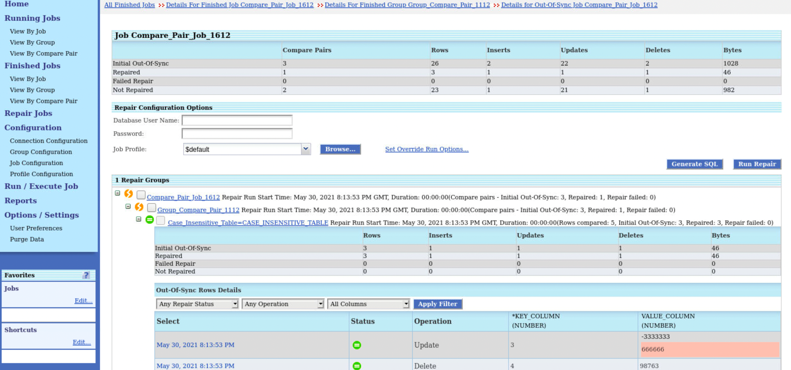
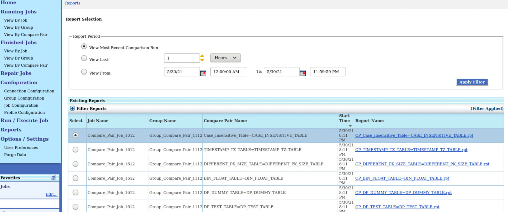
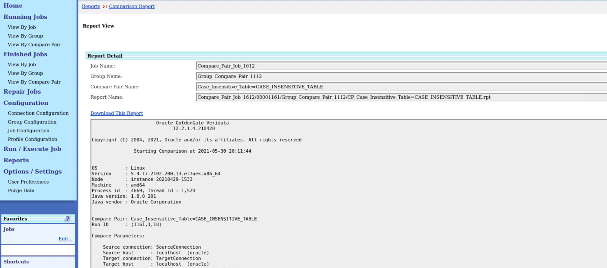

# View Reports

## Introduction
A comparison report is generated for each job, group, and compare pair that is finished being processed. It contains summary details about out-of-sync row counts, the number of records processed, performance statistics, errors, and so forth.

The comparison report tells you how extensive an out-of-sync problem is. It also provides performance statistics and, optionally, column details. The comparison report can be viewed by any user role.

*Estimated Lab Time*: 15 minutes

### Objectives
In this lab, you will:
* View your job report.

### Prerequisites
This lab assumes you have:

* A Free Tier, Paid or LiveLabs Oracle Cloud account
* SSH Private Key to access the host via SSH
* You have completed:
    * Lab: Generate SSH Keys (Free-tier and Paid Tenants only)
    * Lab: Prepare Setup (Free-tier and Paid Tenants only)
    * Lab: Environment Setup
    * Lab: Initialize Environment
* The following are required to complete this lab:
    * Oracle GoldenGate Veridata installed
    * Groups and Compare Pairs have been created as described in Lab: Create Groups, Compare Pairs, Jobs, and Run Jobs
    * Jobs have been created and executed as described in Lab: Create Groups, Compare Pairs, Jobs, and Run Jobs

## **STEP 1:** View a Report

  To view a report:
1. From the left navigation pane, click **Reports** to display the Report Selection page.
    
2. Select one of the following options under **Report Period**: (Optional Step)
    * **View Most Recent Comparison Run**: Selects the most recent report for each job that exists.
    * **View Last**: Selects reports that were created within the last <n> Days, Hours or Minutes.
    * **View From**: Selects reports that were created within a specific date range, with the option to include the time of day. Enter the From and To Date and Time in the format that is accepted by the client machine that is running Oracle GoldenGate Veridata Web User Interface.
3. If you want to select reports based on Jobs, Groups, Compare Pairs, or even Report Names, enter the details and click **Apply Filter** (Optional Step):
    * **Job Like**: Retrieves reports for jobs whose names contain a string that matches the one you enter.
    * **Group Like**: Retrieves reports for groups whose names contain a string that matches the one you enter.
    * **Compare Pair Like**: Retrieves reports for compare pairs whose names contain a string that matches the one you enter.
    * **Show Report Names Like**: Retrieves reports whose file names contain a string that match the one you enter.
4. Select the Report from **Existing Reports**.
      
5. Click **View** to display the **Report View**.
      
6. Click **Download this Report** in case you want to download and save the report for a future reference.  

## Learn More
* [Oracle GoldenGate Veridata Documentation](https://docs.oracle.com/en/middleware/goldengate/veridata/12.2.1.4/index.html)
* [Comparision Report](https://docs.oracle.com/en/middleware/goldengate/veridata/12.2.1.4/gvdug/working-jobs.html#GUID-8E57CC45-33E3-4068-8B19-47E222F70BF1)

## Acknowledgements
* **Author** - Anuradha Chepuri, Principal UA Developer, Oracle GoldenGate User Assistance
* **Contributors** -  Nisharahmed Soneji (PM), Sukin Varghese (QA), GoldenGate
* **Last Updated By/Date** - Anuradha Chepuri, Oracle GoldenGate User Assistance, April 2021
