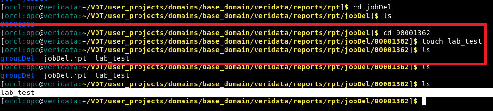

# Purge Data and Delete Directories

## Introduction
This lab describes how to purge data and delete directories in the Oracle GoldenGate Veridata UI.

The Purge Data option allows you to delete old Oracle GoldenGate Veridata stats from the product repository.

The Delete Directories option allows you to purge old reports, compare results, and obsolete data. Use the Delete Directories completely check box to delete the entire reports directory content, including files, and directories created by the user.


*Estimated Lab Time*: 30 minutes

### Objectives
In this lab, you will:
* Purge Data
* Delete Directories
* Delete Directories completely

### Prerequisites
This lab assumes you have:
- A Free Tier, Paid or LiveLabs Oracle Cloud account
- You have completed:
    * Lab: Prepare Setup (*Free-tier* and *Paid Tenants* only)
    * Lab: Environment Setup
    * Lab: Initialize Environment
    * Lab: Create Datasource Connections
    * Lab: Create Groups and Compare Pairs


## Task 1: Purge Data

Ensure to execute a Job by following the steps in Lab: Create and Execute Jobs.
To purge data:

1. Click **Purge Data** from the Left Navigation pane.


2. Select the Date and Time until which you want the data to be purged and click **Purge**.

    

    Data has been purged for the selected Date and time.

    


## Task 2: Delete Directories

The generated report files are stored in this location:
`/home/opc/VDT/user_projects/domains/base_domain/veridata/reports`.

To delete directories:

1. Ensure to execute a Job by following the steps in Lab: Create and Execute Jobs.
2. Create user-defined files in the generated report file location:
`/home/opc/VDT/user_projects/domains/base_domain/veridata/reports`.

    ```
    <copy>
    cd /home/opc/VDT/user_projects/domains/base_domain/veridata/reports/rpt/<*JobName*>/<*directory for the latest job*>
    <copy>
    ```
    ```
    <copy>
    touch lab_test
    <copy>
    ```

    

3. In the UI, select **Finished Jobs**, and select the Job you want to delete and click **Delete**

    

4. Select **jobDel**, and select the **Delete Directories** completely check box and click **Delete**.
      

5. In the terminal, verify that the entire directory has been deleted.

      
  User-defined files created within the reports directories will not be deleted.

You may now [proceed to the next lab](#next).

## Learn More
* [Oracle GoldenGate Veridata Documentation](https://docs.oracle.com/en/middleware/goldengate/veridata/12.2.1.4/index.html)
* [Purging Data](https://docs.oracle.com/en/middleware/goldengate/veridata/12.2.1.4/gvdug/customizing-your-workspace.html#GUID-66262202-CEE1-410D-9D73-3FCB3FC4753B)
* [Compare Pairs](https://docs.oracle.com/en/middleware/goldengate/veridata/12.2.1.4/gvdug/configure-workflow-objects.html#GUID-055CE119-0307-4826-98C7-A51F53E28763)
* [Jobs](https://docs.oracle.com/en/middleware/goldengate/veridata/12.2.1.4/gvdug/working-jobs.html#GUID-EE434517-18EB-4827-A05F-D420D9E5B0DD)


## Acknowledgements
* **Author** - Anuradha Chepuri, Principal UA Developer, Oracle GoldenGate User Assistance
* **Contributors** -  Nisharahmed Soneji, Sukin Varghese, Rene Fontcha
* **Last Updated By/Date** - Rene Fontcha, LiveLabs Platform Lead, NA Technology, November 2021
