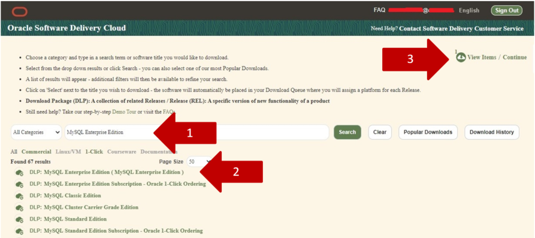

# Download Material Software

## About this Workshop

### Objectives

In This lab you will download the software for the labs

### Prerequisites

This lab assumes you have:

* A valid Oracle account on edelivery.oracle.com

**Notes:**

The MySQL Enterprise Edition software that you are using in this workshop is a trial version: you are eligible to use it for 30 days, then you required to purchase or remove it.

### Lab standard

This lab uses color coding to identify input type

* **<span style="color:green">shell></span>** The command must be executed in the Operating System shell
* **<span style="color:blue">mysql></span>** The command must be executed in a client like MySQL, MySQL Workbench
* **<span style="color:orange">mysqlsh></span>** The command must be executed in MySQL shell

### Software used in the labs

When all of the tasks in Lab1 are completed, the software will be located within each server in the “/workshop” directory

## Task 1: Download MySQL Enterprise Edition files

1. Create a dedicated directory inside your PC  to store all the material. Call this directory “WORK_DIRECTORY”.

    ```text
    <copy>mkdir WORK_DIRECTORY</copy>
    ```

2. Click the link below to Download the configure\_essential\_labs.sh script file:

   Download file [configure\_essential\_labs.sh](files/configure_essential_labs.sh)

3. Click the link below to to connect to the Oracle edelivery sie and login with your account:

    [https://edelivery.oracle.com](https://edelivery.oracle.com)

    

4. In the text box insert “MySQL Enterprise Edition” and then click on “DLP: MySQL Enterprise Edition (MySQL Enterprise Edition)” to add it to cart

    

5. Deselect “MySQL Installer 8…”

6. Select for MySQL Server 8… the platform “Linux x86-64”

    

7. All the software automatically add the Linux x86-64 platform and the button.
Click now the button “Continue” now enabled

    

8. Read and accept the Terms and restrictions and click “Continue”

    

9. Click on “Wget options” and download the file “wget.sh” with a click on “Download .sh”

    

10. Move the file wget.sh into your local pc "WORK_DIRECTORY"

    **You may now proceed to the next lab**

## Learn More

* [https://www.mysql.com/](https://www.mysql.com/)
* [https://docs.oracle.com/en-us/iaas/mysql-database/index.html](https://docs.oracle.com/en-us/iaas/mysql-database/index.html)

## Acknowledgements

* **Author** - Perside Foster, MySQL Engineering
* **Content Creator** -  Marco Carlessi, MySQL Engineering
* **Last Updated By/Date** - Perside Foster, April, 2022
