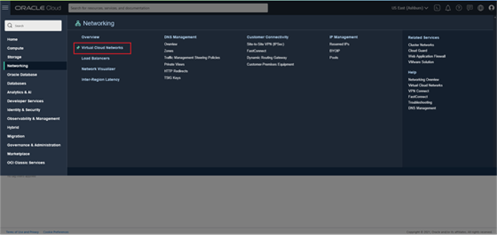
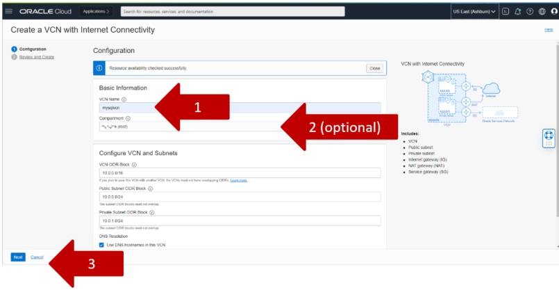
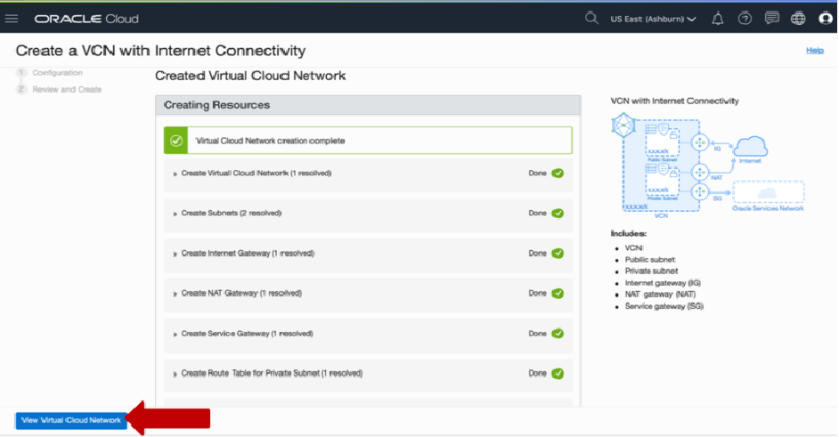

# Create a VCN (Virtual Cloud Network)

## About this Workshop

### Objective

In This lab you will perform the following tasks

1. Login to Oracle Cloud
2. Create Your VCN

### Prerequisites

1. You need an empty trial environment or a dedicated compartment inside Oracle Cloud Infrastructure (OCI) with user settings access
2. To sign in to the Console, you need the following:
    * Cloud account name
    * User name and Password
3. Oracle Cloud Infrastructure supports the latest versions of
    * Google Chrome
    * Firefox
    * Internet Explorer 11.
    * **It does not support the Edge browser**
4. You should have compled Lab 1a

**Note** For more information on Oracle Cloud Console, please visit: [https://docs.cloud.oracle.com/iaas/Content/GSG/Concepts/console.htm](https://docs.cloud.oracle.com/iaas/Content/GSG/Concepts/console.htm)

### Lab standard

This lab uses color coding to identify input type

* **<span style="color:green">shell></span>** The command must be executed in the Operating System shell
* **<span style="color:blue">mysql></span>** The command must be executed in a client like MySQL, MySQL Workbench
* **<span style="color:orange">mysqlsh></span>** The command must be executed in MySQL shell

## Task 1:  Login to Oracle Cloud

If you've signed out of the Oracle Cloud, use these steps to sign back in.

1. Go to [cloud.oracle.com](https://cloud.oracle.com) and enter your Cloud Account Name and click **Next**. This is the name you chose while creating your account in the previous section. It's NOT your email address. If you've forgotten the name, see the confirmation email.

    

2. On "Single Sign-On(SSO)" Click **Continue**

    

3. Enter your Cloud Account credentials and click **Sign In**. Your username is your email address. The password is what you chose when you signed up for an account.

    

4. You are now signed in to Oracle Cloud! You see the Console home page. Use the navigation menu in the upper left to navigate to the service pages where you create, manage, and view the cloud resources.

    

## Task 2: Create Your VCN

To create a VCN on Oracle Cloud Infrastructure:

**Note** Choose your compartment - If your tenancy is empty, you can use root compartment, otherwise we suggest you to create a dedicated compartment for the bootcamp. For the instructions read the addendum.

1. On the Oracle Cloud Infrastructure Console Home page
    * Click Navigation Menu > Networking > Virtual Cloud Networks

    

2. Select **VCN with Internet Connectivity**, and then click **Start VCN Wizard**.

    

3. On Start VCN Wizard, select VCN with Internet Connectivity and click the button “Start VCN Wizard”.
If you don’t see the button, select in the left menu the Compartment “(root)”.

    

4. On Basic Information, enter then click Next
    * VCN Name:

    ```text
    <copy>mysqlvcn</copy>
    ```

    * Compartment: (keep the root compartment or choose your own)
    * Keep the defaults for the section “Configure VCN and Subnets”
    * VCN CIDR Block: 10.0.0.0/16   (keep the default)
    * Public Subnet CIDR Block: 10.0.0.0/24   (keep the default)
    * Private Subnet CIDR Block: 10.0.1.0/24  (keep the default)
    * DNS Resolution: enabled  (keep the default)

    

5. Review and click **Next**
    

6. Review the Oracle Virtual Cloud Network (VCN) and Subnets information. You can customize the VCN with route tables and security lists. Laterm we will show you how to modify the VCN after it’s created.
    

7. Press the **Create** button to create the VCN. It will take a moment to create the VCN and a progress screen will keep you apprised of the workflow.
    

8. Once you see that the creation is complete (see previous screenshot), click on the **View Virtual Cloud Network** button to display the created VCN.

    **You may now proceed to the next lab**

## Learn More

* [https://www.mysql.com/](https://www.mysql.com/)
* [https://docs.oracle.com/en-us/iaas/mysql-database/index.html](https://docs.oracle.com/en-us/iaas/mysql-database/index.html)

## Acknowledgements

* **Author** - Perside Foster, MySQL Engineering
* **Contributors** -  Marco Carlessi, MySQL Engineering
* **Last Updated By/Date** - Perside Foster, April, 2022
