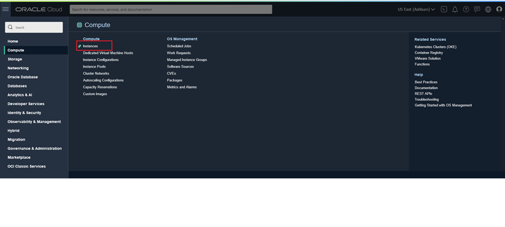
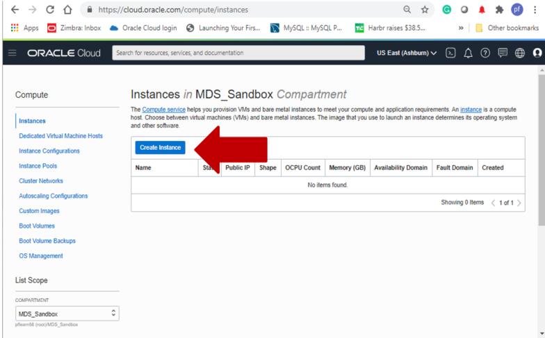
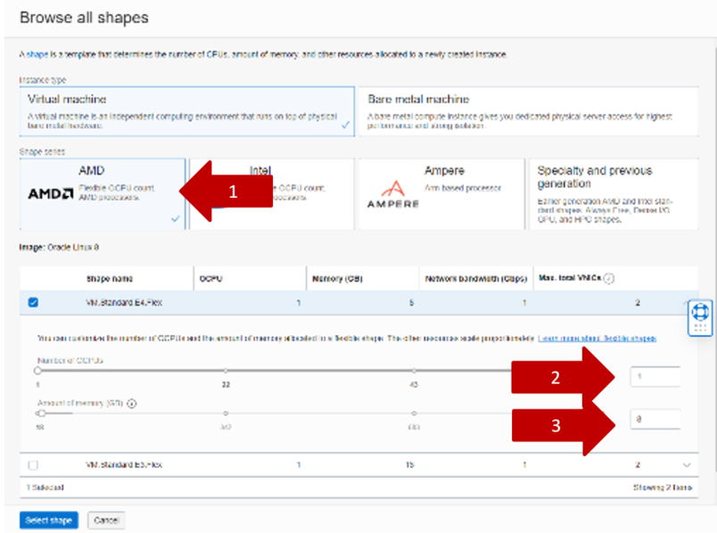
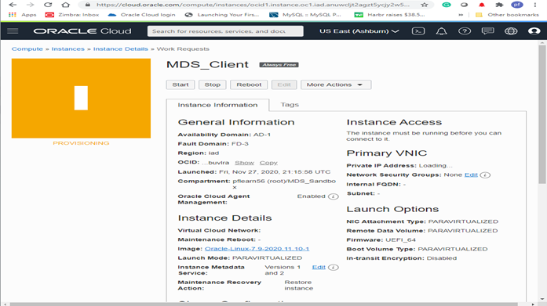
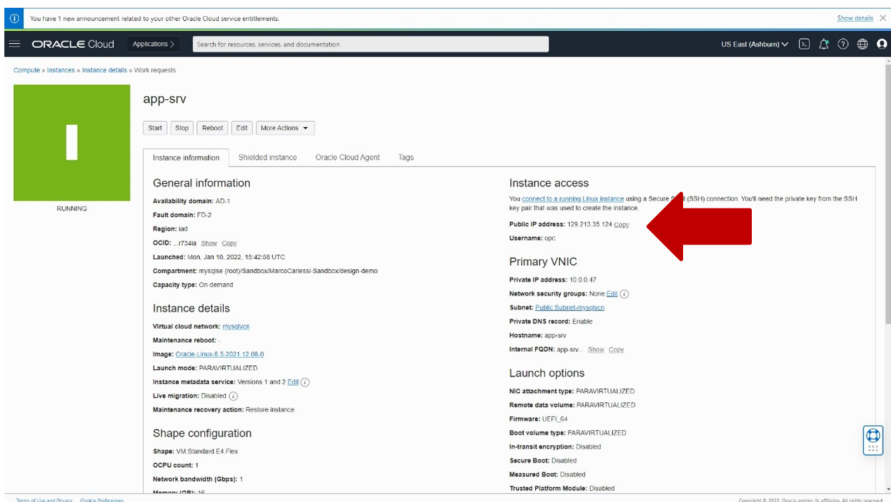

# Create and Test Application Server

## About this Workshop

### Objective

In This lab you will perform the following tasks

1. Create the Application Server - Download and upload wget sw, upload and execute deplo sh scripty.
2. Test the Application Server - Power off mysql2 and mysql3

    **Notes**

    * The compute machine that we create is called **“app-srv”**
    * Compute instances have by default the user “opc” without a password.
    * It’s mandatory to use an SSH key file to access the instance
    * Linux opc user has limited privileges
    * To work with administrative privileges, use "sudo" like **shell> sudo su - root**

### Prerequisites and Reminders

1. You need an empty trial environment or a dedicated compartment inside Oracle Cloud Infrastructure (OCI) with user settings access
2. To sign in to the Console, you need the following:
    * Cloud account name
    * User name and Password
3. Oracle Cloud Infrastructure supports the latest versions of
    * Google Chrome
    * Firefox
    * Internet Explorer 11.
    * **It does not support the Edge browser**
4. You should have compled Lab 1b

### Lab standard

This lab uses color coding to identify input type

* **<span style="color:green">shell></span>** The command must be executed in the Operating System shell
* **<span style="color:blue">mysql></span>** The command must be executed in a client like MySQL, MySQL Workbench
* **<span style="color:orange">mysqlsh></span>** The command must be executed in MySQL shell

## Task 1:  Create Application Server

1. On the Oracle Cloud Infrastructure Console Home page

    * Click Navigation Menu > Compute > Instances

    
2. Click on “Create Instance”.

    

3. On Create Compute Instance, enter

    * **Name:**

    ```text
    <copy>app-srv</copy>
    ```

    * **Create in compartment:** (keep the root compartment or choose your own)
    * **Placement:** (keep the default)
    * **Image and shape**

    * **Image:**
    * a. click “Edit”
    * b. then "Change image”
    * c. Insert:
        * Image name: Oracle Linux
        * OS version: 8
    * d. Then click “Select Image”

        

    * **Shape:**
    * a. **click "Change shape”**
    * b. **Insert:**
        * Instance type: Virtual machine
        * Shape series: AMD
        * Shape name: VM.Standard.E4.Flex
        * Number of OCPUs: 1
    * Amount of memory: 8GB
    * c. Then click “Select shape”

        

    * **Networking**
    Virtual Cloud Network: mysqlvcn (the default)
    Subnet: Public Subnet-mysqlvcn (regional) (the default)
    Public IP address: Assign a public IPv4 address (the default)

    * **Add SSH keys:** keep the default "Generate a key pair for me" and then click the button "Save Private Key“. **Please save the file in your previously created directory WORK_DIRECTORY**

        

4. We are now ready to start the creation, so click on the “Create” button.
5. The New Virtual Machine is now in PROVISIONING
    
6. Wait for the status to change to RUNNING. The instance is now ready to be used.
    
7. In the image above you see the public IP address to use in next steps.  Copy app-srv ans the **PUBLIC IP ADDRESS** to notepad.

## Task 2: Test Application Server

1. You are ready to test the connection to the ne Application Server (app-srv)

2. Using your ssh client (e.g. from bash shell or Windows Powershell on your local system) connect to the Compute with these parameters:

    **User:** opc
    **Private key:** the file downloaded during the instance creation
    **Connection address:** public IP of the compute machine. It’s shown in the instances summary or Instance details.

    After replacing the required information, the command will look like the following:

    (Example: **ssh -i ~/.ssh/id_rsa opc@132.145.170...**)

    **<span style="color:green">shell></span>**

    ```text
    <copy>ssh -i <private_key_file> opc@<your_compute_instance_ip></copy>
    ```

3. If you can connect to your MDS Client the task is finished. Proceed to next lab.

4. If not, fix your ssh connection errors or ask the instructor for help.

    **IN CASE OF ERRORS WITH WINDOWS POWERSHELL**

    In case you are using powershell and you receive an error like the following:

    

    Please use below commands to fix the permissions (please change full path with your path

    (e.g. New-Variable -Name Key -Value "C:\mysql\id_rsa")

    **<span style="color:green">powershell></span>** New-Variable -Name Key -Value "<full path>\id_rsa"

    **\# Verify that ls command retrieve the right file**

    **<span style="color:green">powershell></span>** ls $Key

    **<span style="color:green">powershell></span>** Icacls $Key /c /t /Inheritance:d

    **<span style="color:green">powershell></span>** Icacls $Key /c /t /Grant ${env:UserName}:F

    **<span style="color:green">powershell></span>** TakeOwn /F $Key

    **<span style="color:green">powershell></span>** Icacls $Key /c /t /Grant:r ${env:UserName}:F

    **<span style="color:green">powershell></span>** Icacls $Key /c /t /Remove:g Administrator "Authenticated Users" BUILTIN\Administrators BUILTIN Everyone System Users

    **<span style="color:green">powershell></span>** Icacls $Key

    **<span style="color:green">powershell></span>** Remove-Variable -Name Key

    **Then retry the ssh connection.**

    **You may now proceed to the next lab**

## Learn More

* [https://www.mysql.com/](https://www.mysql.com/)
* [https://docs.oracle.com/en-us/iaas/mysql-database/index.html](https://docs.oracle.com/en-us/iaas/mysql-database/index.html)

## Acknowledgements

* **Author** - Perside Foster, MySQL Engineering
* **Content Creator** -  Marco Carlessi, MySQL Engineering
* **Last Updated By/Date** - Perside Foster, April, 2022
