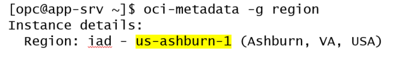
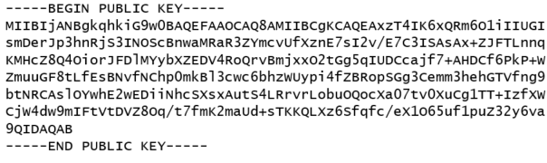
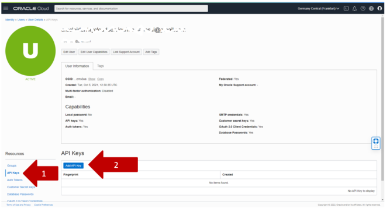
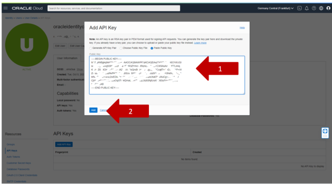

# Install OCI CLI

## About this Workshop

### Objective

In This lab you will perform the following tasks

1. Install CLI
2. Configure CLI
3. Execute CLI Setup

    **Note**

    * OCI CLI tool is used by setup script, but it’s useful also to control our instances. In the addendum you have an example how to automatically stop&start resources with crontab

    * More info on OCI CLI can be found here[https://docs.oracle.com/en-us/iaas/Content/API/Concepts/cliconcepts.htm](<https://docs.oracle.com/en-us/iaas/Content/API/Concepts/cliconcepts.htm>)

### Prerequisites and Reminders

1. You need an empty trial environment or a dedicated compartment inside Oracle Cloud Infrastructure (OCI) with user settings access
2. To sign in to the Console, you need the following:
    * Cloud account name
    * User name and Password
3. Oracle Cloud Infrastructure supports the latest versions of
    * Google Chrome
    * Firefox
    * Internet Explorer 11.
    * **It does not support the Edge browser**
4. You should have compled Lab 1c

### Lab standard

This lab uses color coding to identify input type

* **<span style="color:green">shell></span>** The command must be executed in the Operating System shell
* **<span style="color:blue">mysql></span>** The command must be executed in a client like MySQL, MySQL Workbench
* **<span style="color:orange">mysqlsh></span>** The command must be executed in MySQL shell

## Task 1:  Install CLI

1. If not already connected, connect to app-srv

     After replacing the required information, the command will look like the following:

    (Example: **ssh -i ~/.ssh/id_rsa opc@132.145.170...**)

    **<span style="color:green">shell-app-srv></span>**

    ```text
    <copy>ssh -i <private_key_file> opc@<your_compute_instance_ip></copy>
    ```

2. Install the OCI CLI

    a. **<span style="color:green">shell-app-srv></span>**

    ```text
    <copy>sudo yum -y install oraclelinux-developer-release-el8</copy>
    ```

    b. **<span style="color:green">shell-app-srv></span>**

    ```text
    <copy>sudo yum -y install python36-oci-cli</copy>
    ```

## Task 2: Configure CLI

1. Before configuring  the OCI CLI we need to retrieve some information needed to complete the task:

    We need the tenancy OCID, user OCID and region

    a. From the shell submit the following command to retrieve your region

    **<span style="color:green">shell-app-srv></span>**

    ```text
    <copy>sudo yum -y install python36-oci-cli</copy>
    ```

    Output example:

    

    b. Copy the Region name to your Notepad.

2. Connect to your dashboard

    a. Click on profile

    b. Select Tenancy
    
    c. View Tenancy information
    
    c. Write down the tenancy OCID on your Notepad.

3. From the dashboard click on profile and select “User: Settings”
    
4. Write down the User OCID on your Notepad.
    
5. **<span style="color:red">Don’t close this page!</span>**

## Task 3: Execute CLI Setup

1. We are now ready to execute the setup.
Switch to your ssh connection to app-srv and execute the following command

    **<span style="color:green">shell-app-srv></span>**

    ```text
    <copy>sudo yum -y install python36-oci-cli</copy>
    ```

2. Accept all defaults except for the information retrieve above

    * Tenancy OCID
    * User OCID
    * Region (insert your region number)

3. Output example (the region number change when we add new regions!)
    
4. Now we need to upload the public key in our user settings.
5. Show the content of the public certificate automatically generated by the setup wizard.

    **<span style="color:green">shell-app-srv></span>**

    ```text
    <copy>cat ~/.oci/oci_api_key_public.pem</copy>
    ```

    The output shows something like this:
    
6. Return to your user settings. IF you previously closed the page, here are the steps to return
    
7. From the User Details page select “API Keys” and click on “Add API Key”
    
8. Select “Paste Public Key”
    
9. In the text box insert the content of the public certificate retrieved before in the SSH connection. Please insert from “-----BEGIN PUBLIC KEY-----” to “-----END PUBLIC KEY-----“. The nclick “Add”
    
10. If everything is fine, a recap windows is displayed. Click “Close”.
    
11. We are now ready to test the installation.
Return to the SSH connection to app-srv and check the version with

    **<span style="color:green">shell-app-srv></span>**

    ```text
    <copy>oci --version</copy>
    ```

12. If the version is shown without errors, go to the next lab

    **You may now proceed to the next lab**

## Learn More

* [https://www.mysql.com/](https://www.mysql.com/)
* [https://docs.oracle.com/en-us/iaas/mysql-database/index.html](https://docs.oracle.com/en-us/iaas/mysql-database/index.html)

## Acknowledgements

* **Author** - Perside Foster, MySQL Engineering
* **Content Creator** -  Marco Carlessi, MySQL Engineering
* **Last Updated By/Date** - Perside Foster, April, 2022
