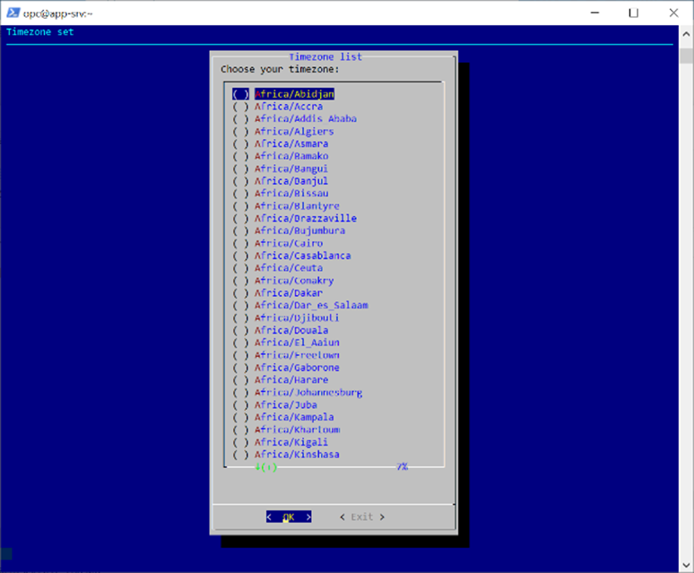
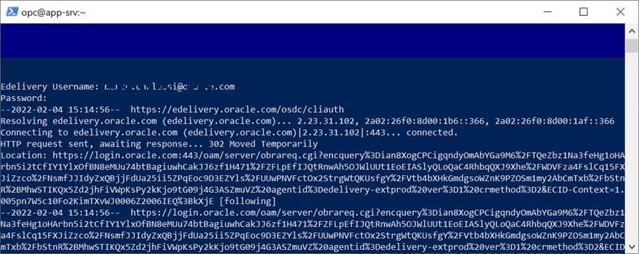

# Setup Environment

## About this Workshop

### Objective

In This lab you will execute a configuration script that will perform the following tasks

1. Configure the app-srv as NFS server
2. Create and populate the /workshop folder
3. Create 3 new instances for mysql servers

**Note:** It’s mandatory that previous steps are correctly completed

### Prerequisites and Reminders

1. You need an empty trial environment or a dedicated compartment inside Oracle Cloud Infrastructure (OCI) with user settings access
2. To sign in to the Console, you need the following:
    * Cloud account name
    * User name and Password
3. Oracle Cloud Infrastructure supports the latest versions of
    * Google Chrome
    * Firefox
    * Internet Explorer 11.
    * **It does not support the Edge browser**
4. You should have compled Lab 1d

### Lab standard

This lab uses color coding to identify input type

* **<span style="color:green">shell></span>** The command must be executed in the Operating System shell
* **<span style="color:blue">mysql></span>** The command must be executed in a client like MySQL, MySQL Workbench
* **<span style="color:orange">mysqlsh></span>** The command must be executed in MySQL shell

## Task 1:  Setup the Environment

1. If the SSH is open, close it
    **<span style="color:green">shell-app-srv></span>**

    ```text
    <copy>exit</copy>
    ```

2. Copy the files wget.sh downloaded in lab 1a and the configuration script to your instance

    a. **<span style="color:green">shell-app-srv></span>**

    ```text
    <copy>scp -i <private_key_file> wget.sh opc@<your_compute_instance_ip>:/home/opc/</copy>
    ```

    b. **<span style="color:green">shell-app-srv></span>**

    ```text
    <copy>scp -i <private_key_file> configure_essential_labs.sh opc@<your_compute_instance_ip>:/home/opc/</copy>
    ```

3. Now reconnect to app-srv

    **<span style="color:green">shell-app-srv></span>**

    ```text
    <copy>ssh -i <private_key_file> opc@<your_compute_instance_ip></copy>
    ```

4. Verify that the 2 files (wget.sh and configure_labs.sh) are here

    **<span style="color:green">shell-app-srv></span>**

    ```text
    <copy>ls -l</copy>
    ```

5. Execute the configuration script

    a. **<span style="color:green">shell-app-srv></span>**

    ```text
    <copy>chmod +x configure_essential_labs.sh</copy>
    ```

    b. **<span style="color:green">shell-app-srv></span>**

    ```text
    <copy>./configure_essential_labs.sh</copy>
    ```

    c. Choose your timezone (use the mouse or “space” to select your timezone)
    

    d. If you have not changed the wget.sh file name, insert your edelivery username and password.

    If you changed the name of the file download from edelivery, provide the correct one.
    

6. If everything is fine download start.
The script requires some time to be completed, if no errors was displayed until now, continue with the lecture while the script complete.

    If you see any error message, please inform the trainer.

    **You may now proceed to the next lab**

## Learn More

* [https://www.mysql.com/](https://www.mysql.com/)
* [https://docs.oracle.com/en-us/iaas/mysql-database/index.html](https://docs.oracle.com/en-us/iaas/mysql-database/index.html)

## Acknowledgements

* **Author** - Perside Foster, MySQL Engineering
* **Content Creator** -  Marco Carlessi, MySQL Engineering
* **Last Updated By/Date** - Perside Foster, April, 2022
