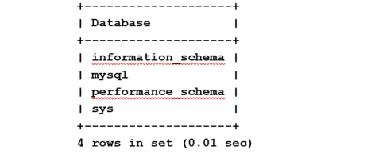

# Install MySQL Community

## About this Workshop

### Objective

In This lab you will install MySQL 8 (Community) on Oracle Linux 8. By default RedHat installs MariaDB so, we will update the repository to install the original MySQL.

Using Server: **mysql1**

**Notes:**

* We call the instance installed here mysql-gpl
* References:

 [https://dev.mysql.com/doc/mysql-yum-repo-quick-guide/en/](https://dev.mysql.com/doc/mysql-yum-repo-quick-guide/en/)
 [https://dev.mysql.com/doc/refman/8.0/en/validate-password.html](https://dev.mysql.com/doc/refman/8.0/en/validate-password.html)

### Prerequisites and Reminders

1. You need an empty trial environment or a dedicated compartment inside Oracle Cloud Infrastructure (OCI) with user settings access
2. To sign in to the Console, you need the following:
    * Cloud account name
    * User name and Password
3. Oracle Cloud Infrastructure supports the latest versions of
    * Google Chrome
    * Firefox
    * Internet Explorer 11.
    * **It does not support the Edge browser**
4. You should have compled Lab 1e

### Lab standard

This lab uses color coding to identify input type

* **<span style="color:green">shell></span>** The command must be executed in the Operating System shell
* **<span style="color:blue">mysql></span>** The command must be executed in a client like MySQL, MySQL Workbench
* **<span style="color:orange">mysqlsh></span>** The command must be executed in MySQL shell

## Task 1:  Install  MySQL Community version 8

1. Open an SSH client to app-srv

    **<span style="color:green">shell-app-srv></span>**

    ```text
    <copy>ssh -i <private_key_file> opc@<your_compute_instance_ip></copy>
    ```

2. Connect to **mysql1**

    **<span style="color:green">shell-app-srv></span>**

    ```text
    <copy>ssh -i $HOME/sshkeys/id_rsa_mysql1 mysql1</copy>
    ```

3. Check to see which MySQL packages are installed on your Linux server

    **<span style="color:green">shell-mysql1></span>**

    ```text
    <copy>sudo rpm -qa | grep mysql</copy>
    ```

4. What happens when you try to install the mysql binaries with RedHat repositories?

    Run the following command but  **<span style="color:red">don’t confirm</span>**

    **<span style="color:green">shell-mysql1></span>**

    ```text
    <copy>sudo yum install mysql</copy>
    ```

5. As you have seen, the above command tried to install MariaDB sw. Each distribution has its own repositories and different choices for the packages to install.
6. To fix a non update PGPkey error,  please run the following command

    **<span style="color:green">shell-mysql1></span>**

    ```text
    <copy>sudo rpm --import https://repo.mysql.com/RPM-GPG-KEY-mysql-2022</copy>
    ```

7. Oracle Linux 8 already havs the official MySQL repository, but to show you how to do it, we install it from the package downloading from [https://dev.mysql.com/downloads/](https://dev.mysql.com/downloads/)

    a. **<span style="color:green">shell-mysql1></span>**

    ```text
    <copy>wget https://dev.mysql.com/get/mysql80-community-release-el8-1.noarch.rpm</copy>
    ```

    b. **<span style="color:green">shell-mysql1></span>**

    ```text
    <copy>sudo sudo yum -y install mysql80-community-release-el8-1.noarch.rpm</copy>
    ```

8.	Update the repository database with the new references

    **<span style="color:green">shell-mysql1></span>**

    ```text
    <copy>sudo yum repolist all</copy>
    ```

9. Repeat the command above to install mysql-client (without using the mysql module id default repositories, to force the usage of MySQL ones) and note the different packages

    a. **<span style="color:green">shell-mysql1></span>**

    ```text
    <copy>sudo yum module disable mysql</copy>
    ```

    b. **<span style="color:green">shell-mysql1></span>**

    ```text
    <copy>sudo yum install mysql</copy>
    ```

10. If only mysql packages are shown, confirm the installation.

11. Install mysql-server

    **<span style="color:green">shell-mysql1></span>**

    ```text
    <copy>sudo yum install mysql-server</copy>
    ```

12. Because MySQL is automatically installed you can use OS command for service management, for example to check if it’s already started

    **<span style="color:green">shell-mysql1></span>**

    ```text
    <copy>sudo systemctl status mysqld</copy>
    ```

## Task 2:  Start MySQL Community

1. Start MySQL if not alread started

    a. **<span style="color:green">shell-mysql1></span>**

    ```text
    <copy>sudo systemctl start mysqld</copy>
    ```

    b.**<span style="color:green">shell-mysql1></span>**

    ```text
    <copy>sudo systemctl status mysqld</copy>
    ```

2. Check the content of my.cnf that is in the default folder for Linux OS and note some info (lines that start with “#” are just comments)

    a. **<span style="color:green">shell-mysql1></span>**

    ```text
    <copy>cat /etc/my.cnf</copy>
    ```

    b. Where is the database and the error log (mysqld.log) stored?

    * Copy the answer to your notepad.

    c. Check if there are errors for the instance by looking into the error log file

    **<span style="color:green">shell-mysql1></span>**

    ```text
    <copy>sudo grep -i error /var/log/mysqld.log</copy>
    ```

3. Starting from MySQL 5.7 the default installation of MySQL Server generates a one-time password. You will find it in the error log notes

    **<span style="color:green">shell-mysql1></span>**

    ```text
    <copy>sudo grep 'temporary' /var/log/mysqld.log</copy>
    ```

4. Login to MySQL using password retrieved in previous step

    **<span style="color:green">shell-mysql1></span>**

    ```text
    <copy>mysql -uroot -p -h localhost</copy>
    ```

5. Try to run a command and write down the error message on your notepad

    **<span style="color:blue">mysql></span>**

    ```text
    <copy>status;</copy>
    ```

6. Change the **root** password

    **<span style="color:blue">mysql></span>**

    ```text
    <copy>ALTER USER 'root'@'localhost' IDENTIFIED BY 'Welcome1!';</copy>
    ```

7. Retry the **status** command  and now it works

    **<span style="color:blue">mysql></span>**

    ```text
    <copy>status;</copy>
    ```

8. Check to see which databases are installed by default

    **<span style="color:blue">mysql></span>**

    ```text
    <copy>show databases;</copy>
    ```

    

9. To see which version of MySQL you are using submit the following command

    **<span style="color:blue">mysql></span>**

    ```text
    <copy>show variables like "%version%";</copy>
    ```

10. Check the default users in the standard installation

    **<span style="color:blue">mysql></span>**

    ```text
    <copy>select user, host from mysql.user where user='root';</copy>
    ```

11. Logout as ‘root’

    **<span style="color:blue">mysql></span>**

    ```text
    <copy>exit</copy>
    ```

    **You may now proceed to the next lab**

## Learn More

* [https://www.mysql.com/](https://www.mysql.com/)
* [https://docs.oracle.com/en-us/iaas/mysql-database/index.html](https://docs.oracle.com/en-us/iaas/mysql-database/index.html)

## Acknowledgements

* **Author** - Perside Foster, MySQL Engineering
* **Content Creator** -  Marco Carlessi, MySQL Engineering
* **Last Updated By/Date** - Perside Foster, April, 2022
