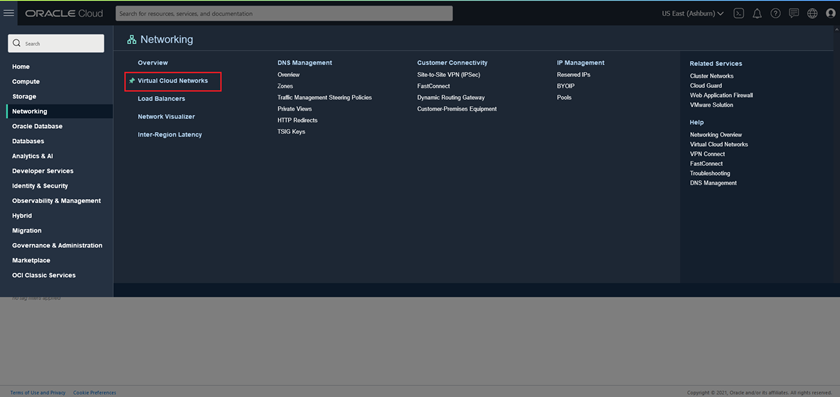
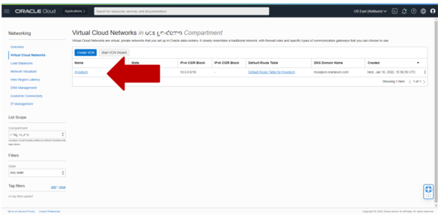
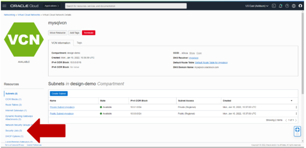
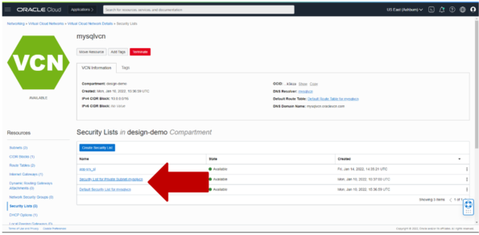
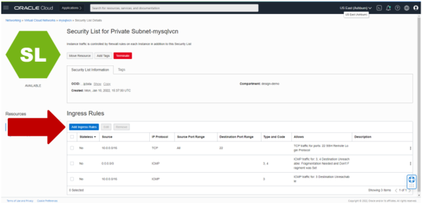
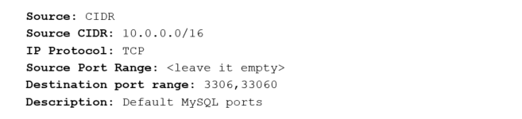
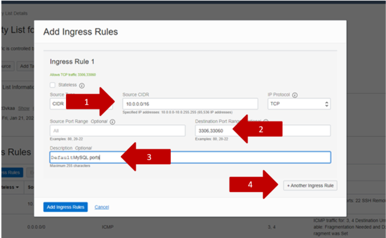
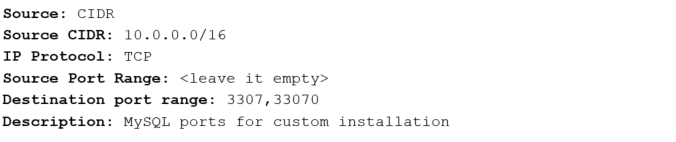
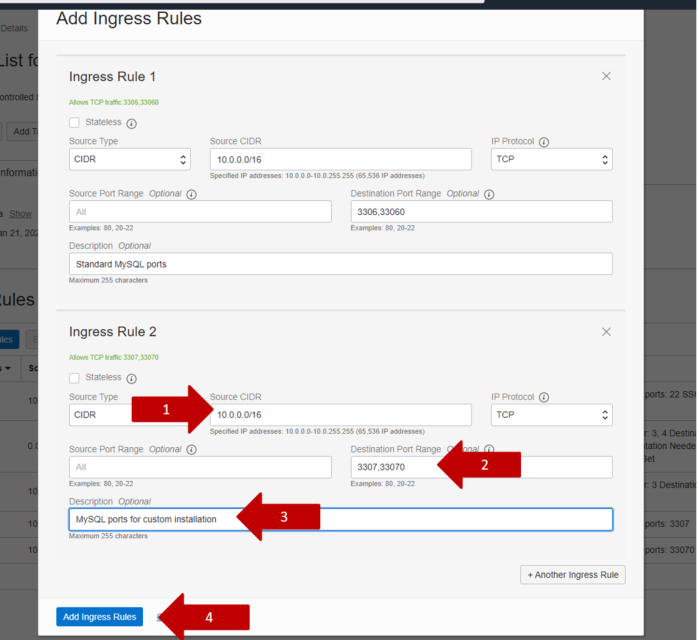

# Open Subnet Ports To Access MySQL

## About this Workshop

### Objective

In this lab, you will update the OCI VCN  to open the MySQL dedicated ports.

### Prerequisites and Reminders

1. You need an empty trial environment or a dedicated compartment inside Oracle Cloud Infrastructure (OCI) with user settings access
2. To sign in to the Console, you need the following:
    * Cloud account name
    * User name and Password
3. Oracle Cloud Infrastructure supports the latest versions of
    * Google Chrome
    * Firefox
    * Internet Explorer 11.
    * **It does not support the Edge browser**
4. You should have compled Lab 2a

### Lab standard

This lab uses color coding to identify input type

* **shell>** The command must be executed in the Operating System shell
* **mysql>** The command must be executed in a client like MySQL, MySQL Workbench
* **mysqlsh>** The command must be executed in MySQL shell

## Task 1:  Open the MySQL dedicated ports

1. Login in your OCI tenancy dashboard

    **Notes:**

    * We have an installation on standard ports (3306 and 33060). The Next lab will create a new instance on 3307/33070, so we now open the access to both instances.
    * The security by default approach of OCI means that you must open the dedicated ports to connect services between subnets. It can be achieved using Security lists [https://docs.oracle.com/en-us/iaas/Content/Network/Concepts/securitylists.htm](https://docs.oracle.com/en-us/iaas/Content/Network/Concepts/securitylists.htm) or Network security groups [https://docs.oracle.com/en-us/iaas/Content/Network/Concepts/networksecuritygroups.htm#Network_Security_Groups](https://docs.oracle.com/en-us/iaas/Content/Network/Concepts/networksecuritygroups.htm#Network_Security_Groups).

        We will use Security lists in this workshop.

2. If are using a dedicated compartment, select it

3. On the Navigation Menu,  select Networking -> Virtual Cloud Networks.

    

4. Select mysqlvn

    

5. Select “Security Lists” from left side menu

    

6. Select “Security List for **Private** Subnet-mysqlvcn” security list.

    

7. Click the button “Add Ingress Rules”

    

8. In the form insert these values then add a new line with the button “+ Another Ingress rule”

    

    

9. In the new line add these values then confirm with the button “Add Ingress Rules”

    

    

    **You may now proceed to the next lab**

## Learn More

* [https://www.mysql.com/](https://www.mysql.com/)
* [https://docs.oracle.com/en-us/iaas/mysql-database/index.html](https://docs.oracle.com/en-us/iaas/mysql-database/index.html)

## Acknowledgements

* **Author** - Perside Foster, MySQL Engineering
* **Content Creator** -  Marco Carlessi, MySQL Engineering
* **Last Updated By/Date** - Perside Foster, April, 2022
