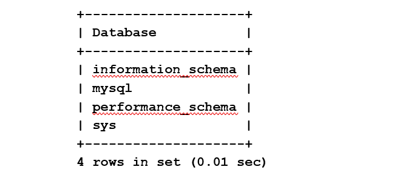

# INSTALL - MYSQL COMMUNITY

## Introduction
2a) Installation of MySQL (replacement of MariaDB)
Objective: Installation of MySQL 8 (Community) on Oracle Linux 7. Because by default RedHat install MariaDB so, we update the repository to install the original MySQL.

Server: serverB

Installation of MySQL 8 (Community) on Oracle Linux 7. Because by default RedHat install MariaDB so, we update the repository to install the original MySQL.


Estimated Time: -- minutes

### Objectives

In this lab, you will:
* Connect to ServerB and get acquainted with the environment
* Install MySQL Community
* Reset and Test MySQL root user password
* Create MySQL admin user and check MySQL version
* Test MySQL admin user

### Prerequisites

This lab assumes you have:
* An Oracle account
* All previous labs successfully completed

* Lab standard  
    -  shell> the command must be executed in the Operating System shell
    -  mysql> the command must be executed in a client like MySQL, MySQL Workbench
    -  mysqlsh> the command must be executed in MySQL shell


**Use ServerB for this lab - We call the instance installed here mysql-gpl**

  *References*
  - https://dev.mysql.com/doc/mysql-yum-repo-quick-guide/en/
  - https://dev.mysql.com/doc/refman/8.0/en/validate-password.html 


## Task 1: Connect to ServerB and get acquainted with the environment

1.	Open an SSH client to your Linux VMs

2.	Please remember that commands must be run with “sudo”, because “opc” user has limited privileges.
For example, to work as root type

3.  ** shell>**

    ```
    <copy>sudo su root</copy>
    ```
4.  ** shell>** 

    ```
    <copy>exit</copy>
    ```
5.	Which Linux are you using?
  
6.  ** shell>** 

    ```
    <copy>cat /etc/redhat-release</copy>
    ```
7.	Which MySQL packages are installed on your Linux?

8.  ** shell>** 

    ```
    <copy>sudo rpm -qa | grep mysql</copy>
    ```
5.	What happens when you try to install the mysql binaries with RedHat repositories? 
Run this command but don’t confirm

9.  ** shell>** 
  
    ```
    <copy>sudo yum install mysql</copy>
    ```
6.	As you have seen, above command try to install MariaDB sw. To compare the difference, look at the repo folder content

10. ** shell>** 
  
    ```
    <copy>ls -l /etc/yum.repos.d/</copy>
    ```

11.	Install the original mysql80-community-release-el7-1.noarch.rpm that was downloaded from mysql.com web site (https://dev.mysql.com/downloads/repo/yum/). Be careful with copy&paste: it's a single line command!

12. ** shell>** 
  
    ```
    <copy>sudo yum install /workshop/linux/mysql80-community-release-el7-3.noarch.rpm</copy>
    ```
8.	Check the new content of repo folder to see the difference (you’ll see now mysql-community repositories)

13. ** shell>** 
  
    ```
    <copy>ls -l /etc/yum.repos.d/</copy>
    ```

14.	Update repository database with the new references

15. ** shell>** 
  
    ```
    <copy>sudo yum repolist all</copy>
    ```
## Task 2: Install MySQL Community

1.	Install mysql-client and note the different package

2.  ** shell>**
  
    ```
    <copy>sudo yum install mysql</copy>
    ```
3.	Install mysql-server

4.  ** shell>** 
  
    ```
    <copy>sudo yum install mysql-server</copy>
    ```

5.	Because MySQL is automatically installed you can use OS command for service management, for example to check if it’s already started

6.  ** shell>** 
  
    ```
    <copy>sudo systemctl status mysqld</copy>
    ```
4.	Start MySQL if not started

7.  ** shell>** 
  
    ```
    <copy>sudo systemctl start mysqld</copy>
    ```

8.  ** shell>** 
  
    ```
    <copy>sudo systemctl status mysqld</copy>
    ```

9.	Check the content of my.cnf, that is in default folder for linux OS and note some info (lines that stat with “#” are just comments)

10. ** shell>** 
  
    ```
    <copy>cat /etc/my.cnf </copy>
    ```

    a.	Where is the database and the error log (mysqld.log) stored?

     
    b.	check if there are errors for the instance looking in the error log file

11. ** shell>**
  
    ```
    <copy>sudo grep -i error /var/log/mysqld.log</copy>
    ```

12.	Starting from MySQL 5.7 the default installation of MySQL Server generates a one-time password. You find it in error log notes above

13. ** shell>** 
  
    ```
    <copy>sudo grep 'temporary' /var/log/mysqld.log</copy>
    ```

## Task 3: Reset and Test MySQL root user password 

1.	Login to MySQL using password retrieved in previous step

2.  ** shell>** 
  
    ```
    <copy>mysql -uroot -p -h localhost</copy>
    ```

3.	Try to run a command and write down the error message

4.  ** mysql>** 
  
    ```
    <copy>status; </copy>
    ```

    ERROR MESSAGE: 
    
 
5.	Change root password

6.  ** mysql>**  
  
    ```
    <copy>ALTER USER 'root'@'localhost' IDENTIFIED BY 'Welcome1!'; </copy>
    ```

7.	Retry command above, now it works

8.  ** mysql>**  
  
    ```
    <copy>status; </copy>
    ```

9.	Which databases are installed by default?

10. ** mysql>**  
  
    ```
    <copy>show databases; </copy>
    ```
    

11.	To see connection information like who are you (user) and which version are you using, use the command (with or without “;”)

12. ** mysql>**  
  
    ```
    <copy>status </copy>
    ```

13.	Check SSL field, do you use a secure connection?

   
14.	Check root users in standard installation

15. ** mysql>**  
  
    ```
    <copy>select user, host from mysql.user where user='root'; </copy>
    ```

## Task 4: Create MySQL admin user and check MySQL version

1.	Create a new administrative user like 'root' user with remote access and full privileges:

3.  ** mysql>**  
  
    ```
    <copy>CREATE USER 'admin'@'%' IDENTIFIED BY 'Welcome1!'; </copy>
    ```

4.  ** mysql>**  
  
    ```
    <copy>GRANT ALL PRIVILEGES ON *.* TO 'admin'@'%' WITH GRANT OPTION;</copy>
    ```

5.	To see which version of MySQL you are using submit the command

6.  ** mysql>**  
  
    ```
    <copy>show variables like "%version%"; </copy>
    ```

7.	Logout as ‘root’ and connect as admin

8.  ** mysql>**  
  
    ```
    <copy>exit </copy>
    ```

## Task 5: Test MySQL admin user

1. Login to MySQL with admin user

2.  ** mysql>** 
  
    ```
    <copy>mysql -uadmin -p -h 127.0.0.1 </copy>
    ```

3.	Check the status

4.  ** mysql>** 
  
    ```
    <copy>status; </copy>
    ```

5.	Check SSL field and compare the new result with what you have seen as ‘root’.

6.	Where is the difference and why? (tips: one is with TCP/IP, the other…)


## Learn More

*(optional - include links to docs, white papers, blogs, etc)*

* [URL text 1](http://docs.oracle.com)
* [URL text 2](http://docs.oracle.com)

## Acknowledgements
* **Author** - Perside Foster, MySQL Engineering
* **Contributors** -  Marco Carlessi, MySQL Engineering
* **Last Updated By/Date** - <Perside Foster, October 2021
