# Lab 4: Use Analytics Cloud on MySQL Database Service powered by HeatWave

## Introduction

In this lab we will use the Oracle Analytics Cloud instance we created in the Infrastructure lab. Oracle Analytics Cloud is embedded with machine learning that will provide you intelligent insights using natural language generation that automatically creates smart textual descriptions of visualizations and instantly visualize your data, which helps organizations with root cause investigation, troubleshooting and decision-making process.

Estimated Lab Time: 30 minutes

### Objectives

- Learn how to create your Analytics dashboards using Oracle Analytics Cloud on MySQL Database Service powered by HeatWave

### Prerequisites

  - All previous labs have been successfully completed.

## **Task 1:** Create Oracle Analytics Cloud Instance 

### **Task 1.1:**

- From the Cloud shell connect to MySQL DB System:
  
```
<copy>mysqlsh --user=admin --password=Oracle.123 --host=<mysql_private_ip_address> --port=3306 --database=tpch --sql</copy>
```
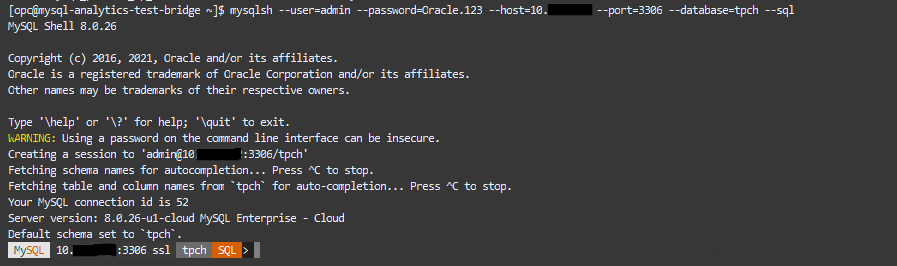

- Run the following query to create a virtual table _**myAnalyticsView**_ that will include data from other tables from the database:

```
<copy>
CREATE VIEW myAnalyticsView AS SELECT * 
    FROM customer JOIN orders ON customer.C_CUSTKEY=orders.O_CUSTKEY
    JOIN nation ON customer.C_NATIONKEY=nation.N_NATIONKEY;
</copy>    
```
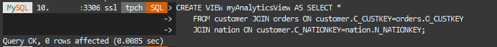

### **Task 1.2:**
- Now going back to the main page click on the _**hamburger menu**_ in the upper left corner and click on _**Analytics & AI -> Analytics Cloud**_.


By now the status of the instance should have changed to _Active_, click on the button _**Analytics Home Page**_ to access Oracle Analytics Cloud.


### **Task 1.3:**

- On the new tab, you can see the Oracle Analyitcs page where we will connect to MySQL Database Service, but before you can choose to preview the new Redwood look by pressing on **preview it**.

  

- On the top right corner click _**Create**_.
  
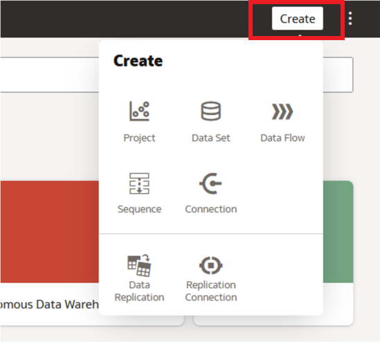

- Then click _**Connection**_.
  
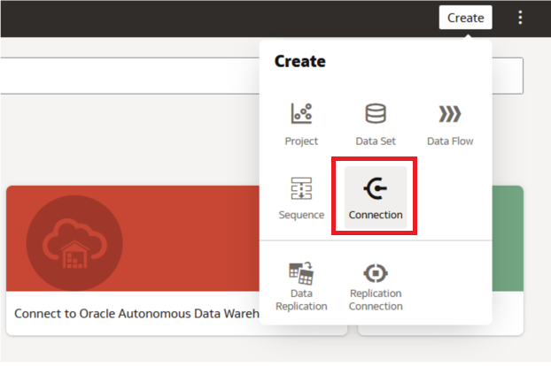

### **Task 1.4:**

- Browse the connection type or simply type in the search section _**MySQL**_, and Click it.
  
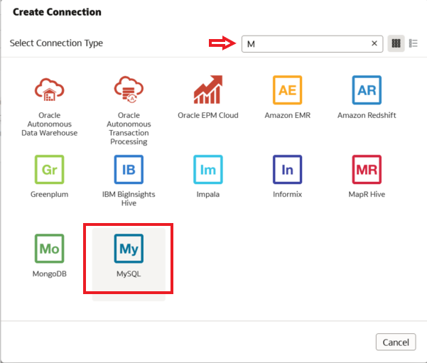

In the new window we have a lot of information we need to provide. Host name is a little bit tricky, we need to provide the Internal FQDN (fully qualified domain name) of the MySQL Database Instance. To find this out, you need to go back to the MySQL instance details.

Go to Databases section on your Cloud Home Page and select **DB Systems** and finally select **mysql-analytics-test** instance that we created previously and you will find all the information required such as **Internal FQDN** and **MySQL Port** in the _Endpoint section_.

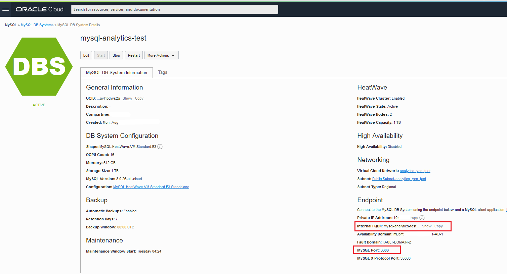 


### **Task 1.5:**

- To create the connection, fill out with the following information:

    - **Connection Name**: _**`MySQL_Connection`**_

    - **Host**: Copy the information from Internal FQDN here. ex: _mysql-analytics-test.@#$%^&*0.analyticsvcntes.oraclevcn.com_

    - **Port**: Copy the information from MySQL Port. It should be _3306_.

    - **Database Name**: _tpch_

    - **Username**: _admin_

    - **Password**: _Oracle.123_
  
After you filled out the information, click _**Save**_.

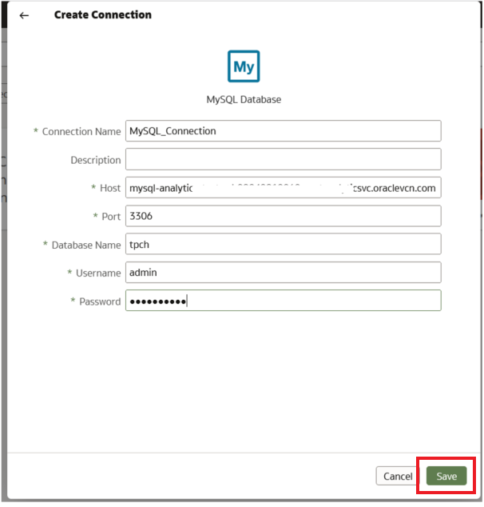

You Oracle Analytics Instance is now connected to your MySQL Database Service powered by HeatWave.


## **Task 2:** Create your first dashboard


### **Task 2.1:**
- Let's now use this connection to create a very simple dashboard! From the top right corner click _**Create**_ and this time click on _**Data Set**_.

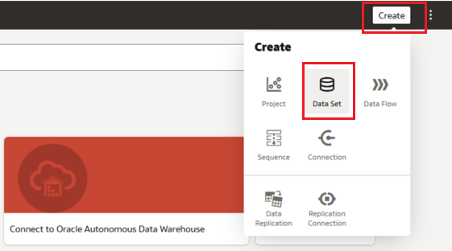

### **Task 2.2:**
- From the new window select the connection we just created **MySQL_Connection.**


Click on the _**tpch**_ database in the left side of the dashboard.

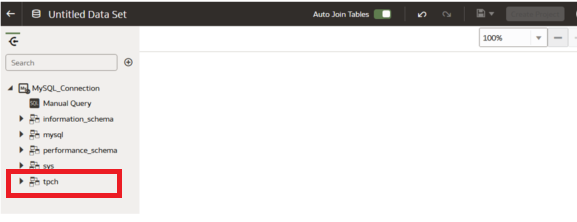

**NOTE**: As a general note, keep in mind that you can use the Undo/Redo buttons at the top right of the screen if you make any mistake in this section.


### **Task 2.3:**
- Now, you will see all the database's tables and views. Select the view we created for this lab called  _**myAnalyticsView**_ on the first step of the Analytics Lab. Drag and Drop that view to the main canvas of OAC dashboard.

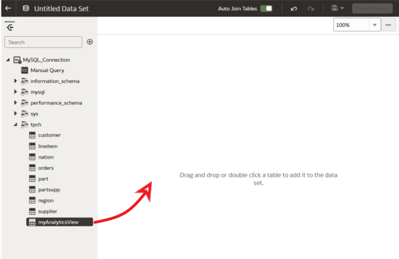

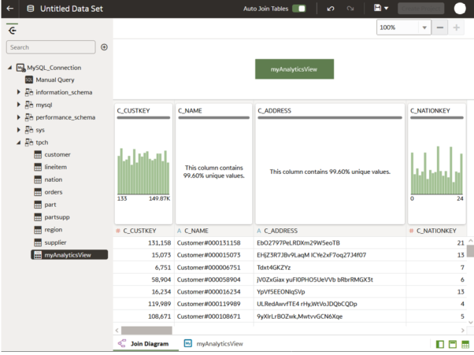

 Save the Data Set on the top left corner of the page where you can see Untitled Dat Set. Call it _**myAnalyticsView**_ and then click **OK**.

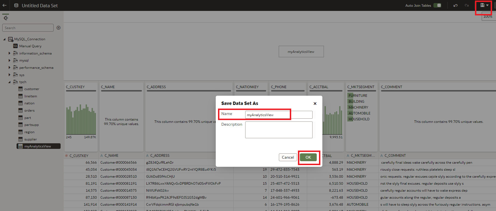

 To view the dataset click on the _**myAnalyticsView**_ tab at the bottom.

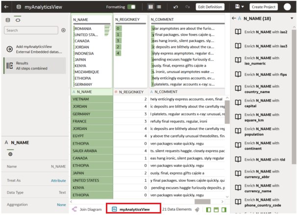

### **Task 2.4:**

- Now you can see the data that has been retrieved. From the _**Recommendations**_ column on the right we could use the suggestions to clean the data. We will leave this topic for another time but feel free to check **[Oracle's documentation](https://docs.oracle.com/en/cloud/paas/analytics-cloud/acubi/data-enrichment-and-transformation-oracle-analytics.html)** on how to use this useful feature!

 To move forward click on _**Create Project**_  button on the top right corner. You will see the Visualisation screen where you can start building your dashboards! 
 
 If **Create Project** button is not activated, make sure you have saved the Data Set name as shown in the _Task 2.3_ .

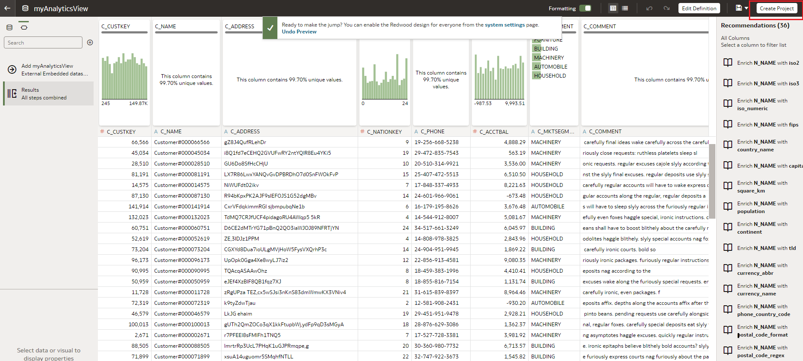

### **Task 2.5:** 

- From the left side of the dashbaord, select the column **`N_NAME`**, and then while pressing CTRL (or Comamnd if you are on Mac) click
  
   **`O_TOTALPRICE`**, and right click and select _**Create Best Visualization**_.

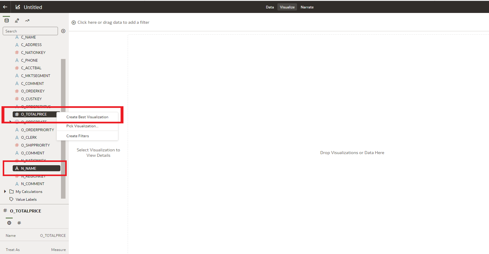

 A Bar Chart will appear after few seconds and we will see that every country contributes approximately equally to the company's revenues.

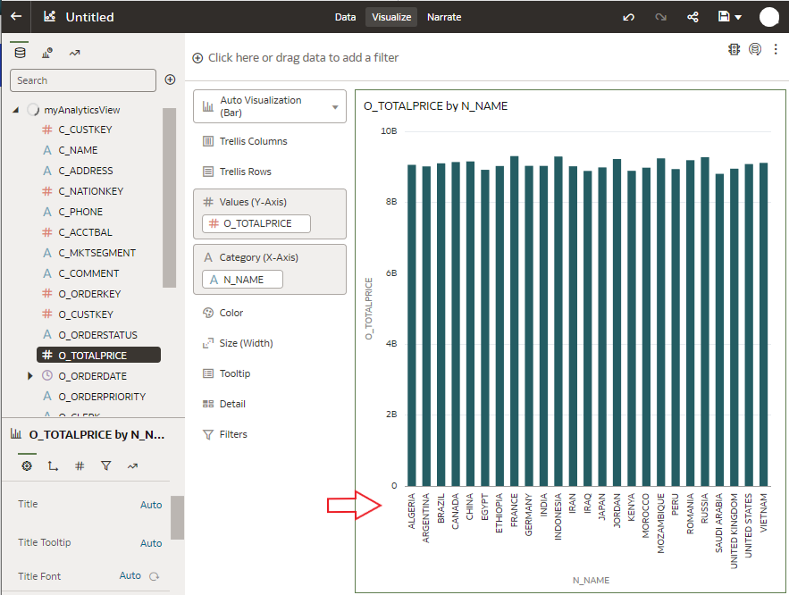

 As you can notice that the information is by country names, so a better way to visualize this data would be on a map. With OAC you can use maps without the need of complex geo-coding data, just out of the country names. Let's create that map.
 
 Right-click on the visualization and go to **Edit--> Duplicate Visualization**.
 


 On the duplicated visual, click on **Visualization Type** and choose **Map**.

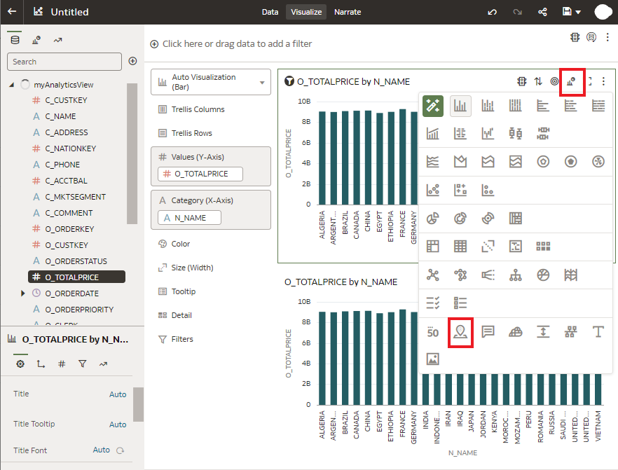

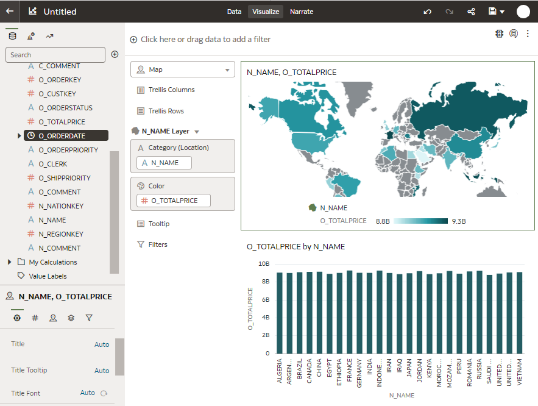

 Our new map appears on the screen. Now let’s analyze the trend of prices by time. On the Explorer pane on the left, expand the column **`O_ORDERDATE`**, 
 
 then click on Year, hold CTRL and click on **`O_TOTALPRICE`**. Right-click and choose _**Create Best Visualization**_.

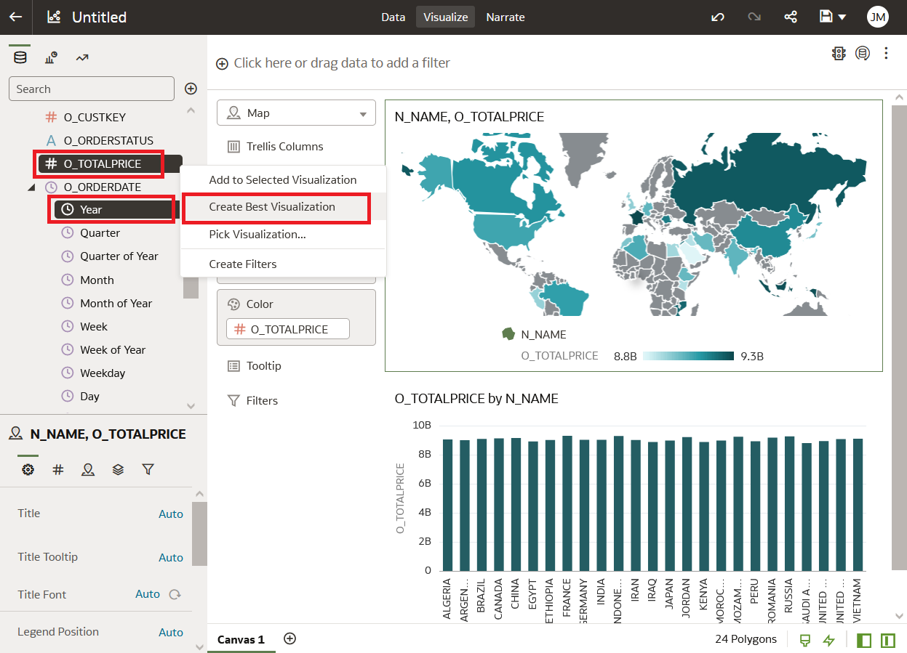

 A line chart will be created at the bottom. We see the historical trend and a drop in the latest year. It would be awesome to know if this drop was a one off, and the embedded Machine Learning within OAC can help you predict the future behavior. Right-click on the Line graphic and go to **Add Statistics --> Forecast**. 

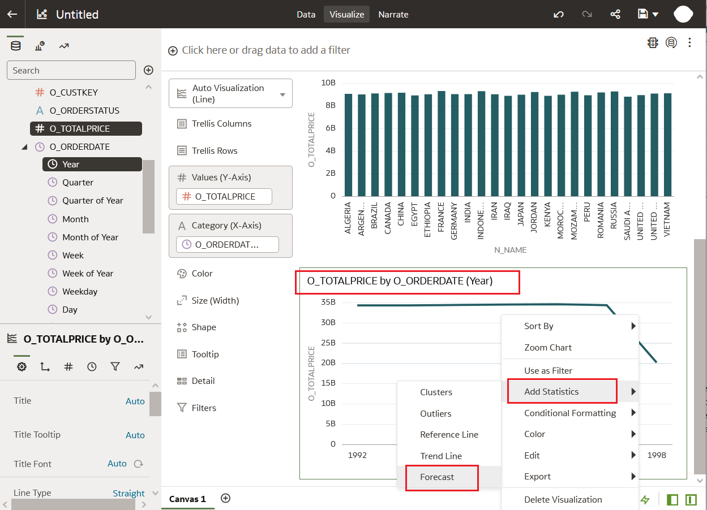

 The visual now shows the forecasted **`O_TOTALPRICE`** based on the Machine Learning applied to the data from the MySQL database. 
 It looks like we will recover from this drop.

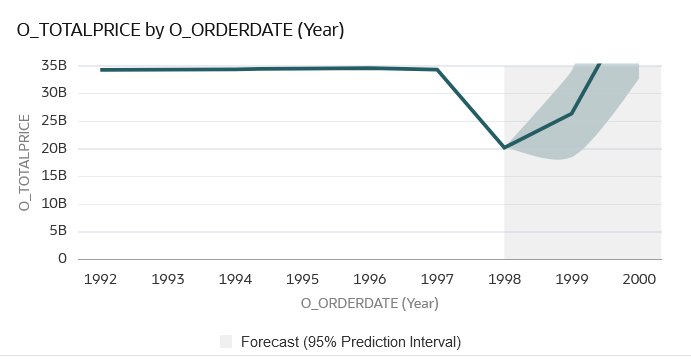

 Finally, save the project by clicking on the Disk icon at the top right of the screen. Give it a name like **Company’s Revenue**.

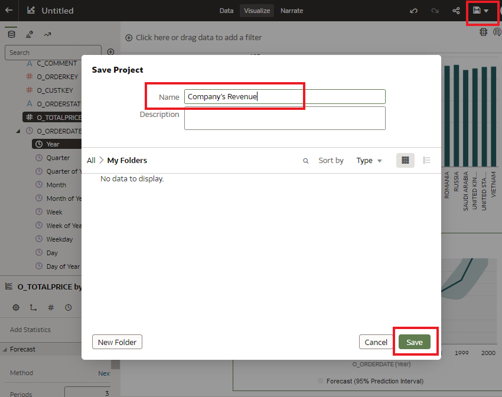

 You can see the name of the Project on the top left corner of the dashboard.

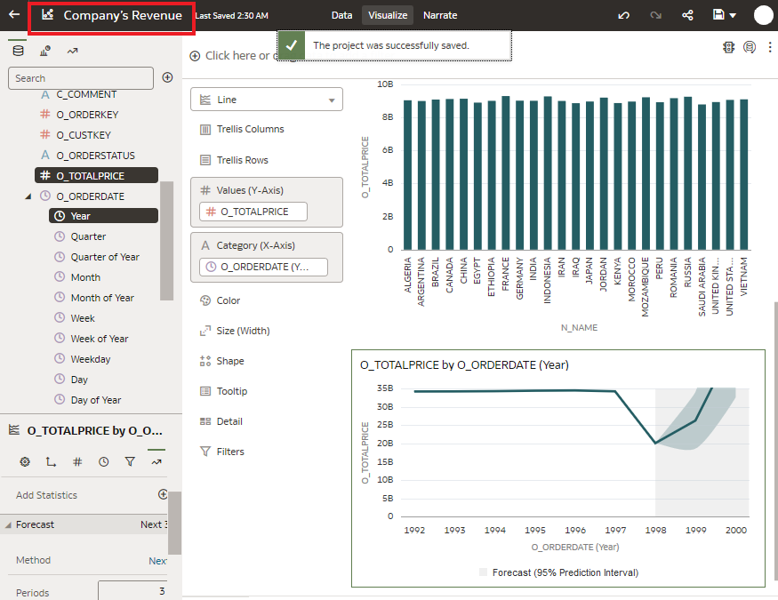

### **Task 2.6:**
- You can also share your project by email or social media. Have a look at the possibilities.

 Select the **Share** icon and select **File** or **Print**.

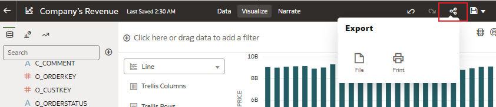

 You can choose to Save your project in a wide variety of standard formats such as PowerPoint (pptx), Acrobat (pdf), Image (png), Data (csv), Package (dva).  Also, you can choose which parts of your project to include, such as All Canvas, only the Active Canvas or the Active Visual. 

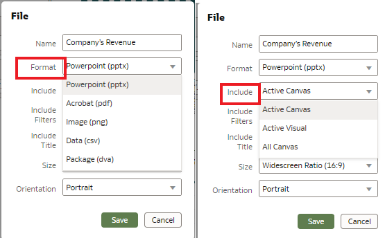

 The file will be downloaded locally on your machine.

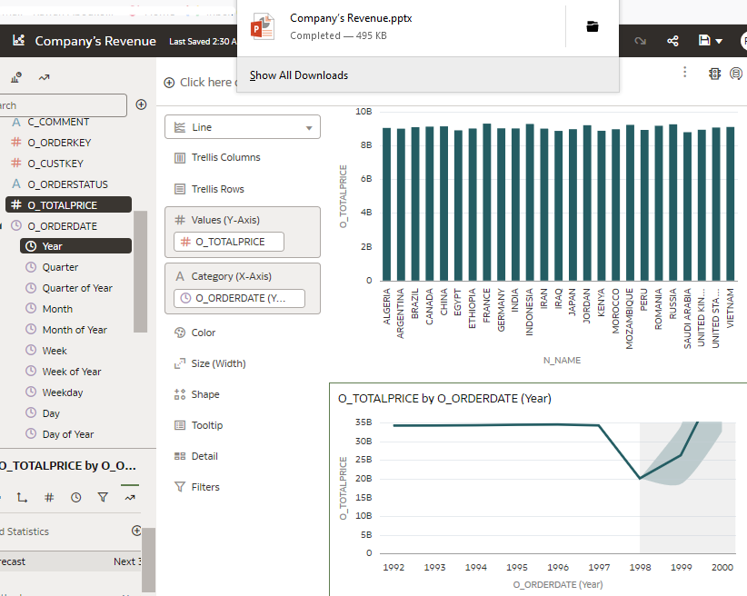

 When you select **Print**, you can choose which parts of your project to include in the Printed output, such as All Canvas, only the Active Canvas or the Active Visual, etc.

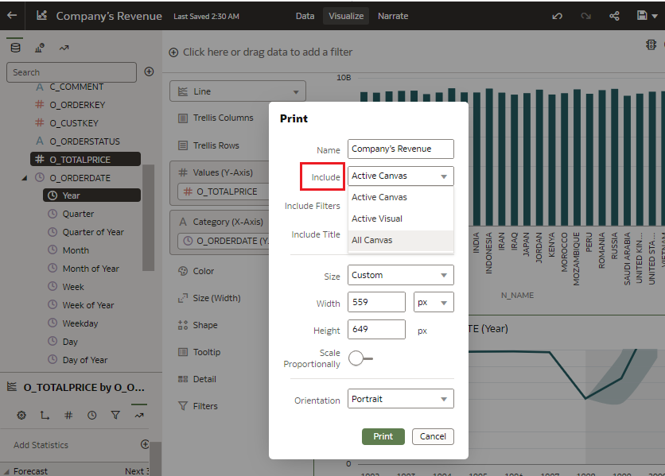


**Well done, Congratulations!** You now have all the tools to discover insights in your data!

 If you want to discover more on how to use Oracle Analytics Cloud check our **[Tutorials](https://docs.oracle.com/en/cloud/paas/analytics-cloud/tutorials.html)** and **[Live Labs!](https://apexapps.oracle.com/pls/apex/dbpm/r/livelabs/livelabs-workshop-cards?p100_focus_area=28&me=117&clear=100&session=107258786260970)**


## **Acknowledgements**
- **Author** - Rawan Aboukoura - Technology Product Strategy Manager, Vittorio Cioe - MySQL Solution Engineer
- **Contributors** - Priscila Iruela - Technology Product Strategy Director, Victor Martin - Technology Product Strategy Manager
- **Last Updated By/Date** -