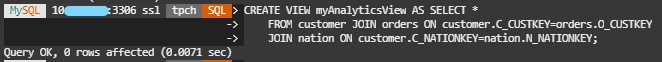
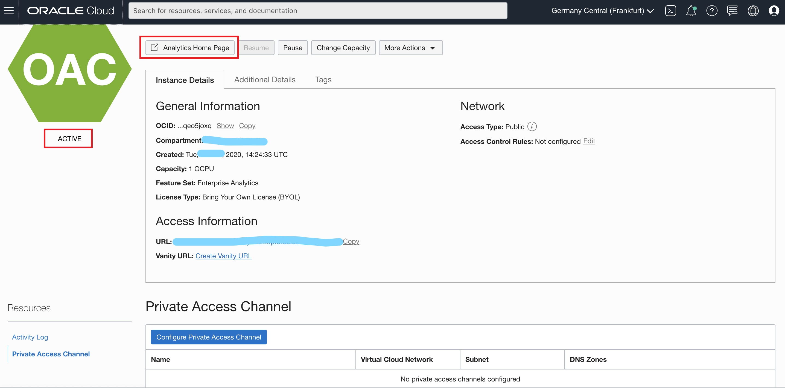
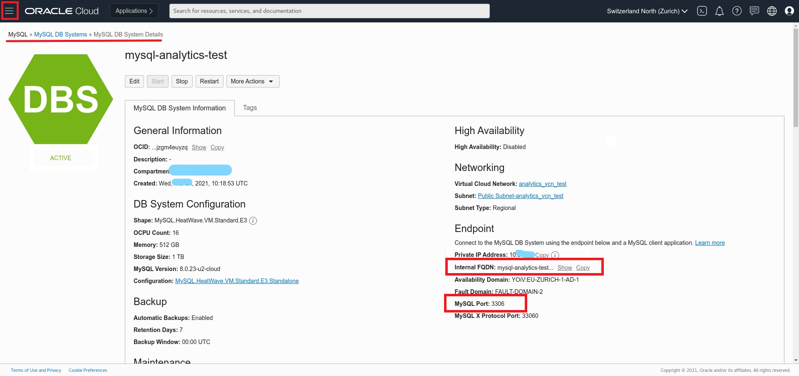
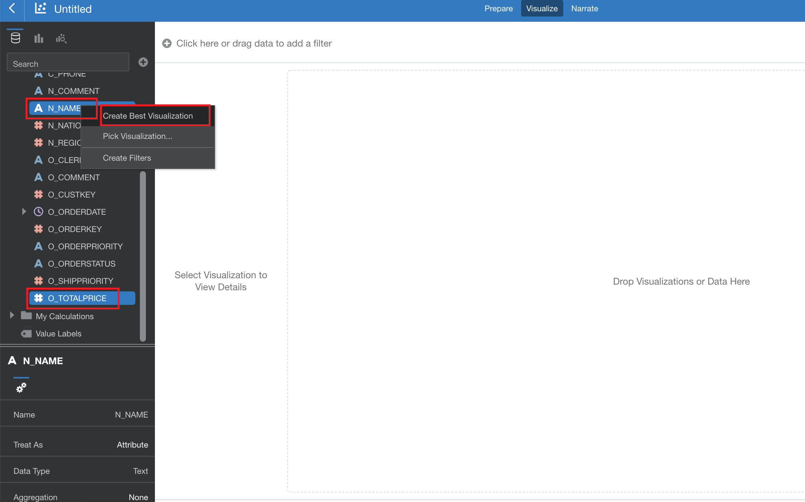

# Lab 4: Use Analytics Cloud on MySQL Database Service powered by HeatWave

## Introduction

In this lab we will use the Oracle Analytics Cloud instance we created in the first lab. Oracle Analytics Cloud is embedded with machine learning that will provide you intelligent insights using natural language generation that automatically creates smart textual descriptions of visualizationsand, and the capability to instantly visualize your data which helps oraganizations with root cause investigation, troubleshooting and decision-making process.

**Objectives:**
- Learn how to create your Analytics dashboards using Oracle Analytics Cloud on MySQL Database Service powered by HeatWave

**Time estimated: x mins**

## Task 1: Create Oracle Analytics Cloud Instance 

### **Task 1.1:**

- From the Cloud shell connect to MySQL DB System:
  
```
mysqlsh --user=admin --password=Oracle.123 --host=<mysql_private_ip_address> --port=3306 --database=tpch --sql
```

Run the following query to create a virtual table _**myAnalyticsView**_ that will include data from other tables from the database:

```
CREATE VIEW myAnalyticsView AS SELECT * 
    FROM customer JOIN orders ON customer.C_CUSTKEY=orders.O_CUSTKEY
    JOIN nation ON customer.C_NATIONKEY=nation.N_NATIONKEY;
    
```


### **Task 1.2:**
Now going back to the main page click on the _**hamburger menu**_ in the upper left corner and click on _**Analytics & AI -> Analytics Cloud**_.


By now the status of the instance changes to _Active_, click on the button _**Analytics Home Page Channel**_ to access Oracle Analytics Cloud.



### **Task 1.3:**
We now want to connect to our MySQL Database Service, so from the top right corner click _**Create**_ and then _**Connection**_.


### **Task 1.4:**

Browse the connection type or simply type in the search section _**MySQL**_, and Click it.


In the new window we have a lot of information we need to provide. Host name is a little bit tricky, we need to provide the Internal FQDN (fully qualified domain name) of the MySQL Database Instance. To find this out, you need to go back to the MySQL instance details.

Go to Databases section on your Cloud Home Page and select DB Systems and finally select mysql-analytics-test instance that we created previously and you will find all the information required such as Internal FQDN and MySQL Port in the Endpoint section.




### **Task 1.5:**

To create the connection, fill out with the following information:

- Connection Name: MySQL_Connection
- Host: Copy the information from Internal FQDN here. It should be something like: mysql-analytics-test.sub07201157510.analyticsvcntes.oraclevcn.com
- Port: Copy the information from MySQL Port. It should be 3306.
- Database Name: tpch
- Username: admin
- Password: Oracle.123
  
After you filled out the information, click Save.


You Oracle Analytics Instance is now connected to your MySQL Database Service powered by HeatWave.


## **Task 2:** Create your first dashboard


### **Task 2.1:**
Let's now use this connection to create a very simple dashboard! From the top right corner click _**Create**_ and this time click on _**Data Set**_.


### **Task 2.2:**
From the new window select the connection we just created _**MysSQL_Connection.**_.


Click on the _**tpch**_ database in the left side of the dashboard.


NOTE: As a general note, keep in mind that you can use the Undo/Redo buttons at the top right of the screen if you make any mistake in this section.


### **Task 2.3:**

Now, you will see all the database's tables and views. Select the view we created for this lab called  _**myAnalyticsView**_ on the first Step of Lab 4. Drag and Drop that view to the main canvas of OAC dashboard.


Save the Data Set on the top left corner of the page where you can see Untitled Dat Set. Call it _**myAnalyticsView**_.


### **Task 2.4:**
Now you can see the data that has been retrieved. From the _**Recommendations**_ column on the right we could use the suggestions to clean the data. We will leave this topic for another time but feel free to check **[Oracle's documentation](https://docs.oracle.com/en/cloud/paas/analytics-cloud/acubi/data-enrichment-and-transformation-oracle-analytics.html)** on how to use this useful feature!

To move forward click on _**Create Project**_  button on the top right corner. You will see the Visualisation screen where you can start building your dashboards! 
If Create Project button is not activated, be sure you have save the name the Data Set, just in case. Click the _**Save**_ icon next to Create Project, confirm the name of the Data Set, _**myAnalyticsView**_ and after click _**Create Project**_.


### **Task 2.5:** 

From the left side of the dashbaord, select the column _**N_NAME**_ and then, while pressing CTRL (or Comamnd if you are on Mac) click _**O_TOTALPRICE**_, right click and select _**Create Best Visualization**_.



A nice Bar Chart will appear after few seconds and we will see that every country contributes approximately equally to the company's revenues.


Remember to Save the Project that we have built clicking on the Save icon and provide a name such as Company's Revenue.


You can see the name of the Project on the top left corner of the dashboard.


### **Task 2.6:**

You can share your project by email or social media. Have a look at the possibilities.

Select the Share icon and select File or Print.


You can choose to Save your project in a wide variety of standard formats such as PowerPoint (pptx), Acrobat (pdf), Image (png), Data (csv), Package (dva).  You can choose which parts of your project to include, such as All Canvas, only the Active Canvas or the Active Visual.


The file will be downloaded locally on your machine.


When you select Print, you can choose which parts of your project to include in the Printed output, such as All Canvas, only the Active Canvas or the Active Visual, etc


**Well done, Congratulations!** You now have all the tools to discover insights in your data!

If you want to discover more on how to use Oracle Analytics Cloud check our **[Tutorials](https://docs.oracle.com/en/cloud/paas/analytics-cloud/tutorials.html)** and **[Live Labs!](https://apexapps.oracle.com/pls/apex/dbpm/r/livelabs/livelabs-workshop-cards?p100_focus_area=28&me=117&clear=100&session=107258786260970)**


**[<< Go to Lab 3](/heatwave/heatwave.md)** | **[Home](../intro.md)** 


 ## Acknowledgements
- **Author** - Rawan Aboukoura - Technology Product Strategy Manager, Vittorio Cioe - MySQL Solution Engineer
- **Contributors** - Priscila Iruela - Technology Product Strategy Director 
- **Last Updated By/Date** -