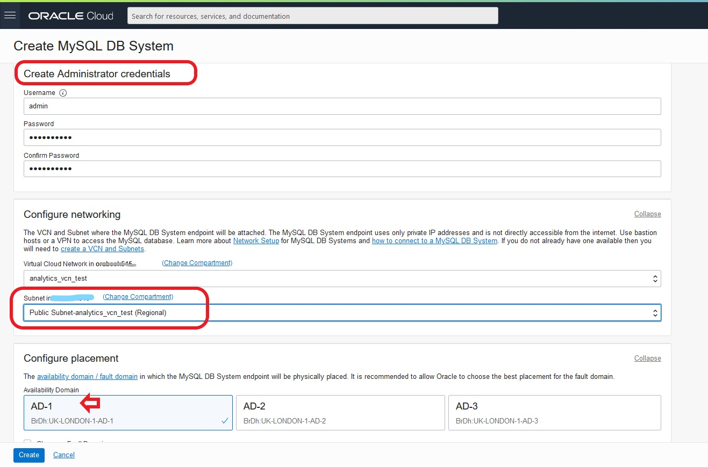
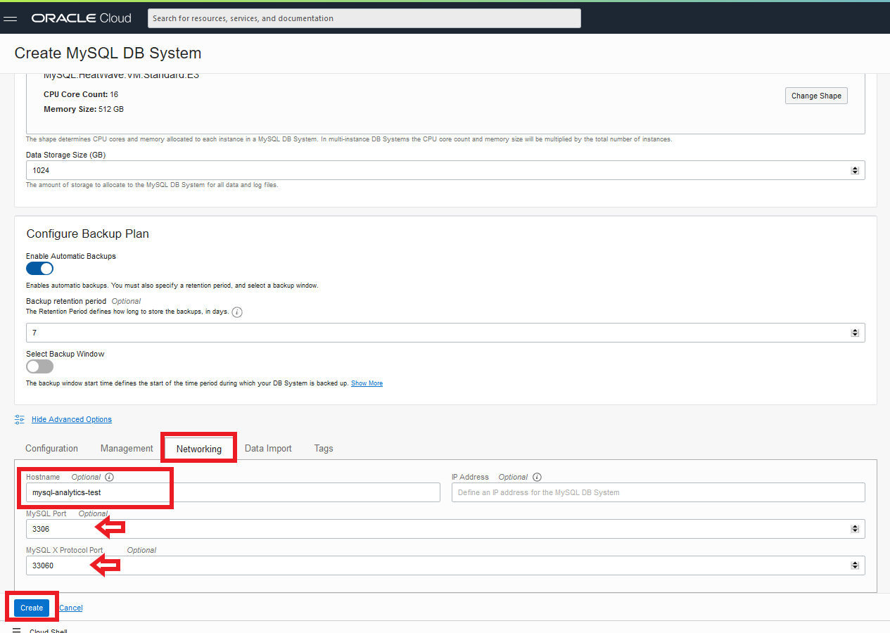
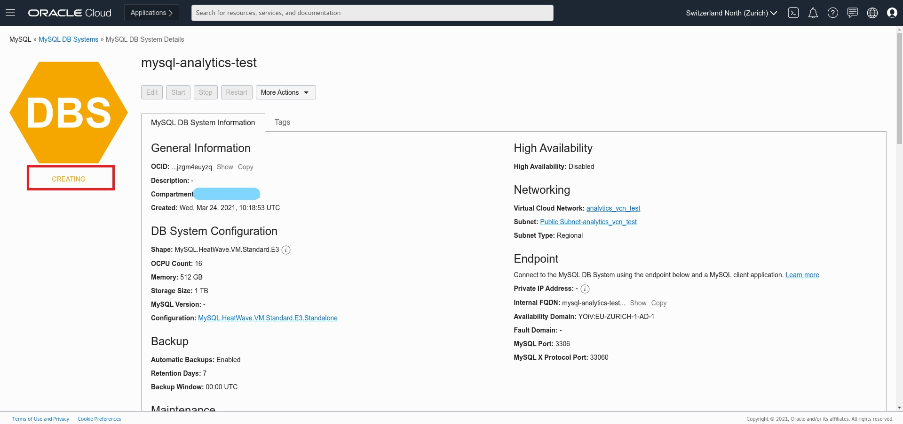
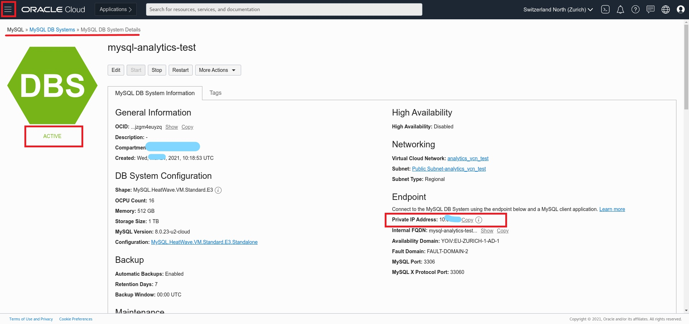
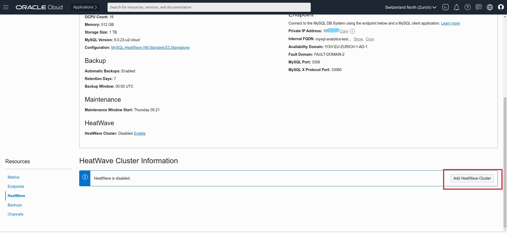

# Lab 2: Create MySQL DB System (MDS) with HeatWave 

## Introduction

By enabling HeatWave you will deploy a standalone DB System characterized by a HeatWave-compatible shape (MySQL.HeatWave.VM.Standard.E3) and 1TB of data storage that will accelerate processing of analytic queries. The DB System and HeatWave cluster must use the same shape, the shape defines the number of CPU cores, the amount of RAM, and so on. The size of the HeatWave cluster needed depends on tables and columns required to load, and the compression achieved in memory for this data. For more information, check **[HeatWave Documentation](https://docs.oracle.com/en-us/iaas/mysql-database/doc/heatwave1.html#GUID-9401C69A-B379-48EB-B96C-56462C23E4FD)**. 

### Objectives: 

-  Create an Instance of MySQL DB Systems
-  Add HeatWave cluster to MySQL Database Service


**Time estimated: x mins**

## **Task 1:** Create an Instance of MySQL in the Cloud

### **Task 1.1:**
- From the main menu on the left select _**Databases >> DB Systems**_
  


### **Task 1.2:**
- The previous Task will bring you to the DB System creation page. 
Look at the compartment selector on the left and check that you are using the same compartment used to create the VCN and the Compute Instance. Once done, click on _**Create MySQL DB System**_.


### **Task 1.3:**
- Start creating the DB System. Cross check again the compartment and assign to the DB System the name _**mysql-analytics-test**_ and select the HeatWave box. This will allow to create a MySQL DB System which will be HeatWave-ready. Ignore other boxes.
  


### **Task 1.4:**
- In the _**Create Administrator Credential**_ section enter the following information:
  
```
username: admin
password: Oracle.123
```
- In the _**Configure Networking**_ section make sure you select the same subnet which you have used to create the Compute Instance (Public-Subnet-analytics_vcn_test(Regional)).

- Leave the default availability domain and proceed to the _**Configure Hardware**_ section.
 
  

### **Task 1.5:**
- Confirm that in the _**Configure Hardware**_ section, the selected shape is MySQL.HeatWave.VM.Standard.E3, CPU Core Count: 16, Memory Size: 512 GB, Data Storage Size: 1024.
In the _**Configure Backup**_ section leave the default backup window of 7 days.


### **Task 1.6:**
- Scroll down and click on _**Show Advanced Options**_ 
  


### **Task 1.7:**
- In the Configuration tab click on _**Select Configuration**_ 


### **Task 1.8:**
- In the _**Browse All Configurations**_ window, select MySQL.HeatWave.VM.Standard.E3.Standalone, and click the button _**Select a Configuration**_ 


### **Task 1.9:**
- If everything is correct you should see something corresponding to the below


### **Task 1.10:**
- Go to the Networking tab, and in the Hostname field enter _**mysql-analytics-test**_ (same as DB System Name). 
Check that port configuration corresponds to the following:

- MySQL Port: 3306
- MySQL X Protocol Port: 33060
  
Once done, click the _**Create**_ button.



### **Task 1.11:**
- The MySQL DB System will have _**CREATING**_ state (as per picture below). Meanwhile you can go ahead and proceed to the next Task.
  



## **Task 2:** Add HeatWave cluster to MySQL Database Service


### **Task 2.1:**
- In the menu on the left, go to _**Databases >> DB Systems**_
Click on the DB System which you have previously created and verify that status is _**Active**_.
Take note of the _**Private IP Address**_ of the MySQL DB System.



### **Task 2.2:**
- Scroll down and select _**HeatWave**_ from the menu on the left.
  


### **Task 2.3:**
- Click on the button _**Add HeatWave Cluster**_ located on the right.
  


### **Task 2.4:**
- Check that Shape looks as per picture below and that Node Count is set to 2.
Click the blue button _**Add HeatWave Cluster**_


### **Task 2.5:**
- You will be brought back to the main page where you can check for the creation status. After some seconds you should see the nodes in _**Creating**_ status.
  


### **Task 2.6:**
- After completion, the node status will switch to _**Active**_ status. The process will take some time to be completed. 
  


In this lab we have created a MySQL DB System node includes a HeatWave plugin that is responsible for cluster management, query scheduling, and returning query results to the MySQL DB System. 
So now let's connect to MySQL DB System and run some queries before we enable the HeatWave cluster in the next lab! 

**[<< Go to Lab 1](/infrastructure/infrastructure.md)** | **[Home](../intro.md)** | **[Go to Lab 3 >>](/heatwave/heatwave.md)**

 ## Acknowledgements
- **Author** - Rawan Aboukoura - Technology Product Strategy Manager, Vittorio Cioe - MySQL Solution Engineer
- **Contributors** - Priscila Iruela - Technology Product Strategy Director 
- **Last Updated By/Date** -