# Lab 3: Run queries leveraging HeatWave
 
   
## Introduction

HeatWave accelerates MySQL queries by 400X using massively parallel processing to provide real-time analytics. So in this lab we will run queries with HeatWave enabled and without and finally observe the results.

Estimated Lab Time: 20 minutes

### Objectives
-  Import data into MDS and load tables to HeatWave
-  Execute queries leveraging HeatWave and compare the query execution time with and without HeatWave enabled

### Prerequisites

  - All previous labs have been successfully completed.

  
  
## **Task 1:** Import data into MDS and load tables to HeatWave

### **Task 1.1:**

- Back to the ssh connection at the cloud shell, if it is disconnected, type the following command to connect again to the instance using the publec IP address of the compute instance.


```
<copy>ssh -i <private-key-file-name>.key opc@<compute_instance_public_ip></copy>
```


- Connect to MySQL DB System with MySQL Shell using MySQL DB private IP address, as the following command:
```
<copy>mysqlsh --user=admin --password=Oracle.123 --host=<mysql_private_ip_address> --port=3306 --js</copy>
```
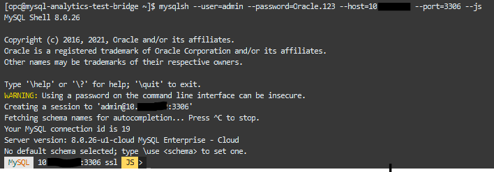

### **Task 1.2:**

- From the MySQL Shell connection, import the data set into MySQL DB System:
```
<copy>util.loadDump("/home/opc/tpch_dump", {dryRun: true, resetProgress:true, ignoreVersion:true})</copy>
```
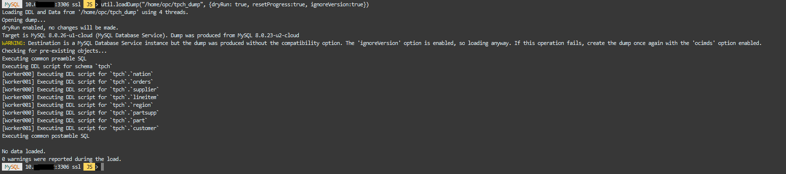

This command will commit a dry run of the import. If it terminates without errors, execute the following to load the dump for real:
```
<copy>util.loadDump("/home/opc/tpch_dump", {dryRun: false, resetProgress:true, ignoreVersion:true})</copy>
```
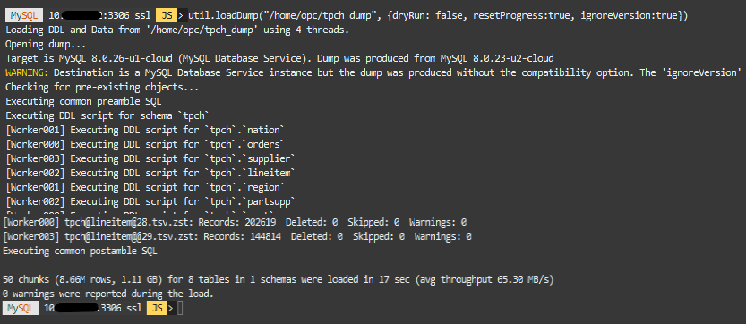

### **Task 1.3:**
- Check the imported data. From MySQL Shell execute the commands:

```
<copy>
\sql
</copy>
```

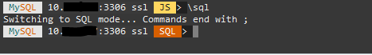

```
<copy>
SHOW DATABASES;
</copy>
```
You should see the following output:

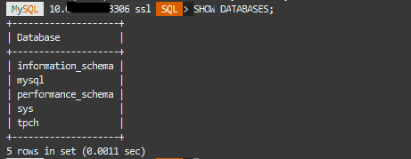

Continue with commands:
```
<copy>
USE tpch;
</copy>
```

```
<copy>
SHOW TABLES;
</copy>
```
You should see the following output:

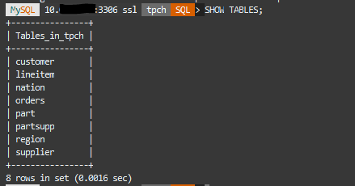

### **Task 1.4:**
- Let's start testing a simple query but yet effective query.
From the previous SQL prompt, run the following query and check the execution time (approximately 12-13s):
```
<copy>
SELECT
    l_returnflag,
    l_linestatus,
    SUM(l_quantity) AS sum_qty,
    SUM(l_extendedprice) AS sum_base_price,
    SUM(l_extendedprice * (1 - l_discount)) AS sum_disc_price,
    SUM(l_extendedprice * (1 - l_discount) * (1 + l_tax)) AS sum_charge,
    AVG(l_quantity) AS avg_qty,
    AVG(l_extendedprice) AS avg_price,
    AVG(l_discount) AS avg_disc,
    COUNT(*) AS count_order
FROM
    lineitem
WHERE
    l_shipdate <= DATE '1998-12-01' - INTERVAL '90' DAY
GROUP BY l_returnflag , l_linestatus
ORDER BY l_returnflag , l_linestatus;
</copy>
```
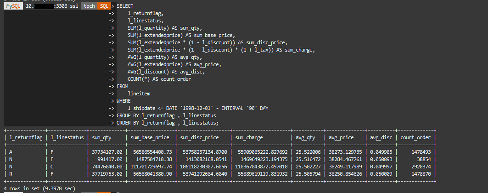

- Exit from MySQL Shell:
  
```
<copy>
 \exit
</copy>
```


## **Task 2:** Execute queries leveraging HeatWave

### **Task 2.1:**

- On the OCI console, check that HeatWave nodes are in _**Active**_ status, go to Databases >> DB Systems and check under the HeatWave section.
  


- If HeatWave nodes are in _**Active**_ status, you can load the tpch database tables into HeatWave, from your bastion host ssh connection, using the following command:
```
<copy>
mysqlsh --user=admin --password=Oracle.123 --host=<mysql_private_ip_address> --port=3306 --sql < tpch_offload.sql
</copy>
```

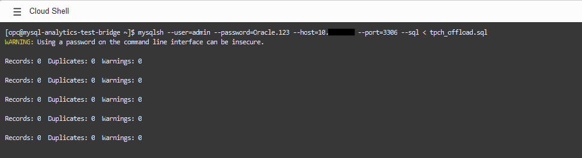

 

### **Task 2.2:**

- Let's come back to the previous query and execute it this time using HeatWave.

Connect to MySQL DB System:
```
<copy>
mysqlsh --user=admin --password=Oracle.123 --host=<mysql_private_ip_address> --port=3306 --database=tpch --sql
</copy>
```
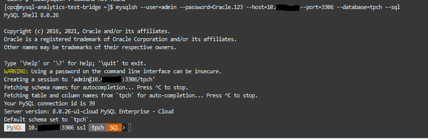

- Now let's enable _**HeatWave**_  and let the Magic begin:
```
<copy>
set @@use_secondary_engine=ON;
</copy>
```


### **Task 2.3:**

- Check the explain plan of the previous query and confirm it will be using secondary engine:
```
<copy>
EXPLAIN SELECT
    l_returnflag,
    l_linestatus,
    SUM(l_quantity) AS sum_qty,
    SUM(l_extendedprice) AS sum_base_price,
    SUM(l_extendedprice * (1 - l_discount)) AS sum_disc_price,
    SUM(l_extendedprice * (1 - l_discount) * (1 + l_tax)) AS sum_charge,
    AVG(l_quantity) AS avg_qty,
    AVG(l_extendedprice) AS avg_price,
    AVG(l_discount) AS avg_disc,
    COUNT(*) AS count_order
FROM
    lineitem
WHERE
    l_shipdate <= DATE '1998-12-01' - INTERVAL '90' DAY
GROUP BY l_returnflag , l_linestatus
ORDER BY l_returnflag , l_linestatus;
</copy>
```
Look for the message "Using secondary engine RAPID" in the output

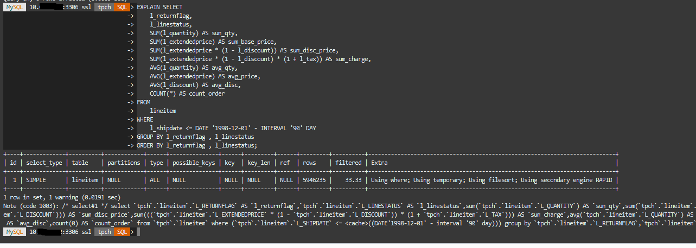

- Re-run the previous query and check the execution time again:
```
<copy>
SELECT
    l_returnflag,
    l_linestatus,
    SUM(l_quantity) AS sum_qty,
    SUM(l_extendedprice) AS sum_base_price,
    SUM(l_extendedprice * (1 - l_discount)) AS sum_disc_price,
    SUM(l_extendedprice * (1 - l_discount) * (1 + l_tax)) AS sum_charge,
    AVG(l_quantity) AS avg_qty,
    AVG(l_extendedprice) AS avg_price,
    AVG(l_discount) AS avg_disc,
    COUNT(*) AS count_order
FROM
    lineitem
WHERE
    l_shipdate <= DATE '1998-12-01' - INTERVAL '90' DAY
GROUP BY l_returnflag , l_linestatus
ORDER BY l_returnflag , l_linestatus;
</copy>
```

- This time execution time should be about 0.2-0.05s!!

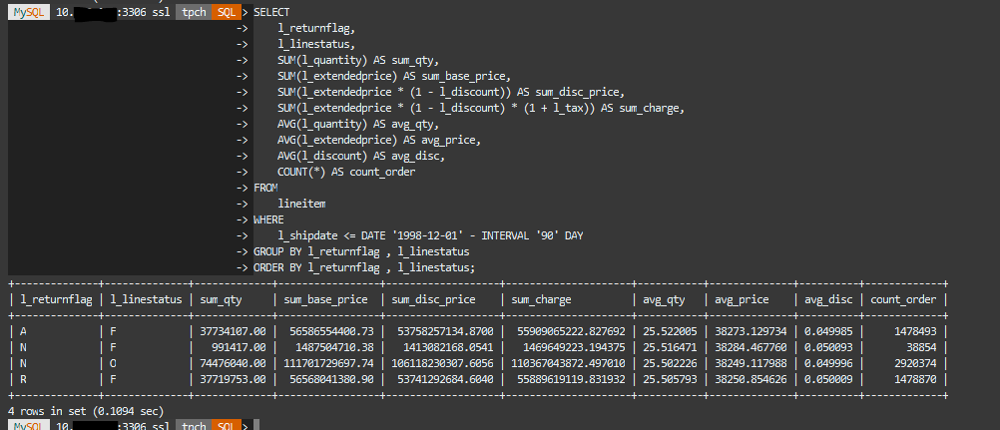

- Exit from MySQL Shell:
  
```
<copy>
 \exit
</copy>
```


### **Task 2.4:**

- Now that you have understood how HeatWave offloading works and which performance gain it can give, it is time to run some batch execution.

    We will run the script **`tpch_queries_mysql.sql`** to execute some queries without using HeatWave.
    Then, we will run the script **`tpch_queries_heatwave.sql`** to execute the same queries using HeatWave.
    In the end, we will compare the results.

- For this exercise, instead of MySQL Shell, we will use MySQL client.

Run the following commands:
```
<copy>
mysql -h<mysql private ip address> -uadmin -pOracle.123 -Dtpch < tpch_queries_heatwave.sql
</copy>
```
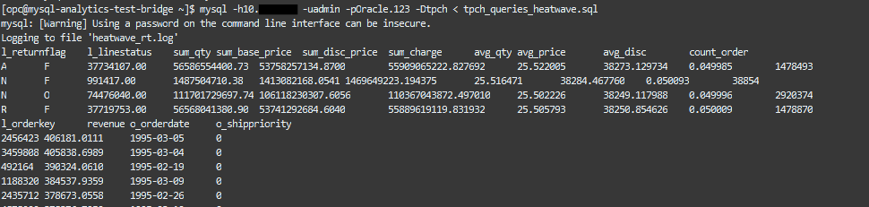

```
<copy>
mysql -h<mysql private ip address> -uadmin -pOracle.123 -Dtpch < tpch_queries_mysql.sql
</copy>
```
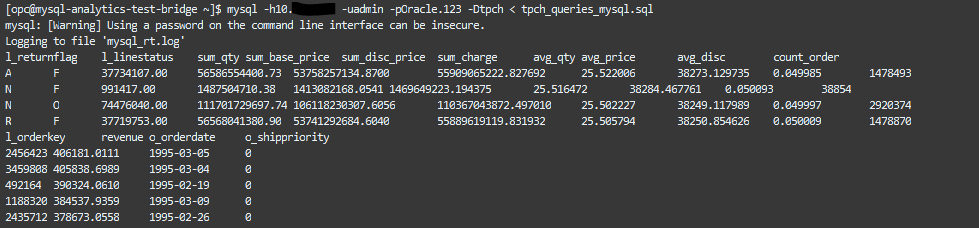

The query that doesn't use the HeatWave service took more time to be completed as we will see in the next command.
```
<copy>
diff -y heatwave_rt_profiles.log mysql_rt_profiles.log
</copy>
```

- The output of the last command should look as follows:

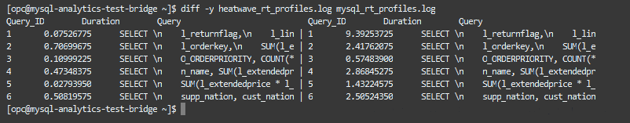

As we observe the execution time obtained using HeatWave and without, such as the first query using HeatWave it took approximately 0.07 sec in comparison with 9.39 sec that the query took to process which is relatively much longer than when a HeatWave cluster is enabled. 

Well done, you can now proceed to the next lab!


## **Acknowledgements**
- **Author** - Rawan Aboukoura - Technology Product Strategy Manager, Vittorio Cioe - MySQL Solution Engineer
- **Contributors** - Priscila Iruela - Technology Product Strategy Director, Victor Martin - Technology Product Strategy Manager 
- **Last Updated By/Date** -