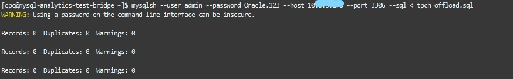

# Lab 3: Run queries leveraging HeatWave
 
   
## Introduction

HeatWave accelerates MySQL queries by 400X using massively parallel processing to provide real-time analytics. So in this lab will run queries with HeatWave enabled and with out and compare the result.

**Objectives:**
-  Import data into MDS and load tables to HeatWave
-  Execute queries leveraging HeatWave and compare the query execution time with and without HeatWave enabled


  **Time estimated: x mins**
  
## **Task 1:** Import data into MDS and load tables to HeatWave

### **Task 1.1:**
- Back to the ssh connection at the cloud shell, if it is disconnected, use the following to connect again to the isntance.
```
ssh -i <private-key-file-name>.key opc@<compute_instance_public_ip>
```


- Connect to MySQL DB System using MySQL Shell, with the following command:
```
mysqlsh --user=admin --password=Oracle.123 --host=<mysql_private_ip_address> --port=3306 --js
```

### **Task 1.2:**
- From the MySQL Shell connection, import the data set into MySQL DB System:
```
util.loadDump("/home/opc/tpch_dump", {dryRun: true, resetProgress:true, ignoreVersion:true})
```


This command will run a dry run of the import. If it terminates without errors, execute the followin to load the dump for real:
```
util.loadDump("/home/opc/tpch_dump", {dryRun: false, resetProgress:true, ignoreVersion:true})
```


### **Task 1.3:**
- Check the imported data. From MySQL Shell execute the commands:

```
\sql

SHOW DATABASES;
```
You should see the following output:
```
+--------------------+
| Database           |
+--------------------+
| information_schema |
| mysql              |
| performance_schema |
| sys                |
| tpch               |
+--------------------+
```
Continue with commands:
```
USE tpch;

SHOW TABLES;
```
(You shoul see the following output:)
```
+----------------+
| Tables_in_tpch |
+----------------+
| customer       |
| lineitem       |
| nation         |
| orders         |
| part           |
| partsupp       |
| region         |
| supplier       |
+----------------+
```

### **Task 1.4:**
- Let's start testing a simple query but yet effective query.
From the previous SQL prompt, run the following query and check the execution time (approximately 12-13s):
```
SELECT
    l_returnflag,
    l_linestatus,
    SUM(l_quantity) AS sum_qty,
    SUM(l_extendedprice) AS sum_base_price,
    SUM(l_extendedprice * (1 - l_discount)) AS sum_disc_price,
    SUM(l_extendedprice * (1 - l_discount) * (1 + l_tax)) AS sum_charge,
    AVG(l_quantity) AS avg_qty,
    AVG(l_extendedprice) AS avg_price,
    AVG(l_discount) AS avg_disc,
    COUNT(*) AS count_order
FROM
    lineitem
WHERE
    l_shipdate <= DATE '1998-12-01' - INTERVAL '90' DAY
GROUP BY l_returnflag , l_linestatus
ORDER BY l_returnflag , l_linestatus;
```
```
+--------------+--------------+-------------+-----------------+-------------------+---------------------+-----------+--------------+----------+-------------+
| l_returnflag | l_linestatus | sum_qty     | sum_base_price  | sum_disc_price    | sum_charge          | avg_qty   | avg_price    | avg_disc | count_order |
+--------------+--------------+-------------+-----------------+-------------------+---------------------+-----------+--------------+----------+-------------+
| A            | F            | 37734107.00 |  56586554400.73 |  53758257134.8700 |  55909065222.827692 | 25.522006 | 38273.129735 | 0.049985 |     1478493 |
| N            | F            |   991417.00 |   1487504710.38 |   1413082168.0541 |   1469649223.194375 | 25.516472 | 38284.467761 | 0.050093 |       38854 |
| N            | O            | 74476040.00 | 111701729697.74 | 106118230307.6056 | 110367043872.497010 | 25.502227 | 38249.117989 | 0.049997 |     2920374 |
| R            | F            | 37719753.00 |  56568041380.90 |  53741292684.6040 |  55889619119.831932 | 25.505794 | 38250.854626 | 0.050009 |     1478870 |
+--------------+--------------+-------------+-----------------+-------------------+---------------------+-----------+--------------+----------+-------------+
4 rows in set (12.6570 sec)
```
- Exit from MySQL Shell:
  
```
 \exit
```


## **Task 2:** Execute queries leveraging HeatWave

### **Task 2.1:**
- On the OCI console, to check that HeatWave nodes are in _**Active**_ status, go to Databases >> DB Systems and check under the HeatWave section as we did on Lab 2 Task 2.
  


### **Task 2.2:**
- If HeatWave nodes are in _**Active**_ status, you can load the tpch database tables into HeatWave, from your bastion host ssh connection, using the following command:
```
mysqlsh --user=admin --password=Oracle.123 --host=<mysql_private_ip_address> --port=3306 --sql < tpch_offload.sql
```



 
### **Task 2.3:**
- Let's come back to the previous query and execute it this time using HeatWave.

Connect to MySQL DB System:
```
mysqlsh --user=admin --password=Oracle.123 --host=<mysql_private_ip_address> --port=3306 --database=tpch --sql
```
- Now let's enable _**HeatWave**_  and let the Magic begin:
```
set @@use_secondary_engine=ON;
```


- Check the explain plan of the previous query and confirm it will be using secondary engine:
```
EXPLAIN SELECT
    l_returnflag,
    l_linestatus,
    SUM(l_quantity) AS sum_qty,
    SUM(l_extendedprice) AS sum_base_price,
    SUM(l_extendedprice * (1 - l_discount)) AS sum_disc_price,
    SUM(l_extendedprice * (1 - l_discount) * (1 + l_tax)) AS sum_charge,
    AVG(l_quantity) AS avg_qty,
    AVG(l_extendedprice) AS avg_price,
    AVG(l_discount) AS avg_disc,
    COUNT(*) AS count_order
FROM
    lineitem
WHERE
    l_shipdate <= DATE '1998-12-01' - INTERVAL '90' DAY
GROUP BY l_returnflag , l_linestatus
ORDER BY l_returnflag , l_linestatus;
```
Look for the message "Using secondary engine RAPID" in the output

```
+----+-------------+----------+------------+------+---------------+------+---------+------+---------+----------+----------------------------------------------------------------------------+
| id | select_type | table    | partitions | type | possible_keys | key  | key_len | ref  | rows    | filtered | Extra                                                                      |
+----+-------------+----------+------------+------+---------------+------+---------+------+---------+----------+----------------------------------------------------------------------------+
|  1 | SIMPLE      | lineitem | NULL       | ALL  | NULL          | NULL | NULL    | NULL | 5970493 |    33.33 | Using where; Using temporary; Using filesort; Using secondary engine RAPID |
+----+-------------+----------+------------+------+---------------+------+---------+------+---------+----------+----------------------------------------------------------------------------+
1 row in set, 1 warning (0.0123 sec)
```

- Re-run the previous query and check the execution time again:
```
SELECT
    l_returnflag,
    l_linestatus,
    SUM(l_quantity) AS sum_qty,
    SUM(l_extendedprice) AS sum_base_price,
    SUM(l_extendedprice * (1 - l_discount)) AS sum_disc_price,
    SUM(l_extendedprice * (1 - l_discount) * (1 + l_tax)) AS sum_charge,
    AVG(l_quantity) AS avg_qty,
    AVG(l_extendedprice) AS avg_price,
    AVG(l_discount) AS avg_disc,
    COUNT(*) AS count_order
FROM
    lineitem
WHERE
    l_shipdate <= DATE '1998-12-01' - INTERVAL '90' DAY
GROUP BY l_returnflag , l_linestatus
ORDER BY l_returnflag , l_linestatus;
```

- This time execution time should be about 0.2-0.05s!!

```
+--------------+--------------+-------------+-----------------+-------------------+---------------------+-----------+--------------+----------+-------------+
| l_returnflag | l_linestatus | sum_qty     | sum_base_price  | sum_disc_price    | sum_charge          | avg_qty   | avg_price    | avg_disc | count_order |
+--------------+--------------+-------------+-----------------+-------------------+---------------------+-----------+--------------+----------+-------------+
| A            | F            | 37734107.00 |  56586554400.73 |  53758257134.8700 |  55909065222.827692 | 25.522005 | 38273.129734 | 0.049985 |     1478493 |
| N            | F            |   991417.00 |   1487504710.38 |   1413082168.0541 |   1469649223.194375 | 25.516471 | 38284.467760 | 0.050093 |       38854 |
| N            | O            | 74476040.00 | 111701729697.74 | 106118230307.6056 | 110367043872.497010 | 25.502226 | 38249.117988 | 0.049996 |     2920374 |
| R            | F            | 37719753.00 |  56568041380.90 |  53741292684.6040 |  55889619119.831932 | 25.505793 | 38250.854626 | 0.050009 |     1478870 |
+--------------+--------------+-------------+-----------------+-------------------+---------------------+-----------+--------------+----------+-------------+
4 rows in set (0.0820 sec)
```
- Exit from MySQL Shell:
  
```
 \exit
```


### **Task 2.4:**

Now that you have understood how HeatWave offloading works and which performance gain it can give, it is time to run some batch execution.

We will run the script tpch_queries_mysql.sql to execute some queries without using HeatWave.
Then, we will run the script tpch_queries_heatwave.sql to execute the same queries using HeatWave.
In the end, we will compare the results.

For this exercise, instead of MySQL Shell, we will use MySQL client.


Run the following commands:
```
mysql -h<mysql private ip address> -uadmin -pOracle.123 -Dtpch < tpch_queries_heatwave.sql
```
```
mysql -h<mysql private ip address> -uadmin -pOracle.123 -Dtpch < tpch_queries_mysql.sql
```
The query that doesn't use the HeatWave service took more time to be completed as we will see in the next command.
```
diff -y heatwave_rt_profiles.log mysql_rt_profiles.log
```

- The output of the last command should look as follows:


- Now, you can compare the execution times obtained using HeatWave or only MySQL on InnoDB, such as the first query using HeatWave it took approximately 0.30 sec in comparison with 10.46 sec that took without. 

Optional: inspect the tpch_queries_mysql.sql and the tpch_queries_heatwave.sql scripts using vi.


Observing the results, we noticed the query processed in much shorter time when a HeatWave cluster is enabled. 
In the next lab you will learn how to use Oracle Analytics Cloud on MySQL Database Service powered by HeatWave.

**[<< Go to Lab 2](/dbmds/dbmds.md)** | **[Home](../intro.md)** | **[Go to Lab 4 >>](/analytics/analytics.md)**

 ## Acknowledgements
- **Author** - Rawan Aboukoura - Technology Product Strategy Manager, Vittorio Cioe - MySQL Solution Engineer
- **Contributors** - Priscila Iruela - Technology Product Strategy Director 
- **Last Updated By/Date** -