# Lab 1: Infrastructure Configuration 

## Introduction

In this lab we will build up the infrastructure that we will use to run the rest of the workshop on top. the main three elements that we will be creating are a Virtual Cloud Network which helps you define your own data centre network topology inside the Oracle Cloud by defining some of the following components (Subnets, Route Tables, Security Lists, Gateways, etc.), bastion host which is a compute instance that serves as the public entry point for accessing a private network from external networks like the internet, and finally we will create an Oracle Analytics Cloud instance which is embedded with machine learning, that helps organizations to discover unique insights faster with automation and intelligence.

### Objectives:
 
-	Create a Virtual Cloud Network and allow traffic through MySQL Database Service port
-	Create a compute instance as a bastion host
-	Connect to the bastion host, install MySQL Shell and download the workshop dataset
- Create an Oracle Analytics Cloud instance


**Time estimated: x mins**

## **Task 1**: Create a Virtual Cloud Network and allow traffic through MySQL Database Service port

### **Task 1.1:**
  Log-in to your OCI tenancy. Once you have logged-in, select _**Networking >> Virtual Cloud Networks**_ from the _**menu icon**_ on the top left corner.


### **Task 1.2:**
 From the Compartment picker on the bottom left side, select your compartment from the list.

_Note: If you have not picked a compartment, you can pick the root compartment which was created by default when you created your tenancy (ie when you registered for the trial account). It is possible to create everything in the root compartment, but Oracle recommends that you create sub-compartments to help manage your resources more efficiently._


### **Task 1.3:** 
 To create a virtual cloud network, click on _**Start VCN Wizard**_.
  
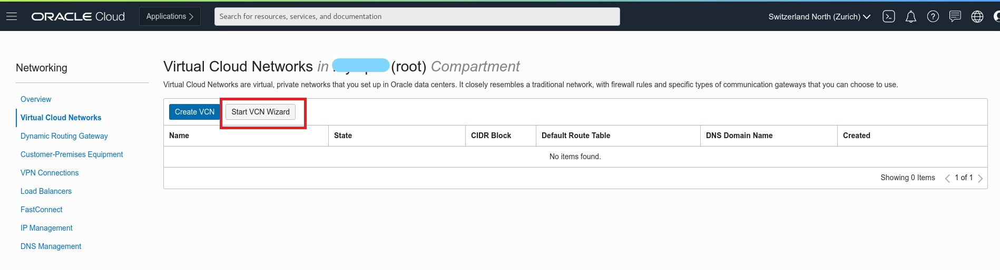

### **Task 1.4:** 
 Select _**VCN with Internet Connectivity**_ and click _**Start VCN Wizard**_.


### **Task 1.5:**
 Now you need to complete some information and set the configuration for the VCN. In the _**VCN NAME**_ field enter the value _**analytics_vcn_test**_ (or any name at your convenience), and make sure that the selected compartment is the right one. Leave all the rest as per default, Click next.

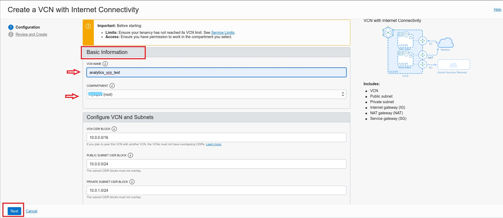

### **Task 1.6:** 
 Review the information showed is correct and click _**Create**_.

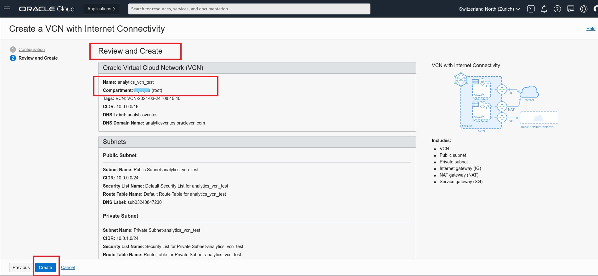

### **Task 1.7:** 
 Once the VCN will be created click _**View Virtual Cloud Network**_.


### **Task 1.8:** 
 Click on the _**Public_Subnet-analytics_vcn_test**_ link. 

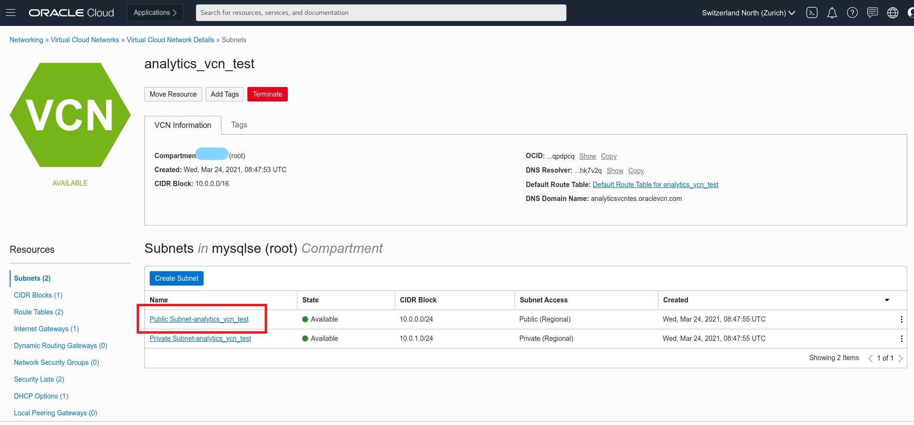

### **Task 1.9:** 
 Earlier we set up the subnet to use the VCN's default security list, that has default rules, which are designed to make it easy to get started with Oracle Cloud Infrastructure. 
 Now we will customize the default security list of the VCN to allow traffic through MySQL Database Service ports by clicking on  _**Default_Security_List_for_analytics_vcn_test**_.

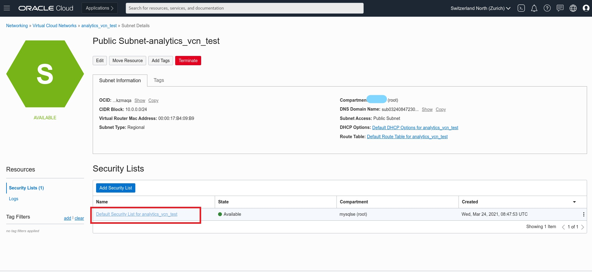

### **Task 1.10:** 
  Click on _**Add Ingress Rules**_.

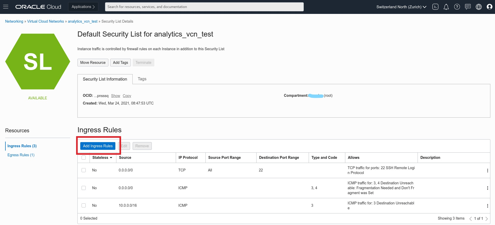

### **Task 1.11:**
 Add the necessary rule to the default security list to enable traffic through MySQL Database Service port. 

Insert the details as below:
Source CIDR  _**0.0.0.0/0**_,  port _**3306**_, description  _**MySQL Port**_.

At the end click the blue button _**Add Ingress Rules**_.


## **Task 2:** Create a compute instance as a bastion host


### **Task 2.1:**
- From the main menu on the top left corner select _**Compute >> Instances**_.
  


### **Task 2.2:** 
- In the compartment selector on the bottom left corner, select the same compartment where you created the VCN. Click on the _**Create Instance**_ blue button to create the compute instance.

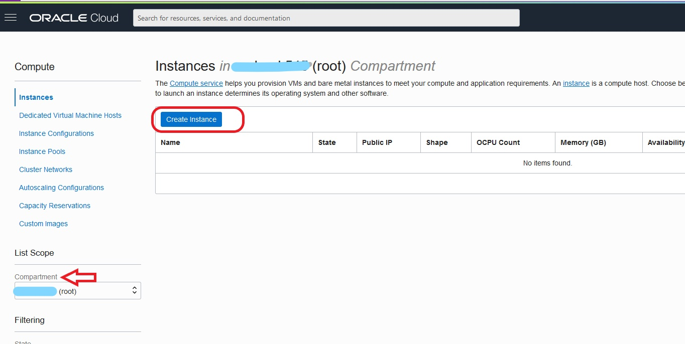

### **Task 2.3:** 
- In the _**Name**_ field, insert _**mysql-analytics-test-bridge**_ (or any other name at your convenience). This name will be used also as internal FQDN. 
The _**Placement and Hardware section**_ is the section where you can change Availability Domain, Fault Domain, Image to be used, and Shape of resources. For the scope of this workshop leave everything as default.

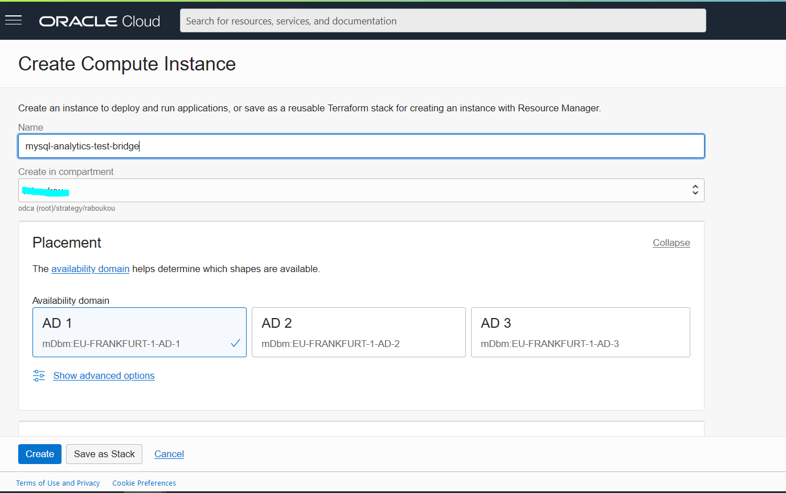


- As you scroll down you can see the Networking section, check that your previously created VCN is selected, and select your PUBLIC subnet (_**Public Subnet - analytics_vcn_test(Regional)**_) from the dropdown menu.
  
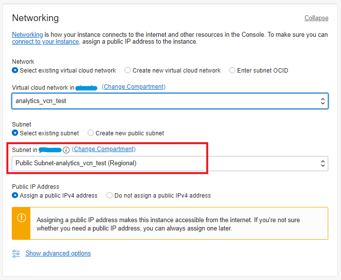


### **Task 2.4:** 
- Scroll down and MAKE SURE TO DOWNLOAD the proposed private key. 
You will use it to connect to the compute instance later on.
Once done, click _**Create**_


### **Task 2.5:** 
- Once the compute instance will be up and running, you will see the square icon on the left turning green. However, you can proceed to the next Task until the provisioning is done.
  
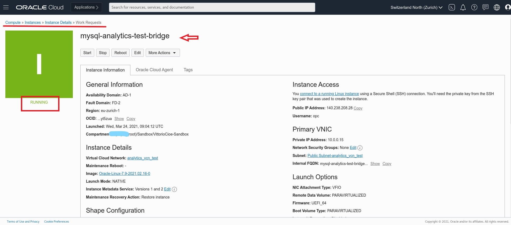


## **Task 3:** Connect to the bastion host, install MySQL Shell and download the workshop dataset

### **Task 3.1:**
- In order to connect to the bastion host, we will use the cloud shell, a small linux terminal embedded in the OCI interface.
To access cloud shell, click on the shell icon next to the name of the OCI region, on the top right corner of the page.


### **Task 3.2:**
- Once the cloud shell is opened, you will see the command line:
  
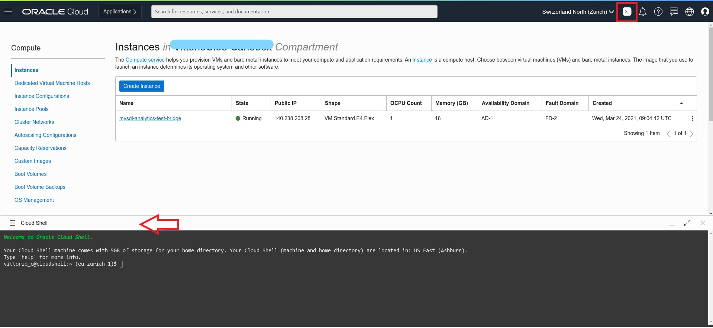

- We suggest to increase the font size:
  


- On the top left corner of the cloud shell there are Minimize, Maximize and Close buttons. If you Maximize the cloud shell it will take the size of the entire page. Remember to Restore the size or Minimize prior of changing page in the OCI interface.


### **Task 3.3:**
- Drag and drop the previously saved private key into the cloud shell. You can get the file name with the command _**ll**_.
  


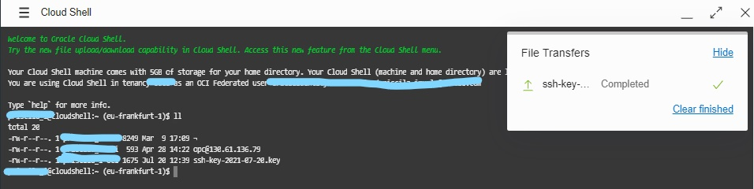


### **Task 3.4:**

- Copy the _**Public IP Address**_ of the compute instance you have just created.


- In order to establish an ssh connection with the bastion host using the Public IP, execute the following commands:
```
chmod 600 <private-key-file-name>.key
ssh -i <private-key-file-name>.key opc@<compute_instance_public_ip>
```


If prompted to accept the finger print, type _**yes**_ and hit enter, then you will get a Warning.

_**Warning: Permanently added '130.******' (ECDSA) to the list of known hosts.**_

Now that you have connected to the instance you can proceed to the next Task.

### **Task 3.5:**
- From the established ssh connection, install MySQL Shell and MySQL client executing the following commands and the expected outputput should be as following:
  
```
wget https://dev.mysql.com/get/mysql80-community-release-el7-3.noarch.rpm
```

```
sudo yum localinstall mysql80-community-release-el7-3.noarch.rpm
```


_**when prompted a warning about the public key type "y"**_

```
sudo yum install mysql-shell  
```


_**when prompted a warning about the public key type "y"**_

```
sudo yum install mysql-community-client
```


_**when prompted a warning about the public key type "y"**_


### **Task 3.6:**
- Launch MySQL Shell executing the following command:
```
mysqlsh
```
When you see the MySQL Shell colorful prompt, exit with the following command:
```
\q
```


### **Task 3.7:**
- Download and unzip the workshop material using the following commands:
```
cd /home/opc
```

```
wget https://objectstorage.eu-frankfurt-1.oraclecloud.com/p/Ufty1RlzG7jobFAsNTsyaEgDVBgSLfiPGcxLscTxVOUxDN8MX6Jswj85_Iw7_bS2/n/odca/b/workshops-livelabs-do-not-delete/o/heatwave_workshop.zip
```


```
unzip heatwave_workshop.zip
```


After it is done extracting the files you can move to the next Task and test it.

### **Task 3.8:**
- Verify the extracted material executing _**ll**_ command.
Among the output, you should see the following file names:

_**tpch_dump**_

_**tpch_offload.sql**_

_**tpch_queries_mysql.sql**_

_**tpch_queries_rapid.sql**_


## **Task 4:** Create an Oracle Analytics Cloud instance

We will create an Oracle Analytics Cloud instance at this stage of the workshop, since it may takes sometime to be provisioned, so it can be ready to use later in this workshop.

### **Task 4.1:**

Click on the menu icon on the left. Verify that you are signed in as a **Single Sign On** (Federated user) user by selecting the **Profile** icon in the top right hand side of your screen. If your username is shown as:

    oracleidentitycloudservice/<your username>

Then you are **connected** as a **Single Sign On** user.


If your username is shown as:

    <your username>

Then you are **signed in** as an **Oracle Cloud Infrastructure** user.

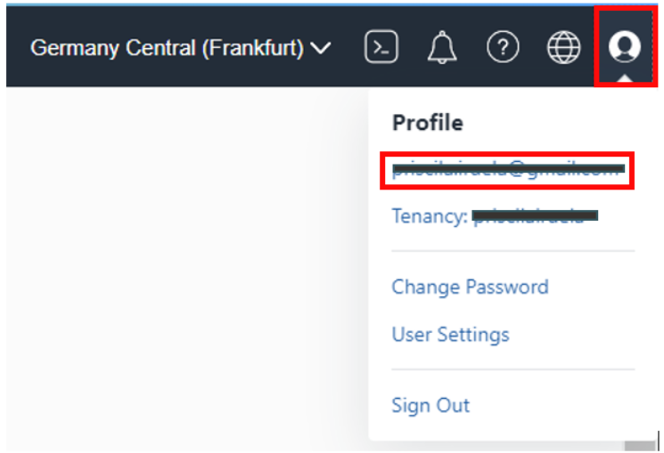

If your user does not contain the identity provider (**oracleidentitycloudprovider**), please logout and select to authenticate using **Single Sign On**.


To be capable of using **Oracle Analytics Cloud** we need to be Sign-On as a **Single Sign-On** (SSO) user.

For more information about federated users, see **[User Provisioning for Federated Users.](https://docs.oracle.com/en-us/iaas/Content/Identity/Tasks/usingscim.htm)**

Now going back to main page click the _**hamburger menu**_ in the upper left corner and click on _**Analytics & AI -> Analytics Cloud**_.


- Name: OACDemo
- OCPU: 2
- License Type: License Included
  
### **Task 4.2:**
Click _**Create instance**_ and in the new window, fill out the fields as shown in the image below. Make sure to select 2 OCPUs, the Enterprise version and the _**License Included**_ button. Finally click _**Create**_ to start the provisioning of the instance.
_**Note:**_ It takes about _**15-20 minutes**_ to create the OAC instance so go get a coffee in the meantime!


### **Task 4.3:**
When the status of the instance changes to _Active_, click on the button _**Configure Private Access Channel**_ under the Private Access Channel section to create a private access to the MySQL Database Service Instance.

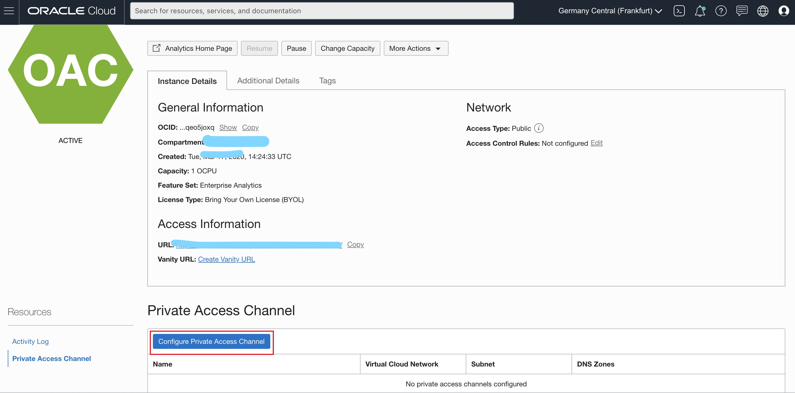

### **Task 4.4:**
In the next window you first need to choose a name for the channel:PrivateChannel. Then, fill in the VCN name with the same one where you provisioned the MySQL Database Service and the HeatWave cluster, analytics_vcn_test. Make sure you select the correct subnet! (In lab 1 you had the option to select Private Subnet or Public Subnet) make sure you select the correct one, Private Subnet-analytics_vcn_test, otherwise you won't be able to connect!
Check _**Virtual Cloud Network's domain name as DNS zone**_, and remove the additional _**DNS Zone**_, using the X icon on the right side of the DNS Zone section, and finally click _**Configure**_.  

_**Note:**_ It will take up to _**50 minutes**_ to create the private channel so go get a nice cup of tea to kill the time! 

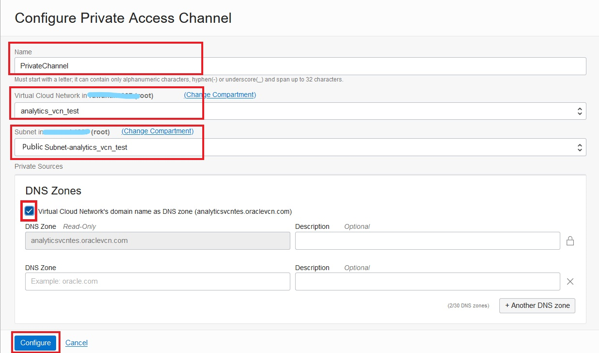


In this Lab we created the VCN and added the additional Ingress rules to the Security list, and created a compute instance that serves as a bastion host and launched the cloud shell to import the private keys to connect to the compute instance, we also installed MySQL Shell and MySQL client, and downloaded the dataset that will be used later on for benchmark analysis.
Finally, we created an Oracle Analytics Cloud instance which we will eventually use later in this workshop.

Now you can proceed to the next lab!

 **[Home](../intro.md)** | **[Go to Lab 2 >>](/dbmds/dbmds.md)**

 ## Acknowledgements
- **Author** - Rawan Aboukoura - Technology Product Strategy Manager, Vittorio Cioe - MySQL Solution Engineer
- **Contributors** - Priscila Iruela - Technology Product Strategy Director 
- **Last Updated By/Date** -
