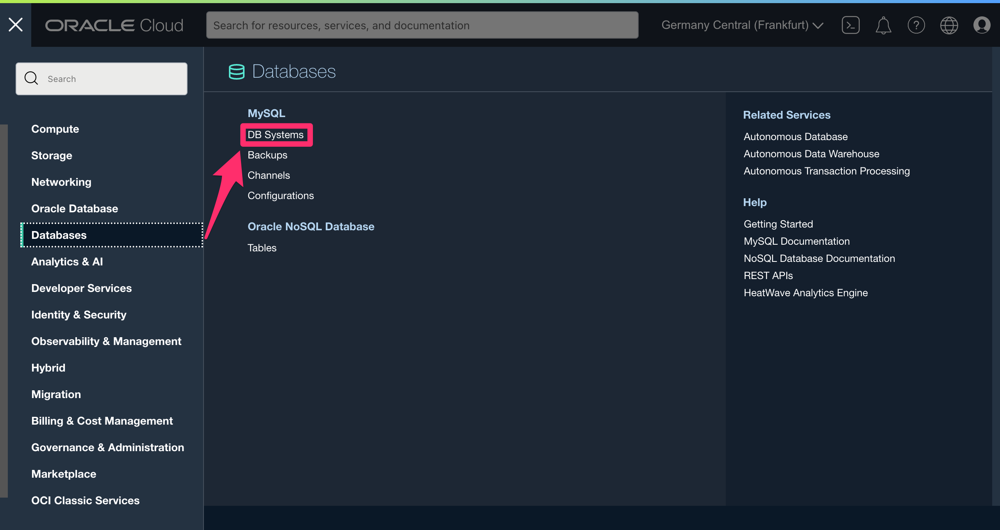
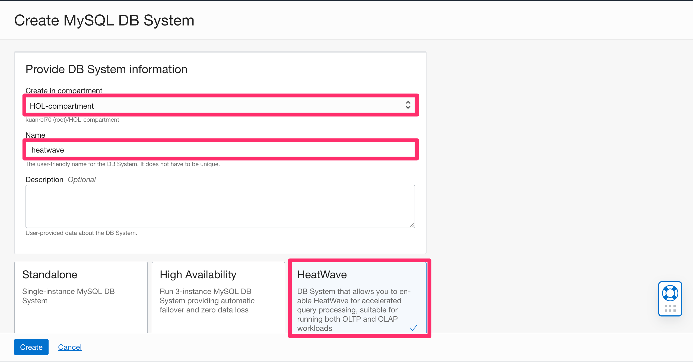
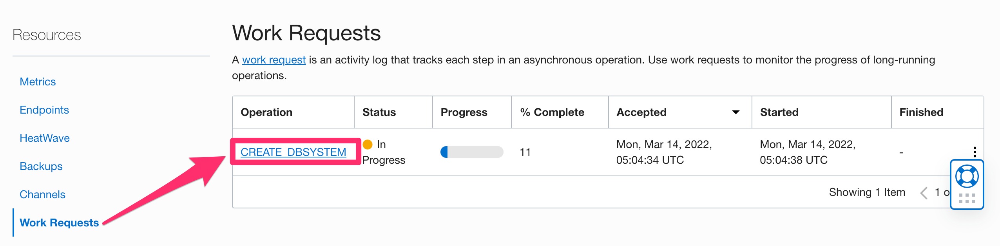

# Create MySQL HeatWave

## Introduction

**Oracle MySQL Database Service** is a fully managed database service that lets developers quickly develop and deploy secure, cloud native applications using the world’s most popular open source database. MySQL Database Service is the only MySQL cloud service with an integrated, high performance, in-memory query accelerator—
**HeatWave**. It enables customers to run sophisticated analytics directly against their operational MySQL databases—eliminating the need for complex, time-consuming, and expensive data movement and integration with a separate analytics database. **HeatWave** accelerates MySQL performance by orders of magnitude for analytics and mixed workloads. Optimized for Oracle Cloud Infrastructure (OCI), MySQL Database Service is 100% built, managed, and supported by the OCI and MySQL engineering teams.

### About HeatWave

HeatWave is a distributed, scalable, shared-nothing, in-memory, hybrid columnar, query processing engine designed for extreme performance. It is enabled when you add a HeatWave cluster to a MySQL DB System. To know more about HeatWave Cluster <a href="https://dev.mysql.com/doc/heatwave/en/heatwave-introduction.html" target="\_blank">**Click Here**</a>

In this lab, we will provision MySQL HeatWave instance in the private subnet of the OKE cluster we created earlier.

Estimated Time: 30 minutes

### About Oracle MySQL Database Service

### Objectives

In this lab, you will provision the following resources:

* MySQL HeatWave instance

### Prerequisites (Optional)

* You have an Oracle account
* You have enough privileges to use OCI

## Task 1: Create MySQL HeatWave instance

1. Log in to OCI Console, clicking on the <a href="#menu">&#9776; hamburger menu</a>, select **Databases**, and click on **DB System**

2. Specify the name of the MySQL instance, for example, **heatwave**

3. Specify the name of the administrator, for example, **admin** and the password satisfying the password requirements

4. Select the private subnet of the VCN created as part of the OKE provisioning. By default, MySQL HeatWave will be created in the private subnet. You can double-check the private subnet is selected.

5. Review the MySQL HeatWave shape

6. You are now ready to provision the HeatWave instance by clicking on **Create**

7. You can monitor the progress of the creation by scrolling down to the bottom of the MySQl page, and click on **Work Request**

8. It will take about 10 minutes to provision MySQL instance

* **Author**

  * Ivan Ma, MySQL Solution Engineer, MySQL APAC
  * Ryan Kuan, MySQL Cloud Engineer, MySQL APAC

* **Contributors**

  * Perside Foster, MySQL Solution Engineering
  * Rayes Huang, OCI Solution Specialist, OCI APAC

* **Last Updated By/Date** - Ryan Kuan, March 2022