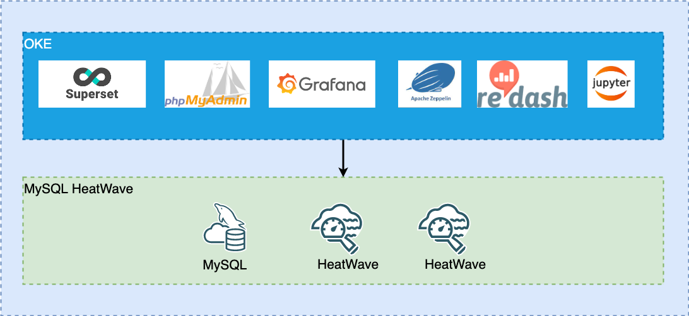

# Introduction

## About this Workshop

This workshop will cover the flexibility of using popular open-source tools such as Superset, Grafana and Zepplin with MySQL HeatWave to leverage the cloud-scale capabilities of Oracle Cloud Infrastructure to implement cloud-native analytics. We will walk you through the process of

* Creating Oracle Kubernetes Engine and MySQL HeatWave
* Loading data into MySQL HeatWave using mysqlsh and auto-pilot utility
* Deploying open-source analytics tools (Superset, Grafana, Zeppelin) to analyze data in MySQL HeatWave

Estimated Time: 90 minutes

### About Oracle MySQL Database Service

**Oracle MySQL Database Service** is a fully managed database service that lets developers quickly develop and deploy secure, cloud native applications using the world’s most popular open source database. MySQL Database Service is the only MySQL cloud service with an integrated, high performance, in-memory query accelerator—
**HeatWave**. It enables customers to run sophisticated analytics directly against their operational MySQL databases—eliminating the need for complex, time-consuming, and expensive data movement and integration with a separate analytics database. **HeatWave** accelerates MySQL performance by orders of magnitude for analytics and mixed workloads. Optimized for Oracle Cloud Infrastructure (OCI), MySQL Database Service is 100% built, managed, and supported by the OCI and MySQL engineering teams.

### About HeatWave

HeatWave is a distributed, scalable, shared-nothing, in-memory, hybrid columnar, query processing engine designed for extreme performance. It is enabled when you add a HeatWave cluster to a MySQL DB System. To know more about HeatWave Cluster <a href="https://dev.mysql.com/doc/heatwave/en/heatwave-introduction.html" target="\_blank">**Click Here**</a>

### Objectives

In this workshop, you will learn how to:

* Creating Oracle Kubernetes Engine and MySQL HeatWave
* Loading data into MySQL HeatWave using mysqlsh and auto-pilot utility
* Deploying open-source analytics tools (Superset, Grafana and Zeppelin) to analyze data in MySQL HeatWave

The following is the OCI architecture with all the components deployed

### Prerequisites (Optional)

* You have an Oracle account
* You have enough privileges to use OCI

## Acknowledgements

* **Author**
	* Ivan Ma, MySQL Solution Engineer, MySQL APAC
	* Ryan Kuan, MySQL Cloud Engineer, MySQL APAC
* **Contributors**
	* Perside Foster, MySQL Solution Engineering
	* Rayes Huang, OCI Solution Specialist, OCI APAC

* **Last Updated By/Date** - Ryan Kuan, March 2022
