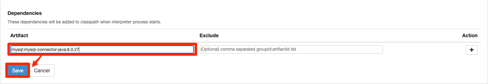

# Deploy Zeppelin notebook

## Introduction

In this lab, we will deploy the popular <a href="https://zeppelin.apache.org/" target="\_blank">**Apache Zeppelin**</a> notebook to OKE and to create a simple notebook to MySQL HeatWave

Estimated Time: 2 minutes

### Objectives

In this lab, you will:

* Create a kubernetes namespace for Zeppelin
* Deploy Zeppelin to OKE
* Run interactive analytics using PhpMyAdmin on MySQL HeatWave

### Prerequisites (Optional)

* You have an Oracle account
* You have enough privileges to use OCI
* OCI Resources required: HOL-compartment, OKE cluster, MySQL HeatWave

## Task 1: Access OKE cluster

1. Click the **Hamburger Menu**  in the upper left, navigate to **Developer Services** and select **Kubernetes Cluster (OKE)**

    

2. Select the Compartment (e.g. HOL-Compartment) that you provisioned the OKE cluster, and verify the status of **oke_cluster** is **Active**

    

## Task 2: Deploy Zeppelin to OKE

1. Connect to **oke-operator** using OCI Cloud Shell

    

2. Download the [Zeppelin-Server](files/zeppelin-server.yml?download=1)

    ```
    <copy>
    wget https://raw.githubusercontent.com/kuanrcl/learning-library/master/data-management-library/mysql/heatwave-cloud-analytics/zeppelin/files/zeppelin-server.yml
    </copy>
    ```

3. Download the [Zeppelin ingress](files/zeppelin-ing.yml)
    ```
    <copy>
    wget https://raw.githubusercontent.com/kuanrcl/learning-library/master/data-management-library/mysql/heatwave-cloud-analytics/zeppelin/files/zeppelin-ing.yml
    </copy>
    ```

4. Execute the kubectl commands to create a namespace

	```
    <copy>
    kubectl create namespace zeppelin
    </copy>
    ```

4. Deploy Zeppelin

    ```
    <copy>
    kubectl apply -f zeppelin-server.yaml -n zeppelin
    </copy>
    ```
    ```
    <copy>
    kubectl apply -f zeppelin-ing.yaml -n zeppelin
    </copy>
    ```

5. Find out the public IP of OKE Ingress Controller

    ```
    <copy>
    kubectl get all -n ingress-nginx
    </copy>
    ```
	

6. Access the deployed Zeppelin application. Point your browser to **http://&lt;INGRESS&#95;PUBLIC&#95;IP&#95;ADDRESS&gt;/zeppelin**

	

Task 3: Connect to MySQL HeatWave

1. Create a JDBC interpreter for MySQL HeatWave in Zeppelin.

	

2. Click on **Create** to create a new JDBC driver for MySQL HeatWave. Fill up the details as indicated in the diagram
  Replace the private ip address of your MySQL instance in the **JDBC URL**

   

3. Scroll to the bottom of the page and specify the MySQL JDBC driver, **mysql:mysql-connector-java:8.0.28**

	

4. Create a new notebook to start connecting to MySQL HeatWave. Specify the name of the notebook, for example, **airportdb**, and select **mysql** as the JDBC interpreter, click on **Create**

	

5. You can now start working with MySQL HeatWave!

	

  Congratulations! You have completed all the labs

## Acknowledgements

* **Author**
	* Ivan Ma, MySQL Solution Engineer, MySQL APAC
	* Ryan Kuan, MySQL Cloud Engineer, MySQL APAC
* **Contributors**
	* Perside Foster, MySQL Solution Engineering
	* Rayes Huang, OCI Solution Specialist, OCI APAC

* **Last Updated By/Date** - Ryan Kuan, March 2022