# Launch Your First MySQL Database Service With HeatWave System

## Introduction

In this Lab, you will learn how to launch a MySQL Database Service System With HeatWave on Oracle Cloud Infrastructure and connect to it using the Console.

Estimated Lab Time: 4 Hours

### About MySQL Database Service With HeatWave

MySQL Database Service is a fully-managed Oracle Cloud Infrastructure service, developed, managed, and supported by the MySQL team in Oracle.Oracle MySQL Database Service, with HeatWave, is the only service that enables database admins and app developers to run OLTP and OLAP workloads directly from their MySQL database, eliminating the need for complex, time-consuming, and expensive data movement and integration with a separate analytics database.

### Objectives

In this lab, you will be guided through the following steps:

- Create Compartment
- Create Policy
- Create Virtual Cloud Network
- Create a MySQL DB System for HeatWave.
- Create Client Virtual Machine
- Connect to MySQL Database
- Create tpch Database and Import Data
- Add a HeatWave Cluster to MDS
- Loading TPCH Data into HeatWave
- Runn Queries in HeatWave
- Connect to HeatWave using Workbench
- Delete MySQL DB With HeatWave System

### Prerequisites

- An Oracle Free Tier, or Paid Cloud Account
- Some Experience with MySQL Shell
- Complete Lab 1: Create Local SSH Key

## **STEP 1**: Create Compartment

You must have an OCI tenancy subscribed to your home region and enough limits configured for your tenancy to create a MySQL DB System. Make sure to log-in to the Console as an Administrator.

1. On the Navigation Menu, under Governance and Administration, select Identity & Security -> Compartments.

    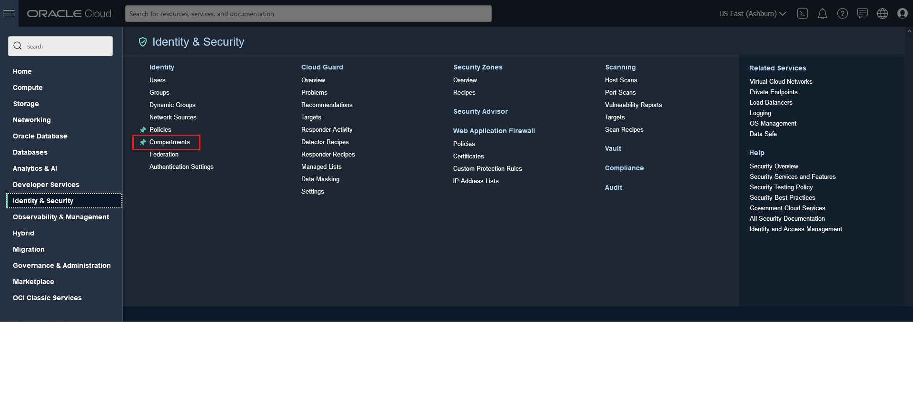

2. On Compartments Page, click on Create Compartment. 

    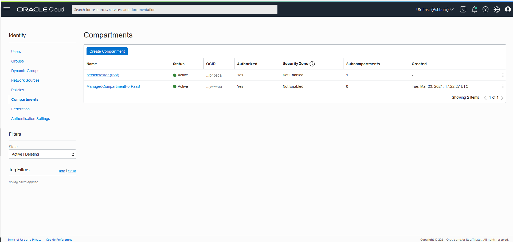

   **Note**:  Two Compartments, named Oracle Account Name (root) and a compartment for PaaS, were automatically created by the Oracle Cloud. 

3. On Create Compartment 
 
 Enter Name
    ````
    <copy>MDS-Sandbox</copy>
    ````
 Enter Description
    ````
    <copy>Compartment for MDS HeatWave Resources</copy>
    ````
 
 Select Parent Compartment (Root)
 
 Click on the Create Compartment button.

    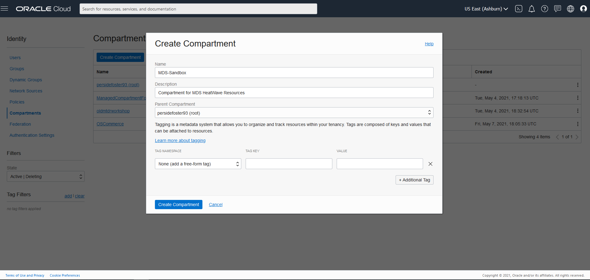
    
    
    
    **Completed Compartment** 
    

## **STEP 2**: Create Policy
1.	On the Navigation Menu, under Governance and Administration, select Identity & Security -> Policies. 
    

2.	On Policies Page, under List Scope, select the Compartment(root) and click on the Create Policy button.
    

3.	On Create Policy

 Enter Name
    ````
    <copy>MDS-Policy</copy>
    ````
 Enter Description
    ````
    <copy>Policy Details for MySQL Database Service</copy>
    ````
 
 Select Root comaprtment.

 On Policy Builder turn on the “Show manual editor”  switch. 
    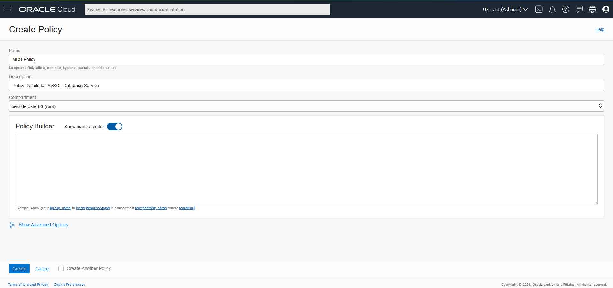

4. Enter the following required MySQL Database Service policies

 Policy statement 1:
    ````
    <copy>Allow group Administrators to {COMPARTMENT_INSPECT} in tenancy</copy>
    ````
 Policy statement 2:
    ````
    <copy>Allow group Administrators to {VCN_READ, SUBNET_READ, SUBNET_ATTACH, SUBNET_DETACH} in tenancy</copy>
    ````
 Policy statement 3:
    ````
    <copy>Allow group Administrators to manage mysql-family in tenancy</copy>
    ````

 Click the Create button

     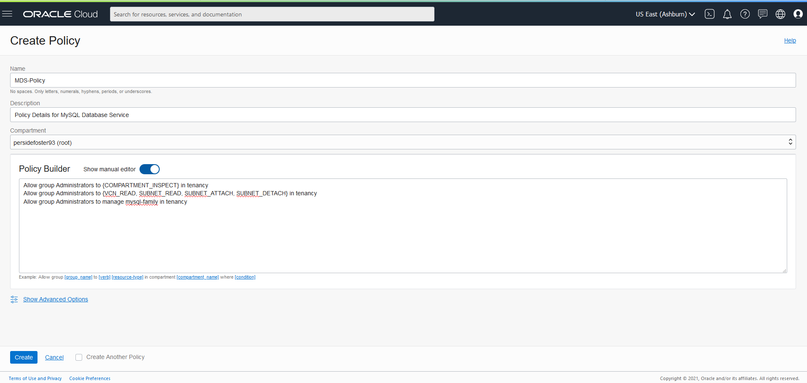

    
    **Completed Policy Creation**
    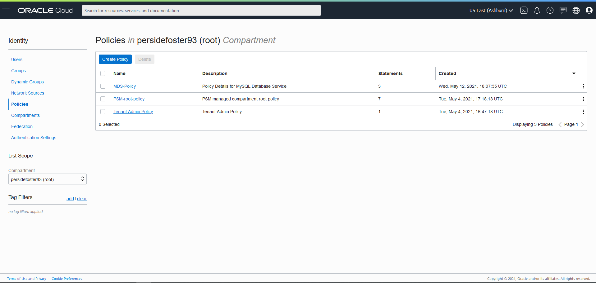

## **STEP 3:** Create Virtual Cloud Network

1. On the Navigation Menu, under Core Infrastructure, select Networking -> Virtual Cloud Networks.
    

2. Click on Start VCN Wizard.
    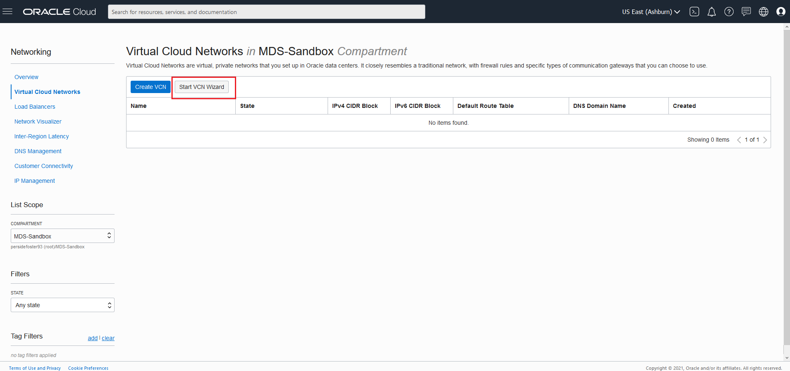

3. Select VCN with Internet Connectivity 

    click on Button Start VCN Wizard 
    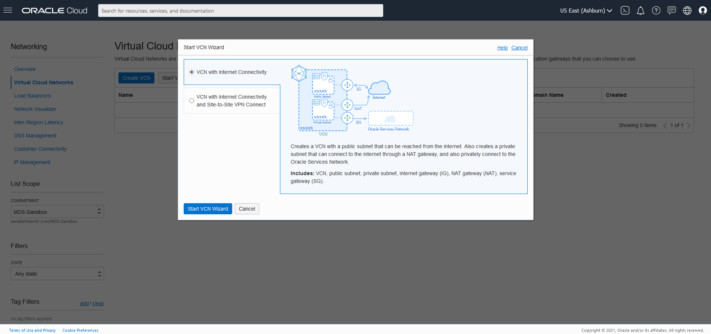

4. Create a VCN with Internet Connectivity 

    On Basic Information  Complete the following fields 
 
 VCN Name
    ````
    <copy>MDS-VCN</copy>
    ````
 Compartment 
   
 Select  **MDS-Sandbox**

 Your screen should look similar to the following
    
  
5. Click the Next button at the bottom of the screen 

6. Review Oracle Virtual Cloud Network (VCN), Subnets, and Gateways
         
    Click Create button to create the VCN
    

7. The Virtual Cloud Network creation is completing 
    
    
8. Click on "View Virtual Cloud Network" button to display the  created VCN
    

9. On the MDS-VCN page Under Subnets in MDS-Sandbox Compartment Click on the  **Private Subnet-MDS-VCN** link. 
            

10.	On the Private Subnet-MDS-VCN page under Security Lists  click on the **Security List for Private Subnet-MDS-VCN** link.
        

11.	On the Security List for Private Subnet-MDS-VCN page click on the **Add Ingress Rules** button

    

12.	On the Add Ingress Rules page under Ingress Rule 1, 
 add an Ingress Rule with Source CIDR 
    ````
    <copy>0.0.0.0/0</copy>
    ````
 Destination Port Name 
     ````
    <copy>3306,33060</copy>
    ```` 
  Description 
     ````
    <copy>MySQL Port Access</copy>
    ````   
 Click on Add Ingress Rule.
    

14.	On Security List for Private Subnet-MDS_VCN page
    
     New Ingress Rules will be shown under the Ingress Rules List
    

## **STEP 4:** Create a MySQL DB System.

1. Open the navigation menu. Under Databases ->MySQL, click DB Systems
    

2. Click on Create MySQL DB System
    

3. On Create MySQL DB System dialog complete the fields in each section

    - Provide basic information for the DB System
    - Setup your required DB System
    - Create Administrator credentials
    - Configure Networking
    - Configure placement
    - Configure hardware
    - Configure Backups
    - Show Advanced Options

4. On Provide basic information for the DB System:
      
 Select Compartment **MDS-Sandbox**
 
 Enter Name
     ````
    <copy>MDS-DB</copy>
    ````
 Enter Description 
    ````
    <copy>Standalone Database System ready for HeatWave Cluster attachment</copy>
    ````
    
    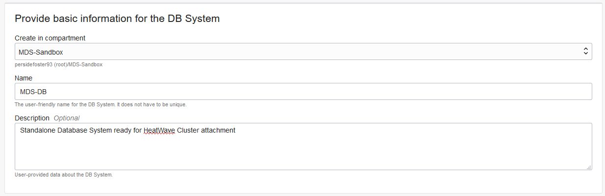

5. On Setup your required DB System 
    
    System Select **HeatWave** to specify a HeatWave DB System
    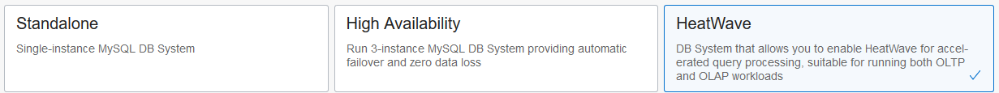

6. On Create Administrator credentials

 Enter Username
    ````
    <copy>admin</copy>
    ````
 Enter Password
    ````
    <copy>Welcome#12345</copy>
    ````   
 Confirm Password
    ````
    <copy>Welcome#12345</copy>
    ````
    

7. On Configure networking Keep default values

    Virtual Cloud Network: **MDS-VCN**
    
    Subnet: **Private Subnet-MDS-VCN (Regional)**

    

8. On Configure placement  keep checked  "Availability Domain"
    
    Do not check "Choose a Fault Domain" for this DB System. Oracle will chooses the best placement for you.
    

9. On Configure hardware keep default shape  **MySQL.HeatWave.VM.Standard.E3**

    Data Storage Size (GB) keep default value **1024**
    

19. On Configure Backups, keep  "Enable Automatic Backups" checked
    
    set Retention period to **7**
    
    select "Default Backup Window"
    
    
    
20. Click on the **Hide Advanced Options** link 

 Select the **Networking** tab

  Enter Hostname
    ````
    <copy>mdsdb</copy>
    ````   
 
  Click the **Create button** 
    

11. The New MySQL DB System will be ready to use after a few minutes. 

    The state will be shown as Creating during the creation
    

12. The state Active indicates that the DB System is ready to use. 

    Check the MySQL endpoint (Address) under Instances in the MySQL DB System Details page. 

    

## **STEP 5:** Create Client Virtual Machine

**Important:** If you have not already completed "Lab 1: Create Local SSH Key", please do so now. 

When you are finished, return to this step.

1. You will need a client machine to connect to your brand new MySQL database. To launch a Linux Compute instance, go to the Console, menu Compute, Instances
    

2. On Instances in **MDS-Sandbox** Compartment, click on Create Instance.
    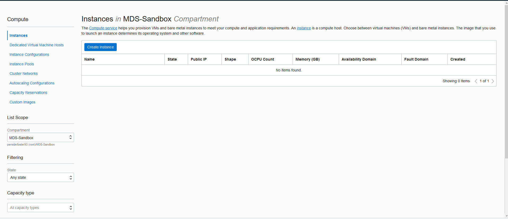

3. On Create Compute Instance 
 
 Enter Name
    ````
    <copy>MDS-Client</copy>
    ````   
4. Make sure **MDS-Sandbox** compartment is selected. 
 
5. Choose an operating system or image source (for this lab , select Oracle Linux), 
 
6. Edit Configure placement and hardware
   
   Select the Availability Domain, Instance Shape (select VM.Standard.E2.1.Micro).

    

   For VCN make sure **MDS-VCN** is selected, "Assign a public IP address" should be set to Yes.  
    

7. If you have not already created your SSH key, perform "Lab 1: Create Local SSH Key".  When you are done return to the next line (STEP 5: #8) .
8. In the Add SSH keys section upload your own public key. 
  
    

9. Hit the **Create** button to finish creating your Compute Instance. 

    

10. The New Virtual Machine will be ready to use after a few minutes. The state will be shown as Provisioning during the creation
    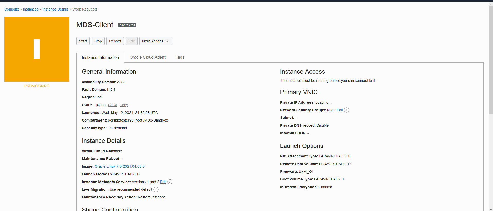

11.	The state Running indicates that the Virtual Machine is ready to use. 

    **Save the Public IP Address** under "Instance Access"  on the **MDS_Client** Instance page. 
    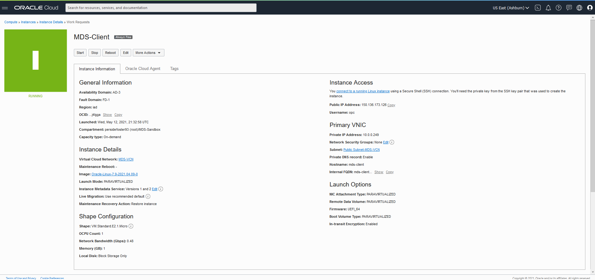

## **STEP 6:** Connect to MySQL Database

1. If you are a Linux, Mac, or  Windows 10 Powershell user go to STEP 6: #2

   If you are a Windows user click Start menu from your windows machine for Git which should include the Git Bash command.

    Click on the Git Bash command. This will take you to the Git Bash terminal as shown below 
    
    and continue to  STEP 6: #2. 
    

2.  From a terminal window on your local system. Connect to the Compute Instance with the SSH command. 

    Indicate the location of the private key you created earlier with **MDS-Client**. 
    
    Enter the username **opc** and the Public **IP Address**.

    Note: The **MDS-Client**  shows the  Public IP Address as mentioned on Step 5: #10
    
    (Example: **ssh -i ~/.ssh/id_rsa opc@132.145.170.990**)

    `$ ssh -i ~/.ssh/id_rsa opc@<your_compute_instance_ip>;`

    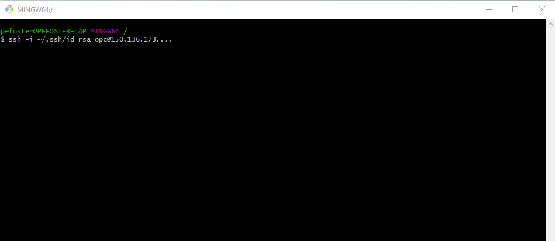

    **Install MySQL Shell on the Compute Instance**

3. You will need a MySQL client tool to connect to your new MySQL DB System from your client machine. 

 Install MySQL release package  with the following command:
 
 **[opc@...]$**
    ````
    <copy>sudo yum -y install https://dev.mysql.com/get/mysql80-community-release-el7-3.noarch.rpm</copy>
    ````

    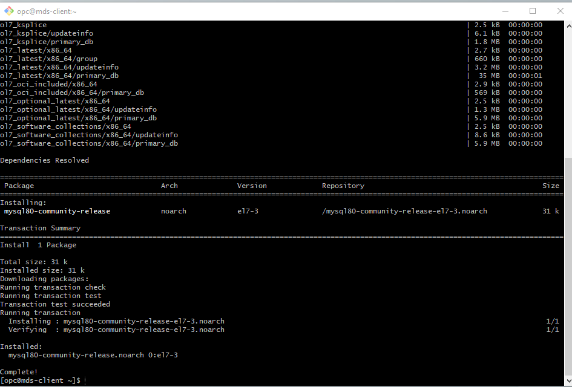

 Install MySQL Shell with the following command 

 **[opc@...]$**
     ````
    <copy>sudo yum install –y mysql-shell</copy>
    ````

    

   **Connect to MySQL Database Service**

4. From your Compute instance, connect to MySQL using the MySQL Shell client tool. 
    
   The endpoint (IP Address) can be found in the MySQL DB System Details page, under the "Endpoints" resource. 

    

5.  Use the following command to connect to MySQL using the MySQL Shell client tool. Be sure to add the MDS-DB private IP address at the end of the cammand. Also enter the admin user password

    (Example  **mysqlsh -uadmin -p -h10.0.1..**)

 **[opc@...]$**
    ````
    <copy>mysqlsh -uadmin -p -h 10.0.1....</copy>
    ````
    

6. On MySQL Shell, switch to SQL mode  to try out some SQL commands 

 Enter the following command at the prompt:
     ````
    <copy>\SQL</copy>
    ````
    

 To display a list of databases, Enter the following command at the prompt:
      ````
    <copy>SHOW DATABASES;</copy>
    ````  
     
 To display the database version, current_date, and user enter the following command at the prompt:
      ````
    <copy>SELECT VERSION(), CURRENT_DATE, USER();</copy>
    ````  
 To display MysQL user and host from user table enter the following command at the prompt:
       ````
    <copy>SELECT USER, HOST FROM mysql.user;</copy>
      ````
 Type the following command to exit MySQL:
      ````
    <copy>\q</copy>
    ````   
  
  **Final Sceen Shot**
    

## **STEP 7:**  Import the TPCH schema and data using MySQL Shell

1.	Create the schema tpch and tables
 
 Create tpch database 
    ````
    <copy>CREATE DATABASE tpch character set utf8mb4;</copy>
    ````  
 Use tpch database 
    ````
    <copy>USE tpch;</copy>
    ````  
 Create table nation 
    ````
    <copy>
    CREATE TABLE nation  
    ( N_NATIONKEY INTEGER primary key,
    N_NAME       CHAR(25) NOT NULL,
    N_REGIONKEY  INTEGER NOT NULL,
    N_COMMENT    VARCHAR(152));
    </copy>
    ````  
 Create table region  
    ````
    <copy>CREATE TABLE region  ( 
    R_REGIONKEY INTEGER primary key,
    R_NAME       CHAR(25) NOT NULL,
    R_COMMENT    VARCHAR(152));
    </copy>
    ````  
 Create table part
    ````
    <copy>CREATE TABLE part  ( 
        P_PARTKEY INTEGER primary key,
    P_NAME        VARCHAR(55) NOT NULL,
    P_MFGR        CHAR(25) NOT NULL,
    P_BRAND       CHAR(10) NOT NULL,
    P_TYPE        VARCHAR(25) NOT NULL,
    P_SIZE        INTEGER NOT NULL,
    P_CONTAINER   CHAR(10) NOT NULL,
    P_RETAILPRICE DECIMAL(15,2) NOT NULL,
    P_COMMENT     VARCHAR(23) NOT NULL );
    </copy>
    ````  
 
 Create table  supplier
    ````
    <copy>CREATE TABLE supplier  ( 
        S_SUPPKEY INTEGER primary key,
    S_NAME        CHAR(25) NOT NULL,
    S_ADDRESS     VARCHAR(40) NOT NULL,
    S_NATIONKEY   INTEGER NOT NULL,
    S_PHONE       CHAR(15) NOT NULL,
    S_ACCTBAL     DECIMAL(15,2) NOT NULL,
    S_COMMENT     VARCHAR(101) NOT NULL);
    </copy>
    ````  
 Create table partsupp
    ````
    <copy>CREATE TABLE partsupp  ( 
        PS_PARTKEY INTEGER NOT NULL,
    PS_SUPPKEY     INTEGER NOT NULL,
    PS_AVAILQTY    INTEGER NOT NULL,
    PS_SUPPLYCOST  DECIMAL(15,2)  NOT NULL,
    PS_COMMENT     VARCHAR(199) NOT NULL, primary key (ps_partkey, ps_suppkey) );
    </copy>
    ````  
 Create table customer 
    ````
    <copy>CREATE TABLE customer  ( 
        C_CUSTKEY INTEGER primary key,
    C_NAME        VARCHAR(25) NOT NULL,
    C_ADDRESS     VARCHAR(40) NOT NULL,
    C_NATIONKEY   INTEGER NOT NULL,
    C_PHONE       CHAR(15) NOT NULL,
    C_ACCTBAL     DECIMAL(15,2)   NOT NULL,
    C_MKTSEGMENT  CHAR(10) NOT NULL,
    C_COMMENT     VARCHAR(117) NOT NULL);
    </copy>
    ````  
 Create table orders 
    ````
    <copy>CREATE TABLE orders  ( 
        O_ORDERKEY INTEGER primary key,
    O_CUSTKEY        INTEGER NOT NULL,
    O_ORDERSTATUS    CHAR(1) NOT NULL,
    O_TOTALPRICE     DECIMAL(15,2) NOT NULL,
    O_ORDERDATE      DATE NOT NULL,
    O_ORDERPRIORITY  CHAR(15) NOT NULL,
    O_CLERK          CHAR(15) NOT NULL,
    O_SHIPPRIORITY   INTEGER NOT NULL,
    O_COMMENT        VARCHAR(79) NOT NULL);
    </copy>
    ````  
 Create table lineitem  
    ````
    <copy>CREATE TABLE lineitem ( 
        L_ORDERKEY INTEGER NOT NULL,
    L_PARTKEY     INTEGER NOT NULL,
    L_SUPPKEY     INTEGER NOT NULL,
    L_LINENUMBER  INTEGER NOT NULL,
    L_QUANTITY    DECIMAL(15,2) NOT NULL,
    L_EXTENDEDPRICE  DECIMAL(15,2) NOT NULL,
    L_DISCOUNT    DECIMAL(15,2) NOT NULL,
    L_TAX         DECIMAL(15,2) NOT NULL,
    L_RETURNFLAG  CHAR(1) NOT NULL,
    L_LINESTATUS  CHAR(1) NOT NULL,
    L_SHIPDATE    DATE NOT NULL,
    L_COMMITDATE  DATE NOT NULL,
    L_RECEIPTDATE DATE NOT NULL,
    L_SHIPINSTRUCT CHAR(25) NOT NULL,
    L_SHIPMODE     CHAR(10) NOT NULL,
    L_COMMENT      VARCHAR(44) NOT NULL,
    primary key(L_ORDERKEY,L_LINENUMBER));
    </copy>
    ````  

   Display list of created tables 
    ````
    <copy>show tables;</copy>
    ```` 
    

2. On MySQL Shell, switch to JavaScript mode 
 
 Create table  
    ````
    <copy>\js</copy>
    ````  
    
  
3.	Import the table data into MySQL Database Service from an external OCI Object Storage 

    
 Laod nation table  
    ````
    <copy>util.importTable("https://objectstorage.us-ashburn-1.oraclecloud.com/n/idazzjlcjqzj/b/bucket-20201125-1020/o/tpch%2Fnation.tbl", { schema:"tpch", table:"nation", fieldsTerminatedBy:"|", bytesPerChunk:"100M", threads:16, skipRows:1})</copy>
    ````  

 Laod customer table  
    ````
    <copy>util.importTable("https://objectstorage.us-ashburn-1.oraclecloud.com/n/idazzjlcjqzj/b/bucket-20201125-1020/o/tpch%2Fcustomer.tbl", { schema:"tpch", table:"customer", fieldsTerminatedBy:"|", bytesPerChunk:"100M", threads:16, skipRows:1})</copy>
    ```` 

 Laod lineitem table  
    ````
    <copy>util.importTable("https://objectstorage.us-ashburn-1.oraclecloud.com/n/idazzjlcjqzj/b/bucket-20201125-1020/o/tpch%2Flineitem.tbl", { schema:"tpch", table:"lineitem", fieldsTerminatedBy:"|", bytesPerChunk:"100M", threads:16, skipRows:1})</copy>
    ```` 

 Laod orders table  
    ````
    <copy>util.importTable("https://objectstorage.us-ashburn-1.oraclecloud.com/n/idazzjlcjqzj/b/bucket-20201125-1020/o/tpch%2Forders.tbl", { schema:"tpch", table:"orders", fieldsTerminatedBy:"|", bytesPerChunk:"100M", threads:16, skipRows:1})</copy>
    ```` 

 Laod part table  
    ````
    <copy>util.importTable("https://objectstorage.us-ashburn-1.oraclecloud.com/n/idazzjlcjqzj/b/bucket-20201125-1020/o/tpch%2Fpart.tbl", { schema:"tpch", table:"part", fieldsTerminatedBy:"|", bytesPerChunk:"100M", threads:16, skipRows:1})</copy>
    ```` 
 Laod partsup table  
    ````
    <copy>util.importTable("https://objectstorage.us-ashburn-1.oraclecloud.com/n/idazzjlcjqzj/b/bucket-20201125-1020/o/tpch%2Fpartsupp.tbl", { schema:"tpch", table:"partsupp", fieldsTerminatedBy:"|", bytesPerChunk:"100M", threads:16, skipRows:1})</copy>
    ```` 
 Laod region table  
    ````
    <copy>util.importTable("https://objectstorage.us-ashburn-1.oraclecloud.com/n/idazzjlcjqzj/b/bucket-20201125-1020/o/tpch%2Fregion.tbl", { schema:"tpch", table:"region", fieldsTerminatedBy:"|", bytesPerChunk:"100M", threads:16, skipRows:1})</copy>
    ```` 

 Laod supplier table  
    ````
    <copy>util.importTable("https://objectstorage.us-ashburn-1.oraclecloud.com/n/idazzjlcjqzj/b/bucket-20201125-1020/o/tpch%2Fsupplier.tbl", { schema:"tpch", table:"supplier", fieldsTerminatedBy:"|", bytesPerChunk:"100M", threads:16, skipRows:1})</copy>
    ```` 
4. Display the count of all records per table in tpch

 Change to SQL 
      ````
    <copy>\sql</copy>
    ````   
  List table content 
      ````
    <copy>SELECT table_name, table_rows FROM INFORMATION_SCHEMA.TABLES WHERE TABLE_SCHEMA = 'tpch';</copy>
    ```` 
  Exit MySQL Shell 
      ````
    <copy>\q</copy>
    ```` 
    

## **STEP 8:**  Add a HeatWave Cluster to MySQL Database System

1. Open the navigation menu, under Databases -> MySQL, click DB Systems
2. Choose your Compartment. A list of DB Systems is displayed. 
    
3. In the list of DB Systems, click on the **MDS-DB** Ssystem. click the “More Action” -> “Add HeatWave Cluster”.
    
4. On the “Add HeatWave Cluster” dialog, select “MySQL.HeatWave.VM.Standard.E3” shape

5. Click “Estimate Node Count” button
    
6. Click “Estimate Node Count” button
7. On the “Estimate Node Count” page, click “Generate Estimate”. This will trigger the auto
provisioning advisor to sample the data stored in InnoDB and based on machine learning
algorithm, it will predict the number of nodes needed.
    

8. Once the estimations are calculated, it shows list of database schemas in MySQL node. If
you expand the schema and select different tables, you will see the estimated memory
required in the Summary box, There is s Load Command (analytics_load) generated in the text box window, which will change based on the selection of databases/tables
    

9. Select the tpch schema and click “Apply Node Count Estimate” to apply the node count
10. Click “Add HeatWave Cluster” to create the HeatWave cluster
    
12. HeatWave creation will take about 10 minutes. From the DB display page scroll down to the Resources section. Click on the **HeatWave** link. Your completed HeatWave Cluster Information section will look like this:
    

## **STEP 9:**  Load TPCH Data into HeatWave Cluster
1. If not already connected with SSH, on Command Line, connect to the Compute instance using SSH

    (Example: **ssh -i ~/.ssh/id_rsa opc@&132.145.170..**)

2. On command Line, connect to MySQL using the MySQL Shell client tool

    (Example  **mysqlsh -uadmin -p -h10.0.1..**)

3. Change the MySQL Shell execution mode to SQL

 Enter the following command at the prompt:
     ````
    <copy>\SQL</copy>
    ````


4. Execute the following operations to prepare the tpch sample database tables and load them into the HeatWave cluster. The operations performed include defining string column encodings, defining the secondary engine, and executing a SECONDARY_LOAD operations.

 Select database to use:
     ````
    <copy>USE tpch;</copy>
    ````
 
   
 
 Prepare nation:
     ````
    <copy>ALTER TABLE nation modify `N_NAME` CHAR(25) NOT NULL COMMENT 'RAPID_COLUMN=ENCODING=SORTED';
ALTER TABLE nation modify `N_COMMENT` VARCHAR(152) COMMENT 'RAPID_COLUMN=ENCODING=SORTED';
ALTER TABLE nation SECONDARY_ENGINE=RAPID;
ALTER TABLE nation SECONDARY_LOAD;
</copy>
    ````

 Prepare region:
     ````
    <copy>ALTER TABLE region modify `R_NAME` CHAR(25) NOT NULL COMMENT 'RAPID_COLUMN=ENCODING=SORTED';
ALTER TABLE region modify `R_COMMENT` VARCHAR(152) COMMENT 'RAPID_COLUMN=ENCODING=SORTED';
ALTER TABLE region SECONDARY_ENGINE=RAPID;
ALTER TABLE region SECONDARY_LOAD;
</copy>
    ````

 Prepare part:
     ````
    <copy>ALTER TABLE part modify `P_MFGR` CHAR(25) NOT NULL COMMENT 'RAPID_COLUMN=ENCODING=SORTED';
ALTER TABLE part modify `P_BRAND` CHAR(10) NOT NULL COMMENT 'RAPID_COLUMN=ENCODING=SORTED';
ALTER TABLE part modify `P_CONTAINER` CHAR(10) NOT NULL COMMENT 'RAPID_COLUMN=ENCODING=SORTED';
ALTER TABLE part modify `P_COMMENT` VARCHAR(23) NOT NULL COMMENT 'RAPID_COLUMN=ENCODING=SORTED';
ALTER TABLE part SECONDARY_ENGINE=RAPID;
ALTER TABLE part SECONDARY_LOAD;
</copy>
    ````

 Prepare supplier:
     ````
    <copy>ALTER TABLE supplier modify `S_NAME` CHAR(25) NOT NULL COMMENT 'RAPID_COLUMN=ENCODING=SORTED';
ALTER TABLE supplier modify `S_ADDRESS` VARCHAR(40) NOT NULL COMMENT 'RAPID_COLUMN=ENCODING=SORTED';
ALTER TABLE supplier modify `S_PHONE` CHAR(15) NOT NULL COMMENT 'RAPID_COLUMN=ENCODING=SORTED';
ALTER TABLE supplier SECONDARY_ENGINE=RAPID;
ALTER TABLE supplier SECONDARY_LOAD;
</copy>
    ````


 Prepare partsupp:
     ````
    <copy>ALTER TABLE partsupp modify `PS_COMMENT` VARCHAR(199) NOT NULL COMMENT 'RAPID_COLUMN=ENCODING=SORTED';
ALTER TABLE partsupp SECONDARY_ENGINE=RAPID;
ALTER TABLE partsupp SECONDARY_LOAD;
</copy>
    ````


 Prepare customer:
     ````
    <copy>ALTER TABLE customer modify `C_NAME` VARCHAR(25) NOT NULL COMMENT 'RAPID_COLUMN=ENCODING=SORTED';
ALTER TABLE customer modify `C_ADDRESS` VARCHAR(40) NOT NULL COMMENT 'RAPID_COLUMN=ENCODING=SORTED';
ALTER TABLE customer modify `C_MKTSEGMENT` CHAR(10) NOT NULL COMMENT 'RAPID_COLUMN=ENCODING=SORTED';
ALTER TABLE customer modify `C_COMMENT` VARCHAR(117) NOT NULL COMMENT 'RAPID_COLUMN=ENCODING=SORTED';
ALTER TABLE customer SECONDARY_ENGINE=RAPID;
ALTER TABLE customer SECONDARY_LOAD;
</copy>
    ````


 Prepare orders:
     ````
    <copy>ALTER TABLE orders modify `O_ORDERSTATUS` CHAR(1) NOT NULL COMMENT 'RAPID_COLUMN=ENCODING=SORTED';
ALTER TABLE orders modify `O_ORDERPRIORITY` CHAR(15) NOT NULL COMMENT 'RAPID_COLUMN=ENCODING=SORTED';
ALTER TABLE orders modify `O_CLERK` CHAR(15) NOT NULL COMMENT 'RAPID_COLUMN=ENCODING=SORTED';
ALTER TABLE orders SECONDARY_ENGINE=RAPID;
ALTER TABLE orders SECONDARY_LOAD;
</copy>
    ````


 Prepare lineitem:
     ````
    <copy>ALTER TABLE lineitem modify `L_RETURNFLAG` CHAR(1) NOT NULL COMMENT 'RAPID_COLUMN=ENCODING=SORTED';
ALTER TABLE lineitem modify `L_LINESTATUS` CHAR(1) NOT NULL COMMENT 'RAPID_COLUMN=ENCODING=SORTED';
ALTER TABLE lineitem modify `L_SHIPINSTRUCT` CHAR(25) NOT NULL COMMENT 'RAPID_COLUMN=ENCODING=SORTED';
ALTER TABLE lineitem modify `L_SHIPMODE` CHAR(10) NOT NULL COMMENT 'RAPID_COLUMN=ENCODING=SORTED';
ALTER TABLE lineitem modify `L_COMMENT` VARCHAR(44) NOT NULL COMMENT 'RAPID_COLUMN=ENCODING=SORTED';
ALTER TABLE lineitem SECONDARY_ENGINE=RAPID;
ALTER TABLE lineitem SECONDARY_LOAD;
</copy>
    ````
Verify that the tables are loaded in the HeatWave cluster.

 Select performance_schema database:
     ````
    <copy>USE performance_schema;</copy>
    ````
 Enter the following command:
     ````
    <copy>SELECT NAME, LOAD_STATUS FROM rpd_tables,rpd_table_id WHERE rpd_tables.ID = rpd_table_id.ID;</copy>
    ````
   
   **NOTE:** Loaded tables have an AVAIL_RPDGSTABSTATE load status.

   

## **STEP 10:**  Runn Queries in HeatWave

1. If not already connected with SSH, on Command Line, connect to the Compute instance using SSH

    (Example: **ssh -i ~/.ssh/id_rsa opc@&132.145.170..**)

2. On command Line, connect to MySQL using the MySQL Shell client tool

    (Example  **mysqlsh -uadmin -p -h10.0.1..**)

3. Change the MySQL Shell execution mode to SQL

 Enter the following command at the prompt:
     ````
    <copy>\SQL</copy>
    ````

4.	Change to the tpch database:

 Enter the following command at the prompt:
     ````
    <copy>USE tpch;</copy>
    ````
    

5. Before running a query, use EXPLAIN to verify that the query can be offloaded to the HeatWave cluster. For example:

 Enter the following command at the prompt:
     ````
    <copy>EXPLAIN SELECT SUM(l_extendedprice * l_discount) AS revenue FROM lineitem WHERE l_shipdate >= date '1994-01-01';</copy>
    ````

6. After verifying that the query can be offloaded, run the query and note the execution time.

 Enter the following command at the prompt:
     ````
    <copy>SELECT SUM(l_extendedprice * l_discount) AS revenue FROM lineitem WHERE l_shipdate >= date '1994-01-01';</copy>
    ````
    


7. To compare the HeatWave execution time with MySQL DB System execution time, disable the use_secondary_engine variable to see how long it takes to run the same query on the MySQL DB System. For example:

 Enter the following command at the prompt:
     ````
    <copy>SET SESSION use_secondary_engine=OFF;</copy>
    ````

 Enter the following command at the prompt:
     ````
    <copy>SELECT SUM(l_extendedprice * l_discount) AS revenue FROM lineitem WHERE l_shipdate >= date '1994-01-01';</copy>
    ````
    

8. To see if use_secondary_engine is enabled (=ON)

 Enter the following command at the prompt:
     ````
    <copy>SHOW VARIABLES LIKE 'use_secondary_engine%';</copy>
    ````
9. Running additional queries. Remember to turn on and off the use of secondary engine  to compare the execution time. 
   
    (Example  **SET SESSION use_secondary_engine=On;**) 

    (Example  **SET SESSION use_secondary_engine=Off;**)      

 Enter the following command at the prompt
     ````
    <copy>SET SESSION use_secondary_engine=ON;</copy>
    ````
 a.	Run Pricing Summary Report Query:
     ````
    <copy>SELECT
    l_returnflag,
    l_linestatus,
    SUM(l_quantity) AS sum_qty,
    SUM(l_extendedprice) AS sum_base_price,
    SUM(l_extendedprice * (1 - l_discount)) AS sum_disc_price,
    SUM(l_extendedprice * (1 - l_discount) * (1 + l_tax)) AS sum_charge,
    AVG(l_quantity) AS avg_qty,
    AVG(l_extendedprice) AS avg_price,
    AVG(l_discount) AS avg_disc,
    COUNT(*) AS count_order
FROM
    lineitem
WHERE
    l_shipdate <= DATE '1998-12-01' - INTERVAL '90' DAY
GROUP BY l_returnflag , l_linestatus
ORDER BY l_returnflag , l_linestatus;
</copy>
    ````
Enter the following command at the prompt:
     ````
    <copy>SET SESSION use_secondary_engine=OFF;</copy>
    ````
    Run the Pricing Summary Report Query again:
    
   Execution with **use_secondary_engine=ON** result

   **4 rows in set (0.7509 sec)**

   Execution with **use_secondary_engine=OFF** result:

   **4 rows in set (10.4541 sec)**


 b.	Shipping Priority Query :
     ````
    <copy>SELECT
    l_orderkey,
    SUM(l_extendedprice * (1 - l_discount)) AS revenue,
    o_orderdate,
    o_shippriority
FROM
    customer,
    orders,
    lineitem
WHERE
c_mktsegment = 'BUILDING'
        AND c_custkey = o_custkey
        AND l_orderkey = o_orderkey
        AND o_orderdate < DATE '1995-03-15'
        AND l_shipdate > DATE '1995-03-15'
GROUP BY l_orderkey , o_orderdate , o_shippriority
ORDER BY revenue DESC , o_orderdate
LIMIT 10;
</copy>
    ````
 c.	Product Type Profit Measure Query :
     ````
    <copy>SELECT
    nation, o_year, SUM(amount) AS sum_profit
FROM
    (SELECT
        n_name AS nation,
            YEAR(o_ORDERdate) AS o_year,
            l_extendedprice * (1 - l_discount) - ps_supplycost * l_quantity AS amount
    FROM
        part
    STRAIGHT_JOIN partsupp
    STRAIGHT_JOIN lineitem
    STRAIGHT_JOIN supplier
    STRAIGHT_JOIN orders
    STRAIGHT_JOIN nation
    WHERE
        s_suppkey = l_suppkey
            AND ps_suppkey = l_suppkey
            AND ps_partkey = l_partkey
            AND p_partkey = l_partkey
            AND o_ORDERkey = l_ORDERkey
            AND s_nationkey = n_nationkey
            AND p_name LIKE '%green%') AS profit
GROUP BY nation , o_year
ORDER BY nation , o_year DESC;
</copy>
    ````
 In case you need to reload HeatWave data, first remove the secondary engine from the definition

 Enter the following command at the prompt:
     ````
    <copy>ALTER TABLE nation SECONDARY_ENGINE NULL;</copy>
    ````

 Then load table:
     ````
    <copy>ALTER TABLE nation modify `N_NAME` CHAR(25) NOT NULL COMMENT 'RAPID_COLUMN=ENCODING=SORTED';
ALTER TABLE nation modify `N_COMMENT` VARCHAR(152) COMMENT 'RAPID_COLUMN=ENCODING=SORTED';
ALTER TABLE nation SECONDARY_ENGINE=RAPID;
ALTER TABLE nation SECONDARY_LOAD;
</copy>
    ````
 
## **STEP 11:**  Connect to HeatWave using Workbench
1. At this point, you can also use MySQL Workbench from your local machine to connect to the MySQL endpoint using your new Compute instance as a jump box. 

2. In your pre-installed MySQL Workbench, configure a connection using the method "Standard TCP/IP over SSH" and use the credentials of the Compute instance for SSH. 

    **MySQL Workbench Configuration for MDS HeatWAve**
     
   
    **MySQL Workbench Use  for MDS HeatWAve**
     

## **STEP 12:** Start, stop, or reboot MySQL DB System

Open the navigation menu. Under MySQL, click DB Systems.


List DB Systems

Choose  **MDS-Sandbox** Compartment 

Click **MDS-DB** to open the DB System details page


Select one of the following actions:
* Start: Starts a stopped DB System. After the DB System is started, the Stop action is enabled and the Start option is disabled.
* Stop: Stops a running DB System. After the DB System is powered off, the Start action is enabled.
* Restart: Shuts down a DB System, and restarts it.

**Note**  Stopping a DB System stops billing for all OCPUs associated with it. 
* Billing continues for storage. 
* Billing for OCPUs resumes if you restart the DB System.
* If you selected Stop or Restart, the Stop/Restart MySQL DB System dialog is displayed.

Select a shutdown type:
* Fast: Flushes dirty pages before shutting down the DB System. 

    Some flush operations must be performed during next startup, potentially increasing the duration of the startup process.
* Slow: Flushes dirty pages and purges undo log pages for older transactions. 
    
    The shutdown itself can take longer, but the subsequent startup is faster.
* Immediate: Does not flush dirty pages and does not purge any undo log pages. 
    Stops MySQL immediately. Page flushes and log purging will take place during the next startup, increasing the duration of the startup process.

Select the required shutdown type and click the Stop or Restart button, depending on the action chosen.


## **STEP 13:** Delete MySQL DB System

Deleting a DB System permanently deletes it. Any manual backups associated with the deleted DB System are retained for their retention periods. Automatic backups are deleted with the DB System.

Open the navigation menu. Under MySQL, click DB Systems.


List DB Systems

Choose  **MDS-Sandbox** Compartment 

Click **MDS-DB** to open the DB System details page


Click on "More Actions" drop down list and select **Delete**


A prompt is displayed asking you to confirm the deletion.

Enter the word, all caps, "DELETE" and click "Delete 1 MySQL DB System" button.

When delete process is done **MDS-DB** will be set to Delete status.
## Learn More

* [Oracle Cloud Infrastructure MySQL Database Service Documentation ](https://docs.cloud.oracle.com/en-us/iaas/mysql-database)
* [MySQL Database Documentation](https://www.mysql.com)
## Acknowledgements
* **Author** -  Airton Lastori, MySQL Principal Product Manager, MySQL Product Management 
* **Contributors** -  Priscila Galvao, MySQL Solution Engineering
* **Last Updated By/Date** - Perside Foster, MySQL Solution Engineering, April 2021

## Need Help?
Please submit feedback or ask for help using our [MySQL Support Forum](https://community.oracle.com/tech/developers/categories/MySQL). Please click the **Log In** button and login using your Oracle Account. Click the **Ask A Question** button to the left to start a *New Discussion* or *Ask a Question*.  Please include your workshop name and lab name.  You can also include screenshots and attach files.  Engage directly with the author of the workshop.

If you do not have an Oracle Account, click [here](https://profile.oracle.com/myprofile/account/create-account.jspx) to create one.

