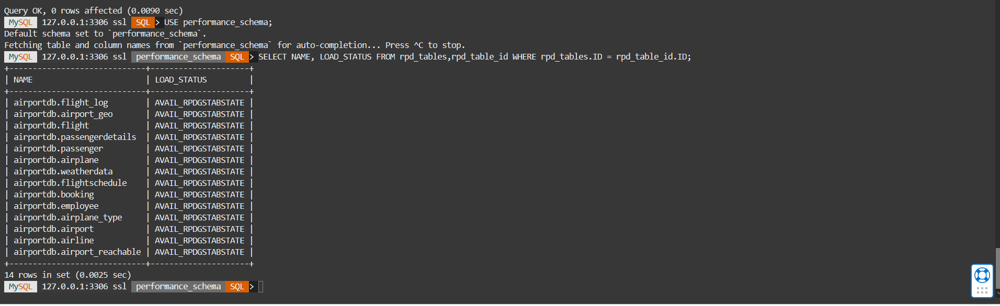

# SETUP HEATWAVE CLUSTER IN MYSQL DATABASE SYSTEM  
 


## Introduction

A HeatWave cluster comprise of a MySQL DB System node and two or more HeatWave nodes. The MySQL DB System node includes a plugin that is responsible for cluster management, loading data into the HeatWave cluster, query scheduling, and returning query result.


Estimated Lab Time: 20 minutes


### Objectives

In this lab, you will be guided through the following tasks:

- Add a HeatWave Cluster to MySQL Database System
- Load Airportdb Data into HeatWave


### Prerequisites

- An Oracle Trial or Paid Cloud Account
- Some Experience with MySQL Shell
- Completed Lab 2

## Task 1: Add a HeatWave Cluster to MDS-HW MySQL Database System

1. Open the navigation menu  
    Databases 
    MySQL
    DB Systems
2. Choose the root Compartment. A list of DB Systems is displayed. 
    
3. In the list of DB Systems, 'click' the **MDS-HW** system. 'click' **More Action ->  Add HeatWave Cluster**.
    
4. On the “Add HeatWave Cluster” dialog, select “MySQL.HeatWave.VM.Standard.E3” shape

5. Click “Estimate Node Count” button
    
6. On the “Estimate Node Count” page, click “Generate Estimate”. This will trigger the auto
provisioning advisor to sample the data stored in InnoDB and based on machine learning
algorithm, it will predict the number of nodes needed.
    

7. Once the estimations are calculated, it shows list of database schemas in MySQL node. If you expand the schema and select different tables, you will see the estimated memory required in the Summary box, There is a Load Command (heatwave_load) generated in the text box window, which will change based on the selection of databases/tables

8. Select the airportdb schema and click “Apply Node Count Estimate” to apply the node count
    

9. Click “Add HeatWave Cluster” to create the HeatWave cluster
    
10. HeatWave creation will take about 10 minutes. From the DB display page scroll down to the Resources section. 'click' the **HeatWave** link. Your completed HeatWave Cluster Information section will look like this:
    

## Task 2: Load airportdb Data into HeatWave Cluster
1. If not already connected with SSH, connect to Compute instance using Cloud Shell

    (Example: **ssh -i ~/.ssh/id_rsa opc@132.145.170...**) 

2. On command Line, connect to MySQL using the MySQL Shell client tool with the following command:

    ```
    <copy>mysqlsh -uadmin -p -h 10.0.1... --sql </copy>
    ```

3. Run the following Auto Parallel Load command to load the airportdb tables into HeatWave..


    

    ```
    <copy>CALL sys.heatwave_load(JSON_ARRAY('airportdb'), NULL);</copy>
    ```
4. The completed load cluster screen should look like this:

    

    

5.	Verify that the tables are loaded in the HeatWave cluster. Loaded tables have an AVAIL_RPDGSTABSTATE load status.

    ```
    <copy>USE performance_schema;</copy>
    ```
    ```
    <copy>SELECT NAME, LOAD_STATUS FROM rpd_tables,rpd_table_id WHERE rpd_tables.ID = rpd_table_id.ID;</copy>
    ```
    

## Learn More

* [Oracle Cloud Infrastructure MySQL Database Service Documentation ](https://docs.cloud.oracle.com/en-us/iaas/MySQL-database)
* [MySQL Database Documentation](https://www.MySQL.com)
## Acknowledgements
* **Author** - Perside Foster, MySQL Solution Engineering 
* **Contributors** - Mandy Pang, MySQL Principal Product Manager,  Priscila Galvao, MySQL Solution Engineering, Nick Mader, MySQL Global Channel Enablement & Strategy Manager
* **Last Updated By/Date** - Perside Foster, MySQL Solution Engineering, September 2021
