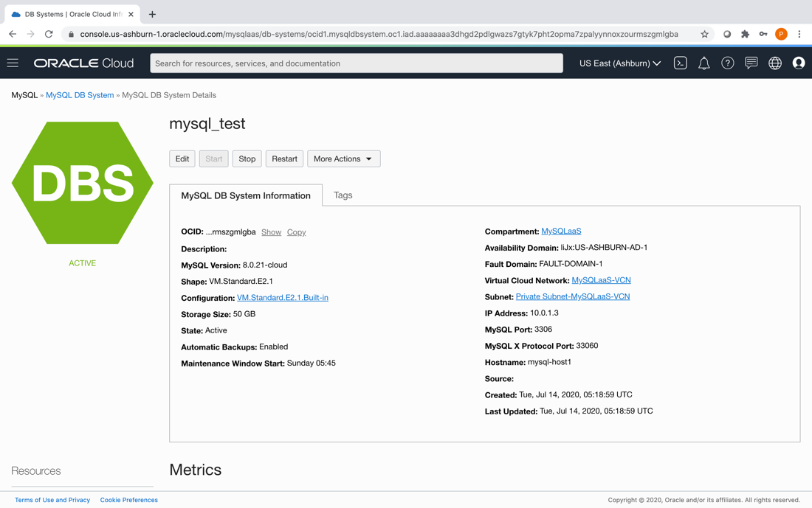
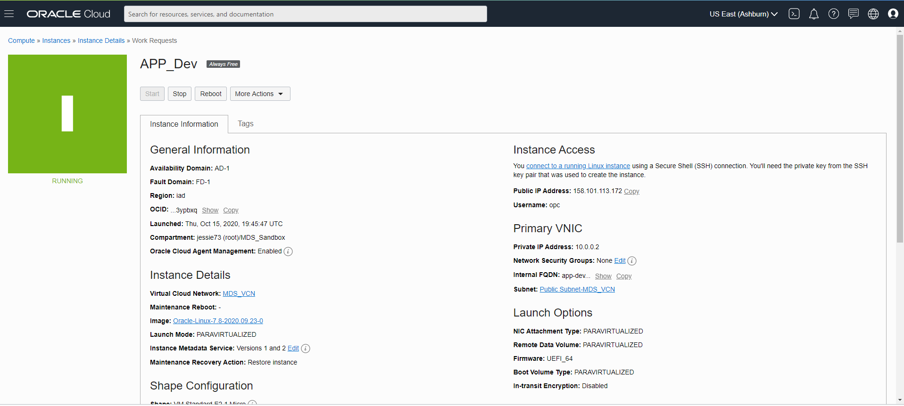

# Launching Your First MySQL Database Service System

## Introduction

In this Lab, you will learn how to launch a MySQL Database Service System on Oracle Cloud Infrastructure and connect to it using the Console.

Estimated Lab Time: 60 minutes

### About MySQL Database Service

MySQL Database Service is a fully-managed Oracle Cloud Infrastructure service, developed, managed, and supported by the MySQL team in Oracle.

### Objectives

In this lab, you will be guided through the following steps:

- Set correct OCI environment and user Policies. 
- Create an isolated Virtual Cloud Network.
- Create a MySQL DB System.
- Configure a client Linux Virtual Machine.
- Clean up resources.

### Prerequisites

- An Oracle Free Tier, Always Free, Paid or LiveLabs Cloud Account
- Some Experience with MySQL Shell

## **STEP 1**: Set correct OCI environment and user Policies

You must have an OCI tenancy subscribed to the US East (Ashburn) region and enough limits configured for your tenancy to create a MySQL DB System.

1. Make sure you have created a tenancy and log-in to the Console as an Administrator.

2. Create a compartment named **MySQLSandbox** On the Navigation Menu, under Governance and Administration, select Identity -> Compartments. 

    

3. Define the required MySQL Database Service policies (Identity menu).
    If your user is in the group MySQL*Test*Group and you want to restrict your MySQL DB Systems to the compartment MySQLSandbox, add the following policy statements:


    a. Policy statement 1:

    ```
    Allow group Administrators to {COMPARTMENT_INSPECT} in tenancy
    ```

    b. Policy statement 2:

    ```
    Allow group Administrators to {VCN_READ, SUBNET_READ, SUBNET_ATTACH, SUBNET_DETACH} in tenancy
    ```

    \_<br>

    c. Policy statement 3:

    ```
    Allow group Administrators to manage mysql-family in tenancy
    ```
Click the Create button


## **STEP 2:** Create an isolated Virtual Cloud Network

1. On the Navigation Menu, under Core Infrastructure, select Networking -> Virtual Cloud Networks.

2. Click on Start VCN Wizard.

3. On Start VCN Wizard, select VCN with Internet Connectivity and click on Button Start VCN Wizard.

4. On Create a VCN with Internet Connectivity, under Basic Information, enter VCN Name (MDSVCN) and select the Compartment.

5. Under Configure VCN and Subnets, add 10.0.0.0/16 on VCN CIDR Block, 10.0.0.0/24

6. On Public Subnet CIDR Block, and 10.0.1.0/24

7. On Private Subnet CIDR Block and click Next.

8. Under Review and Create, review the Oracle Virtual Cloud Network (VCN) and Subnets information and click on Create.

9. On Created Virtual Cloud Network, click on View Virtual Cloud Network to view the VCN and Subnets created. Click the Create button 


## **STEP 3:** Create a MySQL DB System.

1. On the Navigation Menu, under Database, select MySQL -> DB Systems

2. On DB Systems in MDSSandbox Compartment, click on Create MySQL DB System.

3. On Create MySQL DB System, under DB System Information, select a Compartment, enter a Name (MDSDB) for the DB System, add a Description, select an Availability Domain, select a Fault Domain, select a configuration for the MySQL Shape, and click Next.

4. On Create MySQL DB System, under Database Information, create the Administrator Credentials by entering Username (admin) and Password (Welcome1!), specify the network information selecting the Virtual Cloud Network and Subnet in the compartment and entering Hosting Name, and click Next.

5. On Backup Information, select Enable Automatic Backups, select the Backup Retention Period (1 day), select Default Backup Window, and click on Create.

6. The New MySQL DB System will be ready to use after a few minutes. The state will be shown as Creating during the creation.

7. The state Active indicates that the DB System is ready to use. Check the MySQL endpoint (Address) under Instances in the MySQL DB System Details page. 

Click the Create button 



## **STEP 4:** Configure a client Linux Virtual Machine

1. You will need a client machine to connect to your brand new MySQL database. If you still don't have a Linux VM in the same VCN mentioned in the pre-requisites, you can create one right now. To launch a Linux Compute instance, you go to the Console, menu Compute, Instances, and click "Create Instance". Ensure you choose the same VCN from the pre-requisites, and it is in a Public Subnet with a public IP address assigned.

2. Configure the Private Subnet to accept traffic on MySQL port(s). In the Console, got to Networking, Virtual Cloud Networks, <your vcn="" name="">, Security Lists, Security List for Private Subnet, and add an Ingress Rule with Source CIDR 0.0.0.0/0 to Destination Port 3306. (Optional) Add another Ingress Rule to port 33060 if you want to use MySQL Document Store.</your>

3. On Create Compute Instance, enter a Name for the instance (MDSClient), choose an operating system or image source (on this case, please select Oracle Linux), Edit Configure placement and hardware, select the Availability Domain, Instance Shape (please, select VM.Standard.E2.1.Micro)

Click the Create button 


4. Connect to the Compute instance using SSH. For example, using the Terminal:

    `$ ssh -i ~/.ssh/id_rsa opc@&<lt;your_compute_instance_ip>;`

5. You will need a MySQL client tool to connect to your new MySQL DB System from your client machine. 


To install MySQL Shell just run:

 `[opc@...]$ sudo yum -y install https://dev.mysql.com/get/mysql80-community-release-el7-3.noarch.rpm`

 `[opc@...]$ sudo yum -y install mysql-sh`
 

## **STEP 5:** Connect to MySQL

1. From your Compute instance, connect to MySQL using the MySQL Shell client tool. 
The endpoint (IP Address) can be found in the MySQL DB System Details page, under the "Endpoints" resource. 

`[opc@...]$ mysqlsh -u<MDS_admin_username> -p -h<MDS_endpoint>`


2. (Optional) At this point, you can also use MySQL Workbench from your local machine to connect to the MySQL endpoint using your new Compute instance as a jump box. 

In MySQL Workbench, configure a connection using the method "Standard TCP/IP over SSH" and use the credentials of the Compute instance for SSH.


## **STEP 6:** Clean up the resources

1. Delete the MySQL DB System.

2. Terminate the Compute instance.

3. Delete the Virtual Cloud Network.

4. Delete the MySQL policies for the compartment.


## Acknowledgements

- **Author** \- <airton lastori,="" title,="MySQL Principal Product Manager" group="MySQL Product Management"></airton>

- **Contributors** \- <perside foster,="" group="MySQL Solution Engineering"> -- optional</perside>

- **Last Updated By/Date** \- <perside foster,="" group,="MySQL Solution Engineering" month="November" year="2020"></perside>

- **Workshop (or Lab) Expiry Date** \- <month year=""> -- optional, use this when you are using a Pre-Authorized Request (PAR) URL to an object in Oracle Object Store.</month>


## See an issue?

Please submit feedback using this [form](<https://apexapps.oracle.com/pls/apex/f?p=133:1:::::P1_FEEDBACK:1>). Please include the *workshop name*, *lab* and *step* in your request. If you don't see the workshop name listed, please enter it manually. If you would like us to follow up with you, enter your email in the *Feedback Comments* section.

<!-- Downloaded from Tutorial Creator on Tue Nov 03 2020 20:15:32 GMT-0500 (Eastern Standard Time) -->