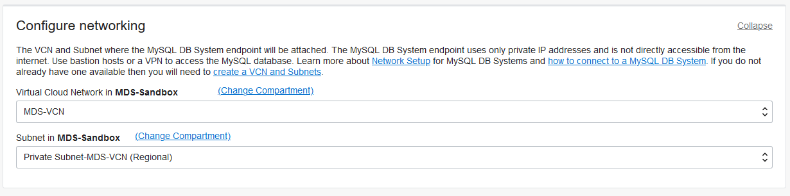
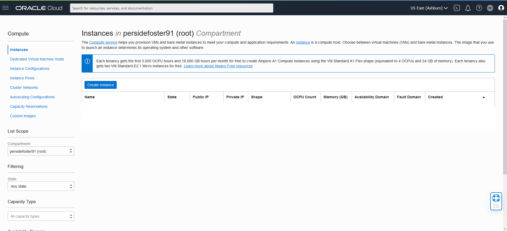
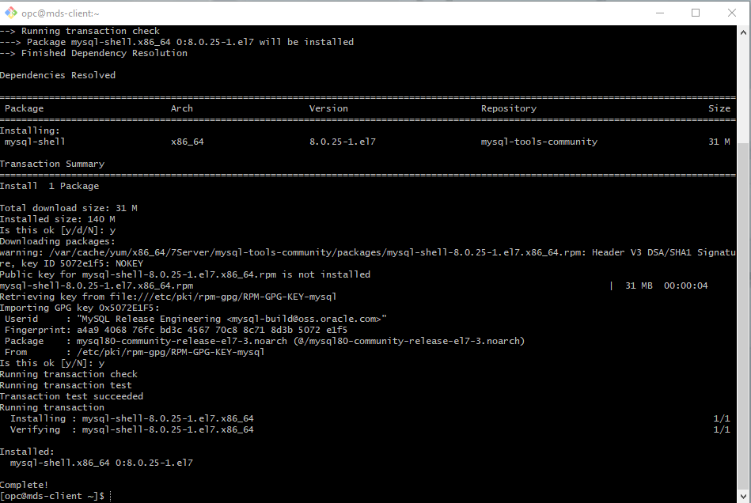

# Getting Started with MySQL Database Service Systems 
 


## Introduction

In this hands-on workshop, you will be introduced to MySQL Database Service (MDS), a powerful union between MySQL Enterprise Edition and Oracle Cloud Infrastructure. You will learn how to create and use three different instances of MySQL Database Service Systems, Standalone, High Availability, and HeatWave,  in a secure Oracle Cloud Infrastructure environment.

Estimated Lab Time: 5 hours


### Objectives

In this lab, you will be guided through the following steps:

- Create and configure a Virtual Cloud Network (VCN) 
- Create the three MySQL Database Systems
    * Standalone
    * High Availability
    * HeatWave
- Create Client Linux Virtual Machine and install  MySQL Shell
- Connect and use MySQL Standalone 
- Connect and use MySQL High Availability 
- Connect and use MySQL HeatWave
    * Create Airportdb Database and Import Data
    * Add HeatWave Cluster to MySQL HeatWave
    * Load Airportdb Data into HeatWave
    * Runn Queries in HeatWave
- Install Apache and PHP and create PHP / MYSQL Connect Application
- Create Oracle Analytics Cloud and connect to MySQL HeatWave
- Create a Bastion Host and connect to MySQL Standalone
    * Connect to MySQL Standalone using Workbench
- Manage MySQL Data Service Systems 

### Prerequisites

- An Oracle Trial, or Paid Cloud Account
- Some Experience with MySQL Shell

## **STEP 1:** Create Virtual Cloud Network

1. Navigation Menu > Core Infrastructure > Networking > Virtual Cloud Networks
    

2. Click Start VCN Wizard.
    

3. Select VCN with Internet Connectivity 

    click on Button Start VCN Wizard 
    

4. Create a VCN with Internet Connectivity 

    On Basic Information  Complete the following fields 

 VCN Name: 
     ````
    <copy>MDS-VCN</copy>
    ````
 Compartment: Select  **(root)**

 Your screen should look similar to the following
    

5. Click the Next button at the bottom of the screen 

6. Review Oracle Virtual Cloud Network (VCN), Subnets, and Gateways
         
    Click Create button to create the VCN
    

7. The Virtual Cloud Network creation is completing 
    
    
8. Click "View Virtual Cloud Network" button to display the  created VCN
    

9. MDS-VCN page Under Subnets in( (root)) Compartment Click on the  **Private Subnet-MDS-VCN** link 
            

10.	Private Subnet-MDS-VCN page under Security Lists  click on the **Security List for Private Subnet-MDS-VCN** link
        

11.	Security List for Private Subnet-MDS-VCN page click on the **Add Ingress Rules** button

    

12.	Add Ingress Rules page under Ingress Rule 1
 
 Add an Ingress Rule with Source CIDR 
    ````
    <copy>0.0.0.0/0</copy>
    ````
 Destination Port Name 
     ````
    <copy>3306,33060</copy>
     ````
    Description 
     ````
    <copy>MySQL Port Access</copy>
     ````
 Click Add Ingress Rule.
    

14.	On Security List for Private Subnet-MDS_VCN page
        
     New Ingress Rules will be shown under the Ingress Rules List
    

## **STEP 2:** Create a MySQL DB System - Standalone.

1. Open the navigation menu. Under Databases ->MySQL, click DB Systems
    

2. Click Create MySQL DB System
    

3. Create MySQL DB System dialog complete the fields in each section

    - Provide basic information for the DB System
    - Setup your required DB System
    - Create Administrator credentials
    - Configure Networking
    - Configure placement
    - Configure hardware
    - Exlude Backups
   

4. Provide basic information for the DB System:
   

 Select Compartment **(root)**

 Enter Name
     ````
    <copy>MDS-SA</copy>
    ````
 Enter Description 
    ````
    <copy>MySQL Database Service Standalone instance</copy>
    ````
 
 Select **Standalone** to specify a Standalone DB System
    

6. Create Administrator credentials

 Enter Username
    ````
    <copy>admin</copy>
    ````
 Enter Password
    ````
    <copy>Welcome#12345</copy>
    ````   
 Confirm Password
    ````
    <copy>Welcome#12345</copy>
    ````
    

7. Configure networking Keep default values

    Virtual Cloud Network: **MDS-VCN**
    
    Subnet: **Private Subnet-MDS-VCN (Regional)**

    

8. Configure placement  keep checked  "Availability Domain"
   
    Do not check "Choose a Fault Domain" for this DB System. Oracle will chooses the best placement for you.
    

9. Configure hardware keep default shape  **MySQL.VM.Standard.E3.1.8GB**

    Data Storage Size (GB) keep default value **50**
    

19. Configure Backups, "Enable Automatic Backups"
    
    Turn off button to disable automatic backup
       
    
    
    Click the **Create button** 
    

11. The New MySQL DB System will be ready to use after a few minutes. 

    The state will be shown as Creating during the creation
    

12. The state Active indicates that the DB System is ready to use. 

    Check the MySQL endpoint (Address) under Instances in the MySQL DB System Details page. 

    

## **STEP 3:** Create a MySQL DB System - High Availability.

1. Open the navigation menu. Under Databases ->MySQL, click DB Systems
    

2. Click Create MySQL DB System
    

3. Create MySQL DB System dialog complete the fields in each section

    - Provide basic information for the DB System
    - Setup your required DB System
    - Create Administrator credentials
    - Configure Networking
    - Configure placement
    - Configure hardware
    - Exlude Backups
   

4. Provide basic information for the DB System:
   

 Select Compartment **(root)**

 Enter Name
     ````
    <copy>MDS-HA</copy>
    ````
 Enter Description 
    ````
    <copy>MySQL Database Service High Availability instance</copy>
    ````
 
 Select **Standalone** to specify a High Availability DB System
    

6. Create Administrator credentials

 Enter Username
    ````
    <copy>admin</copy>
    ````
 Enter Password
    ````
    <copy>Welcome#12345</copy>
    ````   
 Confirm Password
    ````
    <copy>Welcome#12345</copy>
    ````
    

7. Configure networking Keep default values

    Virtual Cloud Network: **MDS-VCN**
    
    Subnet: **Private Subnet-MDS-VCN (Regional)**

    

8. Configure placement  "Availability Domain"

    Select AD-2
   
    Do not check "Choose a Fault Domain" for this DB System. Oracle will chooses the best placement for you.
    

9. Configure hardware keep default shape  **MySQL.VM.Standard.E3.1.8GB**

    Data Storage Size (GB) keep default value **50**
    

19. Configure Backups, "Enable Automatic Backups"
    
    Turn off button to disable automatic backup
       
    
    
    Click the **Create button** 
    

11. The New MySQL DB System will be ready to use after a few minutes. 

    The state will be shown as Creating during the creation
    

12. The state Active indicates that the DB System is ready to use. 

    Check the MySQL endpoint (Address) under Instances in the MySQL DB System Details page. 

    


## **STEP 4:** Create a MySQL DB System - HeatWave.

1. Open the navigation menu. Under Databases ->MySQL, click DB Systems
    

2. Click Create MySQL DB System
    

3. Create MySQL DB System dialog complete the fields in each section

    - Provide basic information for the DB System
    - Setup your required DB System
    - Create Administrator credentials
    - Configure Networking
    - Configure placement
    - Configure hardware
    - Exlude Backups
   

4. Provide basic information for the DB System:
   

 Select Compartment **(root)**

 Enter Name
     ````
    <copy>MDS-HW</copy>
    ````
 Enter Description 
    ````
    <copy>MySQL Database Service HeatWave instance</copy>
    ````
 
 Select **HeatWave** to specify a HeatWave DB System
    

6. Create Administrator credentials

 Enter Username
    ````
    <copy>admin</copy>
    ````
 Enter Password
    ````
    <copy>Welcome#12345</copy>
    ````   
 Confirm Password
    ````
    <copy>Welcome#12345</copy>
    ````
    

7. Configure networking Keep default values

    Virtual Cloud Network: **MDS-VCN**
    
    Subnet: **Private Subnet-MDS-VCN (Regional)**

    

8. Configure placement "Availability Domain"
   
    Select AD-3

    Do not check "Choose a Fault Domain" for this DB System. Oracle will chooses the best placement for you.
    

9. Configure hardware keep default shape  **MySQL.HeatWave.VM.Standard.E3**

    Data Storage Size (GB) Set to **4000**
    

19. Configure Backups, "Enable Automatic Backups"
    
    Turn off button to disable automatic backup

20. Click on Hide Advanced Options link

    Select Networking tab

    Enter Hostname mdshw
       
    
    
    Click the **Create button** 
    

11. The New MySQL DB System will be ready to use after a few minutes. 

    The state will be shown as Creating during the creation
    

12. The state Active indicates that the DB System is ready to use. 

    Check the MySQL endpoint (Address) under Instances in the MySQL DB System Details page. 

    


## **STEP 5:** Create Client Virtual Machine

1. You will need a client machine to connect to your brand new MySQL database. To launch a Linux Compute instance, go to the Console, menu Compute, Instances
    

2. On Instances in **(root)** Compartment, click on Create Instance.
    

3. On Create Compute Instance 

 Enter Name
    ````
    <copy>MDS-Client</copy>
    ````   
4. Make sure **(root)** compartment is selected. 

5. Choose an operating system or image source (for this lab , select Oracle Linux), 

6. Edit Configure placement and hardware
   
   Keed the selected Availability Domain, Instance Shape (select VM.Standard.E2.1.Micro).

   For VCN make sure **MDS-VCN** is selected, "Assign a public IP address" should be set to Yes. 
   
        

7. If you have not already created your SSH key, perform "Lab 1: Create Local SSH Key".  When you are done return to the next line (STEP 5: #8) .
8. In the Add SSH keys section upload your own public key. 
  
    

9. Hit the **Create** button to finish creating your Compute Instance. 

    

10. The New Virtual Machine will be ready to use after a few minutes. The state will be shown as Provisioning during the creation
    

11.	The state Running indicates that the Virtual Machine is ready to use. 

    **Save the Public IP Address** under "Instance Access"  on the **MDS_Client** Instance page. 
    

## **STEP 6:** Connect to MySQL Database

1. If you are a Linux, Mac, or  Windows 10 Powershell user go to STEP 6: #2

   If you are a Windows user click Start menu from your windows machine for Git which should include the Git Bash command.

    Click on the Git Bash command. This will take you to the Git Bash terminal as shown below 
   
    and continue to  STEP 6: #2. 
    

2.  From a terminal window on your local system. Connect to the Compute Instance with the SSH command. 

    Indicate the location of the private key you created earlier with **MDS-Client**. 
    
    Enter the username **opc** and the Public **IP Address**.

    Note: The **MDS-Client**  shows the  Public IP Address as mentioned on Step 5: #10
    
    (Example: **ssh -i ~/.ssh/id_rsa opc@132.145.170.990**)

    `$ ssh -i ~/.ssh/id_rsa opc@<your_compute_instance_ip>;`

    

    **Install MySQL Shell on the Compute Instance**

3. You will need a MySQL client tool to connect to your new MySQL DB System from your client machine. 

 Install MySQL release package  with the following command:

 **[opc@...]$**
    ````
    <copy>sudo yum -y install https://dev.mysql.com/get/mysql80-community-release-el7-3.noarch.rpm</copy>
    ````

    

 Install MySQL Shell with the following command 

 **[opc@...]$**
     ````
    <copy>sudo yum install –y mysql-shell</copy>
    ````

    

   **Connect to MySQL Database Service**

4. From your Compute instance, connect to MySQL using the MySQL Shell client tool. 
   
   The endpoint (IP Address) can be found in the MySQL DB System Details page, under the "Endpoints" resource. 

    

5.  Use the following command to connect to MySQL using the MySQL Shell client tool. Be sure to add the MDS-DB private IP address at the end of the cammand. Also enter the admin user password

    (Example  **mysqlsh -uadmin -p -h10.0.1..**)

 **[opc@...]$**
    ````
    <copy>mysqlsh -uadmin -p -h 10.0.1....</copy>
    ````
    

6. On MySQL Shell, switch to SQL mode  to try out some SQL commands 

 Enter the following command at the prompt:
     ````
    <copy>\SQL</copy>
    ````
    

 To display a list of databases, Enter the following command at the prompt:
      ````
    <copy>SHOW DATABASES;</copy>
    ````  
     
 To display the database version, current_date, and user enter the following command at the prompt:
      ````
    <copy>SELECT VERSION(), CURRENT_DATE, USER();</copy>
    ````  
 To display MysQL user and host from user table enter the following command at the prompt:
       ````
    <copy>SELECT USER, HOST FROM mysql.user;</copy>
      ````
 Type the following command to exit MySQL:
      ````
    <copy>\q</copy>
    ````   

  **Final Sceen Shot**
    

## **STEP 7:** Connect to MySQL Database - Standalone

1. If you are a Linux, Mac, or  Windows 10 Powershell user go to STEP 6: #2

   If you are a Windows user click Start menu from your windows machine for Git which should include the Git Bash command.

    Click on the Git Bash command. This will take you to the Git Bash terminal as shown below 
   
    and continue to  STEP 6: #2. 
    

2.  From a terminal window on your local system. Connect to the Compute Instance with the SSH command. 

    Indicate the location of the private key you created earlier with **MDS-Client**. 
    
    Enter the username **opc** and the Public **IP Address**.

    Note: The **MDS-Client**  shows the  Public IP Address as mentioned on Step 5: #10
    
    (Example: **ssh -i ~/.ssh/id_rsa opc@132.145.170.990**)

    ````
    <copy>ssh -i ~/.ssh/id_rsa opc@<your_compute_instance_ip>;</copy>
    ````

    

    **Install MySQL Shell on the Compute Instance**

3. You will need a MySQL client tool to connect to your new MySQL DB System from your client machine. 

 Install MySQL release package  with the following command:

 **[opc@...]$**
    ````
    <copy>sudo yum -y install https://dev.mysql.com/get/mysql80-community-release-el7-3.noarch.rpm</copy>
    ````

    

 Install MySQL Shell with the following command 

 **[opc@...]$**
     ````
    <copy>sudo yum install –y mysql-shell</copy>
    ````

    

   **Connect to MySQL Database Service**

4. From your Compute instance, connect to MySQL using the MySQL Shell client tool. 
   
   The endpoint (IP Address) can be found in the MySQL DB System Details page, under the "Endpoints" resource. 

    

5.  Use the following command to connect to MySQL using the MySQL Shell client tool. Be sure to add the MDS-DB private IP address at the end of the cammand. Also enter the admin user password

    (Example  **mysqlsh -uadmin -p -h10.0.1..**)

 **[opc@...]$**
    ````
    <copy>mysqlsh -uadmin -p -h 10.0.1....</copy>
    ````
    

6. On MySQL Shell, switch to SQL mode  to try out some SQL commands 

 Enter the following command at the prompt:
     ````
    <copy>\SQL</copy>
    ````
    

 To display a list of databases, Enter the following command at the prompt:
      ````
    <copy>SHOW DATABASES;</copy>
    ````  
     
 To display the database version, current_date, and user enter the following command at the prompt:
      ````
    <copy>SELECT VERSION(), CURRENT_DATE, USER();</copy>
    ````  
 To display MysQL user and host from user table enter the following command at the prompt:
       ````
    <copy>SELECT USER, HOST FROM mysql.user;</copy>
      ````
 Type the following command to exit MySQL:
      ````
    <copy>\q</copy>
    ````   

  **Final Sceen Shot**
    

## **STEP 8:** Connect to MySQL Database - High Availability

1. If you are a Linux, Mac, or  Windows 10 Powershell user go to STEP 6: #2

   If you are a Windows user click Start menu from your windows machine for Git which should include the Git Bash command.

    Click on the Git Bash command. This will take you to the Git Bash terminal as shown below 
   
    and continue to  STEP 6: #2. 
    

2.  From a terminal window on your local system. Connect to the Compute Instance with the SSH command. 

    Indicate the location of the private key you created earlier with **MDS-Client**. 
    
    Enter the username **opc** and the Public **IP Address**.

    Note: The **MDS-Client**  shows the  Public IP Address as mentioned on Step 5: #10
    
    (Example: **ssh -i ~/.ssh/id_rsa opc@132.145.170.990**)

    `$ ssh -i ~/.ssh/id_rsa opc@<your_compute_instance_ip>;`

    

    **Install MySQL Shell on the Compute Instance**

3. You will need a MySQL client tool to connect to your new MySQL DB System from your client machine. 

 Install MySQL release package  with the following command:

 **[opc@...]$**
    ````
    <copy>sudo yum -y install https://dev.mysql.com/get/mysql80-community-release-el7-3.noarch.rpm</copy>
    ````

    

 Install MySQL Shell with the following command 

 **[opc@...]$**
     ````
    <copy>sudo yum install –y mysql-shell</copy>
    ````

    

   **Connect to MySQL Database Service**

4. From your Compute instance, connect to MySQL using the MySQL Shell client tool. 
   
   The endpoint (IP Address) can be found in the MySQL DB System Details page, under the "Endpoints" resource. 

    

5.  Use the following command to connect to MySQL using the MySQL Shell client tool. Be sure to add the MDS-DB private IP address at the end of the cammand. Also enter the admin user password

    (Example  **mysqlsh -uadmin -p -h10.0.1..**)

 **[opc@...]$**
    ````
    <copy>mysqlsh -uadmin -p -h 10.0.1....</copy>
    ````
    

6. On MySQL Shell, switch to SQL mode  to try out some SQL commands 

 Enter the following command at the prompt:
     ````
    <copy>\SQL</copy>
    ````
    

 To display a list of databases, Enter the following command at the prompt:
      ````
    <copy>SHOW DATABASES;</copy>
    ````  
     
 To display the database version, current_date, and user enter the following command at the prompt:
      ````
    <copy>SELECT VERSION(), CURRENT_DATE, USER();</copy>
    ````  
 To display MysQL user and host from user table enter the following command at the prompt:
       ````
    <copy>SELECT USER, HOST FROM mysql.user;</copy>
      ````
 Type the following command to exit MySQL:
      ````
    <copy>\q</copy>
    ````   

  **Final Sceen Shot**
    

## **STEP 7:**  Import the airportdb schema and data using MySQL Shell

1.	Create the schema airportdb and tables

   Display list of created tables 
    ````
    <copy>show tables;</copy>
    ````
    

2. On MySQL Shell, switch to JavaScript mode 

 Create table  
    ````
    <copy>\js</copy>
    ````  
    

3.	Import the table data into MySQL Database Service from an external OCI Object Storage 

4. Display the count of all records per table in tpch

 Change to SQL 
      ````
    <copy>\sql</copy>
    ````   
  List table content 
      ````
    <copy>SELECT table_name, table_rows FROM INFORMATION_SCHEMA.TABLES WHERE TABLE_SCHEMA = 'tpch';</copy>
    ```` 
  Exit MySQL Shell 
      ````
    <copy>\q</copy>
    ```` 
    

## **STEP 8:**  Add a HeatWave Cluster to MySQL Database System

1. Open the navigation menu, under Databases -> MySQL, click DB Systems
2. Choose your Compartment. A list of DB Systems is displayed. 
    
3. In the list of DB Systems, click on the **MDS-DB** Ssystem. click the “More Action” -> “Add HeatWave Cluster”.
    
4. On the “Add HeatWave Cluster” dialog, select “MySQL.HeatWave.VM.Standard.E3” shape

5. Click “Estimate Node Count” button
    
6. Click “Estimate Node Count” button
7. On the “Estimate Node Count” page, click “Generate Estimate”. This will trigger the auto
provisioning advisor to sample the data stored in InnoDB and based on machine learning
algorithm, it will predict the number of nodes needed.
    

8. Once the estimations are calculated, it shows list of database schemas in MySQL node. If
you expand the schema and select different tables, you will see the estimated memory
required in the Summary box, There is s Load Command (analytics_load) generated in the text box window, which will change based on the selection of databases/tables
    

9. Select the tpch schema and click “Apply Node Count Estimate” to apply the node count
10. Click “Add HeatWave Cluster” to create the HeatWave cluster
    
12. HeatWave creation will take about 10 minutes. From the DB display page scroll down to the Resources section. Click on the **HeatWave** link. Your completed HeatWave Cluster Information section will look like this:
    

## **STEP 9:**  Load TPCH Data into HeatWave Cluster
1. If not already connected with SSH, on Command Line, connect to the Compute instance using SSH

    (Example: **ssh -i ~/.ssh/id_rsa opc@&132.145.170..**)

2. On command Line, connect to MySQL using the MySQL Shell client tool

    (Example  **mysqlsh -uadmin -p -h10.0.1..**)

3. Change the MySQL Shell execution mode to SQL

 Enter the following command at the prompt:
     ````
    <copy>\SQL</copy>
    ````


4. Execute the following operations to prepare the tpch sample database tables and load them into the HeatWave cluster. The operations performed include defining string column encodings, defining the secondary engine, and executing a SECONDARY_LOAD operations.

 Select database to use:
     ````
    <copy>USE airportdb;</copy>
    ````

   


Verify that the tables are loaded in the HeatWave cluster.

 Select performance_schema database:
     ````
    <copy>USE performance_schema;</copy>
    ````
 Enter the following command:
     ````
    <copy>SELECT NAME, LOAD_STATUS FROM rpd_tables,rpd_table_id WHERE rpd_tables.ID = rpd_table_id.ID;</copy>
    ````

   **NOTE:** Loaded tables have an AVAIL_RPDGSTABSTATE load status.

   

## **STEP 10:**  Runn Queries in HeatWave

1. If not already connected with SSH, on Command Line, connect to the Compute instance using SSH

    (Example: **ssh -i ~/.ssh/id_rsa opc@&132.145.170..**)

2. On command Line, connect to MySQL using the MySQL Shell client tool

    (Example  **mysqlsh -uadmin -p -h10.0.1..**)

3. Change the MySQL Shell execution mode to SQL

 Enter the following command at the prompt:
     ````
    <copy>\SQL</copy>
    ````

4.	Change to the tpch database:

 Enter the following command at the prompt:
     ````
    <copy>USE airportdb;</copy>
    ````
    

5. Before running a query, use EXPLAIN to verify that the query can be offloaded to the HeatWave cluster. For example:

 Enter the following command at the prompt:
     ````
    <copy>EXPLAIN SELECT SUM(l_extendedprice * l_discount) AS revenue FROM lineitem WHERE l_shipdate >= date '1994-01-01';</copy>
    ````

6. After verifying that the query can be offloaded, run the query and note the execution time.

 Enter the following command at the prompt:
     ````
    <copy>SELECT SUM(l_extendedprice * l_discount) AS revenue FROM lineitem WHERE l_shipdate >= date '1994-01-01';</copy>
    ````
    


7. To compare the HeatWave execution time with MySQL DB System execution time, disable the use_secondary_engine variable to see how long it takes to run the same query on the MySQL DB System. For example:

 Enter the following command at the prompt:
     ````
    <copy>SET SESSION use_secondary_engine=OFF;</copy>
    ````

 Enter the following command at the prompt:
     ````
    <copy>SELECT SUM(l_extendedprice * l_discount) AS revenue FROM lineitem WHERE l_shipdate >= date '1994-01-01';</copy>
    ````
    

8. To see if use_secondary_engine is enabled (=ON)

 Enter the following command at the prompt:
     ````
    <copy>SHOW VARIABLES LIKE 'use_secondary_engine%';</copy>
    ````
9. Running additional queries. Remember to turn on and off the use of secondary engine  to compare the execution time. 
   
    (Example  **SET SESSION use_secondary_engine=On;**) 

    (Example  **SET SESSION use_secondary_engine=Off;**)      

 Enter the following command at the prompt
     ````
    <copy>SET SESSION use_secondary_engine=ON;</copy>
    ````
 a.	Run Pricing Summary Report Query:
     ````
    <copy>SELECT
    l_returnflag,
    l_linestatus,
    SUM(l_quantity) AS sum_qty,
    SUM(l_extendedprice) AS sum_base_price,
    SUM(l_extendedprice * (1 - l_discount)) AS sum_disc_price,
    SUM(l_extendedprice * (1 - l_discount) * (1 + l_tax)) AS sum_charge,
    AVG(l_quantity) AS avg_qty,
    AVG(l_extendedprice) AS avg_price,
    AVG(l_discount) AS avg_disc,
    COUNT(*) AS count_order
FROM
    lineitem
WHERE
    l_shipdate <= DATE '1998-12-01' - INTERVAL '90' DAY
GROUP BY l_returnflag , l_linestatus
ORDER BY l_returnflag , l_linestatus;
</copy>
    ````
Enter the following command at the prompt:
     ````
    <copy>SET SESSION use_secondary_engine=OFF;</copy>
    ````
    Run the Pricing Summary Report Query again:
    
   Execution with **use_secondary_engine=ON** result

   **4 rows in set (0.7509 sec)**

   Execution with **use_secondary_engine=OFF** result:

   **4 rows in set (10.4541 sec)**


 b.	Shipping Priority Query :
     ````
    <copy>SELECT
    l_orderkey,
    SUM(l_extendedprice * (1 - l_discount)) AS revenue,
    o_orderdate,
    o_shippriority
FROM
    customer,
    orders,
    lineitem
WHERE
c_mktsegment = 'BUILDING'
        AND c_custkey = o_custkey
        AND l_orderkey = o_orderkey
        AND o_orderdate < DATE '1995-03-15'
        AND l_shipdate > DATE '1995-03-15'
GROUP BY l_orderkey , o_orderdate , o_shippriority
ORDER BY revenue DESC , o_orderdate
LIMIT 10;
</copy>
    ````
 c.	Product Type Profit Measure Query :
     ````
    <copy>SELECT
    nation, o_year, SUM(amount) AS sum_profit
FROM
    (SELECT
        n_name AS nation,
            YEAR(o_ORDERdate) AS o_year,
            l_extendedprice * (1 - l_discount) - ps_supplycost * l_quantity AS amount
    FROM
        part
    STRAIGHT_JOIN partsupp
    STRAIGHT_JOIN lineitem
    STRAIGHT_JOIN supplier
    STRAIGHT_JOIN orders
    STRAIGHT_JOIN nation
    WHERE
        s_suppkey = l_suppkey
            AND ps_suppkey = l_suppkey
            AND ps_partkey = l_partkey
            AND p_partkey = l_partkey
            AND o_ORDERkey = l_ORDERkey
            AND s_nationkey = n_nationkey
            AND p_name LIKE '%green%') AS profit
GROUP BY nation , o_year
ORDER BY nation , o_year DESC;
</copy>
    ````
 In case you need to reload HeatWave data, first remove the secondary engine from the definition

 Enter the following command at the prompt:
     ````
    <copy>ALTER TABLE nation SECONDARY_ENGINE NULL;</copy>
    ````

 Then load table:
     ````
    <copy>ALTER TABLE nation modify `N_NAME` CHAR(25) NOT NULL COMMENT 'RAPID_COLUMN=ENCODING=SORTED';
ALTER TABLE nation modify `N_COMMENT` VARCHAR(152) COMMENT 'RAPID_COLUMN=ENCODING=SORTED';
ALTER TABLE nation SECONDARY_ENGINE=RAPID;
ALTER TABLE nation SECONDARY_LOAD;
</copy>
    ````

## **STEP 11:**  Connect to HeatWave using Workbench
1. At this point, you can also use MySQL Workbench from your local machine to connect to the MySQL endpoint using your new Compute instance as a jump box. 

2. In your pre-installed MySQL Workbench, configure a connection using the method "Standard TCP/IP over SSH" and use the credentials of the Compute instance for SSH. 

    **MySQL Workbench Configuration for MDS HeatWAve**
     
   
    **MySQL Workbench Use  for MDS HeatWAve**
     

## **STEP 12:**   – Create PHP MySQL Application

Task 1 – Install App Server (APACHE)

1.	If not already connected with SSH, on Command Line, connect to the Compute instance using SSH ... be sure replace the  "private key file"  and the "new compute instance ip"


     ```` 
    <copy>ssh -i private_key_file opc@new_compute_instance_ip</copy>
     ````
2.	Install app server 
    
    ````
    <copy>sudo yum install httpd</copy>
    ````
    
    ````
    <copy>sudo systemctl enable httpd</copy>
    ````
    
    ````
    <copy>sudo systemctl restart httpd</copy>
    ````
     
    ````
    <copy>sudo firewall-cmd --permanent --add-port=80/tcp</copy>
    ````
     
    ````
    <copy>sudo firewall-cmd --reload</copy>
    ````
    
3.	From a browser test apache from your loacal machine using the Public IP Address of your Compute Instance

    Example: http://129.213....

Task 2 – Install PHP    

1.	Install php: 

    ````
    <copy> sudo yum install https://dl.fedoraproject.org/pub/epel/epel-release-latest-7.noarch.rpm </copy>
    ````
    ````
    <copy>sudo yum install http://rpms.remirepo.net/enterprise/remi-release-7.rpm</copy>
    ````
    ````
    <copy>sudo yum install yum-utils</copy>
    ````
    ````
    <copy>sudo yum-config-manager --enable remi-php74</copy>
    ````
    ````
    <copy>sudo yum install php php-cli php-mysqlnd php-zip php-gd php-mcrypt php-mbstring php-xml php-json php-mysql_xdevapi</copy>
    ````
    ````
    <copy>php -v</copy>
    ````
    ````
    <copy>php -m |grep mysql</copy>
    ````
    ````
    <copy>sudo systemctl restart httpd</copy>
    ````

2.	Create test php file (info.php)

    ```` 
    <copy>sudo nano /var/www/html/info.php</copy>   
    ````
3. Add the following code to the editor and save the file (ctr + o) (ctl + x)

    ````
    <copy><?php
phpinfo();
?></copy>
    ````
4. From your local machine, browse the page info.php

   Example: http://129.213.167.../info.php

Task 3 – Create MDS / PHP connect app

1.	Security update"   set SELinux to allow Apache to connect to MySQL

    ````
    <copy> sudo setsebool -P httpd_can_network_connect 1 </copy>
    ````

2.	Create config.php

    ````
    <copy>cd /var/www/html</copy>
    ````

    ````
    <copy>sudo nano config.php</copy>
    ````
3. Add the following code to the editor and save the file (ctr + o) (ctl + x)

    ````
    <copy><?php
// Database credentials
define('DB_SERVER', '10.0.1...');// MDS server IP address
define('DB_USERNAME', 'admin');
define('DB_PASSWORD', 'Welcome#123');
define('DB_NAME', 'sys');
//Attempt to connect to MySQL database
$link = mysqli_connect(DB_SERVER, DB_USERNAME, DB_PASSWORD, DB_NAME);
// Check connection
if($link === false){
    die("ERROR: Could not connect. " . mysqli_connect_error());
}
// Print host information
echo 'Successfull Connect.';
echo 'Host info: ' . mysqli_get_host_info($link);
?> 
</copy>
    ````

4.	Create dbtest.php

    ````
    <copy>cd /var/www/html</copy>
    ````

    ````
    <copy>sudo nano dbtest.php</copy>
    ````
5. Add the following code to the editor and save the file (ctr + o) (ctl + x)

    ````
    <copy><?php
require_once "config.php";
$query = "SELECT mysql_version FROM sys.version;";
if ($stmt = $link->prepare($query)) {
    $stmt->execute();
    $stmt->bind_result($mysql_version);
    printf("mysql_version");
    while ($stmt->fetch()) {
        printf( $mysql_version);
    }
    $stmt->close();
}
?>
</copy>
    ````

6.	From your local  machine connect to dbhwtest.php

    Example: http://129.213.167..../dbhwtest.php  

## **STEP 13:**   – Create and Oracle Analytic Cloud

NOTE:   the following exercise is quite complicated. To learn how to use OAC go to the following page and perform this hands-on workshop.
Analytics - https://luna.oracle.com/?ojr=lab%3Blid%3Da1fc2175-9720-4345-8cb8-c0270a08c9d1

It provides an OCI sandbox for trying the following OAC activities: 
1.	Get started with Oracle Analytics
2.	Understand the core features of Oracle Analytics
3.	Blend Data, Visualize and Narrate using data
4.	Use Machine Learning within Oracle Analytics

Please reach out to us if you have any questions or recommendations.
Oracle Analytics Cloud (OAC) is an enterprise analytics solution for building analytics dashboard, pixel-perfect high quality reports. OAC provides Machine Learning algorithm to exploit insights from your data

In order to build analytics dashboard using OAC on MDS HeatWave, we need to do the following
1.	Create a user account for OAC to MDS
2.	Provision an OAC instance
3.	Build OAC project

Task 1 - Create a user account for OAC to MDS
1.	If not already connected with SSH, on Command Line, connect to the Compute instance using SSH

    ````
    <copy>ssh -i <private_key_file> opc@<new_compute_instance_ip></copy>
    ````
2.	On command Line, connect to MySQL using the MySQL Shell client tool

    ````
    <copy>mysqlsh -uadmin -p -h10.0.1..</copy>
    ````
3.	Change the MySQL Shell execution mode to SQL

    ````
    <copy>\sql</copy>
    ````
4. Create user oacadmin

    ````
    <copy>CREATE USER 'oacadmin'@'%' IDENTIFIED WITH mysql_native_password BY 'Welcome#123';</copy>
    ````
    ````
    <copy>GRANT all privileges on tpch.* to oacadmin;</copy>
    ````
    ````
    <copy>exit;</copy>
    ````

Task 2 - Provision an OAC instance
1.	From the OCI console, navigate to Analytics-> Analytics Clouds and click Create Instance
2.	On the Create Analytics Instance enter the required information as shown below
3.	Wait 30 minutes for OAC instance creation to complete.
4.	Go down to the resources page and click on the Create Private Access Channel link
5.	Click the create Private Access Channel button
6.	On the create Private Access Channel page enter the required … use  MDS_VCN  for virtual cloud network
7.	Click the create Private Access Channel button
8.	Wait 2 hours then continue to step 3

Step 3 - Build OAC Dashboard
1.	Navigate to hamburger->Analytics->Analytics Clouds
2.	From the OCI console, navigate to Analytics-> Analytics Clouds and click Create Instance
3.	On the Create Analytics Instance enter the required information as shown below
4.	Wait 30 minutes for OAC instance creation to complete.
5.	Go down to the resources page and click on the Create Private Access Channel link
6.	Click the create Private Access Channel button
7.	On the create Private Access Channel page enter the required … use  MDS_VCN  for virtual cloud network
8.	Click the create Private Access Channel button
8.	Wait 2 hours then continue to step 3

Step 4 - Build OAC Dashboard
1.	Navigate to hamburger->Analytics->Analytics Clouds
2.	Select the OAC instance you provisioned to access the OAC console by clicking on Analytics Home Page
3.	Create a Connection to HeatWave to build a dashboard
4.	Search for mysql and select mysql as the database
5.	Specify the connections details Specify the hostname of MDS in FQDN such as mysql-xxx.oraclevpn.com and be sure to use the oacadmin mysql user and password Welcome#123
6.	Next build the dashboard on MDS HeatWave by selecting Create->Data Set
7.	Select the MySQL Connection created earlier
8.	For Add Data Set name to customer_nations
9.	Select tpch database
10.	Click on the “Enter SQL and type in the following sql statement:

    ````
    <copy>select count(C_CUSTKEY) totcust, n_name 
from  customer c
join nation n on n.N_NATIONKEY = c.C_NATIONKEY 
group by n_name 
order by n_name;</copy>
    ````
11.	Click the blue Add button 
12.	On new display page click on the Create Project button
13.	On new display page  click on the graph icon, go down the side and select the map icon. Drag the icon to the middle of the page. 
14.	Click the dataset icon and move the totcust field to size and n_name field to Category 
15.	Click on the bottom + sign to add Canvas 2 and drag the bar icon to the middle of the page
16.	Click the dataset icon and move the totcust field to Y-axis and n_name field to Category 
17.	Set project name to customer_nations_bargraph 

## **STEP 14:** Start, stop, or reboot MySQL DB System

Open the navigation menu. Under MySQL, click DB Systems.


List DB Systems

Choose  **(root)** Compartment 

Click **MDS-DB** to open the DB System details page


Select one of the following actions:
* Start: Starts a stopped DB System. After the DB System is started, the Stop action is enabled and the Start option is disabled.
* Stop: Stops a running DB System. After the DB System is powered off, the Start action is enabled.
* Restart: Shuts down a DB System, and restarts it.

**Note**  Stopping a DB System stops billing for all OCPUs associated with it. 
* Billing continues for storage. 
* Billing for OCPUs resumes if you restart the DB System.
* If you selected Stop or Restart, the Stop/Restart MySQL DB System dialog is displayed.

Select a shutdown type:
* Fast: Flushes dirty pages before shutting down the DB System. 

    Some flush operations must be performed during next startup, potentially increasing the duration of the startup process.
* Slow: Flushes dirty pages and purges undo log pages for older transactions. 
  
    The shutdown itself can take longer, but the subsequent startup is faster.
* Immediate: Does not flush dirty pages and does not purge any undo log pages. 
    Stops MySQL immediately. Page flushes and log purging will take place during the next startup, increasing the duration of the startup process.

Select the required shutdown type and click the Stop or Restart button, depending on the action chosen.


## **STEP 15:** Delete MySQL DB System

Deleting a DB System permanently deletes it. Any manual backups associated with the deleted DB System are retained for their retention periods. Automatic backups are deleted with the DB System.

Open the navigation menu. Under MySQL, click DB Systems.


List DB Systems

Choose  **(root)** Compartment 

Click **MDS-DB** to open the DB System details page


Click on "More Actions" drop down list and select **Delete**


A prompt is displayed asking you to confirm the deletion.

Enter the word, all caps, "DELETE" and click "Delete 1 MySQL DB System" button.

When delete process is done **MDS-DB** will be set to Delete status.
## Learn More

* [Oracle Cloud Infrastructure MySQL Database Service Documentation ](https://docs.cloud.oracle.com/en-us/iaas/mysql-database)
* [MySQL Database Documentation](https://www.mysql.com)
## Acknowledgements
* **Author** -   Perside Foster, MySQL Solution Engineering,  
* **Contributors** -  Priscila Galvao, MySQL Solution Engineering, 
Airton Lastori, MySQL Principal Product Manager
* **Last Updated By/Date** - Perside Foster, MySQL Solution Engineering, July 2021

## Need Help?
Please submit feedback or ask for help using our [MySQL Support Forum](https://community.oracle.com/tech/developers/categories/MySQL). Please click the **Log In** button and login using your Oracle Account. Click the **Ask A Question** button to the left to start a *New Discussion* or *Ask a Question*.  Please include your workshop name and lab name.  You can also include screenshots and attach files.  Engage directly with the author of the workshop.

If you do not have an Oracle Account, click [here](https://profile.oracle.com/myprofile/account/create-account.jspx) to create one.

