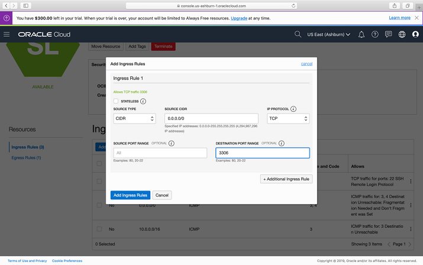
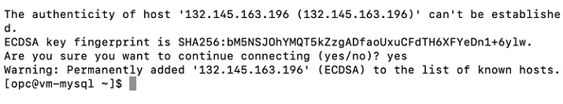
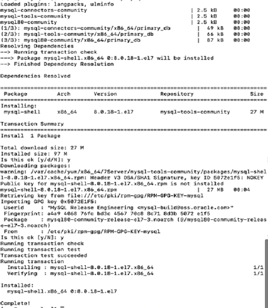
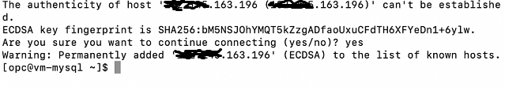
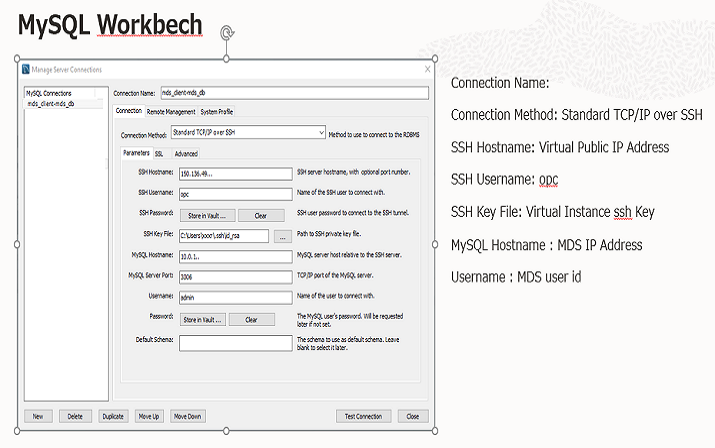

# Launch Your First MySQL Database Service System

## Introduction

In this Lab, you will learn how to launch a MySQL Database Service System on Oracle Cloud Infrastructure and connect to it using the Console.

Estimated Lab Time: 90 minutes

### About MySQL Database Service

MySQL Database Service is a fully-managed Oracle Cloud Infrastructure service, developed, managed, and supported by the MySQL team in Oracle.

### Objectives

In this lab, you will be guided through the following steps:

- Create Compartment
- Create Policy
- Create Virtual Cloud Network
- Create a MySQL DB System.
- Create Client Virtual Machine
- Configure Private Subnet for MySQL port
- Connect to MySQL Database
- Clean up the resources

### Prerequisites

- An Oracle Free Tier, Always Free, Paid or LiveLabs Cloud Account
- Some Experience with MySQL Shell

## **STEP 1**: Create Compartment

You must have an OCI tenancy subscribed to the US East (Ashburn) region and enough limits configured for your tenancy to create a MySQL DB System. Make sure to log-in to the Console as an Administrator.

1. On the Navigation Menu, under Governance and Administration, select Identity -> Compartments.

    

2. On Compartments Page, click on Create Compartment. 

    

   **Note**:  Two Compartments, named Oracle Account Name (root) and a compartment for PaaS, were automatically created by the Oracle Cloud. 

3. On Create Compartment, enter Name MDS_Sandbox, Description, select Parent Compartment, and click on Create Compartment.ompartment.

    
    
    
    
    **Completed Compartment** 
    

## **STEP 2**: Create Policy
1.	On the Navigation Menu, under Governance and Administration, select Identity -> Policies. 
    

2.	On Policies Page, under List Scope, select the Compartment(root) and click on the Create Policy button.
    

3.	On Create Policy , enter Name MDS_Policy, Description, select Root comaprtment, and click on Customize (Advanced) button. 
    
4. Enter the following required MySQL Database Service policies:

    a. Policy statement 1:

    ```
    Allow group Administrators to {COMPARTMENT_INSPECT} in tenancy
    ```

    b. Policy statement 2:

    ```
    Allow group Administrators to {VCN_READ, SUBNET_READ, SUBNET_ATTACH, SUBNET_DETACH} in tenancy
    ```

    \_<br>

    c. Policy statement 3:

    ```
    Allow group Administrators to manage mysql-family in tenancy
    ```
    Click the Create button

     

    
    **Completed Policy Creation**
    

## **STEP 3:** Create Virtual Cloud Network

1. On the Navigation Menu, under Core Infrastructure, select Networking -> Virtual Cloud Networks.
    

2. Click on Start VCN Wizard.
    

3. On Start VCN Wizard, select VCN with Internet Connectivity and click on Button Start VCN Wizard. 
    

4. On Create a VCN with Internet Connectivity, under Basic Information enter VCN Name **MDS_VCN** 

    select MDS_Sandbox Compartment.  Under Configure VCN and Subnets, add 10.0.0.0/16 on VCN CIDR Block, 10.0.0.0/24 on Public Subnet CIDR Block, and 10.0.1.0/24 on Private Subnet CIDR Block and click Next.
     

5. Under Review and Create, review the Oracle Virtual Cloud Network (VCN) and Subnets information and click on Create.
    

6. The Virtual Cloud Network creation is complete. 
    
    
    Here is the completed VCN Creation
    

## **STEP 4:** Create a MySQL DB System.

1. On the Navigation Menu, under Database, select MySQL -> DB Systems
    

2. On DB Systems in MDS_Sandbox Compartment, click on Create MySQL DB System.
    

3. On Create MySQL DB System, under DB System Information, select a Compartment.

4. Enter a Name **MDS_DB** for the DB System

5. Add a Description, select an Availability Domain, select a configuration for the MySQL Shape, and click Next.
    

6. On Create MySQL DB System, under Database Information, create the Administrator Credentials by entering Username (admin) and Password (Welcome1!), 

    Specify the network information selecting the Virtual Cloud Network and Subnet in the compartment and entering Hosting Name, and click Next.
    

7. On Backup Information, select Enable Automatic Backups
    Select the Backup Retention Period (1 day)
    
    Select Default Backup Window, and click on Create.
    

8. The New MySQL DB System will be ready to use after a few minutes. The state will be shown as Creating during the creation.
    

9. The state Active indicates that the DB System is ready to use. 

    Check the MySQL endpoint (Address) under Instances in the MySQL DB System Details page. 

    

## **STEP 5:** Create Client Virtual Machine

1. You will need a client machine to connect to your brand new MySQL database. To launch a Linux Compute instance, go to the Console, menu Compute, Instances
    

2. On Instances in MDS_Sandbox Compartment, click on Create Instance.
    

3. On Create Compute Instance enter **MDS_Client**  for the instance Name. 
    
4. Make sure MDS_Sandbox compartment is selected. 
 
5. Choose an operating system or image source (for this lab , select Oracle Linux), 
 
6. Edit Configure placement and hardware
   
   Select the Availability Domain, Instance Shape (select VM.Standard.E2.1.Micro).

    

   For VCN make sure MDS_VCN is selected, "Assign a public IP address" should be set to Yes.  
    


7. If you have not already created your SSH key, perform "Lab 1: Create Local SSH Key". 
    
   When you are done return to the next line (STEP 5: #8) .

8.  Add SSH Keys: Select CHOOSE SSH KEY FILES and browse to select the
    SSH public key, which was created earlier. (In this example it is id_rsa).

    

9. The New Virtual Machine will be ready to use after a few minutes. The state will be shown as Provisioning during the creation
    

10.	The state Running indicates that the Virtual Machine is ready to use. 

    Save the Public IP Address under Primary VNIC Information on the Instance page. 
    


## **STEP 6:** Configure Private Subnet for MySQL port
1.	In the Console, on the Navigation Menu, under Core Infrastructure, click on Networking -> Virtual Cloud Networks.
    
    
2.	On Virtual Cloud Networks MDS_Sandbox 
    Compartment  click on the VCN Name. 

    Note: On the example, the VCN Name is MDS_VCN. 
            

3.	On the Virtual Cloud Network Details page, under Resources, click on Security Lists (2).
        

4.	On Security Lists in <Compartment Name> Compartment, click on Security List for Private Subnet-MDS_VCN.

    


5.	On Security List for Private Subnet-MDS_VCN  page, under Ingress Rules, click on Add Ingress Rules.
    

6.	On Add Ingress Rule, add an Ingress Rule with Source CIDR 0.0.0.0/0 and Destination Port Name 3306 and click on Add Ingress Rule.
    

7.	On Security List for Private Subnet-MDS_VCN page, the new Ingress Rules will be shown under the Ingress Rules List
    


## **STEP 7:** Connect to MySQL Database

1. If you are a Linux or Mac user go to STEP 6: #2

   If you are a Windows user click Start menu from your windows machine for Git which should include the Git Bash command.

    Click on the Git Bash command. This will take you to the Git Bash terminal as shown below and continue to  STEP 6: #2. 
    

2.  From a terminal window on your local system. Connect to the Compute Instance with the SSH command. 

    Indicate the location of the private key you created earlier with MDS_Client. Enter the username opc and the Public IP Address.

    Note: The **MDS_Client**  shows the  Public IP Address as mentioned on Step 4: #9
    
    (Example: **ssh -i ~/.ssh/id_rsa opc@&132.145.170.990**)

    `$ ssh -i ~/.ssh/id_rsa opc@&<your_compute_instance_ip>;`

    

3. You will need a MySQL client tool to connect to your new MySQL DB System from your client machine. 

    Install MySQL release package  with the following command:

    `[opc@...]$ sudo yum -y install https://dev.mysql.com/get/mysql80-community-release-el7-3.noarch.rpm`

    

    Install MySQL Shell with the following command 

    `[opc@...]$ sudo yum install –y mysql-shell`
    
 
4. From your Compute instance, connect to MySQL using the MySQL Shell client tool. 
    
   The endpoint (IP Address) can be found in the MySQL DB System Details page, under the "Endpoints" resource. 

    

5.  Use the following command to connect to MySQL using the MySQL Shell client tool.

    (Example  **mysqlsh -uadmin -p -h132.145.170.990**)
    
    `[opc@...]$ mysqlsh -u<MDS_admin_username> -p -h<MDS_endpoint>`

    

6. (Optional) At this point, you can also use MySQL Workbench from your local machine to connect to the MySQL endpoint using your new Compute instance as a jump box. 

   In your pre installed MySQL Workbench, 
   
   configure a connection using the method "Standard TCP/IP over SSH" 
   
   and use the credentials of the Compute instance for SSH. 
   
   MySQL Workbench Configuration for MDS:

    

   MySQL Workbench Launched for MDS:

    

## **STEP 8:** Clean up the resources

1. Delete the MySQL DB System.
    

2. Terminate the Compute instance.
    

3. Delete the Virtual Cloud Network.
    

4. Delete the MySQL policies for the compartment.
    

## Learn More

* [Oracle Cloud Infrastructure MySQL Database Service Documentation ](https://docs.cloud.oracle.com/en-us/iaas/mysql-database)
* [MySQL Database Documentation](https://www.mysql.com)
## Acknowledgements
* **Author** -  Airton Lastori, MySQL Principal Product Manager, MySQL Product Management 
* **Contributors** -  Priscila Galvao, MySQL Solution Engineering
* **Last Updated By/Date** - Perside Foster, MySQL Solution Engineering, December 2020

## Need Help?
Please submit feedback or ask for help using our [MySQL Support Forum](https://community.oracle.com/tech/developers/categories/MySQL). Please click the **Log In** button and login using your Oracle Account. Click the **Ask A Question** button to the left to start a *New Discussion* or *Ask a Question*.  Please include your workshop name and lab name.  You can also include screenshots and attach files.  Engage directly with the author of the workshop.

If you do not have an Oracle Account, click [here](https://profile.oracle.com/myprofile/account/create-account.jspx) to create one.

