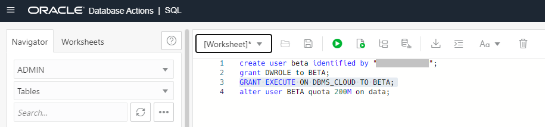
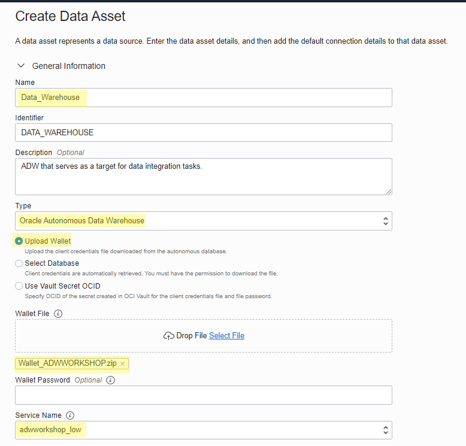

# Create your Object Storage and ADW Data assets

## Introduction

This lab walks you through the steps to create data assets for your source and target data sources using Object Storage as the source and Autonomous Data Warehouse as the target. In Oracle Cloud Infrastructure Data Integration, data assets represent data sources that you can use as sources and targets for your integration tasks. Data assets can be databases, flat files, and so on.

Estimated Lab Time: 15 minutes

## Objectives
In this lab, you will:
* Copy the Workspace OCID for further use in policies
* Create policies for ADW and Object Storage
* Create Object Storage data asset
* Create Autonomous Data Warehouse data asset

## Prerequisites
* An Oracle Cloud Account - Please view this workshop's LiveLabs landing page to see which environments are supported
* You completed Lab 0 (Setting up the Data Integration prerequisites in Oracle Cloud Infrastructure) and Lab 1 (Create an OCI Data Integration Workspace)

## **STEP 1:** Get the Workspace OCID

1. In the Oracle Cloud Infrastructure Console navigation menu, navigate to **Analytics & AI**. Under Big Data, click **Data Integration**.

2. From the Workspaces page, make sure that you are in the compartment you created for data integration (DI-compartment). The Workspace you created in Lab 1 should be displayed (DI-workspace).

3. Click the Actions menu (the three dots) for your Data Integration workspace and then select Copy OCID.

4. A notification saying "Workspace OCID copied" should be displayed at the top right of your screen. Paste your workspace OCID in a notepad, you will need it for later use in policies, as described in the next step of this lab.

## **STEP 2**: Create policies for ADW and Object Storage

Data Integration needs specific permissions to Oracle Object Storage to access metadata, and read and write data. Also working with Autonomous Databases in Data Integration uses Object Storage. So, you must create all the required Object Storage policies and an additional one. This lab step will guide you through the necessary policy statements that you need to add in order to perform the data integration tasks in this workshop.

1. In the Oracle Cloud Infrastructure Console navigation menu, navigate to **Identity & Security**, and then select **Policies** under Identity section.

2. Make sure that you are in your compartment for data integration (DI-compartment). In the list of policies, click on the **Policies-OCI-DI** that you created in Lab 1. You will add here the necessary policies for the Object Storage connection from OCI Data Integration.

3. Your policy details will be displayed. Click on **Edit Policy Statements**.

4. Your Edit Policy Statements screen is displayed and you can see your current policy statements. Check "Advanced" for Policy Builder.

5. You will add the necessary policy statements to enable access to Oracle Object Storage and to use Autonomous Data Warehouse as target for your data integration tasks. In this workshop, the Data Integration workspace and Object Storage data asset belong to the same tenancy so the following statements are needed. Copy the following statements and paste them in the Policy Builder box, each statement as a new line :
* For Object Storage
Allow group <group-name> to use object-family in compartment <compartment-name>
Allow any-user to use buckets in compartment <compartment-name> where ALL {request.principal.type = 'disworkspace', request.principal.id = '<workspace-ocid>'}
Allow any-user to manage objects in compartment <compartment-name> where ALL {request.principal.type = 'disworkspace', request.principal.id = '<workspace-ocid>'}

* For Autonomous Data Warehouse
Allow any-user to manage buckets in compartment <compartment-name> where ALL {request.principal.type = 'disworkspace', request.principal.id = '<workspace-ocid>', request.permission = 'PAR_MANAGE'}

6. Replace in the new policy statements:
- <compartment-name> with the name of your data integration Compartment (DI-compartment)
- <group-name> with the name of your data integration users Group (di-group)
- <workspace-ocid> with the workspace OCID you copied in Step 1 of this lab

7. Click **Save Changes**.

## **STEP 3**: Create Object Storage data asset
In this workshop, Oracle Object Storage serves as the source data asset for our data integration tasks. In this step you will create the Object Storage data asset in our data integration workspace.

1. In the Oracle Cloud Infrastructure Console navigation menu, navigate to **Analytics & AI**. Under Big Data, click **Data Integration**.

2. From the Workspaces page, make sure that you are in the compartment you created for data integration (DI-compartment). Click on your **Workspace** (DI-workspace).

3. On your workspace Home page, click Create Data Asset from the Quick Actions tile.

4. The Create Data Asset dialog box appears. Fill in the following:
* For **Name**, enter "Object_Storage" or any other meaningful name you want.
* For **Description**, you can optionally enter a description about your data asset.
* From the **Type** dropdown, select Oracle Object Storage.
* For **URL**, enter the URL for your Oracle Object Storage resource in the following format: "https://objectstorage.<region-identifier>.oraclecloud.com"
Note: You can find the list of region identifiers at the following link: https://docs.oracle.com/en-us/iaas/Content/General/Concepts/regions.htm .
For example, if you have your Object Storage in Frankfurt region, use "https://objectstorage.eu-frankfurt-1.oraclecloud.com"
* For **Tenant OCID**, enter the Oracle Cloud ID of your tenancy.
Note: To view your tenancy OCID in the Console, from the Profile menu click Tenancy:<your_tenancy_name>. You can find the tenancy OCID under Tenancy Information and copy it from there.

* For **Namespace**, the value should now be auto-populated after completing the preceding step. If not, enter the namespace for the Object Storage bucket, that you can find as in the picture below, section highlighted in yellow.
* Under **Default Connection** Information, you can optionally enter a name and description for the connection or leave the default one.

5. After you complete all the required fields, you can click **Test Connection** to ensure you've entered the data asset details correctly.
A success or failure message displays, indicating whether the test was successful or not. If the test fails, review your connection settings and try again.

6. Click Create.

## **STEP 4**: Prepare the Autonomous Data Warehouse data asset
In this workshop, Autonomous Data Warehouse serves as the target data asset for our data integration tasks. In this step you will create the ADW data asset in our data integration workspace.
In this step you will configure your target Autonomous Data Warehouse database in order to complete all the labs in this workshop.
1. From the OCI console menu, click **Oracle Database** and then select **Autonomous Data Warehouse** under Autonomous Database section.

2. The console shows the Autonomous Data Warehouse databases that exist. Make sure that you are in the compartment that we have created for our data integration resources (DI-compartment). Click on your ADW, the one you created in Lab 0 (ADW Workshop).

3. On your Autonomous Database Details, click Open Database Actions under Database Actions section.

4. In the Tools tab, click Open SQL Developer Web.

5. When prompted, log in with "admin" username and click Next.

6. A new window requiring the password will appear. Write your password for "admin" user and then click Sign In.

7. On Database Actions page, click on SQL tile under Development section.

8. The SQL worksheet opens. To create the BETA user, copy and paste the following code and run it:
create user beta identified by "<password>";
grant DWROLE to BETA;
GRANT EXECUTE ON DBMS_CLOUD TO BETA;
alter user BETA quota 200M on data;

Note : Ensure that you enter a password in place of <password>.

9. In the same SQL worksheet, run the following SQL statements to create the CUSTOMERS_TARGET table.
To-add

10. Refresh the browser and in the Navigator on the left, switch to the BETA schema to verify that your table was created successfully.

## **STEP 5**: Create Autonomous Data Warehouse data asset

1. In the Oracle Cloud Infrastructure Console navigation menu, navigate to **Analytics & AI**. Under Big Data, click **Data Integration**.

2. From the Workspaces page, make sure that you are in the compartment you created for data integration (DI-compartment). Click on your **Workspace** (DI-workspace).

3. From the workspace home landing page, click **Data Assets**.

4. You can see your current existing Data Assets, more specifically the Object Storage. To create a new Data Asset for ADW, click on **Create Data Asset**.

5. On the **Create Data Asset** page, for **General Information**, set the following:
* Name: Give a new for you ADW data asset (for example, "Data_Warehouse").
* Identifier: Auto-generated based on the value you enter for Name. You can change the auto-generated value if you wish to.
* Description: It is optional to give a description for your data asset.
* Type: Select Oracle Autonomous Data Warehouse.
* Choose the Upload Wallet option to provide the login credentials for the ADW.
* Wallet File: Drag and drop or browse to select your wallet file. See the process to download a file in Lab 0 - Step 4 of this workshop.
* You can optionally enter your wallet password.
* Service Name: Choose the low service of Autonomous Data Warehouse.
Note: For more information on predefined Database Service Names for Autonomous Data Warehouse, please see the following link https://docs.oracle.com/en/cloud/paas/autonomous-data-warehouse-cloud/cswgs/autonomous-connect-database-service-names.html#GUID-9747539B-FD46-44F1-8FF8-F5AC650F15BE .

6. In the **Connection** section, enter the following:
* Name: You can optionally rename the connection to "BETA connection"
*Description: : Optional (For example, "Connect with BETA user")
User Name: BETA
Password: The password you created for BETA.

7. After you complete all the required fields, you can click **Test Connection** to ensure you've entered the data asset details correctly.
A success or failure message displays, indicating whether the test was successful or not. If the test fails, review your connection settings and try again.

8. Click Create.

*At the conclusion of the lab add this statement:*
You may now [proceed to the next lab](#next).

## Learn More

*(optional - include links to docs, white papers, blogs, etc)*

* [URL text 1](http://docs.oracle.com)
* [URL text 2](http://docs.oracle.com)

## Acknowledgements
* **Author** - <Name, Title, Group>
* **Contributors** -  <Name, Group> -- optional
* **Last Updated By/Date** - <Name, Group, Month Year>
* **Workshop (or Lab) Expiry Date** - <Month Year> -- optional, use this when you are using a Pre-Authorized Request (PAR) URL to an object in Oracle Object Store.
