# Create a Data Flow, Data Integration task and Data Loader Task

## Introduction

This lab will walk you through the steps to create a Data Flow, Data Integration task and a Data Loader task in OCI Data Integration.

Estimated Lab Time: 45 minutes

## Objectives
In this lab, you will:
* Create an OCI Data Integration project
* Create a Data Flow
* Create an Integration task
* Create a Data Loader task

## Prerequisites
* An Oracle Cloud Account - Please view this workshop's LiveLabs landing page to see which environments are supported
* You completed Lab 0, Lab 1, Lab 2

## **STEP 1:** Create an OCI Data Integration project

In Oracle Cloud Infrastructure Data Integration, data flows and tasks can only be created in a project or folder.

1. In the Oracle Cloud Infrastructure Console navigation menu, navigate to **Analytics & AI**. Under Big Data, click **Data Integration**.

2. From the Workspaces page, make sure that you are in the compartment you created for data integration (DI-compartment). Click on your **Workspace** (DI-workspace).

3. On your workspace Home page, click Open tab (plus icon) in the tab bar, select Projects.

4. On the Projects page, click Create Project.

5. On the Create Project page, enter DI_Workshop for Name and an optional Description, and then click Save.

6. You are now in the Project Details page for DI_Workshop project.

## **STEP 2:** Create a Data Flow
A data flow is a logical diagram representing the flow of data from source data assets, such as a database or flat file, to target data assets, such as a data lake or data warehouse.
The flow of data from source to target can undergo a series of transformations to aggregate, cleanse, and shape the data. Data engineers and ETL developers can then analyze or gather insights and use that data to make impactful business decisions.

You will create a data flow to ingest data from two source files, containing customers (CUSTOMERS_JSON) and orders (REVENUE_CSV) information.
1. From the Project Details page for DI_Workshop project, click on **Data Flows** from the submenu.

2. Click Create Data Flow.

3. The data flow designer opens in a new tab. In the Properties panel, for Name, enter "Load Customers and Revenue Data", and click Save.

4. You will add your Source operator. You add source operators to identify the data entities to use for the data flow. From the Operators panel on the left, drag and drop a Source operator onto the canvas.

5. On the canvas, select SOURCE_1 operator. The Properties panel now displays the details for this operator.
In the Details tab, click Select next to each of the following options to make your selections:
- For Data Asset, select Object_Storage.
- For Connection, select Default Connection.
- For Schema, select your compartment and then your bucket. For the purposes of this tutorial, Object Storage serves as the source data asset, this is why you select your bucket here.

- For Data Entity, click on "Browse by name", select CUSTOMERS.json and then click JSON for the file type.

In the end, your details for the source operator should look like this:

6. When you complete your selections for SOURCE_1, the operator name becomes CUSTOMERS_JSON, reflecting your data entity selection. In the Identifier field, rename the source operator to **CUSTOMERS**.

7. You will now drag and drop onto the data flow canvas another source operator.

8.  On the canvas, select the new source operator. You will now fill  in the details for this new source, in Properties panel.
- For Data Asset, select Object_Storage.
- For Connection, select Default Connection.
- For Schema, select your compartment and then your bucket. For the purposes of this tutorial, Object Storage serves as the source data asset, this is why you select your bucket here.
- For Data Entity, click on "Browse by name", select REVENUE.csv and then click CSV  for the file type. Accept the default values for the remaining items.

In the end, your details for this new source operator should look like this:

9. When you complete your selections for SOURCE_2, the operator name becomes REVENUE_CSV, reflecting your data entity selection. In the Identifier field, rename the source operator to **REVENUE**.

10. While you still have the **REVENUE** operator selected, click on **Attributes** tab in Properties panel.
In the Attributes tab, you can view the data entity's attributes and apply exclude or rename rules to the attributes from their respective Actions icon (three dots). You can also use the filter icon on the Name or Type column to apply one or more filters on the attributes to be excluded.

11. While you still have the **REVENUE** operator selected, click on **Data** tab in Properties panel. In the Data tab, you can view a sampling of data from the source data entity. Scroll to the right and click on field REVENUE_CSV.CURRENCY to view the data profile.
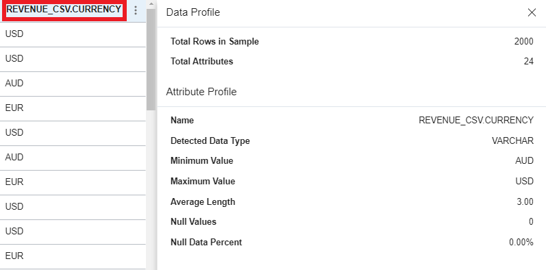

12. In the Validation tab, check for warnings or errors with the configuration of the source operators.

13. You will now filter your source data. The Filter operator produces a subset of data from an upstream operator based on a condition. From the Operators panel, drag and drop a Filter operator onto the canvas.

14. Connect REVENUE source operator to FILTER_1 operator:
- Place your cursor on REVENUE.
- Click the connector circle at the side of REVENUE.

- Drag and drop the connector to FILTER_1.

15. Click on FILTER_1 on the Data Flow Canvas.

16. In the Properties panel of FILTER_1, click Create for Filter Condition.

17. You will now add your filter condition:
- In the Create Filter Condition panel, enter "STA" in the Filter by name search field
- Double-click or drag and drop ORDER_STATUS to add it to the filter condition editor.

- In the condition editor, enter ='1-Booked', so your condition looks like the following:
FILTER_1.REVENUE_CSV.ORDER_STATUS='1-Booked'
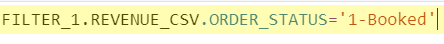
Note: To avoid issues with the quotes, do not copy and paste.
- Click Create.
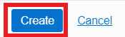

18. The details for FILTER_1 operator should now look like this:

19. From the Operators panel, drag and drop a new Filter operator onto the canvas after CUSTOMERS. Connect CUSTOMERS to FILTER_2.

20. In the Properties panel of FILTER_2, click Create for Filter Condition.

21. You will now add your filter condition for FILTER_2:
- In the Create Filter Condition panel, enter COU in the Filter by name search field.
- Double-click COUNTRY_CODE to add it to the Filter condition editor.
- Enter ='US', so your condition looks like the following: FILTER_2.CUSTOMERS_JSON.COUNTRY_CODE='US'
- Click Create.

22. The details for FILTER_2 operator should now look like this:

23. You will now work on the Data Transformation part of your Data Flow. In the Properties panel for FILTER_2, click the Data tab.
All data rows and attributes are displayed. You can use the vertical scrollbar to scroll the rows, and the horizontal scrollbar to scroll the attributes.

24. In the Filter by pattern search field, enter STATE*.
The number of attributes in the table are filtered. Only those attributes that match the pattern are displayed.

25. Click the transformations icon (three dots) for FILTER_2.CUSTOMERS_JSON.STATE_PROVINCE, and then select Change Case.
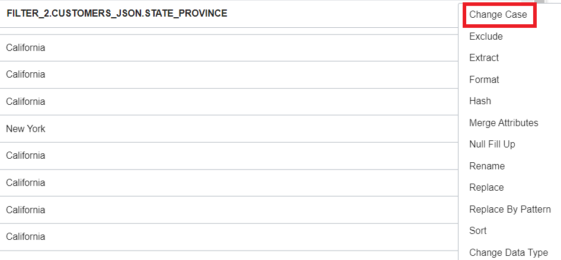

26. In the Change Case dialog:
- From the Type drop-down, select UPPER.
- Do not select the check box Keep Source Attributes.
- Leave the Name as-is.
- Click Apply.

27. An Expression operator is added to the data flow. In the Properties panel, the Details tab is now in focus, showing the expression details. You can see the generated expression, UPPER(EXPRESSION_1.CUSTOMERS_JSON.STATE_PROVINCE), in the Expressions table.

28. With the new Expression_1 operator selected in the data flow, in the Properties panel, change the name in Identifier to CHANGE_CASE.

29. Click the Data tab, and then use the horizontal scrollbar to scroll to the end. EXPRESSION_1.STATE_PROVINCE is added to the end of the dataset. You can preview the transformed data for EXPRESSION_1.STATE_PROVINCE in the Data tab.

30. From the Operators panel, drag and drop a new Expression operator onto the canvas after CHANGE_CASE. Connect CHANGE_CASE to the new Expression.

31. With EXPRESSION_2 selected, in the Properties panel, change the name in Identifier to CONCAT_FULL_NAME and then click Add Expression button in the Expressions table.

32. In the Add Expression panel:
- Rename the expression to FULLNAME in the Identifier field.
- Keep Data Type as VARCHAR.
- Set Length to 200.
- Under Expression Builder, switch from the Incoming list to the Functions list.
- In the filter by name search field, enter CON. Then locate CONCAT under String. You can either search for CONCAT in the functions list yourself, or enter CON to use the auto-complete functionality.
- Enter CONCAT(CONCAT(EXPRESSION_1.CUSTOMERS_JSON.FIRST_NAME, ' '),EXPRESSION_1.CUSTOMERS_JSON.LAST_NAME) in the expression box.
You can also highlight a function's placeholders and then double-click or drag and drop attributes from the Incoming list to create an expression.
- Click Add.

33. The new expression is now listed in the Expression operator. You can add as many expressions as you want.

34. After you apply filters and transformations, you can join the source data entities using a unique customer identifier, and then load the data into a target data entity.
To join the data from expression CONCAT_FULL_NAME with the data from FILTER_1, drag and drop a Join operator from the Operators panel onto the canvas next to CONCAT_FULL_NAME and FILTER_1. Connect CONCAT_FULL_NAME to JOIN_1 and then connect FILTER_1 to JOIN_1.

35. With JOIN_1 selected, in the Details tab of the Properties panel, click Create next to Join Condition.

36. In the Create Join Condition panel:
- Enter CUST in the filter by name search field.
- You want to join the entities using CUST_ID and CUST_KEY. In the editor, enter JOIN_1_1.CUSTOMERS_JSON.CUST_ID=JOIN_1_2.REVENUE_CSV.CUST_KEY.
- Click Create.

37. Your Join operator properties should now look like this:

38. From the Operators panel, drag and drop a Target operator onto the canvas. Connect JOIN_1 to TARGET_1.

39. With TARGET_1 selected on the canvas, in the Details tab of the Properties panel complete the fields accordingly:
- Leave the default value for Integration Strategy as Insert.
- Next, click Select for each of the following options to make your selections for a data entity:
* For Data Asset, select Data_Warehouse.
* For Connection, select Beta Connection.
* For Schema, select BETA.
* For Data Entity, select CUSTOMERS_TARGET.
* For Staging Location, select the Object Storage data asset, its default connection, and your compartment. Then for Schema, select the Object Storage bucket that you created while importing the sample data. Click Select.

40. The properties details for CUSTOMERS_TARGET operator should now look like this:

41. To review the Attributes mapping, click the Map tab. By default, all attributes are mapped by name. For example, CUST_ID from JOIN_1 maps to CUST_ID in the target data entity.

42. To manually map attributes that are not yet mapped, click the All drop-down in the Target attributes table, and then select Attributes not mapped. You can do the same in the Source attributes table (for the incoming fields).
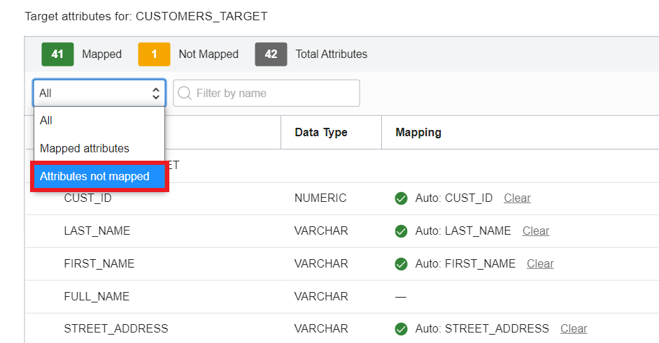

43. Now drag and drop FULLNAME under Source attributes to FULL_NAME under Target attributes. All attributes are now mapped.
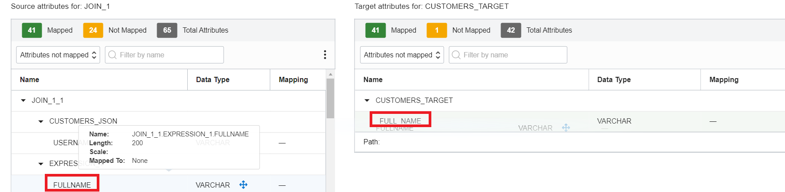

44. Click View Rules to filter and view the applied Rules.
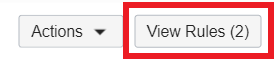

45. You have now completed the data flow. Click on Validate to see the validation output. There shouldn't be any warnings or errors.

46. To save the data flow, click Save.

## **STEP 3:** Create an Integration Task
Integration tasks in OCI Data Integration let you take your data flow design and choose the parameter values you want to use at runtime.
1. From your Workspace home page of OCI Data Integration, click Open tab (plus icon), and then select Projects.

2. On the Projects page, select the project you have been working on for this workshop, DI_Workshop.

3. On the DI_Workshop Project Details page, from the submenu, click Tasks.

4. Click Create Task, and then select Integration.

5. The Create Integration Task page opens in a new tab. On this page:
- Change the Name to "Load Customers Lab" and enter the optional Description if you wish to. The value in the Identifier field is auto-generated based on the value you enter for Name.
- In the Data Flow section, click Select. In the Select a Data Flow panel, select "Load Customers and Revenue Data", and then click Select.

- The Data Flow will be validated after the selection and the result should be displayed as "Successful".
- Click Save and Close.
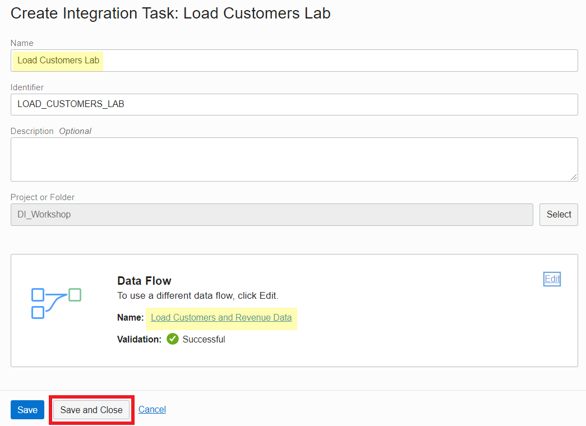

## **STEP 4:** Create a Data Loader task
A data loader task helps you load diverse data set into data lakes, data marts, and data warehouses. You can create a data loader task from the Console or by using the API, and configure transformations to cleanse and process data while it gets loaded into a target data asset. A data loader task takes a source data entity, applies transformations (optional), and then loads the transformed data into a new target data entity, or updates an existing data entity. A data loader task supports transformations at the metadata and data levels.

1. From your Workspace home page of OCI Data Integration, click Open tab (plus icon), and then select Projects.

2. On the Projects page, select the project you have been working on for this workshop, DI_Workshop.

3. On the DI_Workshop Project Details page, from the submenu, click Tasks.

4. Click Create Task, and then select Data Loader.

5. On the Create Data Loader Task page that pops up, for Name, enter "Load Revenue Data into Data Warehouse".

6. In the Source section, click Select.

7. In the Select Source page that pops up, select the following values:
* Data Asset: Object_Storage
* Connection: Default Connection
* Compartment: DI-compartment (the Compartment in which you have uploaded your REVENUE.CSV file)
* Schema: Your Object Storage bucket (DI-bucket)
* Data Entity: Click "Browse by Name" and then select REVENUE.csv
* File Type: Set to csv. Then leave the default settings as-is in all the remaining fields
* Click Select.

8. In the Configure Transformations section, click Configure.

9. The Configure Transformations panel opens, showing the metadata information of the data entity and its attributes. You can also view sample data in the Data tab.

10. Click Data to navigate to the Data tab, then locate and select SRC_ORDER_NUMBER.
A panel displays, showing the Data Profile and the Attribute Profile for SRC_ORDER_NUMBER. Null Data Percent for SRC_ORDER_NUMBER is at 100%.
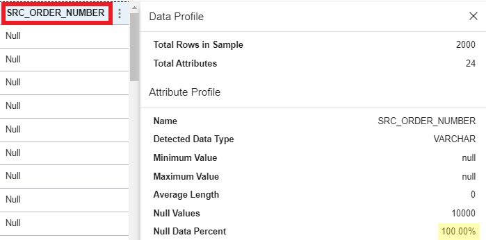

11. From the transformations icon (three dots) for SRC_ORDER_NUMBER, select Null Fill Up.
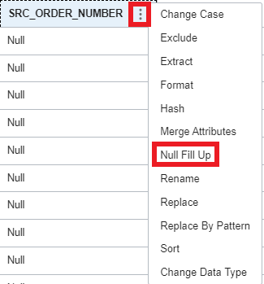

12. In the Null Fill Up dialog, do the following:
- Enter "Not Available" in the Replace by String field.
- Do not select Keep Source Attributes.
- Leave the Name as-is.
- Click Apply.

13. After the Data tab refreshes, use the horizontal scrollbar to scroll to the end of the dataset where the updated SRC_ORDER_NUMBER column is. Notice the values for SRC_ORDER_NUMBER have been replaced by the string you entered.

14. In the Data tab, look for attribute ORDER_DTIME2_TIMEZONE by scrolling to the right. Click on the transformation icon (three dots) for ORDER_DTIME2_TIMEZONE, and then select Rename.
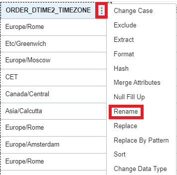

15. In the Rename dialog box, enter a new name for the attribute "ORDER_DTIME2_TIMEZONE". For this workshop, enter "ORDER_TIMEZONE" then click Apply.

16. Click the Transformations icon next to the data entity name.

17. You can review the list of transformations that are applied to the source dataset. If you would want to remove a transformation, you could click the X icon next to a transformed attribute name. For now close the Configure Transformations panel, click OK.

18. The number of transformation rules applied is shown in the Configure Transformations section.

19. In the Target section, select the Create New Entity check box, and then click Select.

20. In the Select Target page, select the following values:
- Data Asset: Data_Warehouse
- Connection: Beta Connection
- Schema: BETA
- Data Entity: Enter "REVENUE_TARGET" for the new entity you're going to create.
- Under Staging Location, select the Object_Storage data asset
- Select the default connection for Object Storage
- Select your DI compartment name
- Select your DI bucket.
- Click Select to complete selecting the target.

21. The Target section in the Data Loader task now displays your selections for the target. Click Save and Close.

## Learn More

*(optional - include links to docs, white papers, blogs, etc)*

* [URL text 1](http://docs.oracle.com)
* [URL text 2](http://docs.oracle.com)

## Acknowledgements
* **Author** - <Name, Title, Group>
* **Contributors** -  <Name, Group> -- optional
* **Last Updated By/Date** - <Name, Group, Month Year>
* **Workshop (or Lab) Expiry Date** - <Month Year> -- optional, use this when you are using a Pre-Authorized Request (PAR) URL to an object in Oracle Object Store.
