# Create an Application, a Pipeline and publish tasks

## Introduction

This lab will walk you through the steps to create an OCI Data Integration application, publish tasks and create a Data Integration pipeline which calls the published tasks.

*Estimated Lab Time*: 30 minutes

## Objectives
In this lab, you will:
* Create an Application
* Publish tasks to Application
* Creating a Pipeline which calls the published tasks
* Creating a Pipeline Task
* Publish the Pipeline Task

## Prerequisites
* Free Tier/ Paid Oracle Cloud Account
* All previous labs have been successfully completed

## **STEP 1:** Create an Application

In OCI Data Integration, an **Application** is a container for published tasks, data flows, and their dependencies. You can run published tasks in an Application for testing, or roll them out into production.
1. In the Oracle Cloud Infrastructure Console navigation menu, navigate to **Analytics & AI**. Under Big Data, click **Data Integration**.

2. From the Workspaces page, make sure that you are in the compartment you created for data integration (DI-compartment). Click on your **Workspace** (DI-workspace).

3. On the workspace Home page, in the **Quick Actions tile**, click **Create Application**.

4. On the Applications page, enter `Workshop Application` for **Name**. You can optionally give a short **Description** for your application, then click **Create**.

5. The **Application Details page** for `Workshop Application` opens in a new tab.

## **STEP 2:** Publish tasks to Application

In Oracle Cloud Infrastructure Data Integration, a **Task** is a design-time resource that specifies a set of actions to perform on data. You create tasks from a project details or folder details page. You then publish the tasks into an Application to test or roll out into production.

1. From the Application Details you are currently in, click on **Open tab** (plus icon) in the tab bar and select **Projects**.

2. Select your `DI_Workshop` project from the projects list.

3. In the **Tasks** list, **check all of the four tasks** you created in the previous lab (two Integration tasks, one Data Loader task and one SQL task).
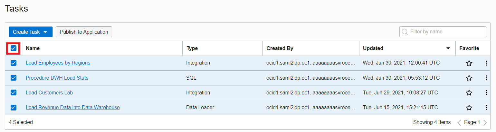

4. Click on **Publish to Application** button.
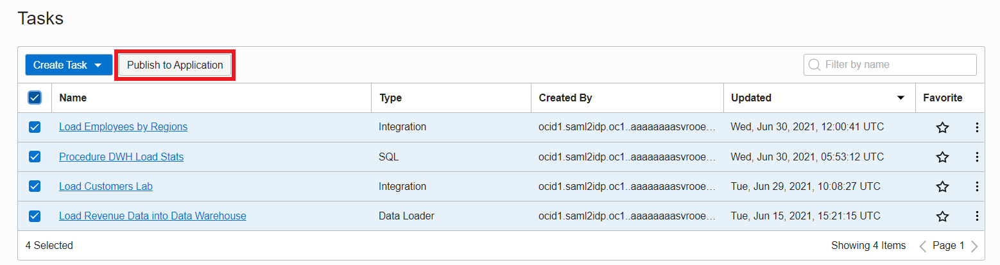

5. In the Publish to Application dialog, select `Workshop Application` and then click **Publish**.

*Note: You can modify the tasks or edit the data flow without impacting the published task. This enables you to test a version of your data flow, while working on some new changes.*

6. You can now go to your `Workshop Application` to see your published task. On your workspace Home page, click **Open tab** (plus icon) in the tab bar, select **Applications**.

8. Select you `Workshop Application` from the list of applications.

9. You can now see the **list of published tasks** inside your `Workshop Application`.
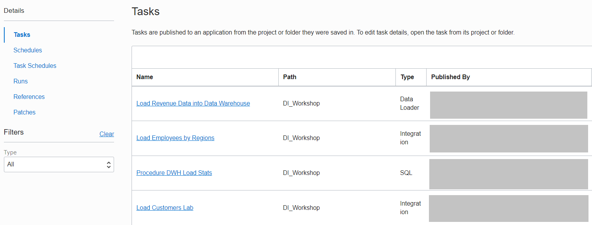

## **STEP 3:** Create a Pipeline
A **pipeline** is a set of tasks connected **in a sequence** or **in parallel** to facilitate data processing. It manages and orchestrates the execution of a set of related tasks and processes. The pipeline functionality in Oracle Cloud Infrastructure Data Integration helps write complex data pipelines using published tasks from any application, and you can add data loader, integration or SQL tasks. You can create pipelines quickly using a designer similar to the Data Flow designer.

1. From the OCI Data Integration Workspace home page, click on **Open tab** (plus icon) in the tab bar and select **Projects**.

2. Select your `DI_Workshop` project from the projects list.

3. Select **Pipelines** section under project Details tab.

4. Click on **Create Pipeline**.

5. The **canvas for designing the Pipeline** is now displayed. The **start and end operators** are already added by default to the canvas. You will start by renaming the Pipeline. Under Properties for the Pipeline, on Details section, currently the name is `New Pipeline`. **Rename** to `Load DWH Pipeline`.

6. Click on **Save** button. The title of the pipeline will change to the pipeline name you have just added.

7. To add a task, you will drag and drop a task operator from the Operators Panel. Start with the drag and drop of an **Integration task**. Connect **START\_1** operator to the **Integration task** you added.

8. In the Properties tab for **INTEGRATION\_TASK\_1**, Details section, click on Select to choose a published Integration task from your Application.

9. A page pops up with the selections for the **Integration Task**:
  - The **Compartment** with your OCI Data Integration resources is already selected
  - The **Workspace** you are currently working in is already selected
  - For **Application**, make sure you select the `Workshop Application`
  - Under **Integration Task**, check the `Load Customers Lab` task
  - Click **Select**.

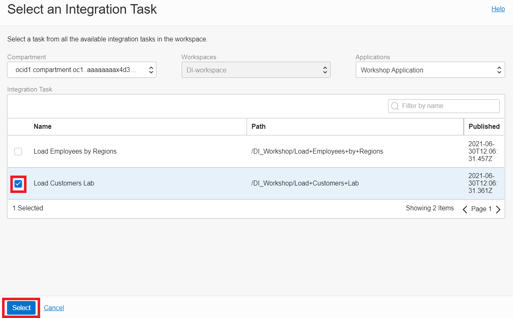

10. In the properties bar, the **Integration Task** `Load Customers Lab` is now selected. The Identifier has automatically changed with the name of Integration Task you selected. For Incoming Link Condition, leave the default option of **Always run**.

11. Drag and drop a **Data Loader** component into the Pipeline canvas. We want this task to be run **in parallel** with the Integration task we have just defined, so connect **START\_1** operator with the **Data Loader task operator**.

12. On the Properties tab for **DATA\_LOADER\_TASK\_1**, Details section, click on Select to choose a **published Data Loader task from your Application**.

13. A page pops up with the selections for the **Data Loader Task**:
  - The **Compartment** with your OCI Data Integration resources is already selected
  - The **Workspace** you are currently working in is already selected
  - For **Application**, make sure you select the `Workshop Application`
  - Under **Data Loader Task**, check the `Load Revenue Data into Data Warehouse` task
  - Click **Select**.

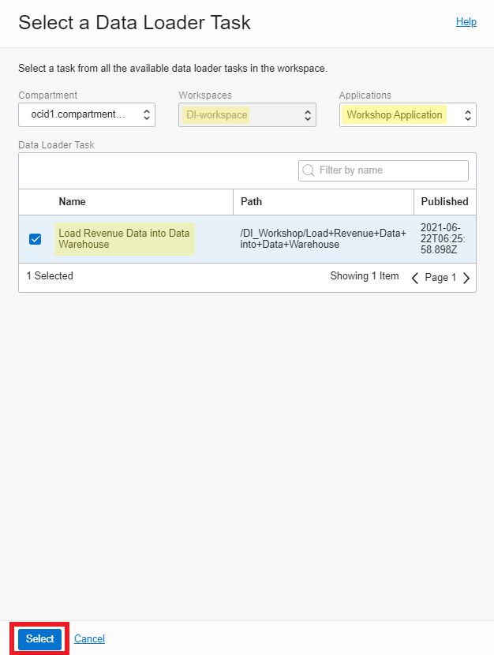

14. In the properties bar, the **Data Loader Task** `Load Revenue Data into Data Warehouse` is now selected. The Identifier has automatically changed with the name of Data Loader Task you selected. For Incoming Link Condition, leave the default option of **Always run**.

15. For these two tasks to run **in parallel**, you will now add a **merge operator**. Drag and drop the Merge operator on the canvas, then connect the two tasks (LOAD\_CUSTOMERS\_LAB and LOAD\_REVENUE\_DATA\_INTO_DATA\_WAREHOUSE) to the MERGE\_1 operator.

16. Under the Details tab of the **Properties** panel of the **MERGE\_1** operator, you can enter a name and optional description. Change the name to MERGE\_SUCCESS. For Merge Condition select the **All Success** option, which means that all parallel operations that are linked upstream must complete and succeed before the next downstream operation can proceed.

17. Drag and drop an **Integration task** to the pipeline canvas. Connect **MERGE\_1** operator to the Integration task you added.

18. On the Properties tab for **INTEGRATION\_TASK\_1**, Details section, click on Select to choose a published Integration task from your Application. This integration task will run **in sequence** after the successful run of the previous parallel tasks.

19. A page pops up with the selections for the **Integration Task**:
  - The **Compartment** with your OCI Data Integration resources is already selected
  - The **Workspace** you are currently working in is already selected
  - For **Application**, make sure you select the `Workshop Application`
  - Under **Integration Task**, check the `Load Employees by Regions` task
  - Click **Select**.

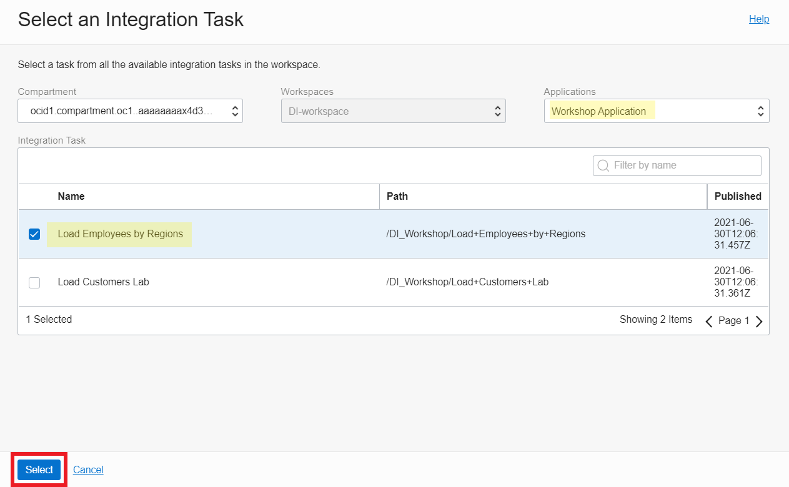

20. In the properties bar, the **Integration Task** `Load Employees by Regions` is now selected. The Identifier has automatically changed with the name of Integration Task you selected. For Incoming Link Condition, leave the default option of **Run on success of previous operator**.

21. Drag and drop a **SQL task** operator to the pipeline canvas. Connect the SQL task operator to the **LOAD\_EMPLOYEES\_BY\_REGIONS** integration task.
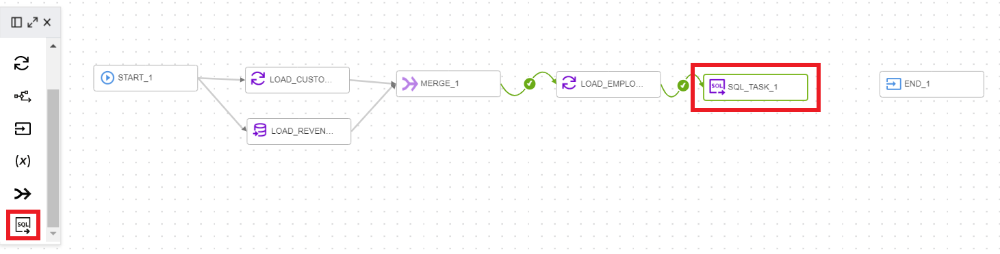

22. On the Properties tab for **SQL\_TASK\_1**, Details section, click on Select to choose a **published SQL task from your Application**.

23. A page pops up with the selections for the **SQL Task**:
  - The **Compartment** with your OCI Data Integration resources is already selected
  - The **Workspace** you are currently working in is already selected
  - For **Application**, make sure you select the `Workshop Application`
  - Under **SQL Task**, check the `Procedure DWH Load Stats` task
  - Click **Select**.

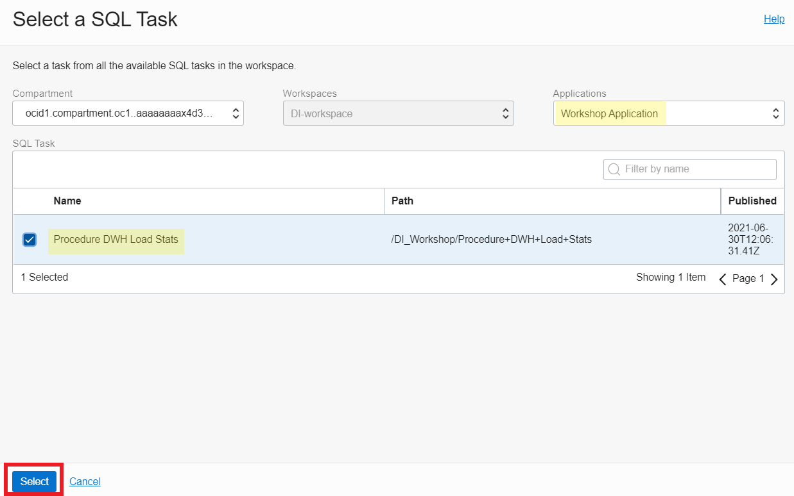

24. In the properties bar, the **SQL Task** `Procedure DWH Load Stats` is now selected. The Identifier has automatically changed with the name of SQL Task you selected. For Incoming Link Condition, leave the default option of **Run on success of previous operator**.

25. In the properties bar, click on **Configuration** tab and then on Configure where you have **Incoming Parameters Configured: 0/1**.
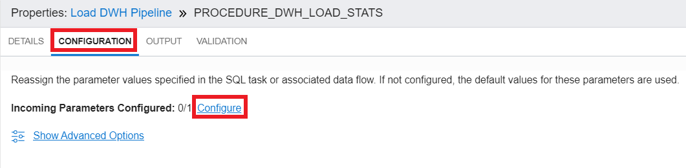

26. A window to **Configure Incoming Parameters** pops up. OCI Data Integration identified the **input parameter of your procedure** (OCIDI\_RESULT) from the database. Click on Configure for the **IN\_DI\_RESULT** parameter.
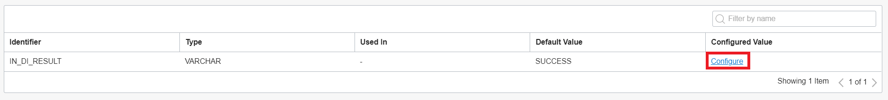

27. In the new windows that is displayed:
  - Leave the **Assign a value** option checked. This means you will override the default value of this parameter
  - In Default value box, write **SUCCESS**
  - Click **Done**.

28. The input parameter of the procedure now has a **Configured Value** - SUCCESS. Click **Configure**.

29. In **Configuration tab**, the **Incoming Parameters** are now displayed as configured **(1/1)**.
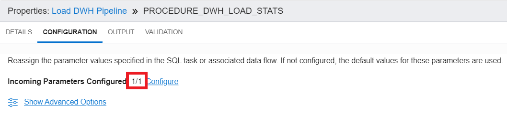

30.  Drag and drop a **SQL task operator** to the pipeline canvas. Connect the SQL task operator to the **LOAD\_EMPLOYEES\_BY\_REGIONS** integration task.

31. On the Properties tab for **SQL\_TASK\_1**, Details section, click on Select to choose a **published SQL task from your Application**.

32. A page pops up with the selections for the **SQL Task**:
  - The **Compartment** with your OCI Data Integration resources is already selected
  - The **Workspace** you are currently working in is already selected
  - For **Application**, make sure you select the `Workshop Application`
  - Under **Integration Task**, check the `Procedure DWH Load Stats` task
  - Click **Select**.

33. In the properties bar, the **SQL Task** `Procedure DWH Load Stats` is now selected. The Identifier has automatically changed with the name of SQL Task you selected. For Incoming Link Condition, leave the default option of **Run on failure of previous operator**. The arrow from the previous operator to the new SQL task operator will turn **red**.
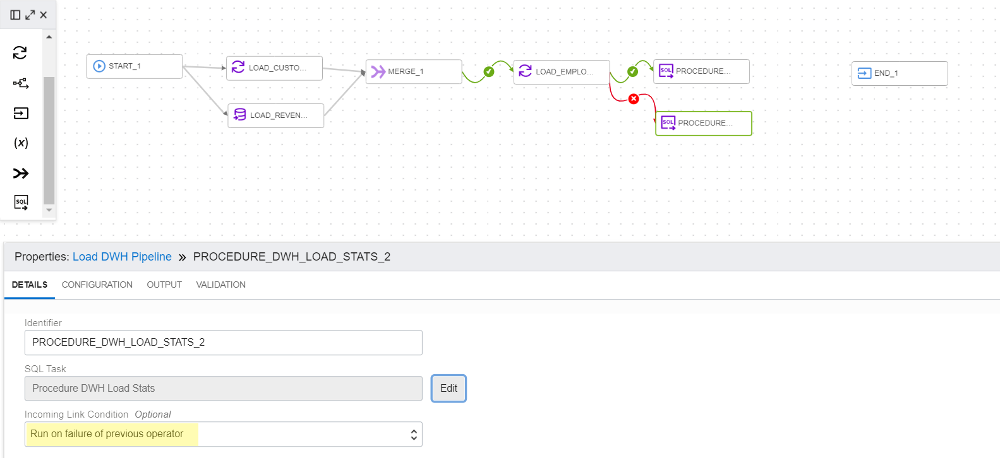

34. In the properties bar, click on **Configuration** tab and then on Configure where you have **Incoming Parameters Configured: 0/1**.

35. A window to **Configure Incoming Parameters** pops up. OCI Data Integration identified the **input parameter of the procedure** (OCIDI\_RESULT) from the database. Click on Configure for the **IN\_DI\_RESULT** parameter.

36. In the new windows that is displayed:
  - Leave the **Assign a value** option checked. This means you will **override the default value of this parameter**
  - In Default value box, write **ERROR**
  - Click **Done**.

37. The input parameter of the procedure now has a **Configured Value** - ERROR. Click **Configure.**
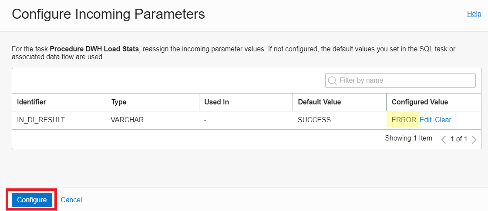

38. In **Configuration tab**, the **Incoming Parameters** are now displayed as configured **(1/1)**.

39. Connect the **two SQL tasks** to the **END\_1** operator. The final Pipeline should look like this:
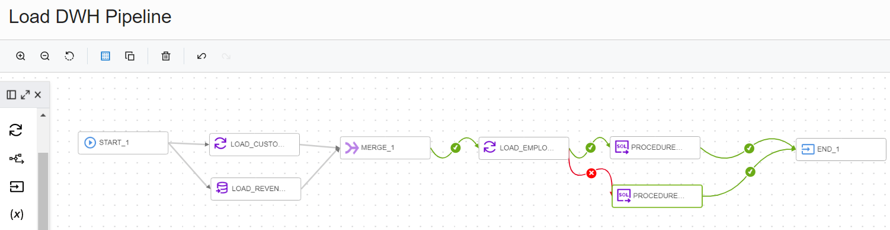

40. Click **Validate**. The result of the Global Validation should display no warnings and no errors.

41. Click on **Save and Close**.

## **STEP 4:** Create a Pipeline task
Pipeline tasks let you take your pipeline design and choose the parameter values you want to use at runtime.

1. On the `DI_Workshop` Project Details page, from the submenu, click **Tasks**.

2. Click **Create Task**, and then select **Pipeline**.

3. On the **Create Pipeline Task** page, enter:
  - For **Name** enter `Load DWH Pipeline Task`
  - **Description** (optional)
  - **Project** `DI_Workshop` is auto-populated because we're creating this task from project details page.

4. In the **Pipeline** section, click **Select**.

5. In the **Select a Pipeline** panel, select the `Load DWH Pipeline`	that this task will run. Then, click Select.

6. After selecting the pipeline, it will automatically be validated. When you see the Validation message as **Successful**, click on **Save and Close**.

## **STEP 5:** Publish the Pipeline Task

1. On the `DI_Workshop` Project Details page, from the submenu, click **Tasks**.

2. All tasks from the `DI_Workshop` project will be displayed. Click on the **Actions menu** (three dots) for the `Load DWH Pipeline Task`. Then, click on **Publish to Application**.
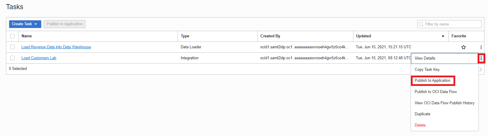

3. In the Publish to Application dialog, select the `Workshop Application` to publish to from the drop-down list. Then, click **Publish**.

**Congratulations!**  You may now [proceed to the next lab](#next).

## Learn More

* [Applications in OCI Data Integration](https://docs.oracle.com/en-us/iaas/data-integration/using/applications.htm)
* [Pipelines in OCI Data Integration](https://docs.oracle.com/en-us/iaas/data-integration/using/pipeline.htm)
* [Pipeline Tasks in OCI Data Integration](https://docs.oracle.com/en-us/iaas/data-integration/using/pipeline-tasks.htm)
* [Publishing Design Tasks in OCI Data Integration](https://docs.oracle.com/en-us/iaas/data-integration/using/publish-design-tasks.htm)

## Acknowledgements
* **Author** - Theodora Cristea
* **Contributors** -  Aditya Duvuri, Rohit Saha
* **Last Updated By/Date** - Theodora Cristea, July 2021
* **Workshop (or Lab) Expiry Date** - 
