# Setting up the Data Integration prerequisites in Oracle Cloud Infrastructure

## Introduction

This lab will walk you through the steps to set up the **prerequisites** before starting our Data Integration journey in Oracle Cloud Infrastructure.
When using your own paid tenancy, several of these tasks need to be performed by the Cloud Administrator for your tenancy. When using the Free Tier Oracle Cloud account, you are the Cloud Administrator so you can perform all of the steps below.

*Estimated Lab Time*: 1 hour

## Objectives

In this lab, you will:
* Create an OCI Compartment
* Create an OCI user and assign it to OCI Group
* Create a VCN and Subnet using VCN Wizard
* Provision an Autonomous Data Warehouse and download Wallet
* Create an Object Storage bucket and upload the sample data

## Prerequisites

* An Oracle Cloud Account - Please view this workshop's LiveLabs landing page to see which environments are supported
* Oracle Cloud Account credentials (Username, Password and Tenant)

## **STEP 1**: Create an OCI Compartment

A compartment is a collection of cloud assets. A Cloud Administrator can optionally create a compartment in your tenancy to help organize the Data Integration resources. In this lab, as a Cloud Administrator, you will create a new compartment that will group all of your Data Integration resources that you will use in the workshop.

1. **Log in to the Oracle Cloud Console** as a user with administrator privileges. On the Sign In page, select your tenancy, enter your username and password, and then click **Sign In**. The Oracle Cloud Console Home page is displayed.
    

2. From the OCI console menu, select **Identity & Security**. Under Identity section, click on **Compartments**.
    

3. In the Compartments page, we have the list of our existing compartments (if any). Click on the **Create Compartment** button to create a sub-compartment.
  

4. In the **Create Compartment** dialog box:
* Enter a **Name** for the compartment (Enter "DI-compartment" in the Name field)
* Enter a meaningful **Description** (Enter "Compartment for Data Integration resources" in the Description field)
* In the **Parent Compartment** drop-down list, select your parent compartment (root or any other existing compartment)
* Then click **Create Compartment**.
  

5. The Compartments page is displayed and the newly created compartment is shown in the list of available compartments. If you select your new **DI-compartment**, you can see the details for it.
  

## **STEP 2:** Create an OCI user and assign it to OCI Group

A Cloud Administrator has complete control over all of the resources in the tenancy; however, it's a good practice to delegate cluster administration tasks to one or more data integration administrators. To create a new data integration administrator for a service, a Cloud Administrator must create a user and then add that user to a DI administrators group. You create Identity and Access Management (IAM) groups with access privileges that are appropriate to your needs.

*Note*:
If you have created an *Oracle Cloud Account Free Tier* to do the workshop, you are already the *Administrator*. In this workshop, you will not login to OCI using the new `di-admin` user that you just created in this step; instead, you will continue your work using the same Cloud Administrator user that you used so far in this workshop. As a Cloud Administrator, you can create a one-time password for the new `di-admin` user. The user must change the password when they sign in to the Console. For detailed information on this topic, see [Managing User Credentials](https://docs.oracle.com/en-us/iaas/Content/Identity/Tasks/managingcredentials.htm) in the OCI documentation.*
In case you are a *Non-admin user*, you can ask your administrator to run this step and later on you can login using the `di-admin` user.

Create a new Administrator group that will have full access rights to the new di-compartment as follows:

1. From the OCI console menu, click **Identity & Security** and then select **Users** under Identity section.
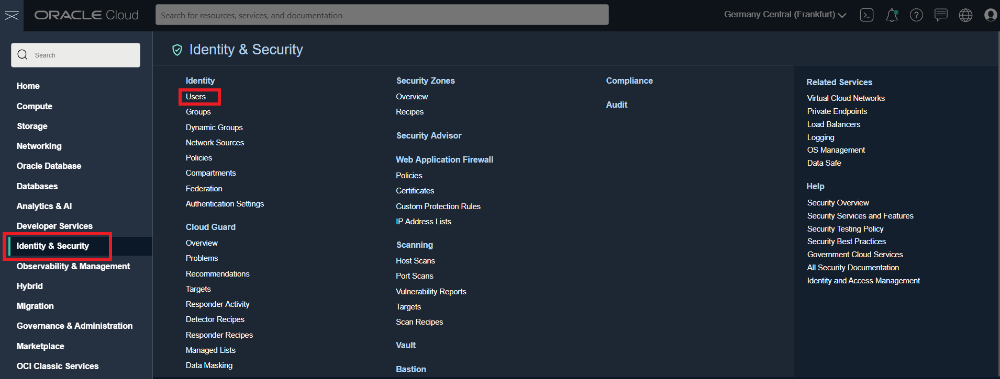

2. On the Users page, click **Create User**.
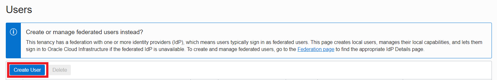

3. In the **Create User** dialog box:
* Select **IAM User** as the user type
* Enter `di-admin` in the **Name** field
* Enter `Workshop OCI Data Integration User` in the **Description** field
* Click **Create**.
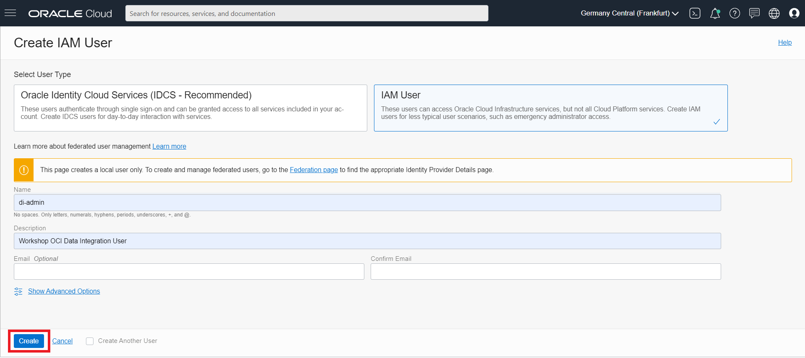

4. The **Users Details** page for the new `di-admin` user is displayed.

5. We will now create a Data Integration group for the data integration users. From the OCI console, on the Menu click **Identity & Security**, then select **Groups** under Identity section.
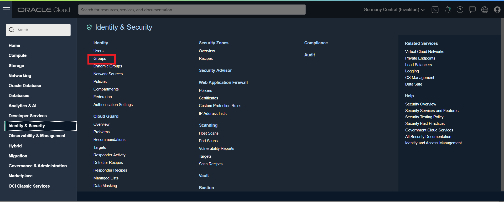

6. On the Groups page, click **Create Group**.
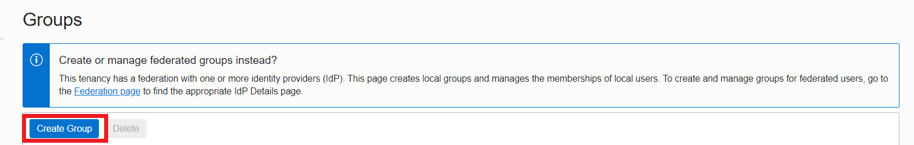

7. In the Create Group dialog box, enter a unique **Name** for your group, such as `di-group` and a meaningful **Description** (for example, `Group for data integration users`). Then, click **Create**.
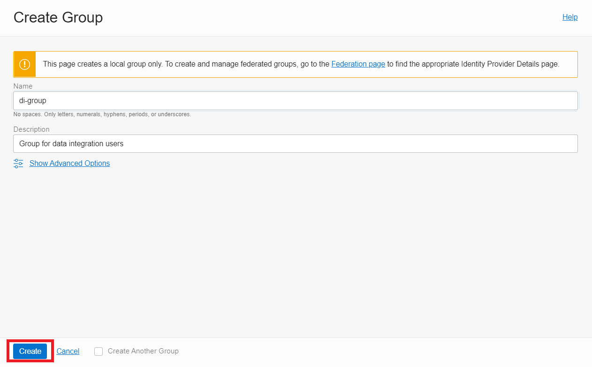

8. Your new group details are displayed.

9. In the Group Members section, click **Add User to Group**.

10. In the Add User to Group dialog box, select the `di-admin user` that you created earlier from the Users drop-down list, and then click **Add**.
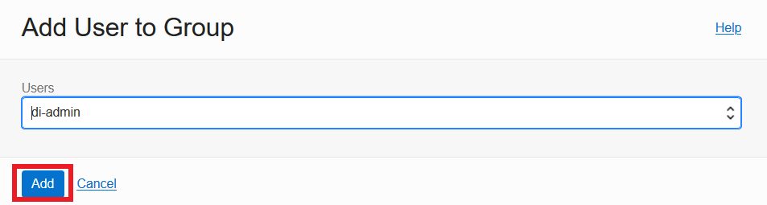

11. The **Group Details** page is re-displayed and the newly added user to this group is displayed in the Group Members section.

12. Now, you will create a **security policy** that gives your group permissions in the data integration **compartment** for workshop purposes. In this example, create a policy that gives permission to compartment `di-compartment` to members of group `di-group`.

a) On the OCI console menu click **Identity & Security**, and then select **Policies** under Identity section.

b) On the left side in the Policies page, make sure you have selected the `DI-compartment` in the **Compartment** drop-down list in the List Scope section. After you have selected the `DI-compartment`, click **Create Policy**.

c) Enter a unique **Name** for your policy (for example, `Policy-for-di-group`) and **Description** (for example, `Policies for data integration group`).

d) From the **Policy Builder**:
- Select `Compartment Management` as the **Policy use case**.
- Select `Let compartment admins manage the compartment` as the **Common policy templates**.
- For **Group** select your `di-group`
- For **Location**, select your data integration compartment (`DI-compartment`)
The policy statement that will appear will say `Allow group di-group to manage all-resources in compartment DI-compartment`
- Click **Create**

## **STEP 3:** Create a VCN and Subnet using VCN Wizard
1. From the OCI console menu, click **Networking** and then select **Virtual Cloud Networks**.

2. On the Virtual Cloud Networks page, make sure that you are in the Data Integration compartment we have created (`DI-compartment`). Then click **Start VCN Wizard**.

3. Select *VCN with Internet Connectivity*, and then click **Start VCN Wizard**.

4. The Configuration page of the wizard is displayed.
In the **Basic Information** section, provide the following information:
* **VCN Name**: Enter `OCI-VCN-WORKSHOP`
* **Compartment**: Select `DI-compartment`.

In the Configure VCN and Subnets section, provide the following information:

* **VCN CIDR BLOCK**: Leave the default 10.0.0.0/16.
* **PUBLIC SUBNET CIDR BLOCK**: Leave the default 10.0.0.0/24.
* **PRIVATE SUBNET CIDR BLOCK**: Leave the default 10.0.1.0/24.
In the DNS RESOLUTION section, select the `USE DNS HOSTNAMES IN THIS VCN` check box. This allows the use of host names instead of IP addresses for hosts to communicate with each other.

5. Click the **Next** button at the bottom left of the screen.

6. Review your settings to be sure they are correct and then click **Create** button.
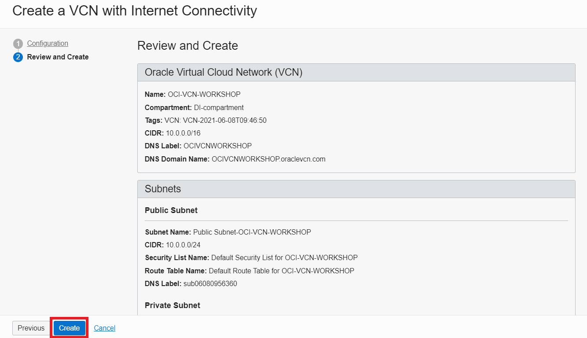

7. It will take a moment to create the VCN and a progress screen will keep you aware of the process. Once you see that the  VCN creation is complete, click on the **View Virtual Cloud Network** button at the bottom of the screen.

8. The **Virtual Cloud Network Details** page is displayed, and we can see that our VCN has a private and a public Subnet.

## **STEP 4:** Provision an Autonomous Data Warehouse and download Wallet
**Autonomous Data Warehouse** is a cloud data warehouse service that eliminates all the complexities of operating a data warehouse, securing data, and developing data-driven applications. It automates provisioning, configuring, securing, tuning, scaling, and backing up of the data warehouse. It includes tools for self-service data loading, data transformations, business models, automatic insights, and built-in converged database capabilities that enable simpler queries across multiple data types and machine learning analysis.

1. From the OCI console menu, click **Oracle Database** and then select **Autonomous Data Warehouse** under Autonomous Database section.

2. The console shows the Autonomous Data Warehouse databases that exist, if any. Make sure that you are in the compartment that we have created for our data integration resources (`DI-compartment`). Click on **Create Autonomous Database**.
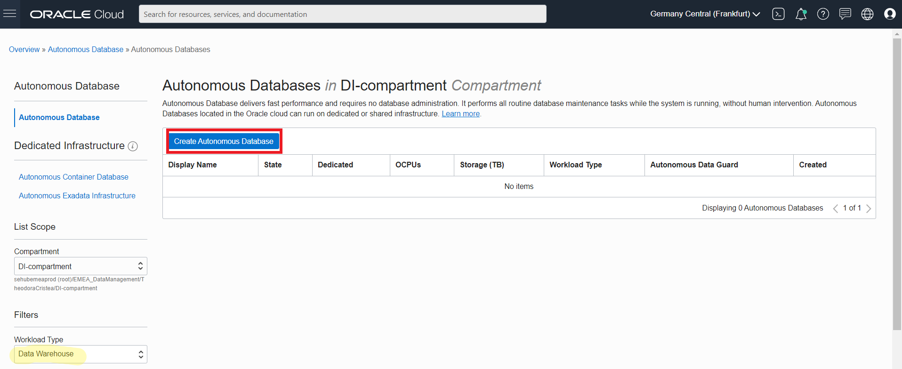

3. Provide basic information for the Autonomous Database:
* Choose a **Compartment** - Select a compartment for the database from the drop-down list (`I-compartment`)
* **Display Name** - Enter a meaningful name for the database for display purposes. For this lab, use `ADW Workshop`.
* **Database Name** - Use letters and numbers only, starting with a letter. Maximum length is 14 characters. (Underscores not initially supported.) For this lab, use `ADWWORKSHOP`.

4. Select **Data Warehouse** as the workload type.

5. Choose **Shared Infrastructure** as the deployment type.

6. Configure the database:
* **Always Free** - If your Cloud Account is an Always Free account, you can select this option to create an always free autonomous database. An always free database comes with 1 CPU and 20 GB of storage. For this lab, we recommend you leave Always Free unchecked.
* **Choose database version** - Select a database version from the available versions. For this lab, leave the default version 19c.
* **OCPU count** - Number of CPUs for your service. For this lab, specify 1 CPU.
* **Storage (TB)** - Select your storage capacity in terabytes. For this lab, specify 1 TB of storage.
* **Auto Scaling** - For this lab, keep auto scaling enabled, to allow the system to automatically use up to three times more CPU and IO resources to meet workload demand if needed.

7. Create **Administrator credentials**:
* Password and Confirm Password - Specify the password for `ADMIN` user of the service instance.

8. Choose **Network access**:
- For this lab, accept the default, **Allow secure access from everywhere**.

9. Choose a **license type**. For this lab, choose **License Included**. The two license types are:
- Bring Your Own License (BYOL) - Select this type when your organization has existing database licenses.
- License Included - Select this type when you want to subscribe to new database software licenses and the database cloud service.

10. Click **Create Autonomous Database**.

11. Your instance will begin provisioning. In a few minutes, the state will turn from Provisioning to **Available**. *At this point, your Autonomous Data Warehouse database is ready to use!*

12. Download the **Client Credentials (Wallet file)** for your Autonomous Data Warehouse.  This will be used to connect OCI Data Integrator to the Autonomous Data Warehouse. From the ADW details page you are currently in, click on **DB Connection** button.

13. On the Database Connection page, leave the default wallet type as Instance Wallet and then click on **Download Wallet**.

14. In the Download Wallet dialog, enter a wallet password in the **Password** field and confirm the password in the Confirm Password field. This password protects the downloaded Client Credentials wallet. Click **Download** to save the client security credentials zip file. By default the filename is: Wallet_databasename.zip. You can save this file as any filename you want.

## **STEP 5:** Create an Object Storage bucket and upload the sample data
The Oracle Cloud Infrastructure **Object Storage** service is an internet-scale, high-performance storage platform that offers reliable and cost-efficient data durability. The Object Storage service can store an unlimited amount of unstructured data of any content type, including analytic data and rich content, like images and videos. With Object Storage, you can safely and securely store or retrieve data directly from the internet or from within the cloud platform.

1. From the OCI console menu, click **Storage** and then select **Buckets** under Object Storage & Archive section.

2. From the Buckets page, make sure that you are in the Data Integration compartment we have created (`DI-compartment`) and then click on **Create Bucket**.

3. Fill out the Create Bucket dialog box:
* **Bucket Name**: Provide a name (`DI-bucket`)
* **Default Storage Tier**: `Standard`
* Leave the rest of the defaults and then click **Create**

4. You should now be able to see your new bucket in the **Buckets** page. Click on your bucket (`di-bucket`).

5. **Download** the datasets  *CUSTOMERS.json* and *REVENUE.xls* to your local directories.
 <!-- **Download** the dataset <a href="https://objectstorage.eu-frankfurt-1.oraclecloud.com/p/27PK5yRJp6ikvVdli-21D0vTwNywA0Q1aUPD2RQ7G8rtbPQwO2onh7TaZjfjawPj/n/odca/b/workshops-livelabs-do-not-delete/o/mds-di-ds-reef_life_survey_fish.csv" target="\_blank">Reef Life Survey Fish</a>. -->

6. You will upload our source files for our workshop data integration flows in this bucket. Click on **Upload** button under Objects.

7. Drop or select the files *CUSTOMERS.json* and *REVENUE.xls* from your local directories. Click **Upload**.
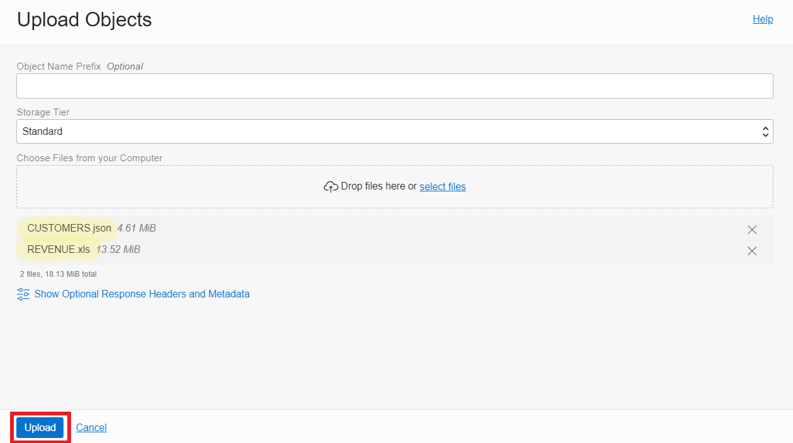

8. Once the files are uploaded, you will see the Finished state of the upload. Click **Close**.
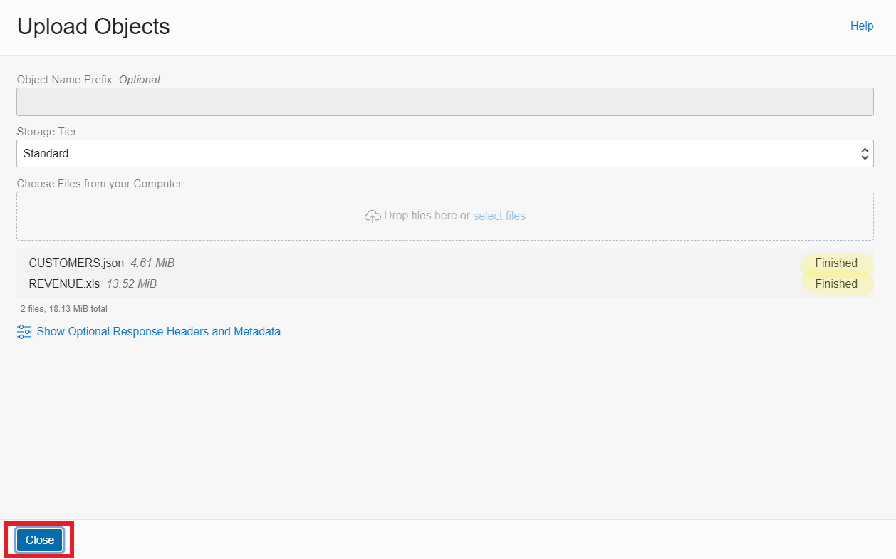

Congratulations! You may now [proceed to the next lab](#next).

## Learn More

* [Autonomous Data Warehouse documentation](https://docs.oracle.com/en/cloud/paas/autonomous-data-warehouse-cloud/index.html)
* [Object Storage](https://docs.oracle.com/en-us/iaas/Content/Object/Concepts/objectstorageoverview.htm)
* [OCI Identity and Access Management](https://docs.oracle.com/en-us/iaas/Content/Identity/Concepts/overview.htm_)

## Acknowledgements
* **Author** -
* **Contributors** -  
* **Last Updated By/Date** -
* **Workshop (or Lab) Expiry Date** - <Month Year> -- optional, use this when you are using a Pre-Authorized Request (PAR) URL to an object in Oracle Object Store.
