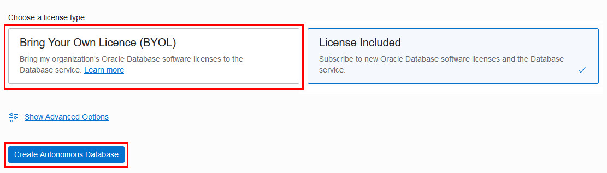
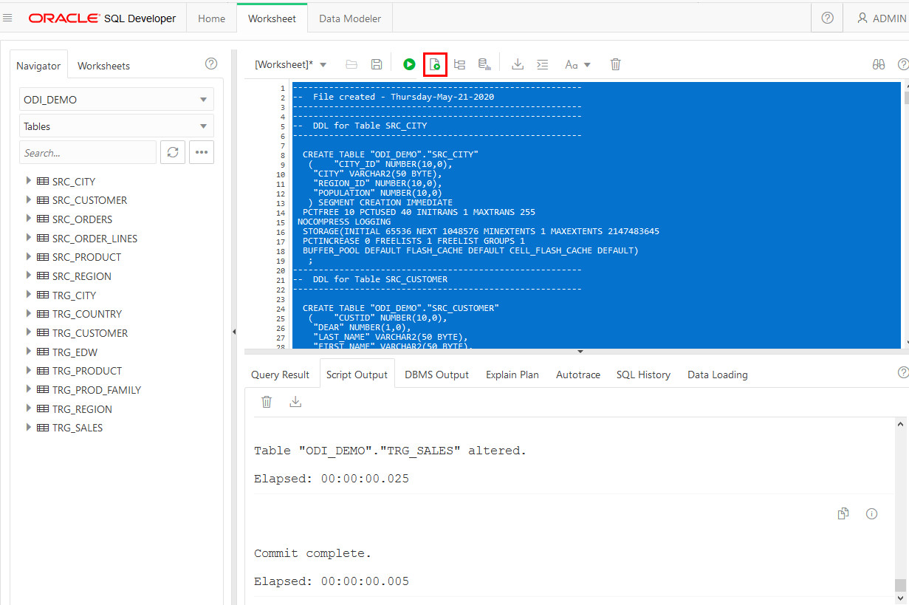

# Create an Autonomous Data Warehouse Database and Seed it with Data

## Introduction

This lab walks you through the steps to create an ADW database and run a script to populate it with data.

### Objectives

-   Learn how to provision a new Autonomous Data Warehouse database
-   Seed the database with data

### Lab Prerequisites

This lab assumes you have already completed the logging in and permission-setting labs in the Lab Contents menu on the right.

## **STEP 1**: Choosing ADW from the Services Menu

1. Login to the Oracle Cloud, as shown in the first lab.
2. Once you are logged in, you are taken to the cloud services dashboard where you can see all the services available to you. Click the navigation menu in the upper left to show top level navigation choices.

    __Note:__ You can also directly access your Autonomous Data Warehouse service in the __Quick Actions__ section of the dashboard.

    

3. Click **Autonomous Data Warehouse**.

    

## **STEP 2**: Creating the ADB instance

1. In the console, click **Create Autonomous Database** to start the instance creation process.

    

2.  This brings up the __Create Autonomous Database__ screen where you will specify the configuration of the instance.
3. Provide basic information for the autonomous database:

    - __Choose a compartment__ - For the convenience of this lab, select the root compartment. (In real production environments, you will want to install the database to a compartment other than root.)
    - __Display Name__ - Enter a memorable name for the database for display purposes. For this lab, append the display name **ADW** with letters from your name.
    - __Database Name__ - Use letters and numbers only, starting with a letter. Maximum length is 14 characters. (Underscores not initially supported.) For this lab, use the database name **ODILAB**.

    

4. Choose a workload type. Select the workload type for your database from the choices:

    - __Data Warehouse__ - For this lab, choose __Data Warehouse__ as the workload type.
    - __Transaction Processing__ - Alternately, you could have chosen Transaction Processing as the workload type.

    

5. Choose a deployment type. Select the deployment type for your database from the choices:

    - __Shared Infrastructure__ - For this lab, choose __Shared Infrastructure__ as the deployment type.
    - __Dedicated Infrastructure__ - Alternately, you could have chosen Dedicated Infrastructure as the workload type.

    

6. Configure the database:

    - __Always Free__ - For this lab, do not create an always free autonomous database.
    - __Choose database version__ - Select a database version from the available versions.
    - __OCPU count__ - Number of CPUs for your service. For this lab, specify __1 CPU__.
    - __Storage (TB)__ - Select your storage capacity in terabytes. For this lab, specify __1 TB__ of storage.
    - __Auto Scaling__ - Deselect auto scaling. In this workshop's labs, there will not be a need to allow the system to automatically use up to three times more CPU and IO resources to meet workload demand.
    - __New Database Preview__ - If a checkbox is available to preview a new database version, do __not__ select it.

    

7. Create administrator credentials:

    - __Password and Confirm Password__ - Specify the password for ADMIN user of the service instance, for example **Welcome12345**. The password must meet the following requirements:
    - The password must be between 12 and 30 characters long and must include at least one uppercase letter, one lowercase letter, and one numeric character.
    - The password cannot contain the username.
    - The password cannot contain the double quote (") character.
    - The password must be different from the last 4 passwords used.
    - The password must not be the same password that is set less than 24 hours ago.
    - Re-enter the password to confirm it. **Be sure to write down this password** so that you can specify it in the next lab where you create the ODI instance.

    
8. Choose network access:
    - For this lab, accept the default, "Allow secure access from everywhere".
    - If you want a private endpoint, to allow traffic only from the VCN you specify - where access to the database from all public IPs or VCNs is blocked, then select "Virtual cloud network" in the Choose network access area.
    - You can control and restrict access to your Autonomous Database by setting network access control lists (ACLs). You can select from 4 IP notation types: IP Address, CIDR Block, Virtual Cloud Network, Virtual Cloud Network OCID).

    

9. Choose a license type. For this lab, choose __Bring Your Own License (BYOL)__. The two license types are:

    - __Bring Your Own License (BYOL)__ - Select this type when your organization has existing database licenses.
    - __License Included__ - Select this type when you want to subscribe to new database software licenses and the database cloud service.

10. Click __Create Autonomous Database__.

    

11.  Your instance will begin provisioning. In a few minutes the state will turn from Provisioning to Available. At this point, your Autonomous Data Warehouse database is ready to use! Have a look at your instance's details here including its name, database version, CPU count and storage size.

    

## **STEP 3**: Populating ADW Database with Seed Data

1. Ensure your ADW instance is available.
  

2. Now you will populate you ADW database with data. In your ADW database's details page, click the **Tools** tab.

    

3. The Tools page provides you access to SQL Developer Web, Oracle Application Express, and Oracle ML User Administration. In the SQL Developer Web box, click **Open SQL Developer Web**.

    

4. A sign-in page opens for the SQL Developer Web. For this lab, simply use your database instance's default administrator username, **admin**, and the admin **Password** you specified when creating the database. Click **Sign in**.

    

5. SQL Developer Web opens on a worksheet tab. The first time you open the SQL Developer Web, a series of pop-up informational boxes introduce you to the main features.

    

6. Click on the link [User-Seed-SQL.ZIP](https://objectstorage.us-ashburn-1.oraclecloud.com/p/kll-WfYjB2AkMl75NnRtCKQOVedBTZzGuupQL3sXoiM/n/c4u03/b/labfiles/o/ODI_User-Seed-SQL.zip) to download a ZIP file containing 2 files:

    `User_setup.sql`

    `Seed_data.sql`   

7. Copy and paste the contents of *User_setup.sql* into the worksheet. Click the **Run Script** button to create the users *ODI\_DEMO* and *ODI\_STAGING*.     

    

8. Copy and paste the contents of *Seed_data.sql* into the worksheet. Click the **Run Script** button to create tables and populate with seed data:
       

## Want to Learn More?

Click [here](https://docs.oracle.com/en/cloud/paas/autonomous-data-warehouse-cloud/user/autonomous-workflow.html#GUID-5780368D-6D40-475C-8DEB-DBA14BA675C3) for documentation on the typical workflow for using Autonomous Data Warehouse.

## Acknowledgements

- **Author** - Mike Matthews, Senior Director, Data Quality Product Management
- **Adapted for Cloud by** - Rick Green, Principal Developer, Database User Assistance
- **Last Updated By/Date** - Rick Green, July 2020

## Need Help?
Please submit feedback or ask for help using our [LiveLabs Support Forum](https://community.oracle.com/tech/developers/categories/livelabsdiscussions). Please click the **Log In** button and login using your Oracle Account. Click the **Ask A Question** button to the left to start a *New Discussion* or *Ask a Question*.  Please include your workshop name and lab name.  You can also include screenshots and attach files.  Engage directly with the author of the workshop.

If you do not have an Oracle Account, click [here](https://profile.oracle.com/myprofile/account/create-account.jspx) to create one.
