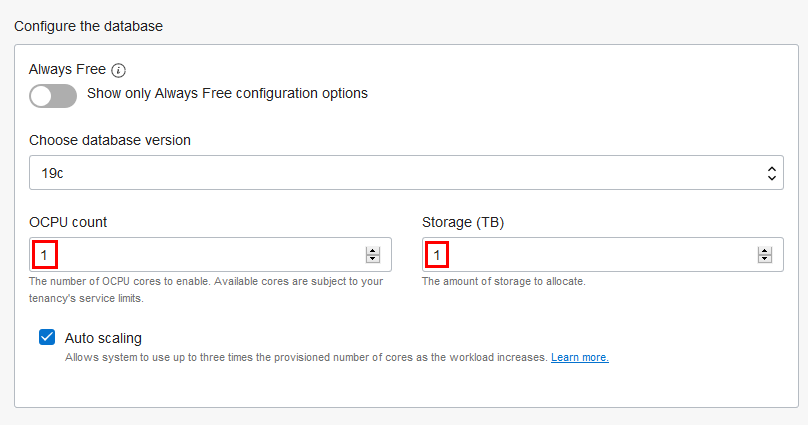
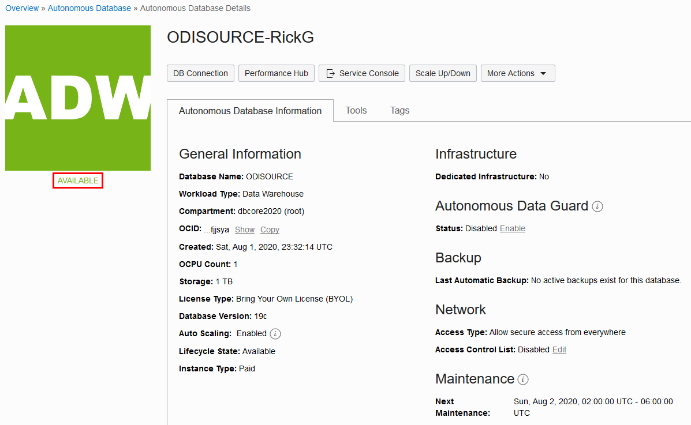
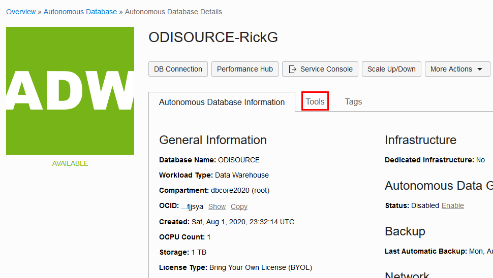
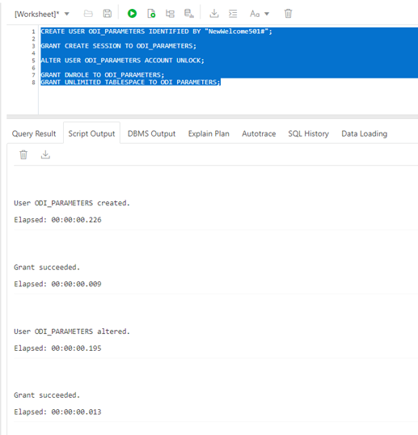
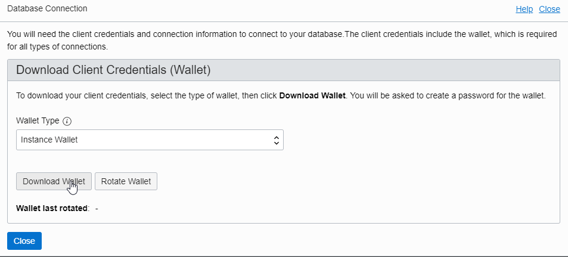

# Create an Autonomous Data Warehouse as an Additional Source

## Introduction

This lab walks you through the steps to create a second ADW database to serve as an additional source for ODI Web.

### Objectives

-   Create an additional Autonomous Data Warehouse database
-   Seed the database with data

### Lab Prerequisites

This lab assumes you have already completed the previous labs in the Lab Contents menu on the right.

## **STEP 1**: Choosing ADW from the Services Menu

1. Login to the Oracle Cloud, as you did in previous labs.
2. Click the navigation menu in the upper left to show top level navigation choices.

    

3. Click **Autonomous Data Warehouse**.

    

## **STEP 2**: Creating the ADB instance

1. In the console, click **Create Autonomous Database** to start creating your second ADW database.

    

2.  This brings up the __Create Autonomous Database__ screen where you will specify the configuration of the instance.
3. Provide basic information for the autonomous database:

    - __Choose a compartment__ - For the convenience of this lab, select the root compartment. (In real production environments, you will want to install the database to a compartment other than root.)
    - __Display Name__ - Enter a memorable name for the database for display purposes. For this lab, append the display name **ODISOURCE** with letters from your name.
    - __Database Name__ - Use letters and numbers only, starting with a letter. Maximum length is 14 characters. (Underscores not initially supported.) For this lab, use the database name **ODISOURCE**.

    

4. Choose a workload type. Select the workload type for your database from the choices:

    - __Data Warehouse__ - For this lab, choose __Data Warehouse__ as the workload type.
    - __Transaction Processing__ - Alternately, you could have chosen Transaction Processing as the workload type.

    

5. Choose a deployment type. Select the deployment type for your database from the choices:

    - __Shared Infrastructure__ - For this lab, choose __Shared Infrastructure__ as the deployment type.
    - __Dedicated Infrastructure__ - Alternately, you could have chosen Dedicated Infrastructure as the workload type.

    

6. Configure the database:

    - __Always Free__ - For this lab, do not create an always free autonomous database.
    - __Choose database version__ - Select a database version from the available versions.
    - __OCPU count__ - Number of CPUs for your service. For this lab, specify __1 CPUs__.
    - __Storage (TB)__ - Select your storage capacity in terabytes. For this lab, specify __1 TB__ of storage.
    - __Auto Scaling__ - For this lab, keep auto scaling enabled, to allow the system to automatically use up to three times more CPU and IO resources to meet workload demand.
    - __New Database Preview__ - If a checkbox is available to preview a new database version, do __not__ select it.

    

7. Create administrator credentials:

    - __Password and Confirm Password__ - Specify the password for ADMIN user of the service instance, for example **Welcome12345**. The password must meet the following requirements:
    - The password must be between 12 and 30 characters long and must include at least one uppercase letter, one lowercase letter, and one numeric character.
    - The password cannot contain the username.
    - The password cannot contain the double quote (") character.
    - The password must be different from the last 4 passwords used.
    - The password must not be the same password that is set less than 24 hours ago.
    - Re-enter the password to confirm it. **Make a note of this password** so that you can use it to log in later.

    
8. Choose network access:
    - For this lab, accept the default, "Allow secure access from everywhere".
    - If you want a private endpoint, to allow traffic only from the VCN you specify - where access to the database from all public IPs or VCNs is blocked, then select "Virtual cloud network" in the Choose network access area.
    - You can control and restrict access to your Autonomous Database by setting network access control lists (ACLs). You can select from 4 IP notation types: IP Address, CIDR Block, Virtual Cloud Network, Virtual Cloud Network OCID).

    

9. Choose a license type. For this lab, choose __Bring Your Own License (BYOL)__. The two license types are:

    - __Bring Your Own License (BYOL)__ - Select this type when your organization has existing database licenses.
    - __License Included__ - Select this type when you want to subscribe to new database software licenses and the database cloud service.

10. Click __Create Autonomous Database__.

    

11.  Your instance will begin provisioning. In a few minutes the state will turn from Provisioning to Available. At this point, your Autonomous Data Warehouse database is ready to use! Have a look at your instance's details here including its name, database version, CPU count and storage size.

## **STEP 3**: Populating ADW Database with Seed Data

1. Ensure your ADW instance is available:

    

2. In your ADW database's details page, click the **Tools** tab.

    

3. The Tools page provides you access to SQL Developer Web, Oracle Application Express, and Oracle ML User Administration. In the SQL Developer Web box, click **Open SQL Developer Web**.

    

4. A sign-in page opens for the SQL Developer Web. For this lab, simply use your ODISOURCE database instance's default administrator account, **Username - admin**, and with the admin **Password** you specified when you just created the database. Click **Sign in**.

    

5. SQL Developer Web opens on a worksheet tab.

    

6. Click on the link [user-setup-parameters.sql](./files/user-setup-parameters.sql) to download the file **user-setup-parameters.sql**.   

7. Open this file and copy the contents of **user-setup-parameters.sql** into the worksheet. Select all of the text and run it to create the user *ODI\_PARAMETERS*.

    

9. Click on the link [seed-data-parameters.sql](./files/seed-data-parameters.sql) to download the file **seed-data-parameters.sql**.

10. Open this file and copy the contents of **seed-data-parameters.sql** into the worksheet. Select all of the text and run it to populate the user *ODI\_PARAMETERS* with tables *SRC\_SALES\_PERSON* and *SRC\_AGE_GROUP*.

      

11. You now need to download the wallet for this new source database as you will need it in the next lab of this workshop. Click the **DB Connection** button. Click the **Download Wallet** button. Create a password for the wallet (for example,  **Welcome12345**) and note it down. Also note down the location where you downloaded the wallet. Click the **Close** button to close the dialog.

      

## Acknowledgements

- **Author** - Mike Matthews, Senior Director, Data Quality Product Management
- **Adapted for Cloud by** - Rick Green, Principal Developer, Database User Assistance
- **Last Updated By/Date** - Rick Green, July 2020

See an issue?  Please open up a request [here](https://github.com/oracle/learning-library/issues).   Please include the workshop name and lab in your request.
