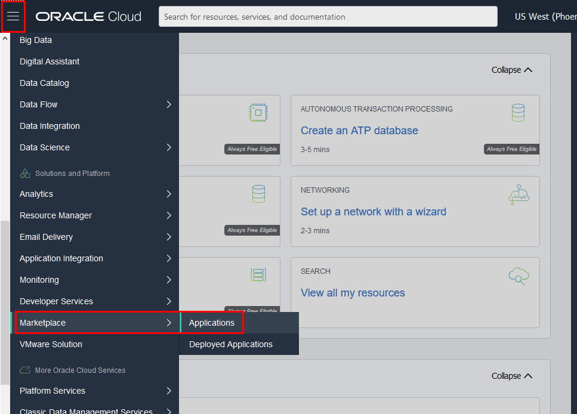
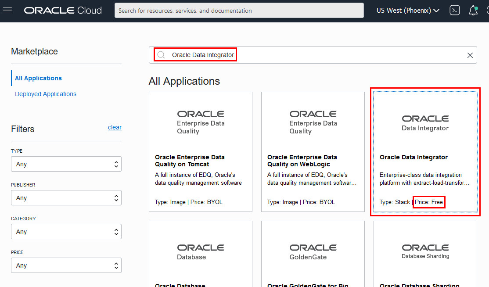
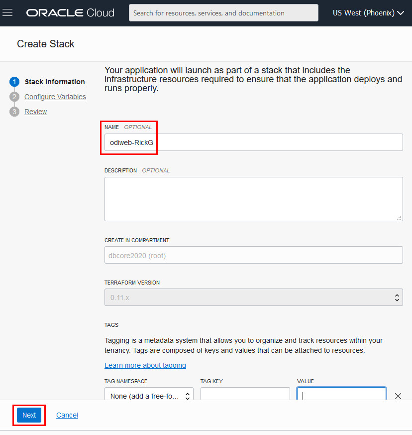
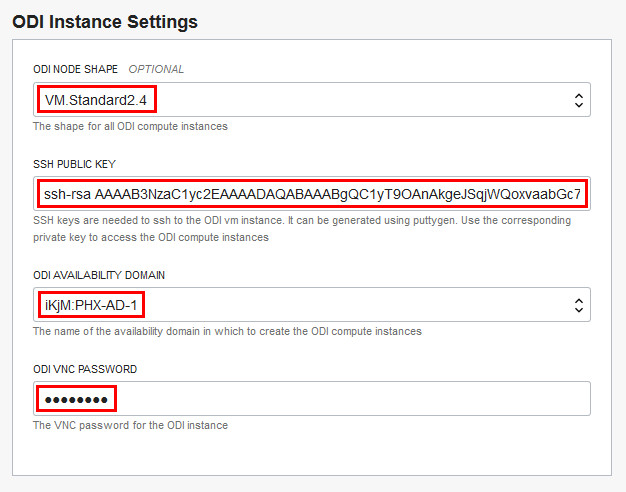
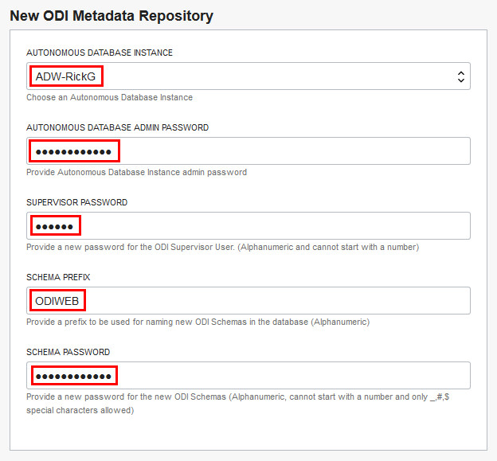
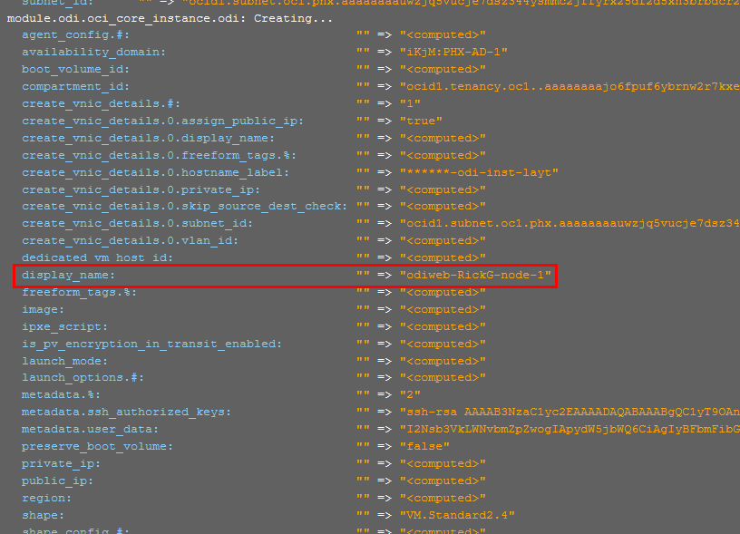
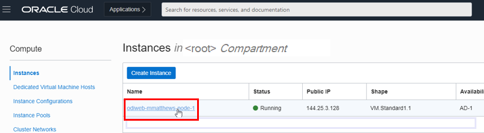
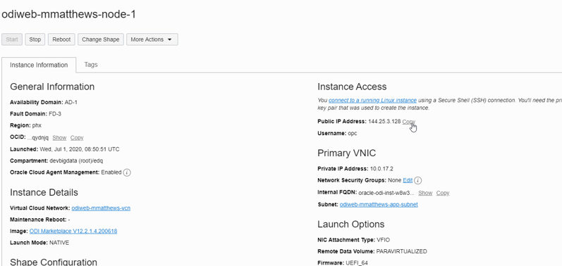
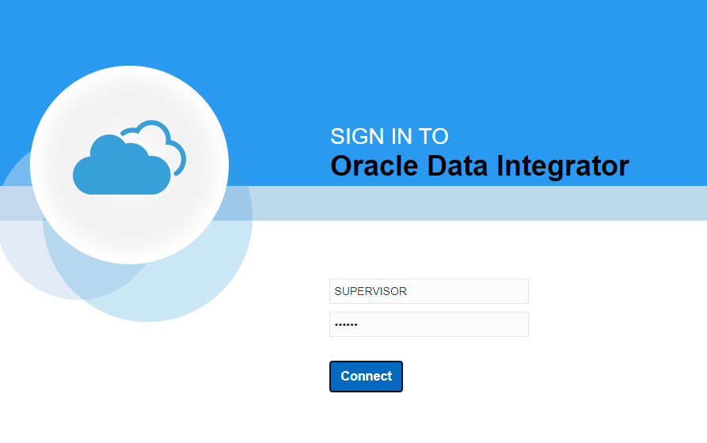

# Setup - Create an ODI Instance from Marketplace #

## Introduction
This lab will show you how to create an ODI instance from a Marketplace image and configure ODI Studio.

### Objectives

-   Select Oracle Data Integrator from OCI Marketplace
-   Configure the Stack
-   Create the ODI Instance
-   Confirm successful ODI instance creation using browser to access ODI Web Studio

### Lab Prerequisites

This lab assumes you have already completed the previous labs in the Lab Contents menu on the right.

## STEP 1: Create an ODI instance from OCI Marketplace

1. Login to the OCI Console and choose **Marketplace -> Applications**.

    

2. OCI Marketplace hosts many applications ready to be deployed.
   Search for “Oracle Data Integrator”.

    

   If there is more than one listing,  click the one that shows **Price: Free**.

3. A page displays describing the ODI product overview and usage instructions. There is also a link to a detailed user guide for deploying the marketplace image.

    Make sure you have chosen the correct **COMPARTMENT** - the root compartment in which you created your ADW database instance.

    Select the version **ODI Web v12.2.1.4.200618a** which has been verified for this training material.
    **Note:** Please do not pick any other version. This version has been tested for the labs.

    Click the checkbox to accept the Terms & Conditions and click **Launch Stack**.

    

4. The **Create Stack** wizard appears. Add your initials to the **Name** field so you can easily identify your Instance, for example ‘odiweb-[yourname]’. Click **Next**.

        

5. The wizard's **General Settings** section appears. For Networking Options, choose **New networking components will be created**. (**Note**: Normally, aside from this lab environment, the best practice will be to use an existing VCN in a real production environment). For ODI Repository Location, choose  **Create a new ODI Repository in an Autonomous Database**, which will create a new ODI repository schema in your ADW database. For Resource Display Name Prefix, use an identifier to help you recognize your stack later, such as 'odiweb-[yourname]'. Target compartment should be the root compartment.

      

6. Scroll down to **ODI Instance Settings** and specify:

    **ODI Node Shape**: VM.Standard.2.2

    **SSH Public Key**: Click <a href="./files/pubkey.pub" target="\_blank">this link</a> to download and open the **pubkey.pub** public key file and copy/paste its entire content into the SSH Public Key field (it should be only ONE line).

    **ODI Availability Domain**: Choose a domain based on your last name (A-J -> 1, K - M -> 2, N-Z -> 3)

    **ODI VNC Password**: Create and remember a password to access your VNC environment, such as 'welcome1'. (This password will not be accessible again and is required to access the VNC from which to run ODI Studio.)

      

7. Scroll down to **New ODI Metadata Repository** and specify:

    **Autonomous Database Instance**: Select the ADW instance you created previously.

    **Note**: If your ADW instance does not appear, check that in the previous lab on permissions, you have enabled the permissions to inspect the tenancy for autonomous databases.

    **Autonomous Database Admin Password**: Specify the ADMIN password you created when you created this ADW instance.

    **Note**: Be sure to copy the ADW database ADMIN's password correctly; this field does not auto-check.

    **Supervisor Password**: Specify a password for the SUPERVISOR user for the ODI repository, such as 'oracle' and make a note of it - you will use it to log in to ODI Web.

    **Schema Prefix**: Specify a schema prefix for your ODI repository schemas, such as 'ODIWEB'.

    **Schema Password**: Specify a schema password, such as 'Welcome12345'.

    

8. Click **NEXT**. In the next page, check that the options look right. Then click **Create** to create the instance.

9. The Stack will get created. It will take approximately 5 minutes for the ODI instance to create.

    

10. You can check the progress by scrolling down to the Logs section. The status will change from **IN PROGRESS** to **SUCCEEDED**. Your instance will have your initials as a Prefix (provided you added them as instructed).

    

## STEP 2: Test the Environment

1. Go to **Compute > Instances** to check for the new instance created by the stack.

    

2. Look for your ODI Web instance by display name and click on it.

         

3. Copy the public IP address. This will be used to access the ODI instance. **Note:** Even if the instance status shows 'running', it takes approximately 20 minutes before you can connect to the ODI web interface.

         

4. Go to a web browser and paste the public IP address and append it with *:9999/odi-web-studio/*

           

5. Bookmark this location. It will take some time (15 to 20 minutes) before the web studio becomes available. You can retry until you get this screen:

          

6. Log in as SUPERVISOR with the password you specified for this user. You will then see a screen with 4 tiles, like this:

          

Congratulations!  Now you have the environment to run the ODI labs.   

## Acknowledgements

- **Author** - Mike Matthews, Senior Director, Data Quality Product Management
- **Adapted for Cloud by** - Rick Green, Principal Developer, Database User Assistance
- **Last Updated By/Date** - Rick Green, August 2020

See an issue?  Please open up a request [here](https://github.com/oracle/learning-library/issues).   Please include the workshop name and lab in your request.
