# Create a Data Flow Using ODI Web

## Introduction

This lab walks you through the steps to create a data flow and load data into the autonomous database.

### Objectives

-   Launch ODI Web
-   Create a data flow in ODI Web
-   Run the data flow to load data into the ADW database

### Lab Prerequisites

This lab assumes you have already completed the previous labs in the Lab Contents menu on the right.

## **STEP 1**: Log In to ODI Web

1. Use the bookmark you created earlier to launch ODI Web.
2. Log in as SUPERVISOR with the password you specified for this user.

    
        

## **STEP 2**: Create a Project

1. Create a project for your data flow. Click **Data Flows**. Click the **+** (plus) button to create a new project.

    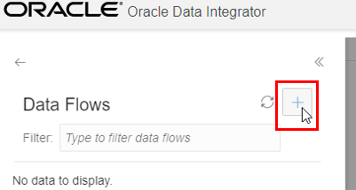

2.  Name the project **Lab**. Click **OK**.

    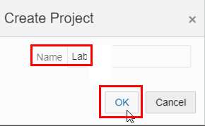

## **STEP 3**: Create a Data Flow

1. Click your Lab project to expand it. You will see that a **DefaultFolder** has been created. Click the 3-dot ellipsis menu to the right of this folder and select **Create Data Flow**.

  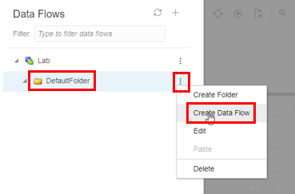

2. Name the data flow **LabDataFlow**. Click **OK**.

    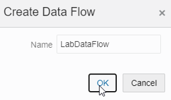

3. This brings up an empty data flow editor. Click the **Save** button – you will come back to edit the data flow.

    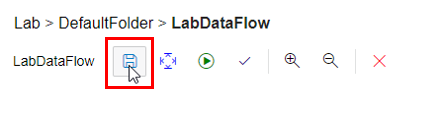

## **STEP 4**: Connect to Your Additional ADW source

1. You will see on the left side a list of the Autonomous Databases that were available in your tenancy when your ODI Web instance was provisioned. The provisioning process for ODI Web sets these up automatically. However, because you have just added a new ADW instance, this will not be set up. Click the **+** (plus) button to the right of Data Entities to create a new connection.

    

2. Select the **Oracle** connection type.

    

3. Name the connection **ODISOURCE**. Select the option to **Use Credential File**. Upload the wallet zip file from the folder where you downloaded it in the previous lab.

    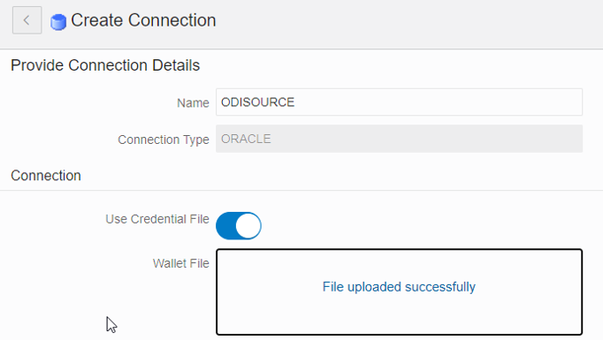

4. Edit the connection. Select the service **odisource_low**. Enter your ADMIN user name and password for the ADW database. Click **Save**. Click **Test** to ensure the connection is successful. Click **Save and Close**.

    

## **STEP 5**: Add a Schema

1. Click the 3-dot ellipsis menu button to the right of your new ODISOURCE connection and select **Add Schema**.

    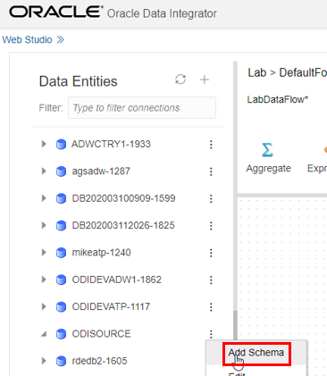

2. Select the **ODI_PARAMETERS** schema and click the **Add** button.

    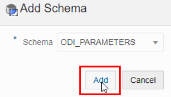

3. Expand your ODISOURCE connection to see the ODI\_PARAMETERS schema. Click the 3-dot ellipsis menu button to the right of the ODI_PARAMETERS schema and select **Create Collection**.

    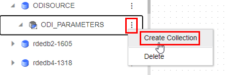

4. Name the Collection **ODI_PARAMETERS**. Tick the boxes to import **Tables** and **Views**. Click **Save**.

    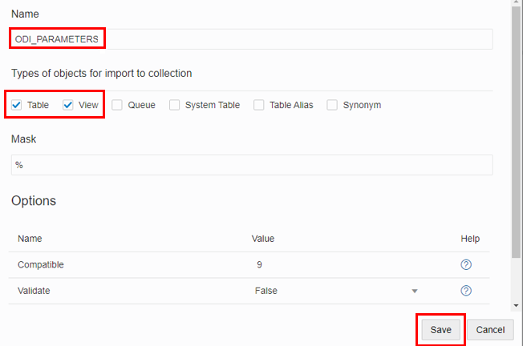

## **STEP 6**: Connect to Your Main ADW Instance

1. You now need to complete the connection to your main ADW instance that you created in Lab 3. This should appear on the left hand side under Data Entities when editing a Data Flow, but the user name and password need to be specified. To do this, click the 3-dot ellipsis menu button to the right of the connection and select the **Edit** button. (**Note**: In the list of Data Entities, this database might appear with a name different from the display name you created as *ADW-your initials*)

    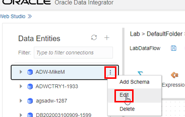

2. Scroll down and specify the ADMIN user name and the password for your main ADW instance, and click **Save**. Click **Test** to test the connection, then click **Save and Close**.

    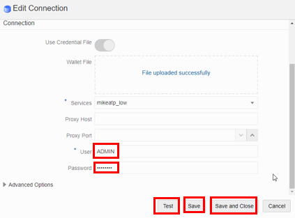

## **STEP 7**: Add ODI_Demo Schema to the Data Flow

1. Now add the ODI_Demo schema you created when you seeded the main ADW database. Click the 3-dot ellipsis menu button to the right of your main ADW connection, and select **Add Schema**.

    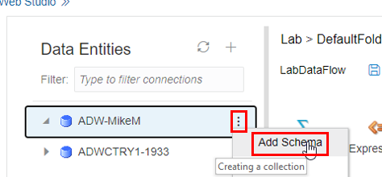

2. Select **ODI_Demo** and click **Add**.

    

3. Create a collection for the ODI\_DEMO schema. Expand your main ADW connection to see the ODI\_DEMO schema. Click the menu button to the right of the ODI\_DEMO schema and select **Create Collection**.

    

4. Name the collection **ODI_DEMO**. Tick the boxes to import **Tables** and **Views**. Click **Save**. It might take up to a minute for a job to run that collects this metadata from your database. When the job finishes, you can expand the collection and see its tables.

    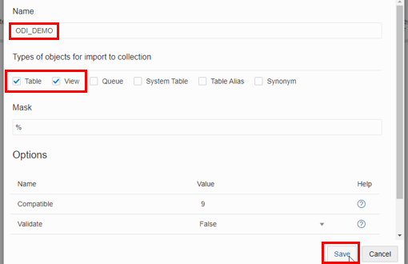

## **STEP 8**: Add Tables, a Join, Lookup Table, Target Table to the Data Flow

1. Add a source table to the data flow. You now have two database connections set up, and you can use their tables and views in your data flows.
The first data flow you need to create will take your **source** customer data (SRC\_CUSTOMER) and load it into your **target** TRG\_CUSTOMER table.
However, you will need to add some transforms to make the data suitable for loading. To start, drag the **SRC_CUSTOMER** table onto the data flow editor.

**Note:** There are 2 steps to drag and drop with this editor. First, left-click a table and release the mouse button. The selected table shows a light blue background after you release the mouse button. Now left-click the table a second time and keep the mouse button depressed while dragging and dropping.

    

2. Add another table. You need to add the sales person for each customer to your SRC\_CUSTOMER table by joining to the SRC\_SALES\_PERSON table in your additional ADW database. Find this table and drag it onto the data flow editor. Then click the **Save** button to save the data flow.

    

3. Add a join. Find the **Join** tool in the toolbar and drag it onto the data flow editor.

    

4. Then click on each of the source tables in turn, find their connecting arrows, and drag them onto the Join processor to connect them to the Join.

    

    

5. Now click the Join tool on the editor and click the far right button to view its Attributes. Notice that the common column name between the two tables has been detected and a join condition created. This looks correct, so **save** the data flow.

    

6. Add a lookup table. The **SRC\_AGE\_GROUP** table in your additional source contains rules about the correct age ranges for your customers. You need to do a lookup in  this table to check the age of the customer records, and to load only records with correct values. Drag the table onto the editor.

    

7. Now add a **Lookup** tool, and connect the output arrow from the Join tool, and then the SRC\_AGE\_GROUP table, to it.

    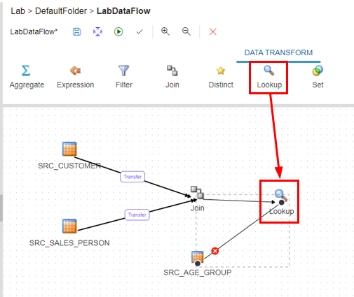

8. Configure the Lookup to check that the Age on the SRC\_CUSTOMER tables is in the right range according to the SRC\_AGE\_GROUP table by specifying the following Lookup Condition (you can copy/paste this into the Condition option box):

    `SRC_CUSTOMER.AGE between SRC_AGE_GROUP.AGE_MIN and SRC_AGE_GROUP.AGE_MAX`

  Change the Driving Source to **SRC\_CUSTOMER**. Change the Lookup Source to **SRC\_AGE\_GROUP**.
  The options should look as follows. Click the **Save** icon to save the data flow:

    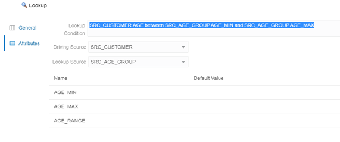

9. Now you will add your Target table to the data flow. Drag the **TRG\_CUSTOMER** table from the Data Entities panel on the left to your data flow.

    

## **STEP 9**: Map Columns to the Target Table

1. Map columns to the target table. To connect the data to the target table, click the Lookup tool and drag its output arrow to the **TRG\_CUSTOMER** table in your flow.

    

2. Now click the **TRG\_CUSTOMER** table, and click the top-right icon to expand the configuration options panel on the right hand side.

    

3. Click the **Column Mapping** option. Notice that many of the columns have been mapped automatically.

    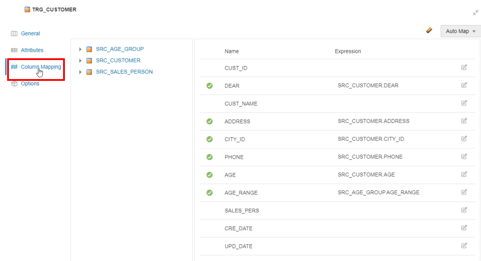

4. You now need to add mappings for the rest of the columns. First, drag the slightly differently named **CUSTID** column from the SRC\_CUSTOMER table to the **CUST_ID** Expression column in the target.

    

5. For the **DEAR** target column, you need a transformation expression that changes the values, mapping the source table's DEAR column (numeric) as a string expression

(0 -->\'MR\', 1 -->\'MRS\', 2-->\'MS\').

To define the expression for the DEAR target column, click the **Edit** button to the right of the DEAR column, then copy and paste the following into the Expression window:

CASE

  WHEN SRC_CUSTOMER.DEAR = 0 THEN 'Mr'

  WHEN SRC_CUSTOMER.DEAR = 1 THEN 'Mrs'

  ELSE 'Ms'

  END

  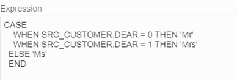

6. Note that your target table has a single **CUST\_NAME** column, but your source has separate **FIRST\_NAME** and **LAST\_NAME** columns. You need to concatenate these values in your target with a space in between, and upper case the last name. To do this, click the Edit button on CUST\_NAME, and paste the following into the **Expression** window, and click **OK**:

 TRIM(SRC\_CUSTOMER.FIRST\_NAME) || ' ' ||

  UPPER(TRIM(SRC\_CUSTOMER.LAST\_NAME))

  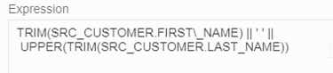

7. You now need to add a similar expression for the **SALES\_PERS** column. Click the Edit button on SALES\_PERS, and paste the following into the **Expression** window, and click **OK**:

 TRIM(SRC\_SALES\_PERSON.FIRST_NAME) || ' ' ||

  UPPER(TRIM(SRC\_SALES\_PERSON.LAST\_NAME))

  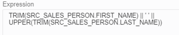

 Click the **Save** button to save the data flow.

8. Finally, you need to create mappings for the **CRE\_DATE** and **UPD\_DATE** columns to add dates of creation and update through ODI. Here, simply add **SYSDATE** as the expression for both columns directly in the mapping window. The final set of mappings should look like this:

    

9. You may have noticed that you used the same expression for CRE\_DATE and UPD\_DATE, so you need to use the options to control the setting and update of these columns correctly. To do this, click **Attributes** on the left side. Then untick the Update option for CRE\_DATE, and untick the Insert option for UPD\_DATE as below. Click the **Save** button to save the data flow.

    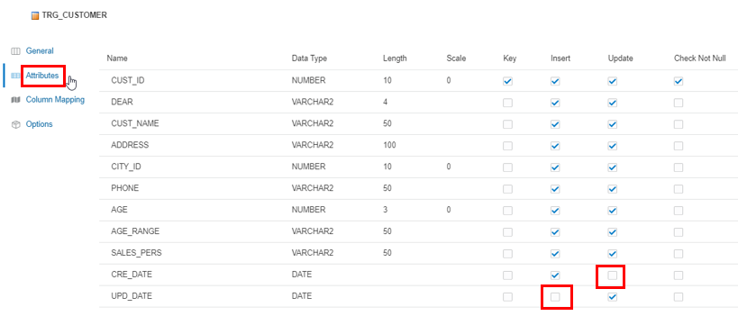

10. Finally, you want the data flow to run so that it incrementally updates your target table. To do this, click **Options** on the left side, then select **Incremental Update** in the upper right. Save the data flow.

    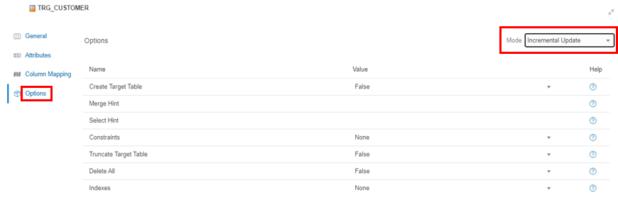

## **STEP 10**: Run Your Data Flow to Load Database

1. The data flow is ready to run. Click the **Execute** button to run it. Click the **Job Id** in the pop-up message to see the progress of the job.

    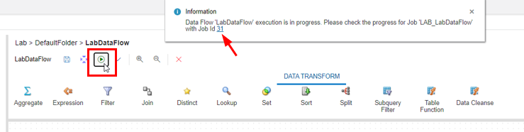

## Want to Learn More?

- <a href="https://docs.oracle.com/en/middleware/fusion-middleware/data-integrator/12.2.1.4/odi-marketplace/using-odi-web-studio.html#GUID-F4BEE72A-A07B-4275-B918-DFF33A314F0D" target="\_blank">Using ODI Web Studio Documentation</a>

## Acknowledgements

- **Author** - Mike Matthews, Senior Director, Data Quality Product Management
- **Adapted for Cloud by** - Rick Green, Principal Developer, Database User Assistance
- **Last Updated By/Date** - Rick Green, July 2020

See an issue?  Please open up a request [here](https://github.com/oracle/learning-library/issues).   Please include the workshop name and lab in your request.
