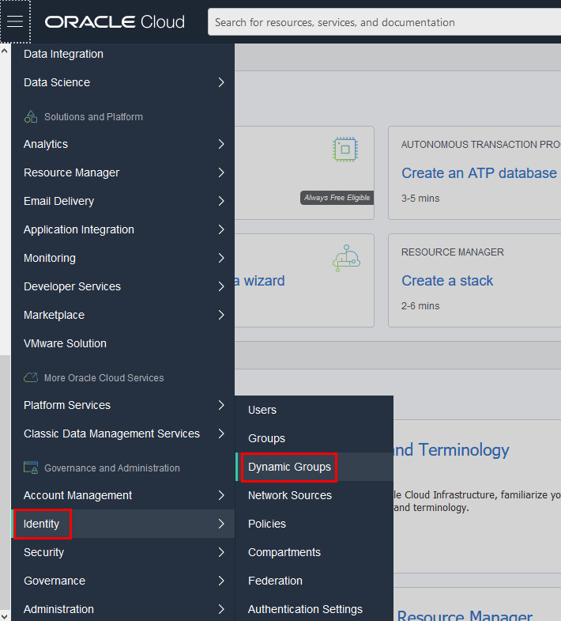
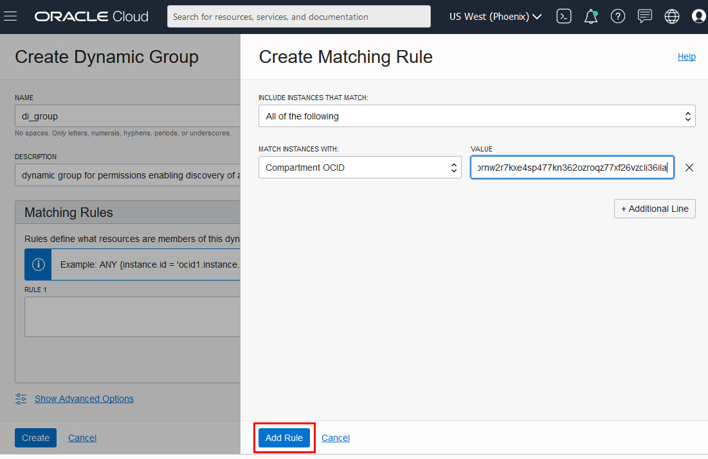
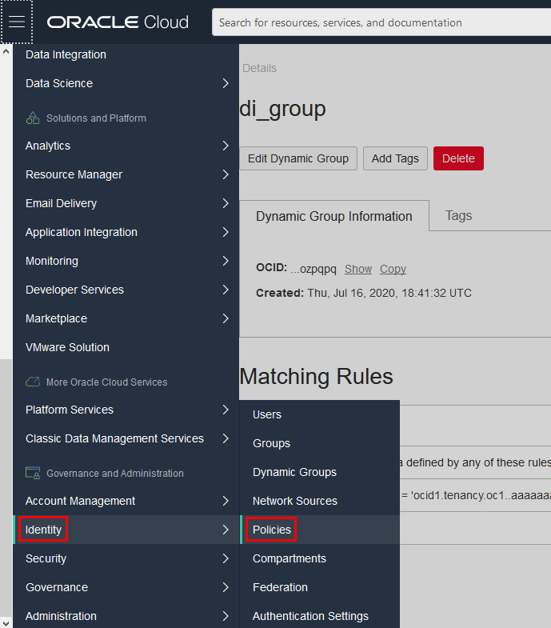
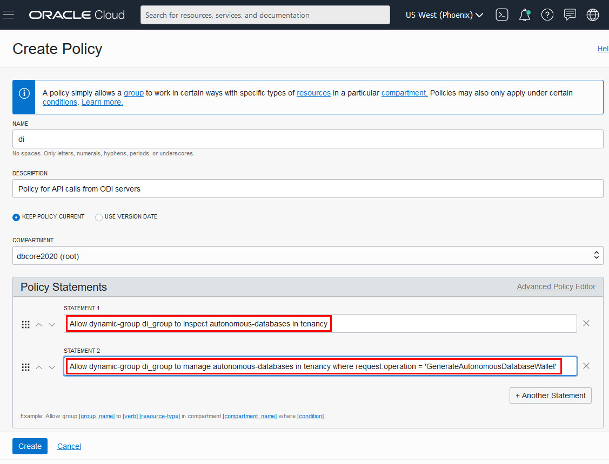

# Set Permissions Enabling Discovery of Autonomous Databases

## Introduction

Both ODI and Oracle Enterprise Data Quality (EDQ) on Marketplace use OCI APIs that allow the discovery of autonomous databases in a tenancy, and the automated download of the wallets needed to connect to them.

This lab walks you through the steps to authorize an instance to make API calls in Oracle Cloud Infrastructure services. After you set up the required resources and policies, an application running on an instance can call Oracle Cloud Infrastructure public services, removing the need to configure user credentials or a configuration file.

### Objectives

-   Create a dynamic group in OCI Console
-   Create a matching rule
-   Create a policy

### Lab Prerequisites

- This lab assumes you have completed the **Login to Oracle Cloud** lab seen in the Lab Contents menu on the right.

## **STEP 1**: Create a Dynamic Group

1. In the OCI Console, navigate to **Identity > Dynamic Groups**.

    

2. Click **Create Dynamic Group**. Create a Dynamic Group and give it a name, for example **di_group**. Fill the required **Description** field.

    

    

## **STEP 2**: Create a Matching Rule

1. Create a Matching Rule that matches any instance in the compartment where you will be installing ODI, such as:

    `ANY {instance.compartment.id = ‘OCID of compartment where you will be installing ODI or EDQ’}`

    __Note__ - This rule can be built using the Rule Builder, with the Attribute ‘Match instances in Compartment ID:’ and the Value set to the OCID of the compartment. To get the OCID of your compartment, navigate to Identity > Compartments and copy the OCID of the compartment you want to give access. Then paste it into the Rule Builder above. After defining the matching rule, click **Create** to finish creating the dynamic group with the matching rule.

    

    

    

## **STEP 3**: Create a Policy
Create a policy that, for the purposes of the labs in this workshop, allows ODI servers in a compartment to access autonomous databases in the same compartment.

1. In the OCI Console, navigate to **Identity > Policies**.

    

2. Create a **Policy** (or you can extend an existing Policy if you have one). If you are creating a policy, give it a name such as **di** and a description such as **Policy for API calls from ODI servers**. Select the default **Policy Versioning** option **(Keep Policy Current)**.

    

    

3. Add the following two policy statements:

### **If You Are Connecting to an Autonomous Database in the Root Compartment (as in this lab)**
For speed and simplicity, in this workshop's labs you will install an ODI server in the **root** compartment and connect it to autonomous databases that you created in the **root** compartment. Therefore, you can create policy statements that reference **'in tenancy'** (rather than specify some other compartment by name where an autonomous database would have been created).

    Allow dynamic-group [name of dynamic group] to inspect autonomous-databases in tenancy

    Allow dynamic-group [name of dynamic group] to manage autonomous-databases in tenancy where request.operation = ‘GenerateAutonomousDatabaseWallet’

For example, if your dynamic group is named **di_group** and your ODI server and autonomous database are in the root compartment, the two policy statements would read as follows:

    Allow dynamic-group di_group to inspect autonomous-databases in tenancy

    Allow dynamic-group di_group to manage autonomous-databases in tenancy where request.operation = 'GenerateAutonomousDatabaseWallet'

### **If You Are Connecting to an Autonomous Database in a Different Compartment of the Same Tenancy (not the example in this lab)**
If your ODI server is in the root compartment  and it is connecting to an autonomous database that is not in the root compartment, but in another compartment of the same tenancy, you would need to specify that compartment by name in the policy statements, as shown below.

    Allow dynamic-group [name of dynamic group] to inspect autonomous-databases in compartment [name of compartment]

    Allow dynamic-group [name of dynamic group] to manage autonomous-databases in compartment [name of compartment] where request.operation = ‘GenerateAutonomousDatabaseWallet’

For example, if your dynamic group is named **di_group** and your compartment is named **di**, the two statements would read as follows:

    Allow dynamic-group di_group to inspect autonomous-databases in compartment di

    Allow dynamic-group di_group to manage autonomous-databases in compartment di where request.operation = ‘GenerateAutonomousDatabaseWallet’

__Note__ - If your ODI server needs to access Autonomous Databases in compartments _other than_ the compartment where the ODI server is installed, you will need to define appropriate additional policies to enable this, including a policy statement defined at the root level that allows the dynamic group to inspect all compartments in the tenancy, i.e.:

    Allow dynamic-group [name of dynamic group] to inspect compartments in tenancy

4. After defining the two policy statements, click **Create** to finish creating the policy.

    

Once such compartments can be inspected, the statements allowing access to the autonomous databases in these compartments will work.

Please proceed to the next lab.

## Want to Learn More?

Click [here](https://docs.cloud.oracle.com/iaas/Content/Identity/Tasks/callingservicesfrominstances.htm) for Oracle Cloud Infrastructure documentation on calling services from an instance.

## Acknowledgements

- **Authors** - Mike Matthews, Senior Director, Data Quality Product Management; Rick Green, Principal Developer, Database User Assistance
- **Adapted for Cloud by** - Rick Green
- **Last Updated By/Date** - Rick Green, July 2020

See an issue?  Please open up a request [here](https://github.com/oracle/learning-library/issues).   Please include the workshop name and lab in your request.
