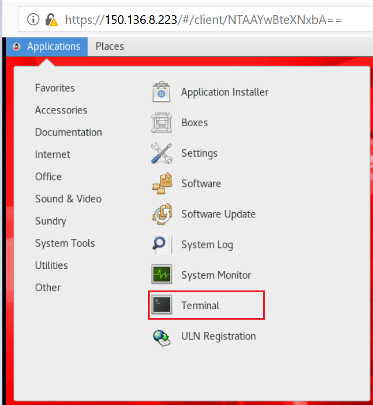
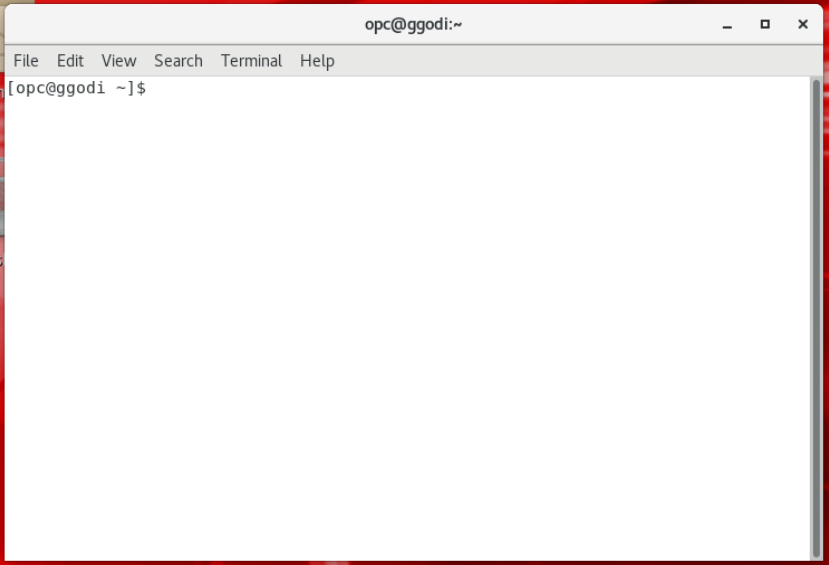
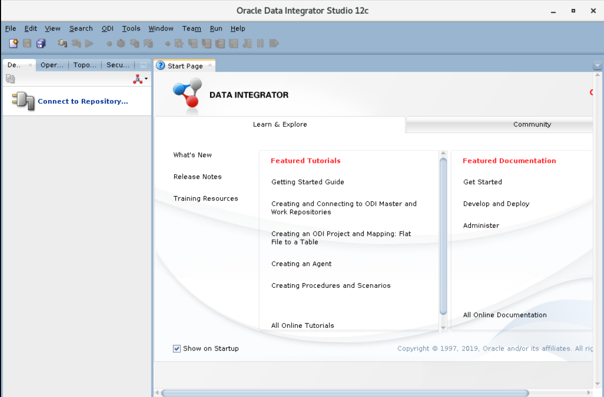
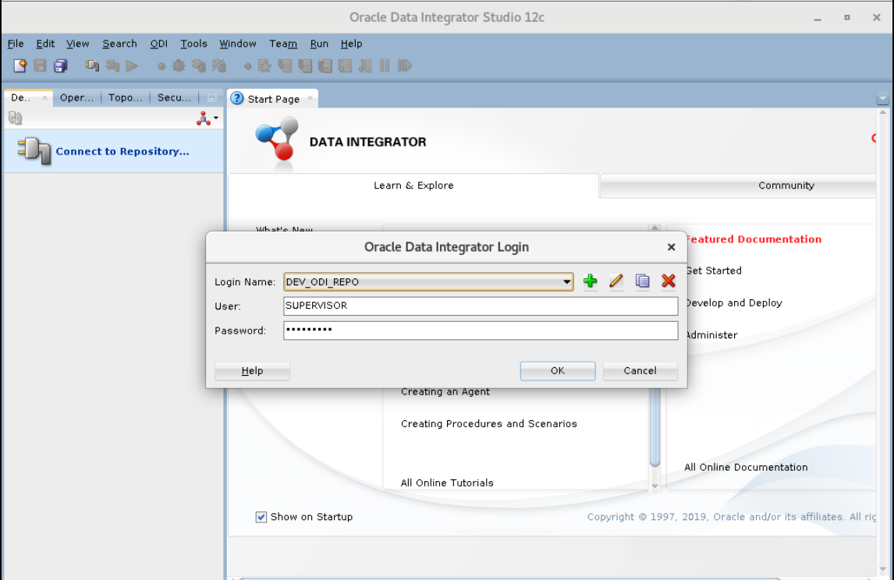
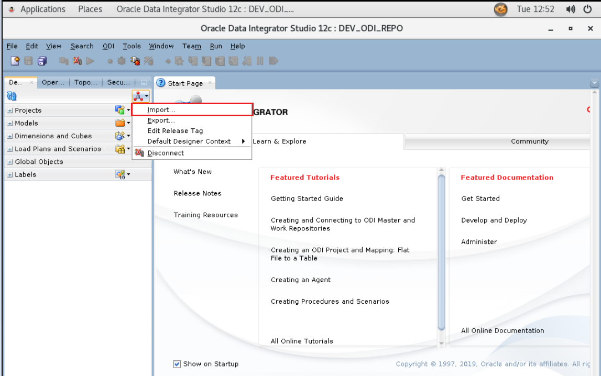

# Access and Configure ODI Instance

## Introduction
This lab will show you how to access an ODI instance using Apache Guacamole and configure ODI Studio

Estimated Lab time: 30 minutes

### Objecives
* Access an ODI Instance through Apache Guacamole
* Configure ODI Studio
* Import Mappings and Run Initial Load
* Test the Environment


### Prerequisites
An Oracle Free Tier, Always Free, Paid or LiveLabs Cloud Account

This lab assumes you have:
- A Free Tier, Paid or LiveLabs Oracle Cloud account
- SSH Private Key to access the host via SSH
  
- You have completed:
    - Lab: Generate SSH Keys
    - Lab: Prepare Setup
    - Lab: Environment Setup


## **STEP  1:** Access an ODI instance through Apache Guacamole

1. Obtain the Apache Guacamole URL, credentials from the instructor and login into it using any browser.

    
2. Select "odivnc" option after you login into the Guacamole.
   
    

3. Click on Applications and select "Terminal" from System tools.

        

    A new terminal will open on screen.
    

4. Sudo to oracle user and login into ODI Studio using the below command.
    ````
   <copy>
    sudo su - oracle
    sh /home/oracle/Oracle/Middleware/Oracle_Home/odi/studio/odi.sh
   </copy>
    ````
     
        

    ODI Studio will appear on screen.

        

5. Click on "Connect to Repository" option and provide the wallet password.
   
    
      

    **Note:** Wallet password can be obtained from the instructor.

6. Click "OK" when the default login username and password appear on screen.
    


## **STEP  2:** Configure ODI Studio and import training repository

1. Go to the Designer tab and select import to open the import wizard.
   
    
    
2. Select "Smart Import" option and click ok.
   
    

3.  Enter the path to the **ODI\_Models.xml** file (/home/oracle/ODI\_Mappings\_V1/ODI\_Models.xml) and click "Next".

      

The import will take approximately 5 minutes

4. Provide the export key. Export key can be obtained from the instructor and click "OK".
       

5. Click "Next" on the next screen and then click on Finish.
    

    

6. Click close on the next screen.
    

## **STEP  3:** Import Mappings and Run Initial Load

1. If you are new to ODI, import these mappings using smart import.Select import to open the import wizard

      

2. Select "Smart Import" option and click ok.
   
    

3.  Enter the path to the **ODI\_Beginner\_Labs.xml** file (/home/oracle/ODI\_Mappings\_V1/ODI\_Beginner\_Labs.xml) and click "Next".

      

4. Click "Next" on the next screen, provide the Export key and then click on Finish.

      

      

5. Click close on the next screen.

    

6. Click on Refresh button in the Designer tab and drill down on project to verify if required mappings are imported.

    

7. Drill down, right click on "Environment_Reset" package an click on "Run".

       

   Click "OK" on the Run box and Information box.

       
       

8. You can check the status of the job in "Operator" tab.

      


## **STEP  4:** Test the environment

1. Expand **Model** and right-click on **SRC\_AGE\_GROUP** and select **View Data**

       

2. If you see data your environment is ready to use

          

Congratulations!  Now you have the environment to run the ODI labs.  

You can now proceed to the next lab

## Acknowledgements

- **Author** - Narayanan Ramakrishnan, December 2020
 - **Contributors** - Srivishnu Gullapalli
 - **Last Updated By/Date** - Narayanan Ramakrishnan, December 2020

## Need Help?
Please submit feedback or ask for help using our [LiveLabs Support Forum](https://community.oracle.com/tech/developers/categories/goldengate-on-premises). Please click the **Log In** button and login using your Oracle Account. Click the **Ask A Question** button to the left to start a *New Discussion* or *Ask a Question*.  Please include your workshop name and lab name.  You can also include screenshots and attach files.  Engage directly with the author of the workshop.
If you do not have an Oracle Account, click [here](https://profile.oracle.com/myprofile/account/create-account.jspx) to create one.
