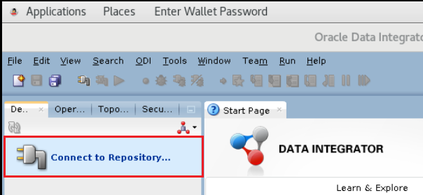
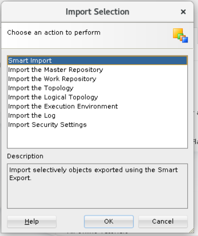
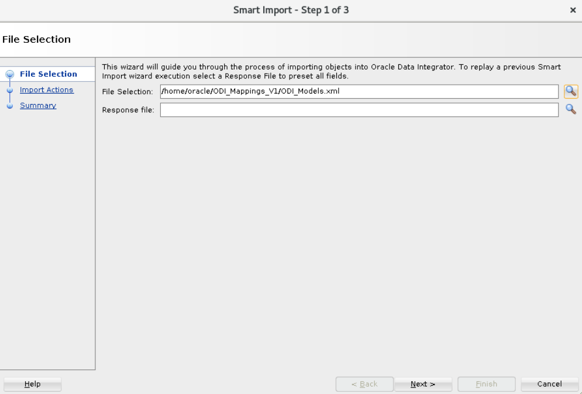
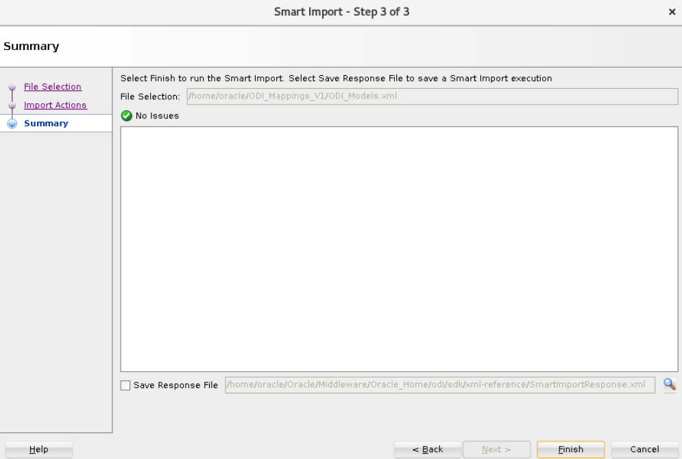
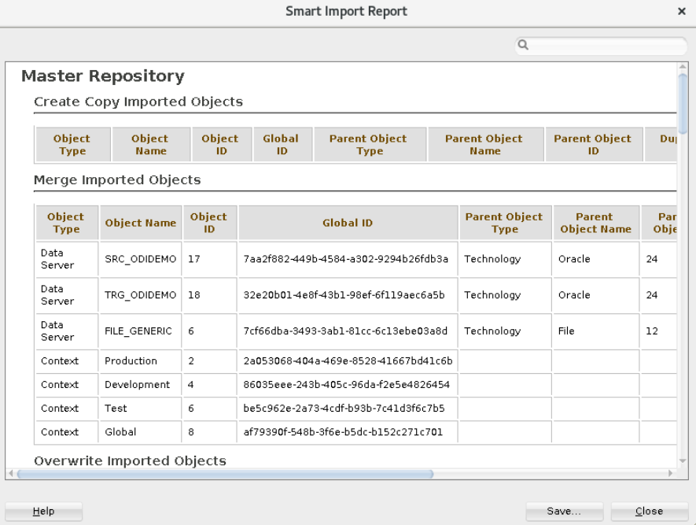
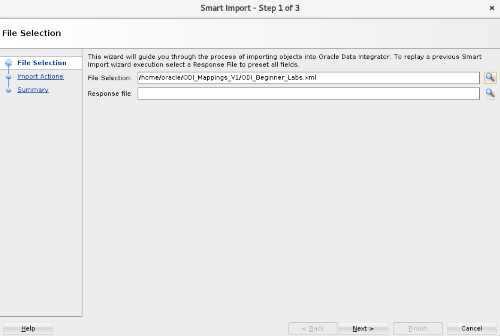
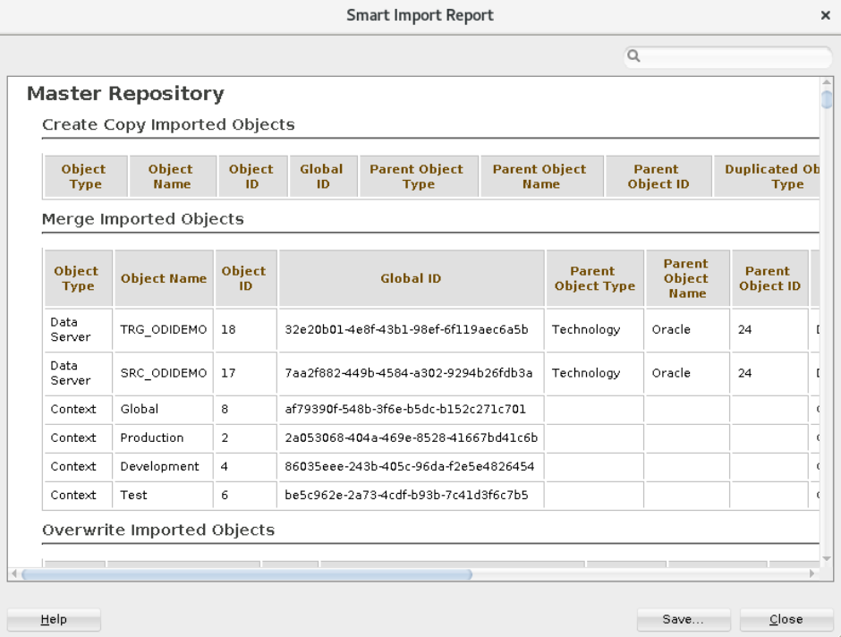
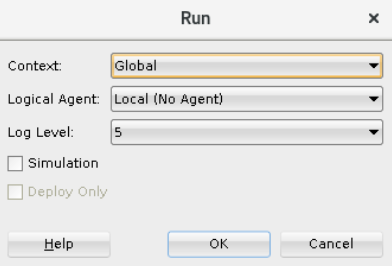
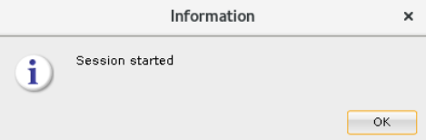

# Access and Configure ODI Instance

## Introduction
This lab will show you how to access an ODI instance using Apache Guacamole and configure ODI Studio

*Estimated Lab Time*: 30 minutes

### Objectives
* Access an ODI Instance through Apache Guacamole
* Configure ODI Studio
* Import Mappings and Run Initial Load
* Test the Environment

### Prerequisites
This lab assumes you have:
- A Free Tier, Paid or LiveLabs Oracle Cloud account
- SSH Private Key to access the host via SSH
- You have completed:
    - Lab: Generate SSH Keys
    - Lab: Prepare Setup
    - Lab: Environment Setup

## **STEP 0**: Running your Lab
### Access the graphical desktop
For ease of execution of this workshop, your instance has been pre-configured for remote graphical desktop accessible using any modern browser on your laptop or workstation. Proceed as detailed below to login.

1. Launch your browser to the following URL

    ```
    URL: <copy>http://[your instance public-ip address]:8080/guacamole</copy>
    ```

2. Provide login credentials

    ```
    Username: <copy>oracle</copy>
    ```
    ```
    Password: <copy>Guac.LiveLabs_</copy>
    ```

  

  *Note*: There is an underscore `_` character at the end of the password.

3. To launch *ODI Studio*, *Firefox* browser or a *Terminal* client, click on respective icon on the desktop

  

### Login to Host using SSH Key based authentication
While all command line tasks included in this workshop can be performed from a terminal session from the remote desktop session as shown above, you can optionally use your preferred SSH client.

Refer to *Lab Environment Setup* for detailed instructions relevant to your SSH client type (e.g. Putty on Windows or Native such as terminal on Mac OS):
  - Authentication OS User - “*opc*”
  - Authentication method - *SSH RSA Key*
  - OS User – “*oracle*”.

1. First login as “*opc*” using your SSH Private Key

2. Then sudo to “*oracle*”. E.g.

    ```
    <copy>sudo su - oracle</copy>
    ```

## **STEP 1:** Launch and Configure ODI Studio

1. A user *Oracle* from the remote desktop session you started above, launch a terminal client and Start the container database, all PDB's and the listener

    ```
    <copy>
    cd ~/scripts/  
    sh ./startup.sh
    </copy>
    ```

  *Note*: You may also run this script from your SSH client if preferred

  

2. From the same remote desktop session, Click on the "*Oracle Data Integrator*" icon.

      

  ODI Studio will appear on screen.

      

2. Click on "Connect to Repository".

  

3. Type in the wallet password and click OK

    ```
    Password: <copy>Welcome1#</copy>
    ```

    

4. Click "OK" when the default login username and password appear on screen.

  

5. Go to the Designer tab and select import to open the import wizard.

  

6. Select "Smart Import" option and click ok.

  

7.  Enter the path to the **ODI_Models.xml** file (`/home/oracle/ODI_Mappings_V1/ODI_Models.xml`) and click "Next".

    

  The import will take approximately 5 minutes

8. Provide the export key. Export key can be obtained from the instructor and click "OK".

     

9. Click "Next" on the next screen and then click on Finish.

  

  

10. Click close on the next screen.

  

## **STEP 2:** Import Mappings and Run Initial Load

1. If you are new to ODI, import these mappings using smart import. Select import to open the import wizard

    

2. Select "Smart Import" option and click ok.

  

3.  Enter the path to the **`ODI_Beginner_Labs.xml`** (or) **`ODI_Advance_Labs.xml`** file (`/home/oracle/ODI_Mappings_V1/ODI_Beginner_Labs.xml`) or (`/home/oracle/ODI_Mappings_V1/ODI_Advance_Labs.xml`) and click "Next".

    

4. Click "Next" on the next screen, provide the Export key and then click on Finish.

    

    

5. Click close on the next screen.

  

6. Click on Refresh button in the Designer tab and drill down on project to verify if required mappings are imported.

  

7. Drill down, right click on "**`Environment_Reset`**" package an click on "Run".

     

   Click "OK" on the Run box and Information box.

     

     

8. You can check the status of the job in "Operator" tab.

    


## **STEP 3:** Test the environment

1. Expand **Model** and right-click on **`SRC_AGE_GROUP`** and select **View Data**

     

2. If you see data your environment is ready to use

        

Congratulations!  Now you have the environment to run the ODI labs. You may proceed to the next lab.

## Learn More
- [Oracle Data Integrator](https://docs.oracle.com/en/middleware/fusion-middleware/data-integrator/index.html)

## Acknowledgements

- **Author** - Narayanan Ramakrishnan, December 2020
- **Contributors** - Srivishnu Gullapalli
- **Last Updated By/Date** - Rene Fontcha, LiveLabs Platform Lead, NA Technology, January 2021

## Need Help?
Please submit feedback or ask for help using our [LiveLabs Support Forum](https://community.oracle.com/tech/developers/categories/livelabsdiscussions). Please click the **Log In** button and login using your Oracle Account. Click the **Ask A Question** button to the left to start a *New Discussion* or *Ask a Question*.  Please include your workshop name and lab name.  You can also include screenshots and attach files.  Engage directly with the author of the workshop.

If you do not have an Oracle Account, click [here](https://profile.oracle.com/myprofile/account/create-account.jspx) to create one.
