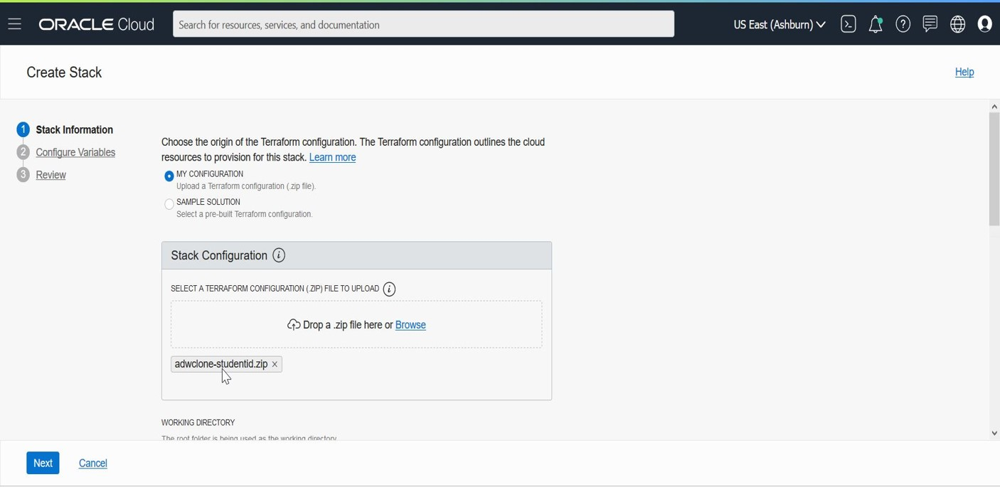
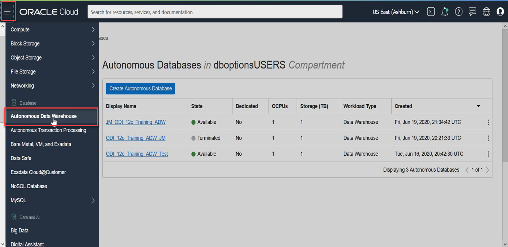
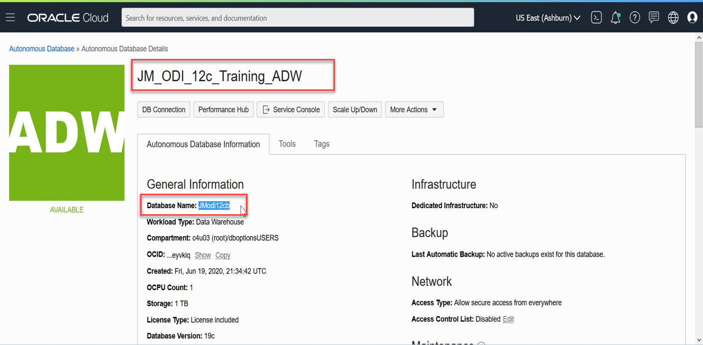
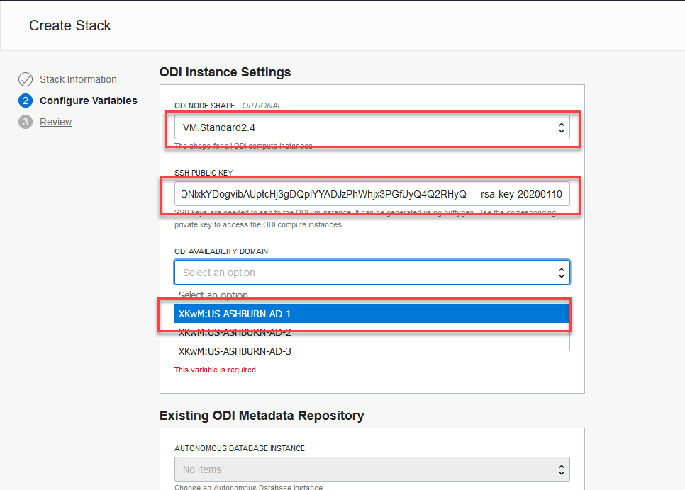

# Setup - FreeTier or Oracle Cloud #

## Introduction
This lab will show you how to login to the cloud and setup your environment using Oracle Resource Manager.  

# This lab to be changed to follow a different ODI Repository Setup - June 25
# LAB UNDER CONSTRUCTION

**PLEASE READ:**  *If you already have access to a running compute instance (running the DB19c Image) configured, go directly to Step 3b run it, skip Step 3c, then run Step 3d.*

## Step 1: Login and Create Stack using Resource Manager
You will be using Terraform to create your database environment.

1.  Click on the link below to download the zip file you need to build your enviornment.  
- [adwclone-studentid.zip](https://objectstorage.us-ashburn-1.oraclecloud.com/p/W771ccMxLDG2z0mZHwv4isnzyYgcVbWUMgCuaCXcr3I/n/c4u03/b/labfiles/o/adwclone-studentid.zip) - Packaged terraform instance creation script

The regular way of creating Autonomous Date Warehouse (ADW) creates an empty database. We will use a special stack to create an ADW repository for training that already contains an ODI repository and seed data.

2.  Save in your downloads folder.

3.  Open up the hamburger menu in the left hand corner.  Choose **Resource Manager > Stacks**.   Choose the compartment from your email, click the  **Create Stack** button

    

    

    

    

6.  Click the **Browse** button and select the zip file (adwclone-studentid.zip) that you downloaded. Click **Select**.

    

    Enter the following information and accept all the defaults

    - **Name**:  Enter your firstname and lastname and the day you were born (DO NOT ENTER ANY SPECIAL CHARACTERS HERE, including periods, underscores, exclamation etc, it will mess up the configuration and you will get an error during the apply process)

    - **Description**:  Same as above

    - **Compartment**:  Select Compartment from Email 2

7.  Click **Next**.

    

    Enter the following information. Some information may already be pre-populated.  Do not change the pre-populated info.  You will be updating Public Subnet, Display Name, AD (Availbility Domain) and SSH Key.

    **Public Subnet ID**:  Enter the subnet ID based on your region.   The subnets are provided in Email 2

    **Display Name:** Enter your firstname and lastname and the day you were born (do not enter any special characters here, including periods, it may mess up the configuration)

    **AD**: Enter 1, 2, or 3 based on your last name.  (A-J -> 1, K - M -> 2, N-Z -> 3)

    **SSH Public Key**:  Paste the public key you created in the earlier step (it should be on ONE line)

8. Click **Next**.

    

9.  Your stack has now been created!  Now to create your environment.  If you get an error about an invalid DNS label, go back to your Display Name, please do not enter ANY special characters or spaces.  It will fail.

    

## Step 2: Terraform Plan and Apply
When using Resource Manager to deploy an environment, execute a terraform **plan** and **apply**.  Let's do that now.

1.  [OPTIONAL]Click **Terraform Actions** -> **Plan** to validate your configuration.  This takes about a minute, please be patient.

    

    

    

2.  At the top of your page, click on **Stack Details**.  Click the button, **Terraform Actions** -> **Apply**.  This will create your instance and install Oracle 19c.
    

    

3. Ensure you note the ADMIN user password, the Database name (db_name) and the DISPLAY_NAME - you will need these credentials later

    

4.  Once this job succeeds, your environment is created!  You can view your ADW database from the console.

    

    

    The detail page shows the DISPLAY NAME and the DB_NAME

## Step 1: Create an ODI instance from OCI Marketplace

1. Login to the OCI Console and choose **Marketplace -> Applications**

    
2. OCI Marketplace hosts many applications ready to be deployed.
   Search for “Oracle Data Integrator”.

    

   If there are more than one listing then pick the one which says “Free”

3. Choose the ODI listing. A page displays describing the ODI product overview and usage instructions. There is also a link to a detailed user guide for deploying the marketplace image.
Make sure you have chosen the correct **COMPARTMENT**
    
        
Select the latest DB Cloud Services Edition. This version is available free of cost for loading data to Oracle DB cloud targets.

Accept the Terms&Conditions and click **Launch Stack**
    

4. Add your initials to the **Name** field so you can easily identify your Instance. Click **Next**
        

5. Choose *create new networking components* and *attach to existing ODI repository*. In practice, networking will be created by admin and a new ODI repository may be needed for the first time. Add your initials to the **Resource Display Name Prefix** field
      

6. Scroll down to **ODI Instance Settings** and choose the
   **VM Shape** (*VM.Standard.2.4*),
   **SSH Key**: Paste the Public Key you created earlier (it should be only ONE line)
   **Availability Domain**: Choose a domain based on your last name (A-J -> 1, K - M -> 2, N-Z -> 3)
   **VNC Password**: create and remember a password to access your VNC environment (This password will not be accessible again)
    

7. Scroll down to **Existing ODI Metadata Repository** and enter:
    **Autonomous Database Instance**: Choose the ADW instance you created in the previous step
    **Autonomous Database ADMIN password**: Enter the ADMIN user password you recorded earlier
    **Supervisor Password**: Enter the password *SUNOPSIS*
    **Schema Prefix**: Enter *JMODI* to match the existing ODI repository created for you
            

    Click **NEXT** and then click **CREATE** in the next page

8. The Stack will get created. Scroll down for the JOB logs:
    

    Your instance will have your initials as a Prefix (provided you added them as instructed)
    

Congratulations!  Now you have the environment to run the ODI labs.   

## Acknowledgements

- **Author** - Jayant Mahto, July 2020
- **Last Updated By/Date** - Troy Anthony, June 2020

See an issue?  Please open up a request [here](https://github.com/oracle/learning-library/issues).   Please include the workshop name and lab in your request.
