# Run Scripts

## Introduction

In this lab, you will navigate to INFA UI and run the scripts.

Estimated Lab Time: 20 minutes

### About <Product/Technology> (Optional)

Enter background information here about the technology/feature or product used in this lab - no need to repeat what you covered in the introduction. Keep this section fairly concise. If you find yourself needing more than to sections/paragraphs, please utilize the "Learn More" section.

### Objectives

In this lab, you will:

* Navigate to INFA UI
* Map with Pushdown Optimization/ELT

### Prerequisites

This lab assumes you have:

* Provisioned and Oracle ADB instance
* Configured secure agent to connect to ADW
* Have loaded data into th ADW

## Task 1: Navigate to INFA UI

1.	Add instructions to navigate to INFA UI

## Task 2: Map with Pushdown Optimization/ELT

Let's see how to create a Mapping and a Mapping Task to transform orders and lineitem tables in Oracle Autonomous Data Warehouse and write to a new table in the same Oracle ADW using Pushdown Optimization or ELT.

1. After logging into IDMC, select **Data Integration**.

	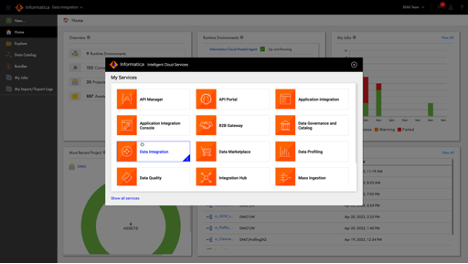

2. Before we dive into mapping, let's take a quick look at the Oracle Autonomous Data Warehouse connection. This connection uses a runtime environment that is a compute instance in OCI with Oracle Linux 8.5 RHCK operating system. In the runtime environment (or secure agent), the Wallet has been configured.  As well as Oracle Autonomous DW properties are set in this connection. As you can see Test Connection returns successful result.

  	Click **Service Selector** at the top left, then select **Administrator** service. In Administrator, go to **Connections**, search for **Oracle Autonomous DW - Oracle Linux 8.5 connection**. Click to open. Click **Test Connection** to test.

	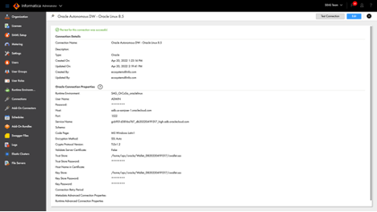

3. The home page shows an Overview of the IDMC organization. Data Integration

	

4. Creating a new asset can be done from existing templates. Templates are pre-built mapping such as Slowly Changing Dimension as you can see in this screen. Templates allow you to quickly build a working mapping by simply editing the properties of transformations in the template. For this demo, we are creating a Mapping from scratch.

   Click **New**. In the New Asset dialog box, click **Mappings** and select **Mapping** and then click **Create**.

	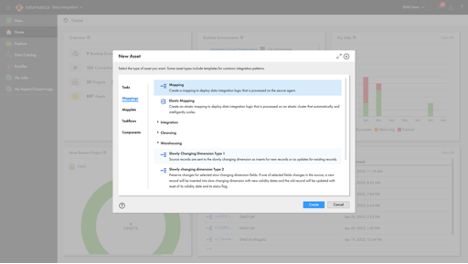

5.	This a new mapping with bare minimum transformations, which is, a source and a target. On the left vertical panel, the available transformations can be dragged and dropped on the canvas. There are about 30 different transformations available and hundreds of commonly used functions in the Expression transformation. Let's open an existing mapping.

	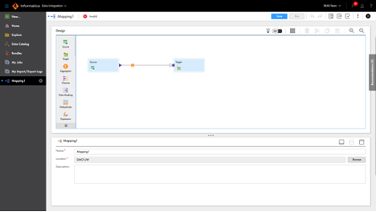

6.	Recently used mapping is readily available in the Home page. Open **m\_transform\_orders\_lineitem\_pdo** mapping.

	Click **Home**, then **click m\_transform\_orders\_lineitem\_pdo** mapping.

	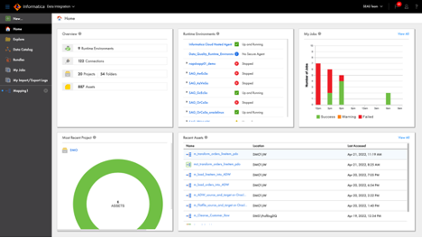

7.	This mapping reads from two sources, Orders and Lineitem, both are Oracle ADW tables. You can read from any data sources that IDMC support. There are more than 200 data source connectors supported. The mapping then joins the two sources, aggregate and count the number of items and order total. The expression rename the fields so they look better in the target table, and write the records into orderslineitem table in Oracle ADW.

	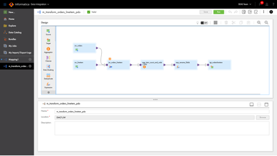

8.	Source properties points to Oracle ADW orders table.

	Click **src\_orders** source, then click **Source** tab in Properties panel

	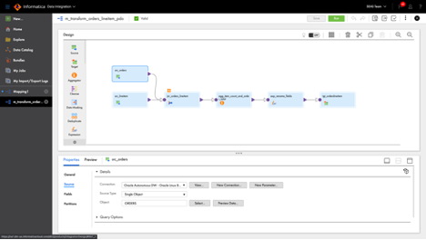

9.	Source properties points to Oracle ADW lineitem table.

	Click **src\_lineitem** source, then click **Source** tab in Properties panel

	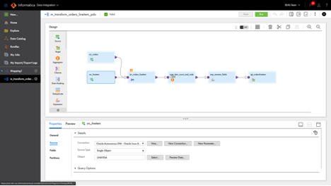

10.	Joiner to join the two sources, has condition set to Master.o\_orderkey = Detail.l\_orderkey

	Click **jnr\_orders\_lineitem**, then click **Join Condition**

	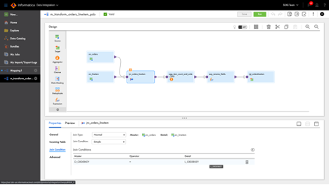

11. Let's create two aggregations. Set the Group By fields in Aggregator

	Click **agg\_item\_count\_and\_order\_total**, then **Group By tab**.

	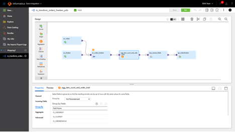

12.	Aggregator field name and expressions; the first one is counting the number of items per order.  The second one is calculating the total in each order.

	Click **Aggregate**

	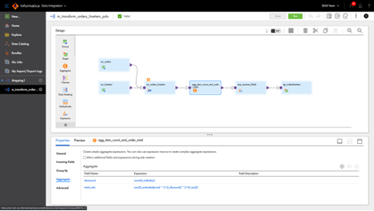

13.	Expressions for renaming fields

	click **exp\_rename\_fields**, click **Expression**

	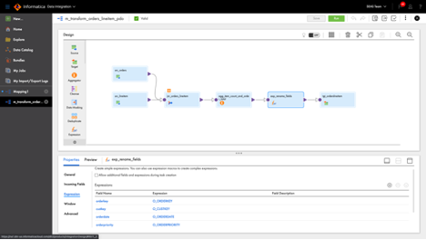

14.	Target is set to write to orderslineitem table

	click **tgt\_orderslineitem** and then click **Target** tab

	

15.	Let's create a Mapping Task by clicking the 3 dots icon and click New Mapping Task. Mapping task allows reusing of mapping.  For example, you can configure parameterized data sources and in mapping task, you then specify the actual data sources.  There are a few parameterization that you can configure.  Mapping task also allows the pushdown optimization configuration, scheduling, and email notification.

	click 3 dots icon, click **New Mapping** task

	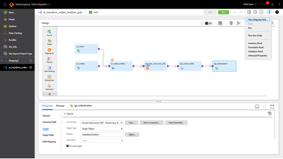

16.	 Let's open an existing Mapping Task.

	Click **Home**, then click **mct\_transform\_orders\_lineitem\_pdo** mapping task

	

17.	The first step shows the task name, runtime environment, and the mapping. Runtime environment is the processing engine. In this case, the processing engine generates the SQL statement because we are setting this up with Pushdown Optimization enabled in the next step.

	Click **Next**

	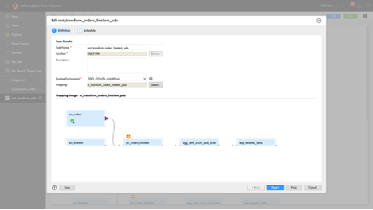

18.	The second step is where you configure the execution schedule, email notification, and pushdown optimization. When Pushdown Optimization is configured, Informatica generates the SQL statement and send it to Oracle ADW to execute it. Let's execute this mapping task.

	Scroll down to show **Pushdown Optimization**

	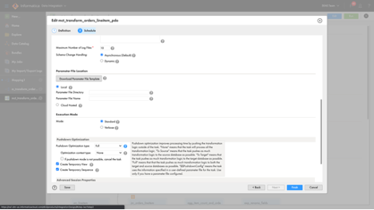

19.	Click **My Jobs**. My Jobs shows the jobs that have been executed, timestamp, rows processed, and status. Open the last job executed.

	Click **My Jobs.**

	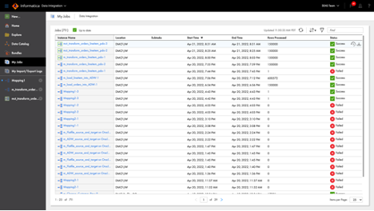

20.	Here you can see the job properties in more detail. Click Download Session Log to view the pushdown optimization status. This will download the log file.

	Click **Download Session Log**

	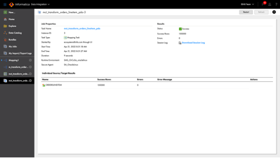

21.	Pushdown optimization was successfully enabled. If you scroll down further, you will see the SQL statement that were generated for Oracle ADW to execute.

	Open log file and scroll down a bit

	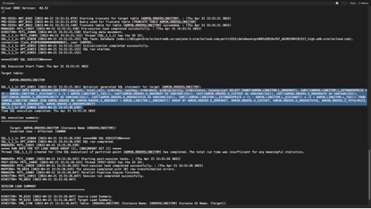

22.	In your **Oracle ADW** navigate to **Performance Hub**, you can find the SQL statement that was executed as well.

	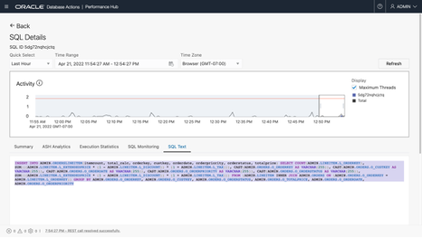

That concludes this demonstration.

## Learn More

*(optional - include links to docs, white papers, blogs, etc)*

* [URL text 1](http://docs.oracle.com)
* [URL text 2](http://docs.oracle.com)

## Acknowledgements
* **Author** - <Name, Title, Group>
* **Contributors** -  <Name, Group> -- optional
* **Last Updated By/Date** - <Name, Month Year>
