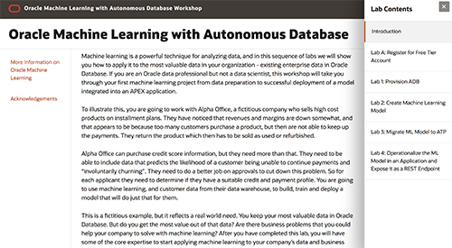

# Oracle Machine Learning Github

The Oracle Machine Learning product family enables scalable data science projects. Data scientists, analysts, developers, and IT can achieve data science project goals faster while taking full advantage of the Oracle platform.

Oracle Machine Learning consists of complementary components supporting scalable machine learning algorithms for in-database and big data environments, notebook technology, SQL and R APIs, and Hadoop/Spark environments. 

With Oracle Machine Learning, Oracle moves the algorithms to the data, processing data where it resides—minimizing or eliminating data movement, achieving scalability, preserving security, and accelerating time-to-model deployment. Oracle delivers parallelized in-database implementations of machine learning algorithms and integration with open source R.

## Workshops
Click on the workshop below to begin.

  

- [Access lab here](https://apexapps.oracle.com/pls/apex/dbpm/r/livelabs/view-workshop?p180_id=560)

## Get an Oracle Cloud Trial Account for Free!
If you don't have an Oracle Cloud account then you can quickly and easily sign up for a free trial account that provides:
- $300 of free credits good for up to 3500 hours of Oracle Cloud usage
- Credits can be used on all eligible Cloud Platform and Infrastructure services for the next 30 days
- Your credit card will only be used for verification purposes and will not be charged unless you 'Upgrade to Paid' in My Services

Click here to request your trial account: [https://www.oracle.com/cloud/free](https://www.oracle.com/cloud/free)

## Product Pages
- [Oracle Machine Learning - 19c](https://www.oracle.com/database/technologies/datawarehouse-bigdata/machine-learning.html)
- [Oracle Database 19c](https://www.oracle.com/database/)

## Documentation
- [Machine Learning Algorithms Cheat Sheet](https://www.oracle.com/a/tech/docs/oml4sql-algorithm-cheat-sheet.pdf)
- [Oracle Machine Learning - 19c](https://docs.oracle.com/en/database/oracle/oracle-database/19/data-warehousing.html)
- [Oracle SQL Developer](https://docs.oracle.com/en/database/oracle/sql-developer/)

## Videos
- [Oracle Machine Learning Video Playlist](https://www.youtube.com/playlist?list=PLdtXkK5KBY57_y3Z0SW2cbCqGUPbfc94w)

## See an issue?
Please submit feedback using this [form](https://apexapps.oracle.com/pls/apex/f?p=133:1:::::P1_FEEDBACK:1). Please include the *workshop name*, *lab* and *step* in your request.  If you don't see the workshop name listed, please enter it manually. If you would like us to follow up with you, enter your email in the *Feedback Comments* section.

-- Oracle Database Product Management
