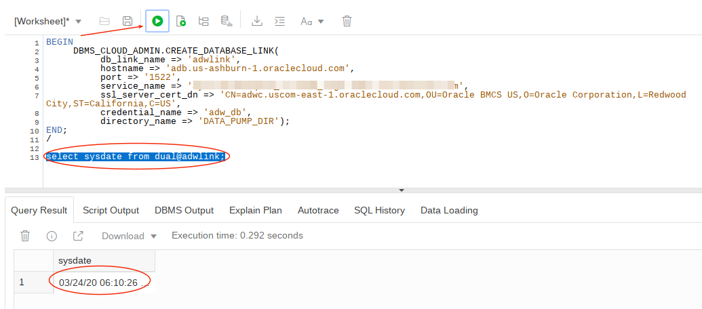

# Creating the Machine Learning Model

In lab 2 you created a machine learning model that can predict customer credit. Congratulations! But you’re not finished. It’s a good model, but models have to be deployed into production systems, they have to positively impact the business, and too many machine learning projects fail at this point. We are going to spend the next two labs making sure you deploy this model so that Alpha Office employees can use it in their day to day work.

The first step is to move the model from where it was developed into a production transaction processing database where it will be accessible to the Client Service application. This lab will take you through that process.

## Objectives

In this lab, you will:

- In ADW:
    - Log into SQL Developer Web and enable user ml_user access to sqldeveloper web.
    - Grant storage priviledges to ml_user
    - Log in with ml_user and export the model to a temporary table.
- In ATP:
    - Create a database link that will be used to copy (pull) an export of the ml model from ADW to ATP.
    - Create a new ml_user and grant that user access to sqldeveloper web, and to storage.
    - Copy the model from ADW to ATP.
    - Log in with ml_user and import the ml model.
    - Create a virtual column on the table that applies the model to rows in the table.

## **Step 1:** Sign in to Oracle Cloud, Open SQL Developer Web, and grant priviledges to ml\_user.

- Log in, if you have not already done so.

  

- Navigate to Autonomous Data Warehouse and then select your ADW instance.

  

  

- Select the Service Console.

  

- Select Development, and then SQL Developer Web.

  

- Log in with your adw admin userid and password.

  

- Close the popup help notes.

  

- By default only the admin userid can use SQL Developer Web.  To enable ml\_user to use it, you need to enable this.  Enter the following and execute the procedure to grant sqldeveloper web access to ml\_user.
```
<copy>BEGIN
   ORDS_ADMIN.ENABLE_SCHEMA(
     p_enabled => TRUE,
     p_schema => 'ML_USER',
     p_url_mapping_type => 'BASE_PATH',
     p_url_mapping_pattern => 'ml_user',
     p_auto_rest_auth => TRUE
   );
   COMMIT;
END;
/</copy>
```

  

  

- Grant storage priviledges to ml\_user.
```
<copy>alter user ml_user quota 100m on data;</copy>
```

  

## **Step 2:** Log into ***ADW*** SQL Developer Web with user ml\_user and export the machine learning model.

- Go up to the URL and change the admin part of the URL to ml\_user and hit enter to log in as ***ml\_user***.  Copy the URL to a notepad - you will need it later.

  

- Log in as ml\_user.

  

- Create a temporary table to hold the data mining model.
```
<copy>create table temp(my_model blob);</copy>
```

  

- Confirm the machine learning model was built.  This would have been done in the lab 1 by executing the steps in the credit scoring notebook.
```
<copy>select * from user_mining_models;</copy>
```

  

- Export the ml model to this temporary table.  The model will be stored in a binary large object.
```
<copy>DECLARE
 v_blob blob;
BEGIN
 dbms_lob.createtemporary(v_blob, FALSE);
 dbms_data_mining.export_sermodel(v_blob, 'N1_CLASS_MODEL');
 insert into temp values(v_blob);
 commit;
 dbms_lob.freetemporary(v_blob);
END;
/</copy>
```

  

- Confirm the model was exported by looking at the length of the blob (you can't see the binary data).  Note your length may differ slightly.
```
<copy>select length(my_model) from temp;</copy>
```

  

## **Step 3:** Log into ***ATP*** SQL Developer Web with userid ***admin*** and create user ml\_user and grant that user privileges to create tables and and access SQL Developer Web.

- Navigate to Autonomous Transaction Processing (ATP) menu item and then select your ATP instance.

  

  

- Select the Service Console.

  

- Select Administration, and then Manage Oracle ML Users.

  

- Create new ML User.

  

- Enter user ml\_user, an emailid, and passwords and select create.

  

- Go back to the ADW Console (previous tab in your browser), select Development, and the SQL Developer Web.

  

- Log in with your ***ATP admin*** userid.

  

- Grant SQL Developer Web rights to ml\_user.
```
<copy>BEGIN
   ORDS_ADMIN.ENABLE_SCHEMA(
     p_enabled => TRUE,
     p_schema => 'ML_USER',
     p_url_mapping_type => 'BASE_PATH',
     p_url_mapping_pattern => 'ml_user',
     p_auto_rest_auth => TRUE
   );
   COMMIT;
END;
/</copy>
```

  

- Grant storage priviledges to ml\_user.
```
<copy>alter user ml_user quota 100m on data;</copy>
```

  


## **Step 4:** Create a database link in ***ATP*** so you can copy the machine learning model in the temp table in ADW back to ATP.

- With the ***admin*** userid in ***ATP*** SQL Developer Web create a credential to copy your ADW wallet from Object Storage to the DATA\_PUMP\_DIR later in this step.  This is your cloud userid and generated auth token.
```
BEGIN
  DBMS_CLOUD.CREATE_CREDENTIAL(
    credential_name => 'adwc_token',
    username => '&lt;your cloud username &gt;',
    password => '&lt; generated auth token &gt;'
  );
END;
/</copy>
```

  

- Create another credential for the ADW database.  This is your database admin userid and password.  This too will be used in the following steps.
```
<copy>BEGIN
  DBMS_CLOUD.CREATE_CREDENTIAL(
    credential_name => 'adw_db',
    username => 'ADMIN',
    password => '&lt;password&gt;'
  );
END;
/</copy>
```

  

- Go back to your main console browser tab and navigate to object storage and select your adwc bucket.  object storage.

  

  

- The database link needs access to your ADW wallet file cwallet.sso.  In Lab 1 we uploaded this file to object storage.

  

- Click on the far right menu of the cwallet.sso file and view details.

  

- Copy the URL to a notepad.  We'll need it next.

  

- Switch browser tabs and go back to SQL Developer Web and copy the wallet to the ATP's DATA\_PUMP\_DIR.  When we create the database link in the next step this wallet will be required.
```
<copy>BEGIN
     DBMS_CLOUD.GET_OBJECT(
        credential_name => 'adwc_token',
        object_uri => '&lt;your object file URI&gt;',
        directory_name => 'DATA_PUMP_DIR');
END;
/</copy>
```

  

- Retrieve values from the tnsnames.ora file which was in the ADW zip wallet file.  You will need the following.  Copy these values to a notepad.
  - hostname
  - service\_name
  - ssl\_server\_cert\_dn

    

- Create database link.  This will allow you to copy data from ADW to ATP (in fact, bi-directional).
```
<copy>BEGIN
     DBMS_CLOUD_ADMIN.CREATE_DATABASE_LINK(
          db_link_name => 'adwlink',
          hostname => '&lt;your ADW host&gt;',
          port => '1522',
          service_name => '&lt;your service name&gt;',
          ssl_server_cert_dn => '&lt;your cert&gt;',
          credential_name => 'adw_db',
          directory_name => 'DATA_PUMP_DIR');
END;
/</copy>
```

  

- Test the database link by retrieving the date from the remote ADW instance:
```
<copy>select sysdate from dual@adwlink;</copy>
```

  

## **Step 5:** In ***ATP*** Sql Developer Web copy tables from ADW to ATP.

- First copy the credit\_scoring\_100k table into ml\_user in ATP.  Normally this table would already exist in the production system.  We could have loaded it in lab 1 when we loaded the table into ADW, but since we were going to create this database link we can just copy it from ADW.  We also need to copy the ml model, which is in the temp table (blob).  Enter the following.
```
<copy>create table ml_user.credit_scoring_100k as select * from credit_scoring_100k@adwlink;<copy/>
```

  

- Now copy the temp table.
```
<copy>create table ml_user.temp as select * from ml_user.temp@adwlink;</copy>
```

  

## **Step 6:** Log into SQL Developer Web as ml\_user and import the ml model.  

- Start by copying the SQL Developer URL for the admin user and paste that into your browser, but change the admin user value to ml\_user.

  

- Change the user from admin to ml\_user and log in.

  

- Import your model.  Note you will get a warning error message, but you can then confirm the model was imported.
```
<copy>DECLARE
 v_blob blob;
BEGIN
 dbms_lob.createtemporary(v_blob, FALSE);
  select my_model into v_blob from temp;
 dbms_data_mining.import_sermodel(v_blob, 'N1_CLASS_MODEL');
 dbms_lob.freetemporary(v_blob);
END;
/</copy>
```

  

- Confirm the ml model was imported.
```
<copy>select * from user_mining_models;</copy>
```

  

- Test the model.
```
<copy>select prediction(N1_CLASS_MODEL USING 'Rich' as WEALTH, 2000 as income, 'Silver' as customer_value_segment) credit_prediction
from dual;</copy>
```

  

- To make the model prediction available to all applications we will use the Oracle Database's virtual column feature.  We'll add two new virtual columns: the prediction itself, and the probably that the prediction is correct.  **TIP:** You can also create a function index in the ml columns (not included here).  If you wish to use a function index the table must be analyzed to be used in queries.
```
<copy>alter table credit_scoring_100k add(
likely_good_credit_pcnt AS (round((100*(prediction_probability(n1_class_model, 'Good Credit' USING
    wealth
  , customer_dmg_segment
  , income
  , highest_credit_card_limit
  , residental_status
  , max_cc_spent_amount_prev
  , max_cc_spent_amount
  , occupation
  , delinquency_status
  , customer_value_segment
  , residental_status))),1))
, credit_prediction AS (prediction(n1_class_model USING   
  wealth
  , customer_dmg_segment
  , income
  , highest_credit_card_limit
  , residental_status
  , max_cc_spent_amount_prev
  , max_cc_spent_amount
  , occupation
  , delinquency_status
  , customer_value_segment
  , residental_status))
);</copy>
```

  

- Select some data to view predictions.
```
<copy>select customer_id, wealth, income, credit_prediction, likely_good_credit_pcnt from credit_scoring_100k;</copy>
```

  
