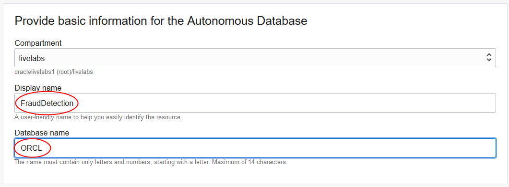
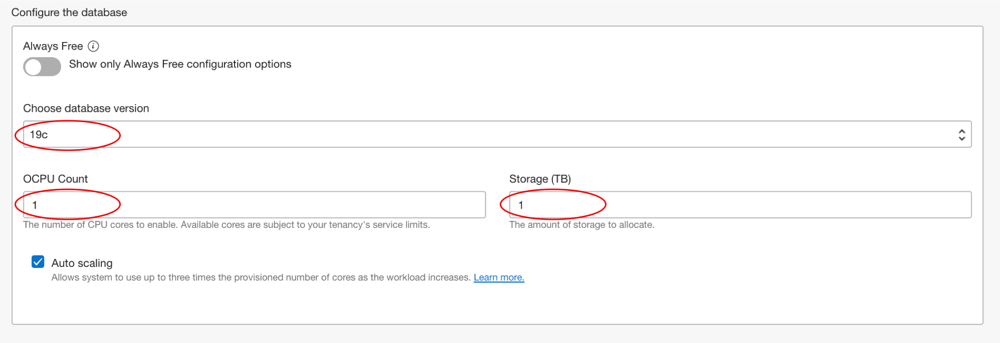
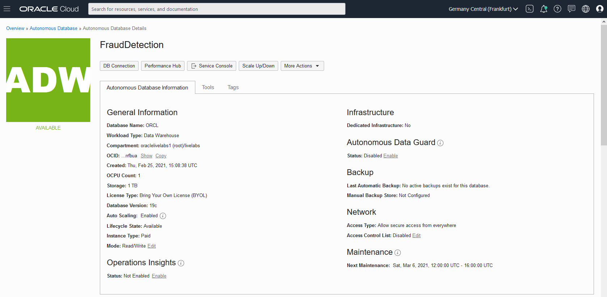
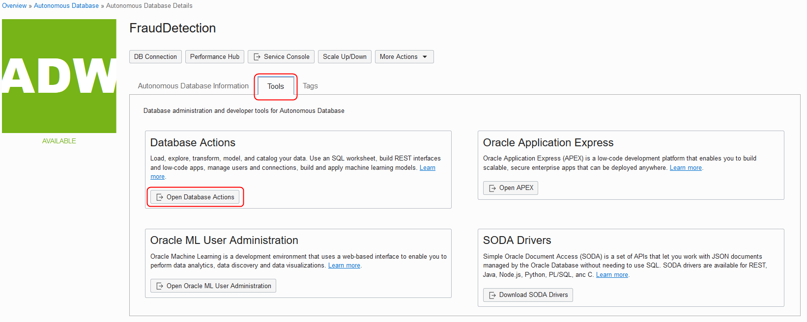
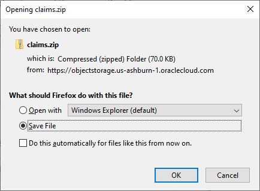
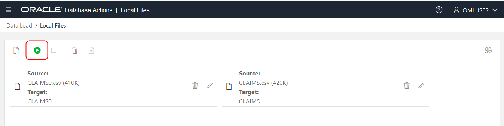
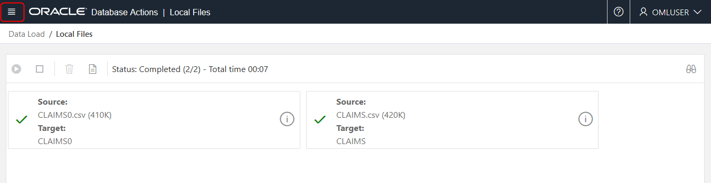

# Provision and Setup #

## Introduction ##

In this lab you will setup your environment. Here we will show you how to provision an autonomous database instances, create a user, load data into the database, and set up credentials and tools.

Estimated Time: 20 mins

### Objectives
-   Learn how to provision an ADW instance
-   Learn how to connect to ADW and use Database Actions

### Prerequisites

This lab assumes you have completed the following labs:
* Sign Up for Free Tier/Login to Oracle Cloud

*Note: You may see differences in account details (eg: Compartment Name is different in different places) as you work through the labs. This is because the workshop was developed using different accounts over time.*

In this section, you will provision an ADWC database, create an OML user account, and load the data required by the OML notebooks.

## Task 1: Create an ADW Instance

First, we are going to create an ADW Instance.

1.  Click the **Navigation Menu** in the upper left, navigate to **Oracle Database**, and select **Autonomous Data Warehouse**.
	
	

2.  Select **Create Autonomous Data Warehouse**.

    

3. Select **Compartment** by clicking on the drop-down list. (Note that yours will be different - do not select **ManagedCompartmentforPaaS**) and then enter **Display Name**, **Database Name**.

    

4.  Under **Choose a workload type** and **Choose a deployment type**, select **Data Warehouse**, and **Shared Infrastructure** respectively.

    

5.  Under **Configure the database**, leave **Choose database version** and **Storage (TB)** and **OCPU Count** as they are.

    

6.  Add a password. Note the password down in a notepad, you will need it later in Lab 2.

    

7.  Under **Choose a license type**, select **License Included**.

    

8.  Click **Create Autonomous Database**. Once it finishes provisioning, you can click on the instance name to see details of it.

    

## Task 2: Create an OML User

1. On your instance, click the **Tools** tab, and then click **Open Oracle ML User Administration**.

    

2. Sign in as admin with the password you used when you created your Autonomous instance.

    

3. Click on **Create**.

    

4. On the **Create User** form, enter the username **omluser**, an e-mail address (you can use admin@oracle.com), uncheck **Generate password**, and enter a password you will remember. You can use the same password you used for the ADMIN account. Then click **Create**.

    

## Task 3: Allow OMLUSER to access Database Actions

1. On the tab with your ADW instance, and click on **Open Database Actions**.

    

2. Login as ADMIN, using the same password you created for ADMIN when you created the ADW instance.

    

    

3. From the Database Action menu, select **SQL**.

    

4. Dismiss the Help by clicking on the **X** in the popup.

    

5. Copy and paste the SQL below into the SQL pane to allow OMLUSER to use the Database Actions.

    ```
      <copy>BEGIN
      ORDS_ADMIN.ENABLE_SCHEMA(
        p_enabled => TRUE,
        p_schema => 'OMLUSER',
        p_url_mapping_type => 'BASE_PATH',
        p_url_mapping_pattern => 'omluser',
        p_auto_rest_auth => TRUE
      );
      COMMIT;
    END;
    /</copy>
    ```

6. Click **Run Script** to execute the SQL.

    

    

## Task 4: Download Files to use in next lab

1.  Click the link below to download the install file.

    [claims.zip](https://objectstorage.us-ashburn-1.oraclecloud.com/p/VEKec7t0mGwBkJX92Jn0nMptuXIlEpJ5XJA-A6C9PymRgY2LhKbjWqHeB5rVBbaV/n/c4u04/b/livelabsfiles/o/data-management-library-files/claims.zip)

2.  Save `claims.zip` to a download directory and then unzip the file.

    

## Task 5: Upload the two data files to OMLUSER

1. On the tab with your ADW instance, and click on **Open Database Actions**.

    

2. This time sign in as **omluser**.

    

    

3. Select **Data Load** from Database Actions.

    

4. Leave the default selections (**Load data** and **Local File**) and click **Next**.

    

5. Drag the **CLAIMS.csv** and **CLAIMS0.csv** files from the directory where you downloaded and unzipped onto the Drag and Drop target.

    

6. When the upload is complete, click **Start** and click **Run** in the confirmation dialog.

    

    

7. When the job is completed, click on the hamburger menu to open the database tools menus and select **SQL**.

    

    

8. The SQL Web Developer shows the two tables have been successfully created (and associated with OMLUSER).

    

You may now [proceed to the next lab](#next).

## Acknowledgements

- **Author** - Mark Hornick , Sr. Director, Data Science / Machine Learning PM

- **Last Updated By/Date** - Siddesh Ujjni, Senior Cloud Engineer, October 2021.

