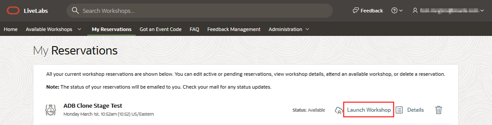
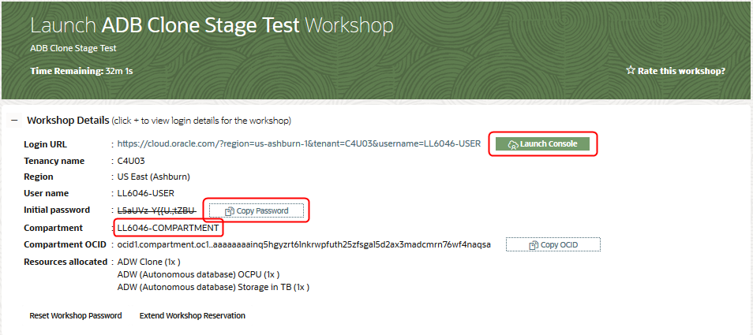
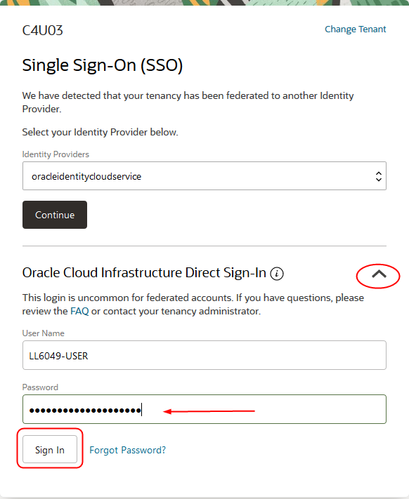

# Introduction

## Oracle Machine Learning ##

Oracle Machine Learning is a powerful technique for analyzing data, and in this sequence of labs, we will show you how to apply it to the most valuable data in your organization - existing enterprise data in Oracle Database. If you are an Oracle data professional but not a data scientist, this workshop will take you through your first machine learning project from data preparation to a successful deployment of a model integrated into an APEX application.

Simplifying greatly, you can split machine learning into two parts: the process of building and training a model so it is ready to work; putting that model to work in production systems, applications, and processes. In general, training a machine learning model takes significant computing resources. You should not run that kind of work in an existing data warehouse or data mart, without clearing it ahead of time because it’s possible that model training could use too many resources and impact SLAs. You definitely don’t want to build and train a model in any kind of critical transactional system for the same reason.

Watch the video below for an introduction to Oracle Machine Learning and a brief demo.

Estimated time: 1 hour

### Workshop Scenario - Automobile Insurance Claims Fraud

Automotive insurance fraud involves someone deceiving an insurance company about a claim involving their personal or commercial motor vehicle. It can involve giving out misleading information or providing false documentation to support the claim.

Nearly one of 10 Americans would commit insurance fraud if they knew they could get away with it. Nearly one of four Americans say it’s ok to defraud insurers. About one in 10 people agree it’s ok to submit claims for items that aren’t lost or damaged, or for personal injuries that didn’t occur. Two of five people are “not very likely” or “not likely at all” to report someone who ripped off an insurer. Accenture Ltd.(2003) Nearly three of 10 Americans (29 percent) wouldn't report insurance scams committed by someone they know.

This workshop highlights the use of two Oracle Machine Learning notebooks working in conjunction with automobile insurance claims investigators in a two-step process.  First, we use Oracle Machine Learning to “flag” for the investigator anomalous insurance claims using an unsupervised learning algorithm (1-Class Support Vector Machine). We help the claims investigators focus on the most suspicious claims using their expertise and knowledge using an Oracle APEX application.   

After their investigation of the most suspicious claims, we ask them to enter their decisions (Fraudfound?  Yes or No) creating "labeled" data for building supervised learning classification models on the target attribute (FraudFound) using Oracle Machine Learning.  Based on this two-step process of unsupervised learning and supervised learning combined with human expertise, we can build a data and ML-driven methodology to detect costly fraudulent auto claims.

### Prerequisites

- An Oracle Cloud Account - Please view this workshop's LiveLabs landing page to see which environments are supported

*Note: If you have a **Free Trial** account, when your Free Trial expires your account will be converted to an **Always Free** account. You will not be able to conduct Free Tier workshops unless the Always Free environment is available. **[Click here for the Free Tier FAQ page.](https://www.oracle.com/cloud/free/faq.html)***

<if type="livelabs">

## Task 1: Launch the workshop

*Note: it takes approximately 20 minutes to create your workshop environment.*

1. After you receive the e-mail stating that your environment is ready, go back to the My Reservations page and click **Launch Workshop**.

    

2. Make a mental note of the compartment name assigned to you. Click **Copy Password** to copy your initial password. Note that this is also the admin password for your Autonomous Data Warehouse instance, so save the password for later use. Then click **Launch Console**.

    

3. On the login page, use the Oracle Cloud Infrastructure direct sign-in, paste the password and click **Sign In**.

    

4. Change your password by entering your existing password and entering a new password. Note: you can use your existing password as the new password also.

    

5. Click on the menu icon and then select Autonomous Data Warehouse from the menu.

    

6. Select the compartment assigned to you from the **List Scope menu** and then click the ADW instance.

    

    

You may now [proceed to the next lab](#next).

</if>

## More Information on Oracle Machine Learning

* [Oracle Machine Learning Product Page](https://www.oracle.com/database/technologies/datawarehouse-bigdata/machine-learning.html)

## Acknowledgements

- **Authors/Contributors** - Mark Hornick, Sr. Director, Data Science / Machine Learning PM

- **Last Updated By/Date** - Siddesh Ujjni, Senior Cloud Engineer, October 2021

- **Workshop Expiration Date** - March 2022

