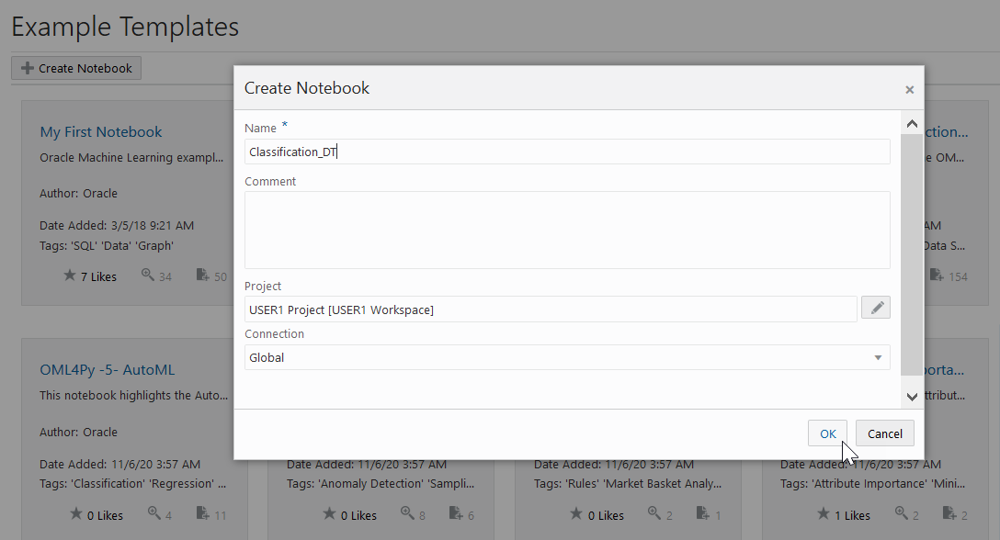
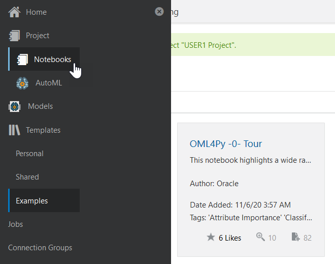
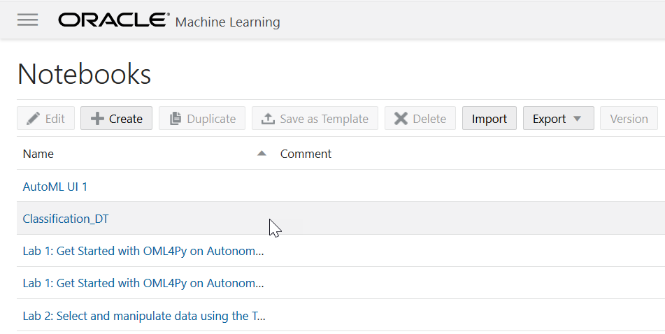

# Title of the Lab

## Introduction

This lab walks you through the steps to This lab walks you through the steps to sign in to Oracle Machine Learning Notebooks, create an OML notebook, and create  an OML notebook based on one of the template example notebooks.

Estimated Time: 15 minutes

### About Oracle Machine Learning Notebooks
Oracle Machine Learning Notebooks is a collaborative user interface supporting data scientists, analysts, developers, and DBAs. You can work with SQL, PL/SQL, and Python in the same notebook—using the most appropriate language for the problem at hand. You can also view notebook changes by team members in real time, interactively. Data science team members can explicitly share notebooks and version notebooks as well as schedule notebooks to run at a set time or a repeating schedule. By virtue of being included in Autonomous Database, machine learning functionality is automatically provisioned and managed.
Through OML Notebooks, you have access to the in-database algorithms and analytics functions to explore and prepare data, build and evaluate models, score data, and deploy solutions.

### Objectives

In this lab, you will:
* Sign into Oracle Machine Learning Notebooks
* Create an Oracle Machine Learning Notebooks
* Create a notebook based on an example template
* Check and update the interpreter binding settings for a notebook
* Schedule a notebook to run at a specific time using the Jobs interface

### Prerequisites

This lab assumes you have:
* An Oracle Machine Learning account
* Access to OMLUSER account


## Task 1: Sign into Oracle Machine Learning Notebooks

A notebook is a web-based interface for data analysis, data discovery, data visualization, and collaboration. You create and run notebooks in Oracle Machine Learning Notebooks. You can access Oracle Machine Learning Notebooks from Autonomous Database.

1. From the tab on your browser with your ADW instance, click **Service Console**, then select **Development** on the left.

	


2. Click **Oracle Machine Learning Notebooks.**

  

4. Enter your user credentials and click **Sign in**.

	> **Note:** If you are using a LiveLabs tenancy, then the username is ``OMLUSER`` and the password is ``AAbbcc123456``.

	

5. Click **Notebooks** in the Quick Actions section.

	


## Task 2: Create a Notebook and define paragraphs the md, SQL, PL/SQL, and Python interpreters
To create a notebook:

1. On the Oracle Machine Learning homepage, click **Notebooks**. The Notebooks page opens.

	

2. On the Notebooks page, click **Create**. The Create Notebook window appears.
	

3. In the Name field, enter **Test** Notebook.

4. In the **Comments** field, enter comments, if any.

5. In the **Connections** field, select a connection in the drop-down list. By default, the **Global Connection Group** is assigned.

6. Click **OK**. Your notebook is created and it opens in the notebook editor.


You can now use it to create an md paragraph, SQL paragraph, and python paragraph and do the following:

### Task 2.1: Call the Markdown interpreter and generate static html from Markdown plain text
To call the Markdown interpreter and generate static html from Markdown plain text:

1. Type ``%md`` and press Enter.

2. Type ``"Hello World!"`` and click **Run**. The static html text is generated, as seen in the screenshot below.

	

3. You can format the text in bold and italics. To display the text in bold, write the same text inside the tag **Hello World** and click Run.

	

4. To display the text in italics, write the same text inside the a an asterisk pair or underscore pair as shown in the screenshot, and click Run.

	

5. To display the text in a bulleted list, prefix * (asterisk) to the text, as shown in the screenshot below:

	

6. To display the text in heading1, heading 2 and heading 2, prefix # (hash) to the text and click Run. For H1, H2, and H3, you must prefix 1, 2, and 3 hashes respectively.

	


### Task 2.2: Call the SQL Interpreter and run SQL Statements
To call the SQL interpreter and run SQL statements:

1. Edit the paragraph tag and type %sql to call the SQL interpreter.
2. Type select `table_name` from ``user_tables`` and click Run. The command returns the table names in a tabular format - a table with one column `TABLE_NAME`, as shown in the screenshot:

	


### Task 2.3: Call the PL/SQL Interpreter and run PL/SQL Scripts

To call the PL/SQL interpreter and run PL/SQL scripts:
1. Edit the paragraph rag and type ``%script`` to call the PL/SQL interpreter.
2. Type the following command and click Run. Alternatively, you can press Shift+Enter keys to run the paragraph.

    ```
    <copy>CREATE TABLE small_table
			(
			NAME VARCHAR(200),
			ID1 INTEGER,
			ID2 VARCHAR(200),
			ID3 VARCHAR(200),
			ID4 VARCHAR(200),
			TEXT VARCHAR(200)
			);

			BEGIN
			FOR i IN 1..100 LOOP
			INSERT INTO small_table VALUES ('Name_'||i, i,'ID2_'||i,'ID3_'||i,'ID4_'||i,'TEXT_'||i);
			END LOOP;
			COMMIT;
			END; </copy>
     ```


	

The PL/SQL script successfully creates the table SMALL_TABLE. The PL/SQL script in this example contains two parts:
* The first part of the script contains the SQL statement CREATE TABLE to create a table named ``small_table``. It defines the table name, table column, data types, and size. In this example, the column names are ``NAME, ID1, ID2, ID3, ID4, and TEXT``.

* The second part of the script begins with the keyword ``BEGIN``. It inserts 100 rows in to the table ``small_table``


### Task 2.4: Call the Python Interpreter and run Python Statements
To call the Python interpreter and run python statements:
1. Edit the paragraph tag and type %python to call the python interpreter.
2. Type the following command and click Run.

```
<copy>
import pandas as pd

		import oml

		DATA = oml.sync(table = "SUPPLEMENTARY_DEMOGRAPHICS", schema = "SH")

		z.show(DATA.head())
</copy>
```


The command displays the SUPPLEMENTARY_DEMOGRAPHICS table present in the SH schema, as shown in the screenshot here:


## Task 3: Create a Notebook using a Template Example

This step demonstrates how to create a notebook based on an Example template:

1. Sign into your OML Notebook instance and click **Examples** in the Quick Actions section on the home page. Alternatively, you can go to the left navigation menu and click **Examples** under templates. The Examples page opens with all the templates listed.

	

2. Navigate to the **OML4Py Classification DT** example template notebook, click it and then click **Create Notebook**.


3. The Create Notebook dialog opens. Provide a name for this notebook and click **OK**. In this example, enter **Classification_DT**.

	> **Note:** In the Project field, the current user, project and workspace is selected by default. You have the option to choose a different project or a workspace by clicking the edit icon here.  

	


4. Once the notebook is created, the message _Notebook Classification_DT created in project USER1 Project_ is displayed, as shown in the screenshot.

	


5. To view the notebook, navigate to the Notebooks page from the left navigation menu.

	


6. The notebook Classification_DT is now listed on the Notebooks page, as shown in the screenshot. Click it to open the notebook in the Notebooks editor and work on it.

	

This completes the task of creating a notebook from an Example template.


## Task 4: Change Interpreter Bindings Order

An interpreter allows using a specific data processing language at the backend to process commands entered in a notebook paragraph. For the notebooks in Oracle Machine Learning Notebooks, you use the following interpreters:

* SQL interpreters for SQL Statements within an Oracle Database interpreter group
* PL/SQL  interpreters for PL/SQL scripts/statements within an Oracle Database interpreter group
* Python interpreter to process Python scripts
* md (MarkDown) interpreter for plain text formatting syntax so that it can be converted to HTML.

This is the initial binding order of the interpreters. You can change the order of the interpreter bindings by clicking and dragging an entry above or below others.

* **Low** (Default): Provides the least level of resources for in-database operations, typically serial (non-parallel) execution. It supports the maximum number of concurrent in-database operations by multiple users. The interpreter with low priority is listed at the top of the interpreter list, and hence, is the default.
* **Medium:** Provides a fixed number of CPUs to execute in-database operations in parallel, where possible. It supports a limited number of concurrent users, typically 1.25 times the number of CPUs allocated to the Autonomous Database instance.
* **High:** Provides the highest level of CPUs to run in-database operations in parallel, up to the number of CPUs allocated to the Autonomous Database instance. It offers the highest performance but supports the minimum number of concurrent in-database operations, typically 3.

	> **Note:** The interpreter binding order that is set for a notebook applies to all the paragraphs in that notebook.

In this step, you learn how to set the interpreter bindings:
1. Open the **Classification_DT** notebook, and click  on the top right corner in the notebook. This opens the interpreter settings.

	

2. Click **medium** and drag and drop it on top of the list.

	

	>**Note:** You can disable a particular binding by deselecting it (turns from blue to white) or enable it by selecting it ( turns from white to blue).


	

3. Once you successfully drag and drop it on top of the list, click **Save**.

	

Clicking **Save** hides the interpreter settings. You can verify it again by clicking the gear icon. This completes the task of changing the interpreter binding order.


## Learn More

*(optional - include links to docs, white papers, blogs, etc)*

* [URL text 1](http://docs.oracle.com)
* [URL text 2](http://docs.oracle.com)

## Acknowledgements
* **Author** - <Name, Title, Group>
* **Contributors** -  <Name, Group> -- optional
* **Last Updated By/Date** - <Name, Month Year>
