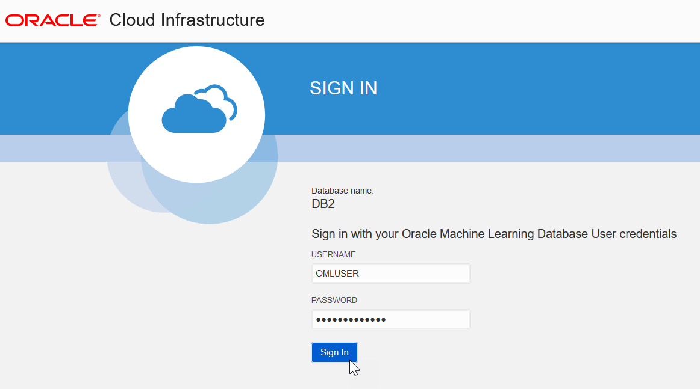
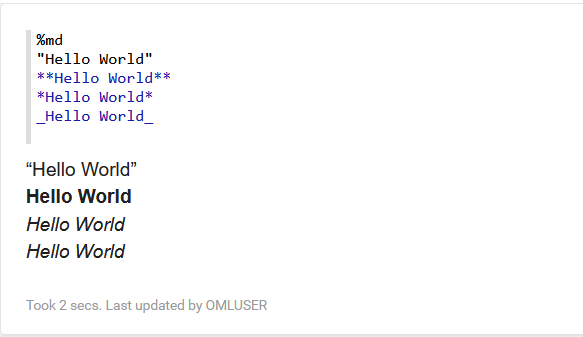
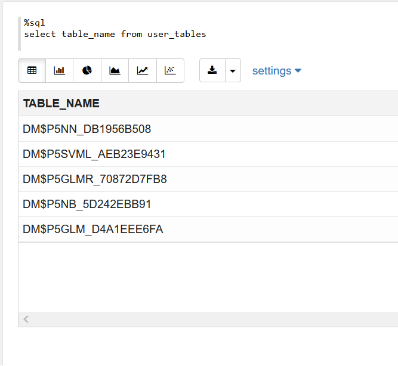
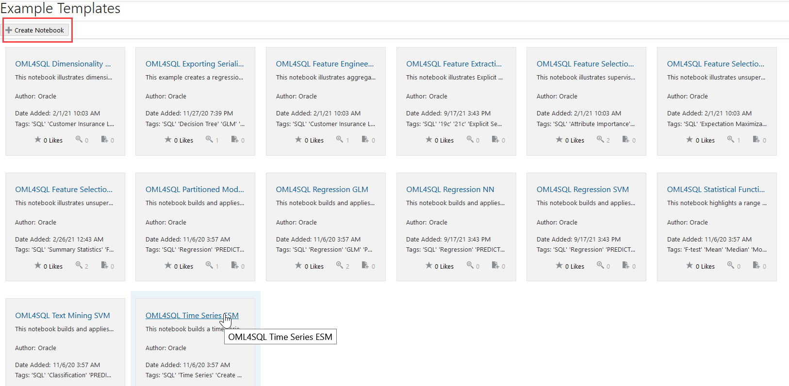
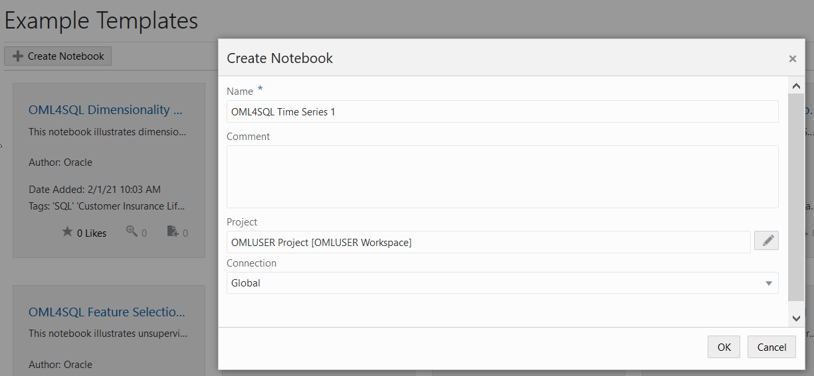
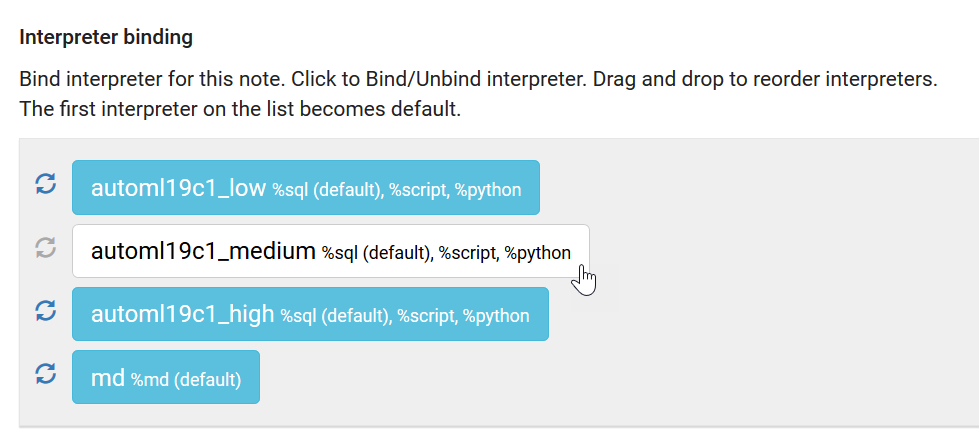
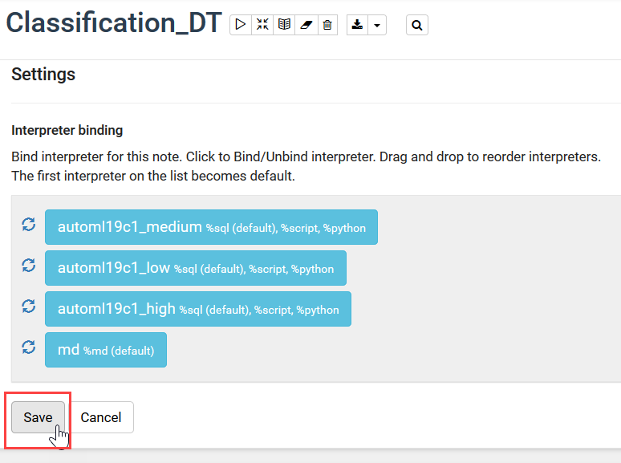
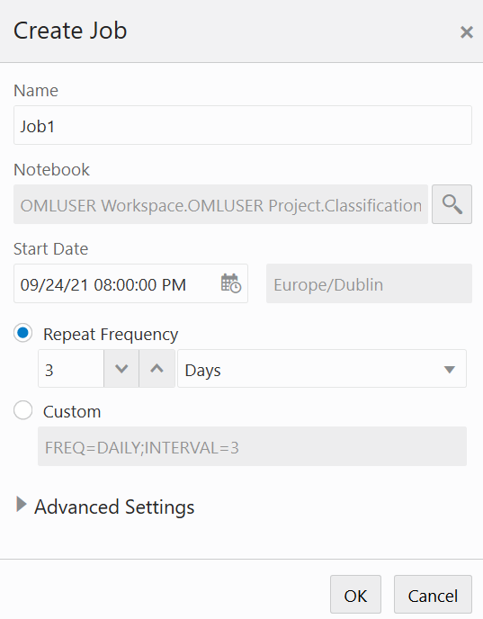

# Use Oracle Machine Learning

## Introduction

This lab walks you through the steps to sign into Oracle Machine Learning, create an OML notebook from scratch, create an OML notebook based on the example template notebooks, and create jobs to schedule notebooks to run at specific day and time.

Estimated Time: 15 minutes

### About Oracle Machine Learning
Oracle Machine Learning is a collaborative user interface supporting data scientists, analysts, developers, and DBAs. You can work with SQL, PL/SQL, and Python in the same notebook—using the most appropriate language for the problem at hand. You can also view notebook changes by team members in real time, interactively. Data science team members can explicitly share notebooks and version notebooks as well as schedule notebooks to run at a set time or a repeating schedule. By virtue of being included in Autonomous Database, machine learning functionality is automatically provisioned and managed.
Through Oracle Machine Learning, you have access to the in-database algorithms and analytics functions to explore and prepare data, build and evaluate models, score data, and deploy solutions.

### Objectives

In this lab, you will learn how to:
* Sign into Oracle Machine Learning
* Create an Oracle Machine Learning notebook from scratch
* Create a notebook based on an example template
* Check and update the interpreter binding settings for a notebook
* Schedule a notebook to run at a specific time using the Jobs interface

### Prerequisites

This lab assumes you have:
* An Oracle Machine Learning account
* Access to OMLUSER account


## Task 1: Sign into Oracle Machine Learning

A notebook is a web-based interface for data analysis, data discovery, data visualization, and collaboration. You create and run notebooks in Oracle Machine Learning. You can access Oracle Machine Learning from Oracle Autonomous Database.

1. Sign into your OCI console, click on the left navigation menu, and then click **Autonomous Database**.  

	

2. The Autonomous Database dashboard lists all the databases that are provisioned in the tenancy. Click the Oracle Autonomous Database that you have provisioned.

          	  

3. On your Oracle Autonomous Database instance page, click **Service Console**. The Launch Service Console dialog opens. Wait till the Service Console opens.

	


4. On the Service Console page, click **Development** on the left pane.

	

5. Click **Oracle Machine Learning User Interface.** This opens the Oracle Machine Learning sign in page.

  

6. Enter your user credentials and click **Sign in**. This opens the Oracle Machine Learning home page.

	>**Note:** The credential is what you have defined while creating the Oracle Machine Learning user.

	

This completes the task of accessing Oracle Machine Learning.


## Task 2: Create a Notebook and define paragraphs using the md, SQL, PL/SQL, and Python interpreters
To create a notebook:

1. On the Oracle Machine Learning home page, click **Notebooks**. The Notebooks page opens.

	

2. On the Notebooks page, click **Create**. The Create Notebook dialog opens.
	

3. In the Name field, enter **Test Notebook**.

4. In the **Comments** field, enter comments, if any.

5. In the **Connections** field, select a connection in the drop-down list. By default, the **Global Connection Group** is assigned.

6. Click **OK**. Your notebook is created and it opens in the notebook editor.


You can now use it to create a Markdown paragraph, SQL paragraph, and python paragraph and do the following:

### Task 2.1: Call the Markdown interpreter and generate static html from Markdown plain text
To call the Markdown interpreter and generate static html from Markdown plain text:

1. Type ``%md`` and press Enter.

2. Type the following:  

	* To generate static html text, type the text `Hello World` inside double quotes
	* To format the text in bold, type the text `Hello World` inside two asterisks pair
	* To format the text in italics, type the text `Hello World` either inside an asterisk pair or an underscore pair, and click **Run**

	

3. To display the text in a bulleted list, prefix * (asterisk) to the text, as shown in the screenshot below:

	

4. To display the text in heading1, heading 2 and heading 2, prefix # (hash) to the text and click Run. For H1, H2, and H3, you must prefix one, two, and three hashes respectively.

	


### Task 2.2: Call the SQL Interpreter and run SQL Statements
Let’s create another paragraph to call the SQL interpreter and run SQL statements:

1. Edit the paragraph tag and type ``%sql`` to call the SQL interpreter.
2. Type ``select table_name from user_tables`` and click Run. The command returns the table names in a tabular format - a table with one column `TABLE_NAME`, as shown in the screenshot:

	


### Task 2.3: Call the PL/SQL Interpreter and run PL/SQL Scripts

Let’s create another paragraph to call the PL/SQL interpreter and run PL/SQL scripts:
1. In the new paragraph, type ``%script`` to call the PL/SQL interpreter.
2. Type the following command and click Run. Alternatively, you can press Shift+Enter keys to run the paragraph.

    ```
    <copy>CREATE TABLE small_table
			(
			NAME VARCHAR(200),
			ID1 INTEGER,
			ID2 VARCHAR(200),
			ID3 VARCHAR(200),
			ID4 VARCHAR(200),
			TEXT VARCHAR(200)
			);

			BEGIN
			FOR i IN 1..100 LOOP
			INSERT INTO small_table VALUES ('Name_'||i, i,'ID2_'||i,'ID3_'||i,'ID4_'||i,'TEXT_'||i);
			END LOOP;
			COMMIT;
			END; </copy>
     ```


	

The PL/SQL script successfully creates the table SMALL_TABLE. The PL/SQL script in this example contains two parts:
* The first part of the script contains the SQL statement CREATE TABLE to create a table named ``small_table``. It defines the table name, table column, data types, and size. In this example, the column names are ``NAME, ID1, ID2, ID3, ID4, and TEXT``.

* The second part of the script begins with the keyword ``BEGIN``. It inserts 100 rows in to the table ``small_table``


### Task 2.4: Call the Python Interpreter and run Python Statements
Let’s create another paragraph to call the Python interpreter and run python statements:
1. Edit the paragraph tag and type ``%python`` to call the python interpreter.
2. Type the following command and click Run.

```
<copy>
import pandas as pd

		import oml

		DATA = oml.sync(table = "SUPPLEMENTARY_DEMOGRAPHICS", schema = "SH")

		z.show(DATA.head())
</copy>
```


The ``z.show`` command displays the SUPPLEMENTARY_DEMOGRAPHICS table present in the SH schema, as shown in the screenshot here. Use the ``z.show`` command to display Python objects, proxy object content, and to display the desired data in the notebook. You will learn more about ``z.show`` in the lab on Oracle Machine Learning for Python.


## Task 3: Create a Notebook using a Template Example

Tasks 3.1 and 3.2 demonstrate how to create notebooks based on Example templates.

* Task 3.1 shows how to create the OML4Py Classification notebook based on the OML4Py Classification DT example template. The template builds and applies the classification Decision Tree algorithm to build a classification model based on the relationships between the predictor values and the target values. The template uses the Sales History (`SH`) schema.
* Task 3.2 shows how to create the Time Series notebook based on the OML4SQL Time Series ESM example template. This template forecasts sales by using the Exponential Smoothing Algorithm for Time Series Data. It also used the `Sales` table in the SH schema.

### Task 3.1: Create an OML4Py Notebook using the Classification DT Template Example
This step demonstrates how to create the OML4Py Classification notebook based on the OML4Py Classification DT (Decision Tree) Example template:

1. On your Oracle Machine Learning home page, click **Examples** in the Quick Actions section. Alternatively, you can go to the left navigation menu and click **Examples** under templates. The Examples page opens with all the templates listed.

	

2. Navigate to the **OML4Py Classification DT** example template notebook. Alternatively, type DT in the search box on the upper right to get a list of the decision tree-related notebooks. Click the notebook and then click **Create Notebook**.

	

3. The Create Notebook dialog opens. The Name field displays the same name as the template. You can edit this name. In this example, enter **OML4Py Classification DT** and click **OK**.

	> **Note:** In the Project field, the current user, project and workspace is selected by default. You have the option to choose a different project or a workspace by clicking the edit icon here.  

	


4. Once the notebook is created, the message _Notebook Classification DT 1 created in project OMLUSER Project_ is displayed, as shown in the screenshot.

	


5. To view the notebook, navigate to the Notebooks page from the left navigation menu.

	


6. The Classification DT 1 notebook is now listed on the Notebooks page, as shown in the screenshot. Click it to open the notebook in the Notebooks editor. Note that you will run this notebook in the subsequent steps.

	

This completes the task of creating a notebook from an Example template.


### Task 3.2: Create a Time Series Notebook using the OML4SQL Time Series Template Example

This step demonstrates how to create the Time Series notebook based on the Example template:

1. Go to the **Examples** page under Templates in the OML menu or click **Examples** on the Oracle Machine Learning home page.

2. Navigate to the **OML4SQL Time Series ESM** example template notebook. Alternatively, type ESM in the search box on the upper right to get a list of the ESM-related notebooks. Click the notebook and then click **Create Notebook**.

	

3. The Create Notebook dialog opens. Provide a name for this notebook and click **OK**. In this example, enter **OML4SQL Time Series 1**.

	> **Note:** In the Project field, the current user, project and workspace is selected by default. You have the option to choose a different project or a workspace by clicking the edit icon here.  

	


4. Once the notebook is created, the message _Notebook OML4SQL Time Series 1 created in project OMLUSER Project_ is displayed.


5. To view the notebook, navigate to the Notebooks page from the left navigation menu.


6. The notebook **OML4SQL Time Series 1** is now listed on the Notebooks page, as shown in the screenshot. Click it to open the notebook in the Notebooks editor and work on it.

	

This completes the task of creating the Time Series notebook from the OML4SQL Time Series ESM Example template.


## Task 4: Change Interpreter Bindings Order

An interpreter allows using a specific data processing language at the backend to process commands entered in a notebook paragraph. For the notebooks in Oracle Machine Learning, you use the following interpreters:

* SQL interpreter for SQL Statements
* PL/SQL  interpreter for PL/SQL scripts/statements
* Python interpreter to process Python scripts
* md (MarkDown) interpreter for plain text formatting syntax so that it can be converted to HTML.

This is the initial binding order of the interpreters. You can change the order of the interpreter bindings by clicking and dragging an entry above or below others (turns from white to blue). You can also deselect a binding to disable it (turns from blue to white). This does not require dragging the enabled interpreters above the disabled ones.

* **Low** (Default): Provides the least level of resources for in-database operations, typically serial (non-parallel) running of database operations. It supports the maximum number of concurrent in-database operations by multiple users. The interpreter with low priority is listed at the top of the interpreter list, and hence, is the default.
* **Medium:** Provides a fixed number of CPUs to run in-database operations in parallel, where possible. It supports a limited number of concurrent users, typically 1.25 times the number of CPUs allocated to the Autonomous Database instance.
* **High:** Provides the highest level of CPUs to run in-database operations in parallel, up to the number of CPUs allocated to the Autonomous Database instance. It offers the highest performance but supports the minimum number of concurrent in-database operations, typically 3.

	> **Note:** The interpreter binding order that is set for a notebook applies to all the paragraphs in that notebook. However, you can override the binding of an individual paragraph also. This is an advanced topic, and is not covered in this workshop.

In this step, you learn how to set the interpreter bindings:
1. Open the **Classification_DT** notebook, and click  on the top right corner of the notebook. This opens the interpreter settings.

	

2. Click **medium** and drag and drop it on top of the list.

	

	>**Note:** You can disable a particular binding by deselecting it (turns from blue to white) or enable it by selecting it ( turns from white to blue). However, this does not require dragging the enabled interpreters above the disabled ones.


	

3. Once you successfully drag and drop it on top of the list, click **Save**.

	

Clicking **Save** records the changes and hides the interpreter settings. You can verify it again by clicking the gear icon. This completes the task of changing the interpreter binding order.

## Step 5: Create Jobs to Schedule Notebook Run
Jobs allow you to schedule the running of notebooks. On the Jobs page, you can create jobs, duplicate jobs, start and stop jobs, delete jobs, and monitor job status by viewing job logs, which are read-only notebooks. In this lab, you will learn how to create a job to schedule the running of the notebook Classification_DT.

To create a job:

1. On the Oracle Machine Learning UI home page, click **Jobs**. Alternatively, in the left navigation menu, click **Jobs**.

	

2. On the Jobs page, click **Create**. The Create Jobs dialog box opens.

	

3. In the **Name** field, enter `Job1`. The number of characters in the job name must not exceed 128 bytes.

	

4. In the **Notebook** field, click the search icon to select a notebook to create a job. Navigate through the OMLUSER workspace and OMLUSER project and select `Classification_DT`.

	> **Note:** Only notebooks that are owned by the user or shared are available for selection.

5. In the **Start Date** field, click the date-time editor to set the date and time for your job to commence. Select 09/24/21 and time 08.00.00 pm. Based on the selected date and time, the next run date is computed.

6. Select **Repeat Frequency** and enter **3**, and select **Days** to set the repeat frequency and settings. You can set the frequency in minutes, hours, days, weeks, and months.

7. Expand **Advanced Settings**, and specify the following settings:

	

	* **Maximum Number of Runs:** Select **3**. This specifies the maximum number of times the job must run before it is stopped. When the job reaches the maximum run limit, it will stop.  

	* **Timeout in Minutes:** Select **60**. This specifies the maximum amount of time a job should be allowed to run.

	* **Maximum Failures Allowed:** Select **3**. This specifies the maximum number of times a job can fail on consecutive scheduled runs. When the maximum number of failures is reached, the next run date column in the Jobs UI will show an empty value to indicate the job is no longer scheduled to run. The Status column may show the status as `Failed`.

		> **Note:** Select Automatic Retry if you do not wish to specify the maximum failures allowed manually.  

8. Click **OK**.

This completes the task of creating a job.

You may now **proceed to the next lab**.

## Learn More


* [Oracle Machine Learning UI](https://docs.oracle.com/en/database/oracle/machine-learning/oml-notebooks/)
* [Interactive Tour - Oracle Machine Learning UI](https://docs.oracle.com/en/cloud/paas/autonomous-database/oml-tour/)

## Acknowledgements
* **Author** -  Moitreyee Hazarika, Principal User Assistance Developer, Database User Assistance Development
* **Contributors** -   Mark Hornick, Senior Director, Data Science and Machine Learning; Marcos Arancibia Coddou, Product Manager, Oracle Data Science; Sherry LaMonica, Principal Member of Tech Staff, Advanced Analytics, Machine Learning
* **Last Updated By/Date** - Moitreyee Hazarika, December, 2021
