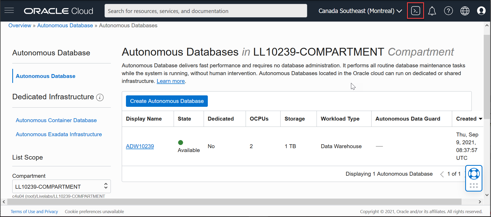

# Use Oracle Machine Learning Services

## Introduction

 In this lab, you will get a quick tour of basic OML Services features. You will learn how to obtain an authentication token for your user account to get started with OML Services and then use OML Services to explore the APIs, get model information and score with a model. You will also get a chance to use Oracle's proprietary Cognitive Text model.

Estimated Time: 30 minutes

### About Oracle Machine Learning Services
OML Services extends OML functionality to support model deployment and model lifecycle management for both in-database OML models and third-party Open Neural Networks Exchange (ONNX) machine learning models via REST APIs. These third-party classification or regression models can be built using tools that support the ONNX format, which includes packages like Scikit-learn and TensorFlow, among several others.

Oracle Machine Learning Services provides REST endpoints through the Oracle Autonomous Database environment. These endpoints enable the storage of machine learning models along with their metadata, the creation of scoring endpoints for the model, and producing scores using these endpoints.

### Objectives

In this lab, you will:
* Authenticate your user account with your Autonomous Database instance to use OML Services.
    * Obtain authentication token.
    * Refresh authentication token.
    * Revoke authentication token.
* Explore APIs. Specifically:
    * View the API.
    * Get a list of saved models.
    * View a specific model by referencing the model ID.
    * Get a list of models filtered by model name.
    * Get a list of models filtered by version and namespace.
* Get a model scoring endpoint.
* Score data with a model.
    * Perform singleton scoring and mini-batch scoring.
    * Use Oracle's Cognitive Text functionality to discover keywords and get a summary for a given text string.
* Review OML Services support for ONNX format models


### Prerequisites

This lab assumes you have:
* cURL installed for your operating system to run the OML Services commands if you are using your free trial account or your own OCI tenancy. Alternatively, you can use OCI Cloud Shell which has cURL installed. If you are using LiveLabs tenancy, you will use OCI Cloud Shell to run these commands.
* an Autonomous Database instance created in your account/tenancy if you are using your own tenancy or a free trial account. You should have handy the following information for your instance:
    * Your OML user name and password
    * OML server name
    * Tenant name
    * Database name
* completed all previous labs successfully.

## Task 1: Authenticate Your User Account with Your Autonomous Database Instance to Use OML Services

1.  If you are using the LiveLab tenancy, use the OCI Cloud Shell to perform the steps in this lab. To access the OCI Cloud Shell, select your compartment and click on the Cloud Shell icon.

	 

   On clicking the Cloud Shell icon, the OCI Cloud Shell command prompt is displayed in the lower half of the console as illustrated in the image below.

  

2. To access Oracle Machine Learning Services using the REST API, you must acquire an access token. To authenticate and obtain an access token, use cURL with the -d option to pass the user name and password for your Oracle Machine Learning Services account against the Oracle Machine Learning User Management Cloud Service token service. Use the following details to get an authentication token.
    * Your OML user name
    * Your OML password
    * OML server URL

   Here is the syntax:
     ```
     <copy>curl -X POST --header 'Content-Type: application/json' --header 'Accept: application/json'\
     -d '{"grant_type":"password", "username":"'${oml_username}'", "password":"'${oml_password}'"}'\
     "<OML server URL>/omlusers/api/oauth2/v1/token"</copy>
     ```
   In the syntax above, OML server URL is the Autonomous Database URL and points to the region where the Autonomous Database instance resides. The URL also contains the database name and tenancy ID. You can obtain this URL information from the Development tab on the Autonomous Database service console. From your ADB instance details page, click open the service console.

  

   On the service console, click the Development link on the left panel.

  

   Scroll down the Development page to view the Oracle Machine Learning RESTful Services tile, and copy the URL for your ADB instance.

  

   Now, go back to the Cloud Shell interface and run a command to obtain a token. First set variables for the parameters for ease of use in subsequent requests.

    ```
    <copy>export omlserver=<omlserver url>
    export oml_username=OMLUSER
    export oml_password=<*******></copy>

    ```
   In the command above,
     * omlserver url is the URL that you copied from the ADB console. An example of omlserver URL is https://aabbcc123456xyz-db2.adb.us-ashburn-1.oraclecloudapps.com. In this URL ``aabbcc123456xyz`` is the tenancy ID, ``db2`` is the database name and ``adb.us-ashburn-1.oraclecloudapps.com`` is the region name.
     * OMLUSER is your OML user name.
     * The set of asterisks within angle brackets is your OML password.

   Run the following command to obtain an authentication token that uses the variables set above.

    ```
    <copy>curl -X POST --header 'Content-Type: application/json' --header 'Accept: application/json'\
    -d '{"grant_type":"password", "username":"'${oml_username}'", "password":"'${oml_password}'"}'\
    "${omlserver}/omlusers/api/oauth2/v1/token"</copy>
    ```
   Successfully running the command above results in a token as displayed below. In this example result, the token string is
  truncated as indicated by the ellipses (three dots).

    ```
    {"accessToken":"eyJhbGci... KLbI1wQ==","expiresIn":3600,"tokenType":"Bearer"}

    ```

3. A token is valid for an hour. You can refresh a token for up to 8 hours after generating it. Each refresh will extend its validity by an hour. In order to run the command to refresh the token (or any command that uses the token for authentication), you should save the returned token as a variable and use the variable for convenience. Enclose the token within single quotes:

    ```
    <copy>export token = 'eyJhbGci... KLbI1wQ=='</copy>
    ```
   Here's the syntax for refreshing a token:

    ```
    <copy>curl -i -X POST --header 'Content-Type: application/json' --header 'Accept: application/json' --header "Authorization: Bearer ${token}" -d '{"grant_type":"refresh_token", "refresh_token":"'${token}'"}' "${omlserver}/omlusers/api/oauth2/v1/token"</copy>
    ```
   Running a command to refresh a token results in an output similar to this:

    ```
    HTTP/1.1 100 Continue

    HTTP/1.1 200 OK
    Date: Mon, 06 Sep 2021 07:09:55 GMT
    Content-Type: application/json
    Content-Length: 1103
    Connection: keep-alive
    Cache-Control: no-cache, no-store, must-revalidate
    Pragma: no-cache
    X-Frame-Options: SAMEORIGIN
    X-XSS-Protection: 1;mode=block
    Strict-Transport-Security: max-age=31536000; includeSubDomains
    X-Content-Type-Options: nosniff
    Content-Security-Policy: frame-ancestors 'none'

    {"accessToken":"eyJhbGci... KLbI1wQ==","expiresIn":3600}

    ```
4. You can also revoke a token. You cannot use or refresh a token you have revoked. For this LiveLab, do not perform this step. The syntax is provided for your reference.

    ```
    <copy>curl -i -X POST --header 'Content-Type: application/json' --header 'Accept: application/json' --header "Authorization: Bearer ${token}" "${omlserver}/omlusers/api/oauth2/v1/token/revoke"</copy>
    ```
   Running the command above produces a result similar to this:

    ```
    HTTP/1.1 200 OK
    Date: Mon, 06 Sep 2021 07:12:49 GMT
    Content-Type: application/json
    Content-Length: 15
    Connection: keep-alive
    Cache-Control: no-cache, no-store, must-revalidate
    Pragma: no-cache
    X-Frame-Options: SAMEORIGIN
    X-XSS-Protection: 1;mode=block
    Strict-Transport-Security: max-age=31536000; includeSubDomains
    X-Content-Type-Options: nosniff
    Content-Security-Policy: frame-ancestors 'none'

    {"status":"ok"}
    ```

## Task 2: Explore OML Services REST APIs

1. View the content of OML Services REST APIs. You can return the API content in a readable format by using the Linux utility jq.  First, install the jq utility in your system if it is not already installed. If you are using OCI Cloud Shell in the LiveLabs tenancy, you don't need to perform this step as OCI Cloud Shell comes with jq pre-installed. In your own tenancy or a trial account, you can check if jq is installed by running the command rpm -qa jq. If this command returns an empty value, jq is not installed. After installing jq, run the curl command to view the APIs.
    ```
    <copy>sudo yum install jq</copy>

    ```
    ```
    <copy>curl -i -X GET --header "Authorization: Bearer ${token}" "${omlserver}/omlmod/v1/api"</copy>

    ```
   Here's the result, in a truncated form, of running the command above:

    ```
    "lifecycle": {
                "type": "string",
                "enum": [
                  "active",
                  "deprecated"
                ]
              },
                "links": {
                  "type": "array",
                  "items": {
                    "$ref": "#/components/schemas/OMLResourceLink"
              }
            }
          }
        },
        "ApiVersionCollection": {
          "required": [
           "items",
           "links"
         ],
         "properties": {
          "items": {
            "type": "array",
            "items": {
              "$ref": "#/components/schemas/ApiVersion"
            }
    ...

    ```


2.  Get a list of saved models. For this step to return results, you need to have models deployed in your OML user account. If you have completed Labs 2 , 3 or 4, your account should include deployed models. Refer back to Lab 4 Using OML AutoML UI  to know how to quickly create and save a  model.

    ```
    <copy>curl -X GET --header "Authorization: Bearer ${token}" "${omlserver}/omlmod/v1/models" | jq</copy>

    ```
   The result of running the command above is displayed below:

    ```
    {
      "items": [
          {
            "version": "1.0",
            "modelType": "OML",
            "createdBy": "OMLUSER",
            "modelId": "71c51f2b-6178-4b18-a79d-383cb7afd0af",
            "modelName": "automl_affcard_nb",
            "links": [
              {
                "rel": "self",
                "href": "https://aabbcc123456xyz-db2.adb.us-ashburn-1.oraclecloudapps.com/omlmod/v1/models/71c51f2b-6178-4b18-a79d-383cb7afd0af"
              }
                     ],
            "namespace": "automl_affinity_card",
            "shared": false,
            "storedOn": "2021-08-24T06:48:52.639Z"
          },
          {
            "version": "1.0",
            "modelType": "OML",
            "createdBy": "OMLUSER",
            "modelId": "6c6edf94-8b9c-4ca0-984a-271f23813793",
            "modelName": "automl_cust360_affcard_nb",
            "links": [
              {
                "rel": "self",
                "href": "https://aabbcc123456xyz-db2.adb.us-ashburn-1.oraclecloudapps.com/omlmod/v1/models/6c6edf94-8b9c-4ca0-984a-271f23813793"
              }
                     ],
            "namespace": "automl_cust360_affinity_card",
            "shared": false,
            "storedOn": "2021-09-06T04:54:08.908Z"
          }
               ],
      "links": [
          {
            "rel": "self",
            "href": "https://aabbcc123456xyz-db2.adb.us-ashburn-1.oraclecloudapps.com/omlmod/v1/models"
          }
              ]
    }

    ```


3. View a model's details by providing its name in the REST API call. In this case, the model name is `automl_affcard_nb`.

    ```
    <copy>curl -X GET --header "Authorization: Bearer $token" "${omlserver}/omlmod/v1/models?modelName=automl_affcard_nb" | jq</copy>

    ```
   Running the command above produces the model details for the model `automl_affcard_nb` as displayed below:

    ```
    {
      "items": [
        {
          "version": "1.0",
          "modelType": "OML",
          "createdBy": "OMLUSER",
          "modelId": "71c51f2b-6178-4b18-a79d-383cb7afd0af",
          "modelName": "automl_affcard_nb",
          "links": [
            {
              "rel": "self",
              "href": "https://aabbcc123456xyz-db2.adb.us-ashburn-1.oraclecloudapps.com/omlmod/v1/models/71c51f2b-6178-4b18-a79d-383cb7afd0af"
            }
      ],
          "namespace": "automl_affinity_card",
          "shared": false,
          "storedOn": "2021-08-24T06:48:52.639Z"
        }
    ],
      "links": [
        {
          "rel": "self",
          "href": "https://aabbcc123456xyz-db2.adb.us-ashburn-1.oraclecloudapps.com/omlmod/v1/models"
        }
      ]
    }

    ```

4.  Next, get a list of models filtered by version=1.0 and namespace=`automl_affinity_card`.

    ```
    <copy>curl -X GET --header "Authorization: Bearer $token" "${omlserver}/omlmod/v1/models?version=1.0&namespace=automl_affinity_card" | jq</copy>

    ```
   The command above applies the filters and produces the following result:

    ```
    {
     "items": [
        {
          "version": "1.0",
          "modelType": "OML",
          "createdBy": "OMLUSER",
          "modelId": "71c51f2b-6178-4b18-a79d-383cb7afd0af",
          "modelName": "automl_affcard_nb",
          "links": [
            {
              "rel": "self",
              "href": "https://aabbcc123456xyz-db2.adb.us-ashburn-1.oraclecloudapps.com/omlmod/v1/models/71c51f2b-6178-4b18-a79d-383cb7afd0af"
            }
      ],
          "namespace": "automl_affinity_card",
          "shared": false,
          "storedOn": "2021-08-24T06:48:52.639Z"
        }
    ],
      "links": [
        {
          "rel": "self",
          "href": "https://aabbcc123456xyz-db2.adb.us-ashburn-1.oraclecloudapps.com/omlmod/v1/models"
        }
      ]
    }

    ```

## Task 3: Get Model Endpoint Details

1. Get model endpoint details for the model that you created in the preceding labs (Labs 2 through 4). Use the following values:

    * authentication token=generated in Task 1 or if expired then a refreshed or regenerated token
    * omlserver= e.g. https://aabbcc123456xyz-db2.adb.us-ashburn-1.oraclecloudapps.com. In this URL, ``aabbcc123456xyz`` is the tenancy ID, ``db2`` is the database name and ``adb.us-ashburn-1.oraclecloudapps.com`` is the region name.
    * model URI=e.g. `automl_cust360_affinity_card_nb` (To get the URI for the model that you want the endpoint for, log in to OML Notebooks, go to the Models page,  Deployed tab.)

    ```
    <copy>curl -X GET "${omlserver}/omlmod/v1/deployment/automl_cust360_affinity_card_nb" \
    --header "Authorization: Bearer $token" | jq</copy>

    ```
   The endpoint details of the model with the model URI `automl_affinity_card_nb` are displayed below:

    ```
    {
      "version": "1.0",
      "modelType": "OML",
      "createdBy": "OMLUSER",
      "modelId": "6c6edf94-8b9c-4ca0-984a-271f23813793",
      "modelName": "automl_cust360_affcard_nb",
      "metadata": {
        "miningFunction": "CLASSIFICATION",
        "algorithm": "NAIVE_BAYES",
        "attributes": [
          {
            "name": "CUST_GENDER",
            "attributeType": "CATEGORICAL"
          },
          {
            "name": "CUST_MARITAL_STATUS",
            "attributeType": "CATEGORICAL"
          },
          {
            "name": "CUST_YEAR_OF_BIRTH",
            "attributeType": "NUMERICAL"
          },
          {
            "name": "EDUCATION",
            "attributeType": "CATEGORICAL"
          },
          {
            "name": "HOUSEHOLD_SIZE",
            "attributeType": "CATEGORICAL"
          },
          {
            "name": "OCCUPATION",
            "attributeType": "CATEGORICAL"
          },
          {
            "name": "YRS_RESIDENCE",
            "attributeType": "NUMERICAL"
          },
          {
            "name": "Y_BOX_GAMES",
            "attributeType": "NUMERICAL"
          }
        ],
        "output": {
        "name": "AFFINITY_CARD",
        "attributeType": "CATEGORICAL"
        },
        "labels": [
          "0",
          "1"
        ],
        "modelName": "automl_cust360_affcard_nb"
      },
      "links": [
        {
          "rel": "self",
          "href": "https://aabbcc123456xyz-db2.adb.us-ashburn-1.oraclecloudapps.com/omlmod/v1/deployment/automl_cust360_affinity_card_nb"
        }
      ],
      "namespace": "automl_cust360_affinity_card",
      "shared": false,
      "uri": "automl_cust360_affinity_card_nb",
      "deployedOn": "2021-09-06T04:54:08.954Z"
    }

    ```
## Task 4: Score singleton and mini batch records against a model

1. Score a single record with a model. You need the following information handy to make a REST call to score with a model:

    * OML server name
    * Model URI of the model against which you are scoring
    * A valid authentication token
    * Input record to score

   Here's the syntax:

    ```
    <copy>curl -X POST "${omlserver}/omlmod/v1/deployment/${model_URI}/score" \
    --header "Authorization: Bearer ${token}" \
    --header 'Content-Type: application/json' \
    -d '{"topNdetails":n,"inputRecords":[{"XXX":value,"YYY":value}]}'| jq</copy>

    ```
  In the syntax above, the parameter `topNdetails` is optional. It fetches the top n prediction details for the record you are scoring. Prediction details refer to the attributes or features that impact a prediction. In the following example,  you specify the model URI `automl_affinity_card_nb` and a valid token generated in Task 1. The model was built using the Supplementary Demographics data set. To score with a single record, for XXX use `YRS_RESIDENCE` with the value of 10 and for YYY  use `Y_BOX_GAMES` with a value of 0. You want to predict the probability that the person associated with this record will purchase the affinity card.

    ```
   <copy>curl -X POST "${omlserver}/omlmod/v1/deployment/automl_cust360_affinity_card_nb/score" \
    --header "Authorization: Bearer ${token}" \
    --header 'Content-Type: application/json' \
    -d '{"inputRecords":[{"YRS_RESIDENCE":10,"Y_BOX_GAMES":0}]} | jq</copy>

    ```
   Here's the score for the data above. It indicates the probability value for each label.

    ```
    {
      "scoringResults": [
        {
         "classifications": [
           {
             "label": "0",
             "probability": 0.9850329798772426
           },
           {
             "label": "1",
             "probability": 0.014967020122757546
           }
         ]
        }
      ]
    }

    ```


2.  Next, score a mini-batch of 2 records with the same model URI. For the first record, use the same data as in the singleton scoring step above. For the second record and the prediction details parameter, use the data shown below. You want to return the top 3 attributes that impact the predictions and, therefore, set `topNdetails` to 3.:
    * `YRS_RESIDENCE`=5
    * `Y_BOX_GAMES`=1
    * `topNdetails` = 3

    ```
    <copy>curl -X POST "${omlserver}/omlmod/v1/deployment/automl_cust360_affinity_card_nb/score" \
    --header "Authorization: Bearer ${token}" \
    --header 'Content-Type: application/json' \
    -d '{"topNdetails:3", "inputRecords":[{"YRS_RESIDENCE":10,"Y_BOX_GAMES":0},
                     {"YRS_RESIDENCE":5,"Y_BOX_GAMES":1}]}'} | jq</copy>

    ```
    The scores for the above two records, along with the prediction details for each score, are displayed below:

    ```
    {
      "scoringResults": [
        {
            "classifications": [
                {
                    "label": "0",
                    "probability": 0.9850329798772426
                },
                {
                    "label": "1",
                    "probability": 0.014967020122757546
                }
                   ],
            "details":  [
                {
                    "columnName": "YRS_RESIDENCE",
                    "weight": 1.097
                },
                {
                    "columnName": "Y_BOX_GAMES",
                    "weight": 0.971
                },
                {
                    "columnName": "CUST_YEAR_OF_BIRTH",
                    "weight": 0.349
                }
                   ]
        },
        {
            "classifications": [
                {
                    "label": "0",
                    "probability": 0.9984975504253337
                },
                {
                     "label": "1",
                    "probability": 0.0015024495746662695
                }
                   ],
            "details":         [
                {
                    "columnName": "YRS_RESIDENCE",
                    "weight": 1.097
                },
                {
                    "columnName": "CUST_YEAR_OF_BIRTH",
                    "weight": 0.349
                },
                {
                    "columnName": "Y_BOX_GAMES",
                    "weight": 0.174
                }
                   ]
        }
      ]
    }

    ```

3. In this task, use Oracle's proprietary Cognitive Text functionality. This functionality provides endpoints to score a string of text to obtain information such as most relevant keywords, topics, text summary, sentiment, similarity to another text string and text features. The supported languages for Cognitive Text include English (America), Spanish, French and Italian. In this step, pass a text string to obtain keywords and its summary using the relevant end points. Here's the syntax for using the keywords endpoint:

    ```
    <copy>curl -X POST "${omlserver}/omlmod/v1/cognitive-text/keywords" \
    --header 'Content-Type: application/json' \
    --header "Authorization: Bearer ${token}" \
    --data '{
         "topN":<n=number of top keywords to return>,
         "textList":["<text to score>"]
            }' | jq</copy>

    ```
   In the syntax above,

    * topN is an optional parameter, which determines the number of most relevant keywords to return. If you don't specify this parameter, by default 5 keywords are returned.
    * textList is a required parameter to pass the text string to be scored.

   Run the following command to obtain the top 2 most relevant keywords in the provided text string.

    ```
    <copy>curl -X POST "${omlserver}/omlmod/v1/cognitive-text/keywords" \
    --header 'Content-Type: application/json' \
    --header "Authorization: Bearer ${token}" \
    --data '{
         "topN":2,
         "textList":["With Oracle Machine Learning, Oracle moves the algorithms to the data. Oracle runs machine learning within the database, where the data reside. This approach minimizes or eliminates data movement, achieves scalability, preserves data security, and accelerates time-to-model deployment. Oracle delivers parallelized in-database implementations of machine learning algorithms and integration with the leading open source environments R and Python. Oracle Machine Learning delivers the performance, scalability, and automation required by enterprise-scale data science projects - both on-premises and in the Cloud."]
            }' | jq</copy>

    ```

   Here's the result of running the command above. Notice that the result includes a weight for each keyword returned.

    ```
    [
      {
        "text": "With Oracle Machine Learning, Oracle moves the algorithms to the data. Oracle runs machine learning within the database, where the data reside. This approach minimizes or eliminates data movement, achieves scalability, preserves data security, and accelerates time-to-model deployment. Oracle delivers parallelized in-database implementations of machine learning algorithms and integration with the leading open source environments R and Python. Oracle Machine Learning delivers the performance, scalability, and automation required by enterprise-scale data science projects - both on-premises and in the Cloud.",
        "keywordResults": [
           {
              "keyword": "algorithms",
              "weight": 0.47299225792183597
           },
           {
              "keyword": "Oracle",
              "weight": 0.419561506545797
           }
         ]
       }
    ]

    ```

4. Next, get a summary of the same text string that you passed in the previous step by using the summary endpoint. Run the following command:

    ```
    <copy>curl -X POST "${omlserver}/omlmod/v1/cognitive-text/summary" \
    --header 'Content-Type: application/json' \
    --header "Authorization: Bearer ${token}" \
    --data '{
     "topN":2,
     "textList":["With Oracle Machine Learning, Oracle moves the algorithms to the data. Oracle runs machine learning within the database, where the data reside. This approach minimizes or eliminates data movement, achieves scalability, preserves data security, and accelerates time-to-model deployment. Oracle delivers parallelized in-database implementations of machine learning algorithms and integration with the leading open source environments R and Python. Oracle Machine Learning delivers the performance, scalability, and automation required by enterprise-scale data science projects - both on-premises and in the Cloud."]
    }' | jq</copy>

    ```
   Here's the result of running the command above. Two summary statements have been returned as the topN parameter was set to 2.
For each summary, an associated weight is also returned.

    ```
    "summaryResults": [
        {
          "sentence": "With Oracle Machine Learning, Oracle moves the algorithms to the data. ",
          "weight": 0.7629768490745089
        },
        {
          "sentence": "Oracle delivers parallelized in-database implementations of machine learning algorithms and integration with the leading open source environments R and Python. ",
          "weight": 0.8173779491556387
        }
      ]

    ```
## Task 5: Review OML Services support for ONNX Models

   Open Neural Network Exchange or ONNX is an open standard format of machine learning models. By using the Oracle Machine Learning Services REST API, you can deploy and score with your ONNX format models (both image and non-image).

   The REST API is exposed as part of the Oracle Machine Learning Services on Oracle Autonomous Database cloud service. The Oracle Machine Learning Services REST API supports ONNX format model deployment through REST endpoints for:

   * Classification models (both non-image models and image models)
   * Regression models

To learn more about how OML Services support ONNX format models, see resources listed under the Learn More section of this lab.


## Learn More

* [REST API for Oracle Machine Learning Services](https://docs.oracle.com/en/database/oracle/machine-learning/omlss/omlss/index.html)
* [Work with Oracle Machine Learning ONNX Format Models](https://docs.oracle.com/en/database/oracle/machine-learning/omlss/omlss/omls-example-onnx-ml.html)
* [Work with Oracle Machine Learning ONNX Image Models](https://docs.oracle.com/en/database/oracle/machine-learning/omlss/omlss/omls-example-onnx-image.html)

## Acknowledgements
* **Author** - Suresh Rajan, Senior Manager, Oracle Database User Assistance Development
* **Contributors** -  Mark Hornick, Senior Director, Data Science and Oracle Machine Learning Product Management; Sherry LaMonica, Principal Member of Technical Staff, Oracle Machine Learning
* **Last Updated By/Date** - Suresh Rajan, December 2021
