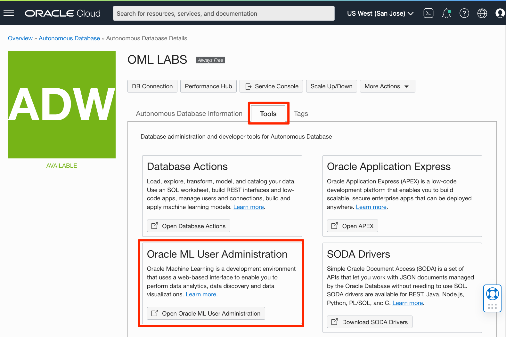
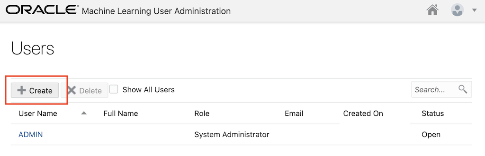
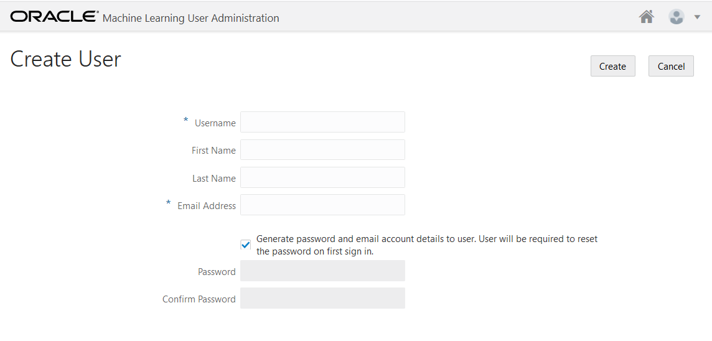
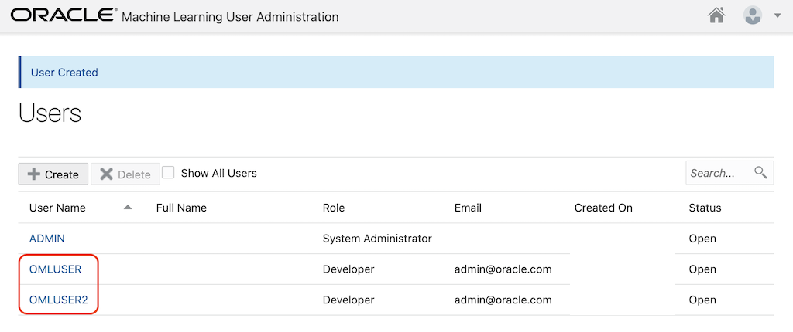

# Appendix: OML user administration

## Introduction
This lab walks you through the steps to create and manage an Oracle Machine Learning user.

Estimated Time: 5 minutes

### Objectives

In this lab, you will learn how to:
* Access Oracle Machine Learning Notebooks administration interface
* Create an Oracle Machine Learning user
* Get familiar with OML user settings

## Task 1: Access the Oracle Machine Learning administration interface

An administrator creates a new user account and user credentials for Oracle Machine Learning in the User Management interface.

> **Note:** You must have the administrator role to access the Oracle Machine Learning User Management interface. To create a user account:

1. On the Autonomous Database Details page, click **Tools**, and then click on the **Oracle ML User Administration** tile.

    

2. You will be asked for your ADMIN credentials to login.

   

3. To create a new user, click **Create** on the Oracle Machine Learning User Administration page.
    

4. On the Create User page, enter the following details to create a user called `OMLUSER`:
    
    - **Username:** Enter `omluser` for username. Using this username, the user will log in to an Oracle Machine Learning instance.
    - **First Name:** Enter the first name of the user.
    - **Last Name:**  Enter the first name of the user.
    - **Email Address:** Enter the email ID of the user.
    - Select the **Generate password and email account details to user. User will be required to reset the password on first sign in**  check box to auto generate a temporary password and send an email with the account credentials to the user.
    If you select this option, you don't need to enter values in the **Password** and **Confirm Password** fields; the fields are grayed out.
    - **Password:** Enter a password for the user, if you choose to create a password for the user.
    This option is disabled if you select the **Generate password...** option to auto generate a temporary password for the user.
    - **Confirm Password:** Enter a password to confirm the value that you entered in the Password field.
    By doing so, you create the password for the user. The user can change the password when first logging in.
    
    Click **Create.**

5. You can repeat step 5 and if you need to create additional users.  For example, if you create an additional user named `omluser2`, you will see the result below.

    

## Learn More

* [Administer Oracle Machine Learning](https://docs.oracle.com/en/database/oracle/machine-learning/oml-notebooks/omlug/administer-oracle-machine-learning.html#GUID-E74F0E2E-EEE5-4421-A0BB-96A58811C04A)
* [Oracle Machine Learning Notebooks](https://docs.oracle.com/en/database/oracle/machine-learning/oml-notebooks/)

## Acknowledgements
* **Authors** - Marcos Arancibia, Product Manager, Machine Learning; Moitreyee Hazarika, Principal User Assistance Developer
* **Contributors** -  Mark Hornick, Senior Director, Data Science and Machine Learning; Sherry LaMonica, Principal Member of Tech Staff, Machine Learning; Jie Liu, Data Scientist
* **Last Updated By/Date** - Marcos Arancibia, October 2021
