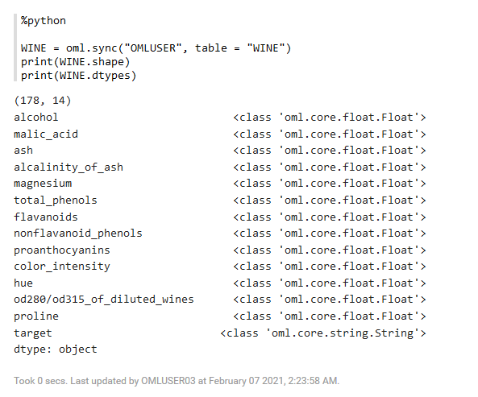
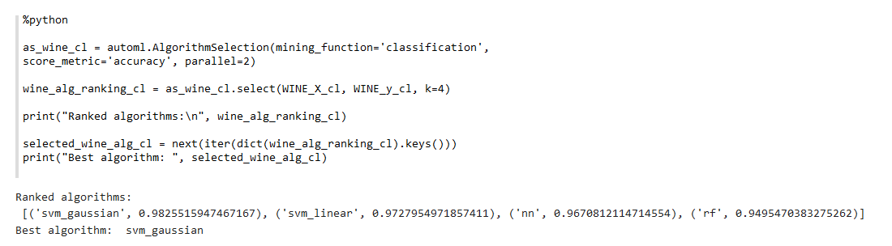
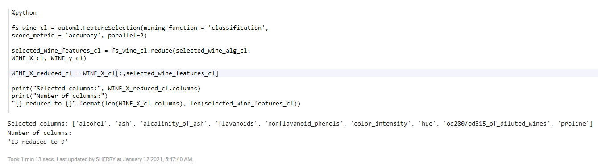
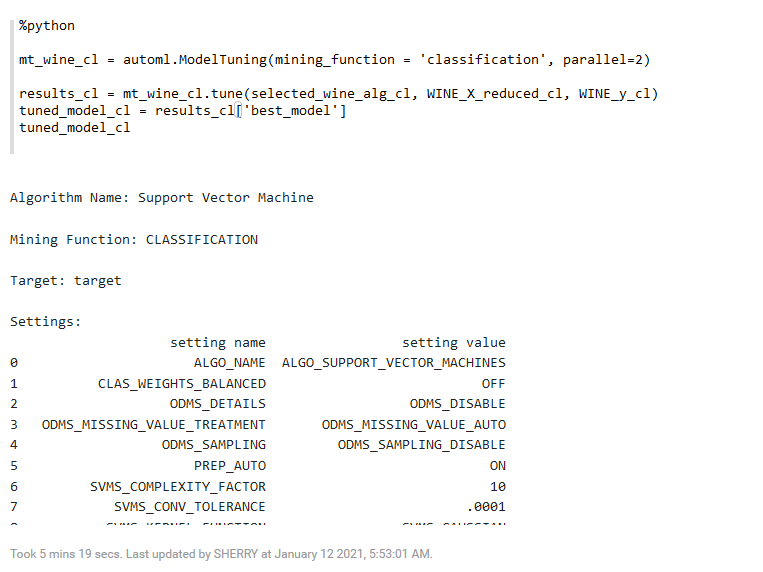
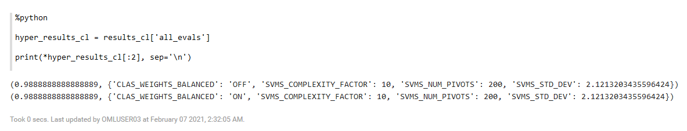
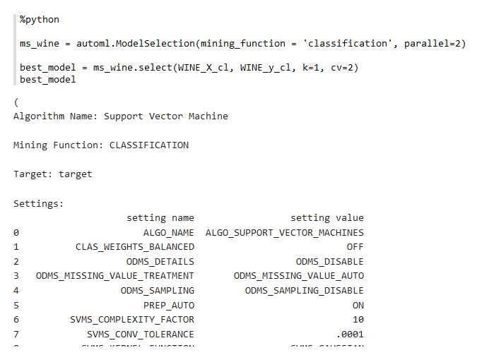

# Use AutoML

## Introduction

This lab walks you through the steps to use the AutoML functionality.

Estimated Lab Time: 15 minutes

### About AutoML
AutoML (Automated Machine Learning) provides built-in data science expertise about data analytics and modeling that you can employ to build machine learning models.

### Objectives

In this lab, you will learn how to:
* Create data set (wine data) as Pandas DataFrame and load into Oracle Autonomous Database
* Use `automl.AlgorithmSelection` to rank the in-database algorithms by predicted score metric for classification or regression problems
* Use `automl.FeatureSelection` to quickly identify the most relevant feature subsets for the provided training data set and an in-database algorithm
* Use `automl.ModelTuning` to tune the hyperparameters for the specified algorithm and training data
* Use `automl.ModelSelection` to select the top in-database algorithm, and then tune the corresponding model


## (Optional) Download and View the Notebook File

To download the notebook version of this lab (without screenshots), click [here](./../notebooks/lab6_automl.json?download=1).

[](include:import)

## **Step 1**: Import libraries supporting OML4Py

1. Run the following script to import `oml` module, Pandas package, and `automl` module.
    ```
    <copy>%python

    import pandas as pd
    import oml
    from oml import automl</copy>
    ```

2. Use the `oml.sync` function to create an Oracle Machine Learning Dataframe as a proxy for the database table WINE.
    ```
    %python
    <copy>

    WINE = oml.sync("OMLUSER", table = "WINE")
    print(WINE.shape)
    print(WINE.dtypes)</copy>
    ```
        

## **Step 2:** Automated Algorithm Selection
In this step, you prepare the wine data set by separating predictors from the target as conventional for Python model building. This produces two new proxy objects that will be used in AutoML functions.
1. Run the following script to prepare the wine data set:
    ```
    %python
    <copy>

    WINE_X_cl,WINE_y_cl = WINE.drop('target'), WINE['target']</copy>
    ```

2. Run the following script to select the top classification algorithms for predicting the WINE data target. It displays the top ranked algorithms and their accuracy.
    ```
    %python
    <copy>

    as_wine_cl = automl.AlgorithmSelection(mining_function='classification', score_metric='accuracy', parallel=2)

    wine_alg_ranking_cl = as_wine_cl.select(WINE_X_cl, WINE_y_cl, k=4)

    print("Ranked algorithms:\n", wine_alg_ranking_cl)

    selected_wine_alg_cl = next(iter(dict(wine_alg_ranking_cl).keys()))
    print("Best algorithm: ", selected_wine_alg_cl)</copy>
    ```
    

    The script returns the SVM Gaussian, SVM Linear, Neural Network and Random Forest. Among these, SVM Gaussian is ranked first, and we will use that in subsequent AutoML function calls.

## **Step 3:** Automated Feature Selection
In this step, you determine the features that best support the selected algorithm. First define a FeatureSelection object with score metric accuracy. Then call the `reduce` function and specify the desired algorithm, in this case, as determined above and stored in the variable `selected_wine_alg_cl`. Also specify the train and test OML DataFrame proxy objects.

You see the set of selected columns.

1. Run the following script to define the Feature Selection object `fs_wine_cl` and call the `reduce` function with the selected algorithms and WINE proxy objects:
    ```
    %python
    <copy>

    fs_wine_cl = automl.FeatureSelection(mining_function = 'classification', score_metric = 'accuracy', parallel=2)

    selected_wine_features_cl = fs_wine_cl.reduce(selected_wine_alg_cl, WINE_X_cl, WINE_y_cl)

    WINE_X_reduced_cl = WINE_X_cl[:,selected_wine_features_cl]

    print("Selected columns:", WINE_X_reduced_cl.columns)
    print("Number of columns:")
    "{} reduced to {}".format(len(WINE_X_cl.columns), len(selected_wine_features_cl))</copy>
    ```
    


### **Try it Yourself**
Try other algorithms, such as `svm_linear` or `rf` in the first argument of the reduce function see if different columns are selected.

## **Step 4:** Automated Model Tuning
At this point, you are ready to build and tune the models you want to use.

First, you define a `ModelTuning` object for classification.
Then, call `tune` to produce the tuned model using the algorithms selected above and the reduced data features.

Model tuning returns a dictionary with the best model and the evaluation results of the other models tried. This also contains a list of the hyperparameter choices tried and their corresponding score.

1. Run the following script to define the model tuning object `my_wine_cl` for classification and call `tune`.
    ```
    %python
    <copy>

    mt_wine_cl = automl.ModelTuning(mining_function = 'classification', parallel=2)
    mt_wine_cl.tune

    results_cl = mt_wine_cl.tune(selected_wine_alg_cl, WINE_X_reduced_cl, WINE_y_cl)

    tuned_model_cl = results_cl['best_model']
    tuned_model_cl</copy>
    ```
    

2. Run the following script to list the hyperparameters and their values tried for the top two models, along with the corresponding model's score metric value.
    ```
    %python
    <copy>

    hyper_results_cl = results_cl['all_evals']

    print(*hyper_results_cl[:2], sep='\n')</copy>
    ```
    

3. Run the following script to specify a custom search space to explore for model building using the `param_space` argument to the `tune` function. With this specification, model tuning will narrow the set of important hyperparameter values.
    ```
    %python
    <copy>

    search_space={'RFOR_SAMPLING_RATIO': {'type': 'continuous', 'range': [0.05, 0.5]},
                  'RFOR_NUM_TREES': {'type': 'discrete', 'range': [50, 55]},
                  'TREE_IMPURITY_METRIC': {'type': 'categorical',
                  'range': ['TREE_IMPURITY_ENTROPY', 'TREE_IMPURITY_GINI']},}

    at_wine2_cl = automl.ModelTuning(mining_function='classification', score_metric='f1_macro', parallel=2)

    results2_cl = at_wine2_cl.tune('rf', WINE_X_cl, WINE_y_cl, param_space=search_space)

    score2_cl, params2_cl = results2_cl['all_evals'][0]
    "{:.2}".format(score2_cl)

    tuned_model2_cl = results2_cl['best_model']
    tuned_model2_cl</copy>
    ```
    

## **Step 5:** Automated Model Selection
As a short cut, you may choose to go directly to model selection on the training data. Model Selection automatically selects the best algorithm (using Algorithm Selection) from the set of supported algorithms, then builds, tunes, and returns the model.

1. Run the following script to define a ModelSelection object and call `select` for automatically building the best model on the wine data. It selects the best model for the wine data set:
    ```
    %python
    <copy>

    ms_wine = automl.ModelSelection(mining_function = 'classification', parallel=2)

    best_model = ms_wine.select(WINE_X_cl, WINE_y_cl, k=1, cv=2)
    best_model</copy>
    ```
    


Congratulations! You have completed this workshop!

## Learn More

* [Automated Machine Learning](https://docs.oracle.com/en/database/oracle/machine-learning/oml4py/1/mlpug/automatic-machine-learning.html#GUID-4B240E7A-1A8B-43B6-99A5-7FF86330805A)
* [Oracle Machine Learning Notebooks](https://docs.oracle.com/en/database/oracle/machine-learning/oml-notebooks/)

## Acknowledgements
* **Author** - Moitreyee Hazarika, Principal User Assistance Developer
* **Contributors** -  Mark Hornick, Senior Director, Data Science and Machine Learning; Marcos Arancibia Coddou, Product Manager, Oracle Data Science; Sherry LaMonica, Principal Member of Tech Staff, Advanced Analytics, Machine Learning
* **Last Updated By/Date** - Moitreyee Hazarika, July 2021
